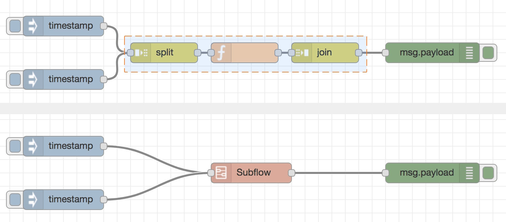
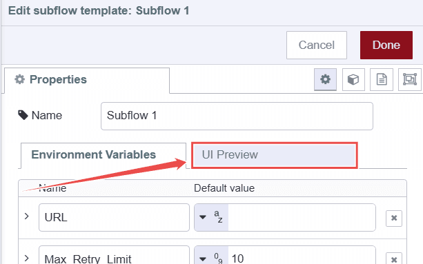
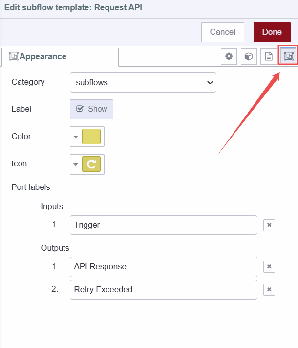

In traditional programming, managing complex and repetitive tasks can quickly lead to a tangled mess of code that’s hard to maintain and update. To tackle this issue, developers use libraries or modules—reusable chunks of code that help organize functionality, minimize duplication, and keep codebases clean and manageable.

<!--more-->

Node-RED brings a similar solution to its visual programming environment with Subflows. Imagine Subflows as the visual counterpart to libraries. In this guide, we will explore what Subflows are, how to create them, and how to use them effectively to enhance your Node-RED experience.

## What Exactly Are Subflows?

{data-zoomable}
_Image showing a Node-RED flow at the top selected for creating a Subflow, and the resulting Subflow at the bottom._

Subflows in Node-RED are a way to group together a set of nodes and reusable flows into a single, reusable node. This helps you manage and organize complex workflows by encapsulating repetitive or complex logic into a modular unit. You can think of Subflows as custom nodes that you create and use within your flows to simplify your design and reduce redundancy.

## Creating a Subflow in Node-RED

In this section, we will create a Subflow for a flow that sends requests to an API and returns results. If the request faces an issue, it retries until it reaches the maximum retry limit. Let's assume we need to use this flow in multiple places, for different APIs, each with different retry timeouts. To avoid duplicating the flow logic, we can create a Subflow.

To follow along, import the following flow into your Node-RED instance.


[{"id":"132f4fdc40d55e89","type":"debug","z":"380e37fed72e6885","name":"debug 2","active":true,"tosidebar":true,"console":false,"tostatus":false,"complete":"true","targetType":"full","statusVal":"","statusType":"auto","x":2840,"y":280,"wires":[]},{"id":"612819f76617e5a8","type":"debug","z":"380e37fed72e6885","name":"debug 3","active":true,"tosidebar":true,"console":false,"tostatus":false,"complete":"false","statusVal":"","statusType":"auto","x":2840,"y":220,"wires":[]},{"id":"7e9e8e1af751bb92","type":"inject","z":"380e37fed72e6885","name":"","props":[{"p":"payload"},{"p":"topic","vt":"str"}],"repeat":"","crontab":"","once":false,"onceDelay":0.1,"topic":"","payload":"","payloadType":"date","x":1460,"y":240,"wires":[["8899fea497064b8c"]]},{"id":"b4eca1de14599dd1","type":"delay","z":"380e37fed72e6885","name":"","pauseType":"delayv","timeout":"5","timeoutUnits":"milliseconds","rate":"1","nbRateUnits":"1","rateUnits":"second","randomFirst":"1","randomLast":"5","randomUnits":"seconds","drop":false,"allowrate":false,"outputs":1,"x":1900,"y":240,"wires":[["96ca1ed69e7fa7ac"]]},{"id":"96ca1ed69e7fa7ac","type":"http request","z":"380e37fed72e6885","name":"","method":"GET","ret":"txt","paytoqs":"ignore","url":"https://jsonplaceholder.typicode.com/todos","tls":"","persist":false,"proxy":"","insecureHTTPParser":false,"authType":"","senderr":false,"headers":[],"x":2050,"y":240,"wires":[["f523bb034db360a4"]]},{"id":"3eb4ec6b71fc383b","type":"switch","z":"380e37fed72e6885","name":"if success","property":"statusCode","propertyType":"msg","rules":[{"t":"btwn","v":"200","vt":"num","v2":"299","v2t":"num"},{"t":"else"}],"checkall":"true","repair":false,"outputs":2,"x":2420,"y":240,"wires":[["612819f76617e5a8"],["bad4bdb7e00b7a80"]]},{"id":"bad4bdb7e00b7a80","type":"switch","z":"380e37fed72e6885","name":"if max retries","property":"retry_counter","propertyType":"msg","rules":[{"t":"gte","v":"10000","vt":"num"},{"t":"else"}],"checkall":"true","repair":false,"outputs":2,"x":2590,"y":280,"wires":[["132f4fdc40d55e89"],["b4eca1de14599dd1"]]},{"id":"8899fea497064b8c","type":"change","z":"380e37fed72e6885","name":"","rules":[{"t":"set","p":"delay","pt":"msg","to":"retry_interval","tot":"msg"},{"t":"set","p":"retry_counter","pt":"msg","to":"0","tot":"num"}],"action":"","property":"","from":"","to":"","reg":false,"x":1720,"y":240,"wires":[["b4eca1de14599dd1"]]},{"id":"f523bb034db360a4","type":"change","z":"380e37fed72e6885","name":"retry_counter++","rules":[{"t":"set","p":"payload","pt":"msg","to":"retry_counter+1","tot":"jsonata"}],"action":"","property":"","from":"","to":"","reg":false,"x":2240,"y":240,"wires":[["3eb4ec6b71fc383b"]]}]


### Creating subflow of selection

{data-zoomable}
_Image showing process of creating subflow from the selection_

1. Select the flow you want to convert into a Subflow.
2. Open the main menu by clicking the top-right menu icon, and select "Selection to Subflow" under the Subflows option.

{data-zoomable}
_Image showing subflow node added in the node palette_

Once selected, the Subflow will be added to the node palette like other nodes. The selected flow will also be converted into a single node representing the Subflow.

### Adding Properties to the Subflow

1. Double-click on the Subflow, then click on **"Edit Subflow template"**.

{data-zoomable}
_Editing the Subflow template by clicking on the 'Edit Subflow Template' option._

2. A new flow tab for the Subflow will open. Click on **"Edit Properties"** in the top-left corner.

{data-zoomable}
_The edit properties button for a Subflow_

3. To add environment properties, click on the **"+ add"** button located at the bottom-left.

{data-zoomable}
_The 'Add' button for adding environment properties for subflow_

4. In the field that opens, give the property a name and set its default value.
5. Once you have added all your properties, you can view a preview by switching to the **"UI PREVIEW"** tab.

{data-zoomable}
_A preview of the Subflow environment properties_

6. Click "Done" to save.

### Setting Added Environment Variables in the Nodes

Now that we have added properties for the Subflow (which are environment variables), we need to use them in the relevant nodes, such as the HTTP request node, which will require an API and the max-retry setting.

1. Double-click on the **HTTP request** node, set the environment variable as `${your_env_name}` into the URL feild, and click **Done** to save.

{data-zoomable}
_The URL field of an HTTP request node in Node-RED with an environment variable added._

2. Next, double-click on the **switch** node named "if max retries," update the hardcoded max retry condition value to the environment variable you set for it, and click **Done** to save.

{data-zoomable}
_The switch node in Node-RED with a max retry condition set using an environment variable._

### Managing Subflow Input and Output Ports

As we know, any node in Node-RED requires input and output ports to manage its data flow. Similarly, a Subflow node requires these ports to function correctly. In our Subflow example, it needs to be triggered and therefore requires at least one input port and one or more output ports. Specifically, our Subflow has two outputs: one for successfully fetched data and another to indicate when the maximum retry limit has been exceeded.

1. In the **Subflow** tab, at the top, you will see an option for **inputs** with values 0 and 1. Click on **1** to add an input port (as a any Node-RED node can have only one input port). Once set to 1, you will see an input port added in the Subflow tab. Connect it to the appropriate node; in our example, it should be connected to the first **change** node.

{data-zoomable}
_Option to add input port for subflow_

2. Next, right after the **inputs** option, you will see an option for **outputs**. Unlike inputs, you can add as many outputs as you need. Once you've added the outputs, connect them to the appropriate nodes. In our example, the first output should be connected to the first input of both **switch** nodes.

{data-zoomable}
_Option to add output ports for subflow_

### Adding Status for Subflow Nodes

To effectively manage and monitor the execution of Subflows, you can add status indicators to your Subflow nodes. This allows you to see if the Subflow is functioning correctly and helps in debugging if something goes wrong. To add a status indicator:

1. In the Subflow flow tab at the top, click on the **Status** node option to add a status node. This status node can be connected to the Node-RED status node to capture and display all statuses, or you can configure it to use `msg.payload`.

{data-zoomable}
_Option to add status for subflow_

   In our example, we need two indicators: one to display when the flow is retrying to request and another to indicate that the fetch operation has successfully completed.

2. Drag two **Change** nodes onto the Canvas. Connect one Change node to the **if success** switch node's first output and set the `msg.payload` to `"completed"`. Connect the other Change node to the **if max retries** switch node's first output and set its `msg.payload` to `"retrying"`. Then, connect both Change nodes to the input of the Subflow status node.

### Customizing the Appearance of a Subflow Node

Node-RED allows you to customize the appearance of Subflow nodes, including setting the color, icon, port labels, and selecting the category in which it will be visible in the node palette.

1. In the Subflow flow tab, click on the **"Edit Properties"** option in the top-left corner and switch to the **"Appearance"** tab. 

{data-zoomable}
_Image showing the apperance tab of subflow_

2. Select a category from the available categories or add a new one by clicking on **"Add new"**.
3. Choose a color for the Subflow node and select an icon.
4. Provide labels for the ports so that when someone hovers over the Subflow input or output ports, they can quickly understand their purpose.

### Adding Documentation for a Subflow Node

Node-RED allows you to add documentation for Subflow nodes, providing guidance on how to use them. This documentation will be rendered in the help sidebar, similar to other nodes.

1. In the Subflow flow tab, click on the **"Edit Properties"** option in the top-left corner and switch to the **"Description"** tab.

{data-zoomable}
_Image showing the apperance tab of subflow_

2. Enter the documentation content in markdown format that provides guidance on how to use the Subflow node effectively.
3. Click **Done** to save.

Once saved, the documentation will be displayed in the help sidebar when users click on the Subflow node in the Node-RED palette or hover over and select the help option for that node.


[{"id":"ea5436b592a86b90","type":"subflow","name":"API Retry ","info":"## hee","category":"function","in":[{"x":50,"y":30,"wires":[{"id":"8899fea497064b8c"}]}],"out":[{"x":1140,"y":60,"wires":[{"id":"3eb4ec6b71fc383b","port":0}]},{"x":1610,"y":120,"wires":[{"id":"092547737a0cbee2","port":0}]}],"env":[{"name":"URL","type":"str","value":""},{"name":"MAX_RETRY","type":"str","value":""}],"meta":{},"color":"#D7D7A0","inputLabels":["Trigger"],"outputLabels":["API Response","Max Retry Exeeded"],"icon":"node-red/white-globe.svg"},{"id":"b4eca1de14599dd1","type":"delay","z":"ea5436b592a86b90","name":"","pauseType":"delayv","timeout":"5","timeoutUnits":"milliseconds","rate":"1","nbRateUnits":"1","rateUnits":"second","randomFirst":"1","randomLast":"5","randomUnits":"seconds","drop":false,"allowrate":false,"outputs":1,"x":400,"y":80,"wires":[["96ca1ed69e7fa7ac"]]},{"id":"96ca1ed69e7fa7ac","type":"http request","z":"ea5436b592a86b90","name":"","method":"GET","ret":"txt","paytoqs":"ignore","url":"${URL}","tls":"","persist":false,"proxy":"","insecureHTTPParser":false,"authType":"","senderr":false,"headers":[],"x":550,"y":80,"wires":[["f523bb034db360a4"]]},{"id":"3eb4ec6b71fc383b","type":"switch","z":"ea5436b592a86b90","name":"if success","property":"statusCode","propertyType":"msg","rules":[{"t":"btwn","v":"200","vt":"num","v2":"299","v2t":"num"},{"t":"else"}],"checkall":"true","repair":false,"outputs":2,"x":920,"y":80,"wires":[[],["bad4bdb7e00b7a80"]]},{"id":"bad4bdb7e00b7a80","type":"switch","z":"ea5436b592a86b90","name":"if max retries","property":"retry_counter","propertyType":"msg","rules":[{"t":"gte","v":"MAX_RETRY","vt":"env"},{"t":"else"}],"checkall":"true","repair":false,"outputs":2,"x":1090,"y":120,"wires":[["092547737a0cbee2"],["b4eca1de14599dd1"]]},{"id":"8899fea497064b8c","type":"change","z":"ea5436b592a86b90","name":"","rules":[{"t":"set","p":"delay","pt":"msg","to":"retry_interval","tot":"msg"},{"t":"set","p":"retry_counter","pt":"msg","to":"0","tot":"num"}],"action":"","property":"","from":"","to":"","reg":false,"x":220,"y":80,"wires":[["b4eca1de14599dd1"]]},{"id":"f523bb034db360a4","type":"change","z":"ea5436b592a86b90","name":"retry_counter++","rules":[{"t":"set","p":"retry_counter","pt":"msg","to":"retry_counter+1","tot":"jsonata"}],"action":"","property":"","from":"","to":"","reg":false,"x":740,"y":80,"wires":[["3eb4ec6b71fc383b"]]},{"id":"092547737a0cbee2","type":"change","z":"ea5436b592a86b90","name":"","rules":[{"t":"set","p":"payload","pt":"msg","to":"Max retry exeeded","tot":"str"}],"action":"","property":"","from":"","to":"","reg":false,"x":1360,"y":120,"wires":[[]]},{"id":"132f4fdc40d55e89","type":"debug","z":"380e37fed72e6885","name":"debug 2","active":true,"tosidebar":true,"console":false,"tostatus":false,"complete":"true","targetType":"full","statusVal":"","statusType":"auto","x":2420,"y":320,"wires":[]},{"id":"612819f76617e5a8","type":"debug","z":"380e37fed72e6885","name":"debug 3","active":true,"tosidebar":true,"console":false,"tostatus":false,"complete":"false","statusVal":"","statusType":"auto","x":2420,"y":200,"wires":[]},{"id":"7e9e8e1af751bb92","type":"inject","z":"380e37fed72e6885","name":"","props":[{"p":"payload"},{"p":"topic","vt":"str"}],"repeat":"","crontab":"","once":false,"onceDelay":0.1,"topic":"","payload":"","payloadType":"date","x":1840,"y":260,"wires":[["ccadc2ba40bb8606"]]},{"id":"ccadc2ba40bb8606","type":"subflow:ea5436b592a86b90","z":"380e37fed72e6885","name":"","env":[{"name":"URL","value":"https://jsonplaceholder.typicode.com/photosS","type":"str"},{"name":"MAX_RETRY","value":"10000","type":"str"}],"x":2160,"y":260,"wires":[["612819f76617e5a8"],["132f4fdc40d55e89"]]}]


Now, just like regular Node-RED nodes, you can effectively use this Subflow node in your projects. With its added documentation, customized appearance, and status indicators, it integrates seamlessly into your Node-RED environment, enhancing both usability and functionality.

### Benefits of using subflows.

- **Modularity**: Subflows allow you to group related nodes into a single, reusable unit, making complex flows easier to manage.
- **Code Reuse**: They help avoid duplicating similar logic across different parts of your flow, saving time and effort.
- **Simplified Design**: Subflows can simplify your main flow by hiding complexity within a single node.
- **Easier Maintenance**: Updating a Subflow automatically updates all instances where it is used, making maintenance quicker.

## Conclusion

In this guide, we explored the concept of subflows in Node-RED, including their definition and purpose. We walked through the steps to create and configure subflows, demonstrating how to integrate them into your main flow. Additionally, we discussed how to edit and update existing subflows, and provided best practices for managing and organizing them effectively.

{% include "cta.njk", cta_query: "utm_campaign=60718323-BCTA&utm_source=blog&utm_medium=cta&utm_term=high_intent&utm_content=How%20to%20create%20and%20use%20Subflow%20in%20Node-RED", cta_type: "signup", cta_text: "" %}