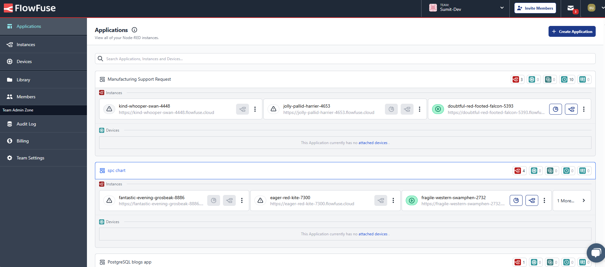
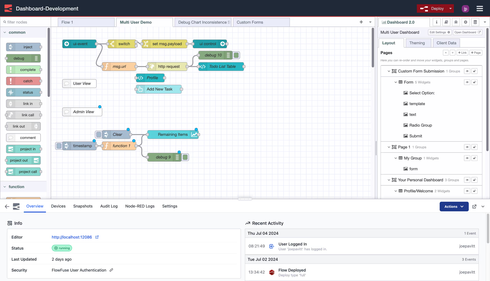
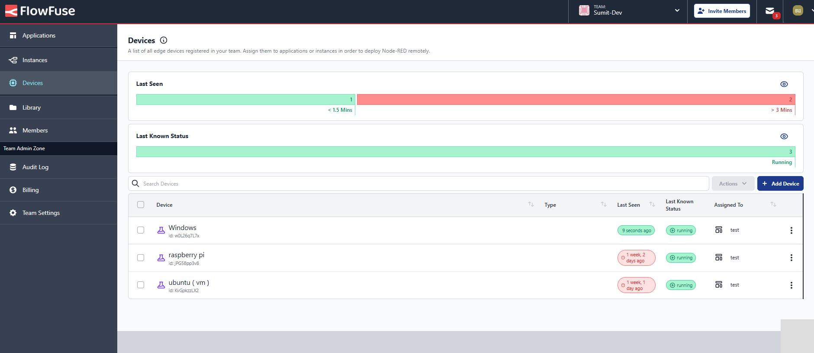
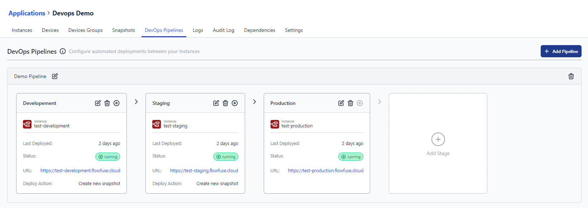
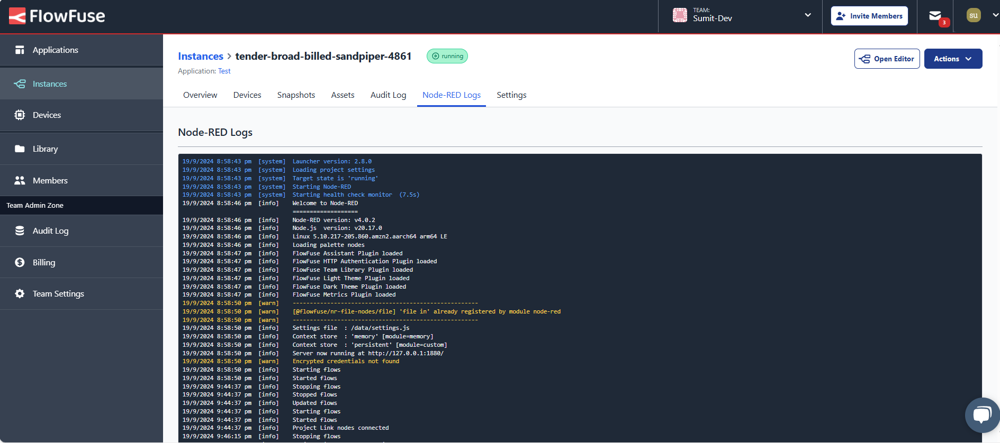
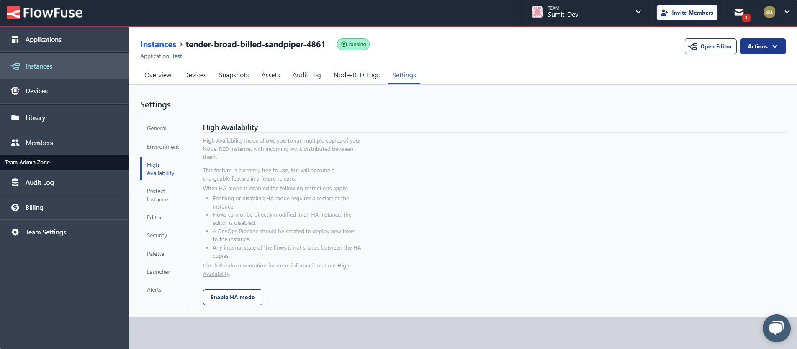

Managing a single Node-RED instance involves setting up and configuring a server, securely tunneling for remote access to edge devices, and ensuring proper networking and firewall configurations, all of which can be complex. The complexity increases when overseeing multiple Node-RED instances spread across various projects, devices, or environments.
<!--more-->
This situation brings additional challenges that can make management a really difficult task, often leading to confusion and frustration as teams try to keep everything running smoothly, troubleshoot issues, and ensure clear communication between instances. Consolidating control into a single platform simplifies deployment, configuration, collaboration, and oversight, making it easier to manage multiple Node-RED instances. Let’s explore how FlowFuse can centralize this management.

## What is a Node-RED Instance?

A [Node-RED](/node-red/) instance refers to a single, operational setup of the Node-RED application. Whether you start Node-RED on your computer, a cloud server, or an edge device, you create an instance. Each instance operates independently, allowing you to build and run automation flows or applications.

## What are the Challenges of Managing Multiple Node-RED Instances?

Managing numerous Node-RED instances can quickly become a complex juggling act as operations scale. Each new instance adds layers of complexity, from configuration inconsistencies to security concerns. Understanding these challenges underscores the need for a centralized solution to streamline management and enhance efficiency.

1. **Deployment and Configuration Management:** Setting up Node-RED instances on a server requires not just solid technical know-how but also ongoing attention. As you scale to thousands of instances, the task becomes a marathon of maintenance and configuration tweaks, consuming valuable time and resources.

2. **Remote Management:** When it comes to managing Node-RED instances on edge devices, the challenges can multiply. Unexpected issues might arise that require an on-site visit for troubleshooting.

3. **Monitoring and Troubleshooting:** Monitoring the health and performance of multiple instances demands vigilance. You’ll find yourself sifting through logs and responding to alerts across instances, turning monitoring into a crucial yet often overwhelming task.

4. **Security Management:** Each instance demands its own set of security settings, and managing these can feel like herding cats. It’s vital to ensure that each instance is fortified against threats while navigating the intricate web of security measures.

5. **Backup and Recovery:** A solid backup and recovery plan is necessary for any organization running numerous instances. Crashes can happen, and when they do, you want to avoid losing critical work or dealing with unwanted changes.

6. **Scaling Challenges:** As your applications become complex, scaling your Node-RED instances becomes inevitable. This requires expertise in server management and a proactive approach to handle the intricacies of multiple instances.

7. **Ensuring High Availability:** In production environments, maintaining uptime and high availability for each Node-RED instance is no small feat. As the number of instances grows, so does the challenge of ensuring they remain operational and responsive.

To tackle these challenges, it is essential to find a platform that handles all this complex configuration, deployment, and management while providing a visual interface for maintaining and updating your instances as needed.

## FlowFuse: Centralize Your Node-RED Management

FlowFuse is a powerful platform designed to simplify the management of multiple Node-RED instances. By providing a centralized interface, FlowFuse enables users to streamline deployment, configuration, collaboration, and monitoring across various Node-RED projects and environments.

  
*Image showing how multiple Node-RED instances are organized and managed under one roof.*

With FlowFuse, you can organize your Node-RED instances into teams for improved collaboration. This feature allows for easy management of team members' permissions, enabling seamless teamwork on projects without navigating between different instance locations physically. You can create as many teams as needed, ensuring that instances are organized based on the team members assigned to them.

  
*Image showing how FlowFuse's immersive editor simplifies managing settings and configuration within the Node-RED editor.*

FlowFuse also simplifies the [monitoring and controlling of edge devices](/solutions/device-management/) through the FlowFuse Device Agent, which quickly connects your devices to the cloud platform and allows you to build and monitor applications remotely.

  
*Image showing remote edge devices connected through the FlowFuse platform for remote monitoring and control.*

Additionally, FlowFuse enables the creation of [DevOps pipelines](/blog/2024/10/how-to-build-automate-devops-pipelines-node-red-deployments/) that ensure your application is well-tested and evaluated before deployment to production. Deploying the same flow to hundreds or thousands of devices becomes effortless with these pipelines.

  
*Image showing feature to create the devops pipeline for Node-RED instances*

You can efficiently [monitor logs](/docs/user/logs/#logs) for each instance and receive instant email alerts if any crashes occur, facilitating quick troubleshooting.

  
*Image showing the Node-RED instance logs.*

FlowFuse also allows you to quickly add [high availability](/docs/user/high-availability/) features to your instances, ensuring smooth and efficient operation of your production applications. The platform includes an auto-snapshot feature that lets you recover from accidental changes to flows, ensuring you always have a backup of your application.

  
*Image showing the feature that allows to enable high availability for instances*

we just covered the pills of flowfuse there are even more i i think triple or fouther x what i have shown and team is consistenly working to birng new ones...

### How FlowFuse Transforms Production Operations

In manufacturing, downtime is costly, and managing machines, sensors, and systems across multiple sites adds complexity. Integrating diverse data sources and transforming them into actionable insights, all while ensuring smooth production, can be a daunting task. FlowFuse simplifies this by centralizing management, providing a single platform to efficiently oversee all your Node-RED instances.

FlowFuse automates deployment, updates, and monitoring, significantly reducing human error. It easily collects data from various sources—whether hardware, APIs, or services—and transforms it in a user-friendly drag-and-drop environment, allowing teams to quickly visualize and analyze production data through customizable dashboards. Its high-availability feature ensures critical operations continue uninterrupted, even during unexpected failures, keeping production lines running smoothly. With centralized security and real-time alerts, you can swiftly respond to issues, minimizing downtime and maximizing efficiency.

Collaboration across teams or sites is seamless with FlowFuse, enabling engineers and managers to work together without the confusion of multiple systems. As your operations expand, FlowFuse scales effortlessly, allowing easy integration of new machines and facilities with minimal complexity.

By transforming the complexity of managing distributed systems into a streamlined, reliable process, FlowFuse keeps your production lines running securely and efficiently, allowing your team to focus on innovation and growth.

[**Get started with FlowFuse on the Cloud**](https://app.flowfuse.com/account/create/)

#### Conclusion

FlowFuse transforms how you manage Node-RED instances, turning chaos into clarity. With centralized control, teams can reduce operational costs while ensuring critical applications remain available and secure. Automated backups and high availability translate to less downtime and more focus on innovation. 
