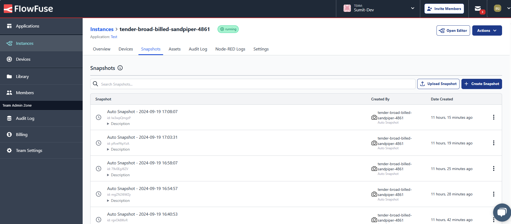

Managing a single Node-RED instance involves setting up and configuring a server, which can be complex. The complexity multiplies when overseeing multiple Node-RED instances distributed across various projects, devices, or environments. This scenario presents additional challenges that can make management a daunting task.

<!--more-->

By consolidating control into a single platform, you can simplify deployment, configuration, collaboration, and oversight, making it easier to handle multiple instances efficiently. Let's look at how you can centralize the management of your Node-RED instances with FlowFuse. 

## What is a Node-RED Instance?

A [Node-RED](/node-red/) instance refers to a single, operational setup of the Node-RED application. Whether you start Node-RED on your computer, a cloud server, or an edge device, you create an instance. Each instance operates independently, allowing you to build and run automation flows or applications.

## What are the Challenges of Managing Multiple Node-RED Instances?

Managing numerous Node-RED instances can quickly become a complex juggling act as operations scale. Each new instance adds layers of complexity, from configuration inconsistencies to security concerns. Understanding these challenges underscores the need for a centralized solution to streamline management and enhance efficiency.

1. **Deployment and Configuration Management:** Setting up Node-RED instances on a server requires not just solid technical know-how but also ongoing attention. As you scale to thousands of instances, the task becomes a marathon of maintenance and configuration tweaks, consuming valuable time and resources.

2. **Remote Management:** When it comes to managing Node-RED instances on edge devices, the challenges can multiply. Unexpected issues might arise that require an on-site visit for troubleshooting..

3. **Monitoring and Troubleshooting:** Monitoring the health and performance of multiple instances demands vigilance. You’ll find yourself sifting through logs and responding to alerts across instances, turning monitoring into a crucial yet often overwhelming task.

4. **Security Management:** Each instance demands its own set of security settings, and managing these can feel like herding cats. It’s vital to ensure that each instance is fortified against threats while navigating the intricate web of security measures.

5. **Backup and Recovery:** A solid backup and recovery plan is necessary for any organization running numerous instances. Crashes can happen, and when they do, you want to avoid losing critical work or dealing with unwanted changes.

6. **Scaling Challenges:** As your applications become complex, scaling your Node-RED instances becomes inevitable. This requires expertise in server management and a proactive approach to handle the intricacies of multiple instances.

7. **Ensuring High Availability:** In production environments, maintaining uptime and high availability for each Node-RED instance is no small feat. As the number of instances grows, so does the challenge of ensuring they remain operational and responsive.

To tackle these challenges, it is essential to find a platform that handles all this complex configuration, deployment, and management while providing a visual interface for maintaining and updating your instances as needed.

## FlowFuse: Centralize Your Node-RED Management

_Image showing how multiple Node-RED instances are organized and managed under one roof_

_Image showing how FlowFuse's immersive editor simplifies managing settings and configuration within the Node-RED editor_

[FlowFuse](/) is a cloud-based platform that simplifies the creation and management of Node-RED instances. With just a few clicks, you can create as many instances as needed in the central platform. The platform provides a visual interface to manage configurations and settings for each instance easily. 

Instances can be organized into [teams](/docs/user/team/#teams) for better collaboration. FlowFuse allows you to manage team members' permissions, enabling seamless teamwork on projects without moving between different instance locations.

_Image showing remote edge devices connected through the FlowFuse platform for remote monitoring and control_

It also simplifies [monitoring and controlling remote devices](/solutions/device-management/) from a centralized platform with the help of the FlowFuse Device agent, which connects your devices quickly to the FlowFuse cloud platform. FlowFuse makes this process as easy as a single click with its [devops pipelines](/docs/user/devops-pipelines/#devops-pipelines) when deploying the same flow to hundreds or thousands of devices.

_Image showing the Node-RED instance logs_

With FlowFuse, you can quickly [monitor logs](/docs/user/logs/#logs) for each instance and receive instant email alerts if any crashes occur. 

_Image showing the 'High Availability' setting option to make your instance highly available_

_Image showing the snapshot feature in the FlowFuse platform_

The platform also allows you to quickly add [high availability](/docs/user/high-availability/) to instances, ensuring that your production applications run smoothly and efficiently. Additionally, FlowFuse offers an auto-snapshot feature that allows you to recover from accidental changes to flows, ensuring you always have a backup of your application.

FlowFuse has various other [features](/product/features/) that make connecting with different hardware, collecting data from devices and systems, transforming that data to meet your needs, and visualizing it in the fully customized, powerful [FlowFuse dashboard](https://dashboard.flowfuse.com/) easy and efficient.

#### How FlowFuse Transforms Production Operations

Managing data from numerous machines, sensors, and systems can be challenging in manufacturing, automotive, and other industries. This data is essential for maintaining production efficiency, tracking machine health, and ensuring product quality. However, data often comes from disparate sources, making integration and management complex.

FlowFuse transforms data handling by providing a centralized, user-friendly platform that seamlessly integrates with Node-RED. Here’s how FlowFuse enhances your production operations:

1. **Streamlined Operational Efficiency:** Manage your entire production environment—from edge devices to cloud systems—through a single platform. With FlowFuse’s DevOps pipelines, deploying flows to hundreds or thousands of devices is as simple as a single click, significantly saving time and minimizing the risk of human error.

2. **Robust Security and Reliability:** FlowFuse simplifies the implementation of high availability for critical Node-RED instances, ensuring that your operations continue smoothly even during unexpected failures. Centralized security management allows you to protect each instance without overwhelming your IT resources.

3. **Real-time Monitoring and Control:** Monitor system health closely with instant alerts and comprehensive log monitoring. FlowFuse lets you quickly identify and resolve issues across your entire setup, reducing downtime and maintaining productivity.

4. **Effortless Collaboration:** Organize Node-RED instances into teams, assign roles, and collaborate on projects seamlessly. This structured approach enhances teamwork and ensures that your production processes run smoothly across all departments.

5. **Scalability with Confidence:** As production demands grow, FlowFuse's visual interface effortlessly enables you to scale your infrastructure. This scalability ensures that your Node-RED instances can handle increased workloads without additional complexity.

6. **Automated Backup and Recovery:** FlowFuse’s automated backup and snapshot features provide peace of mind, ensuring your flows are protected and easily recoverable. You can quickly restore previous states, minimizing disruption and safeguarding critical data.

#### Conclusion

FlowFuse transforms how you manage Node-RED instances, turning chaos into clarity. With centralized control, teams can reduce operational costs by up to 30% while ensuring critical applications remain available and secure. Automated backups and high availability mean less downtime and more focus on innovation. Streamline your processes and empower your team with FlowFuse—where efficiency meets simplicity.

[**Get started with FlowFuse**](https://app.flowfuse.com/account/create/).
