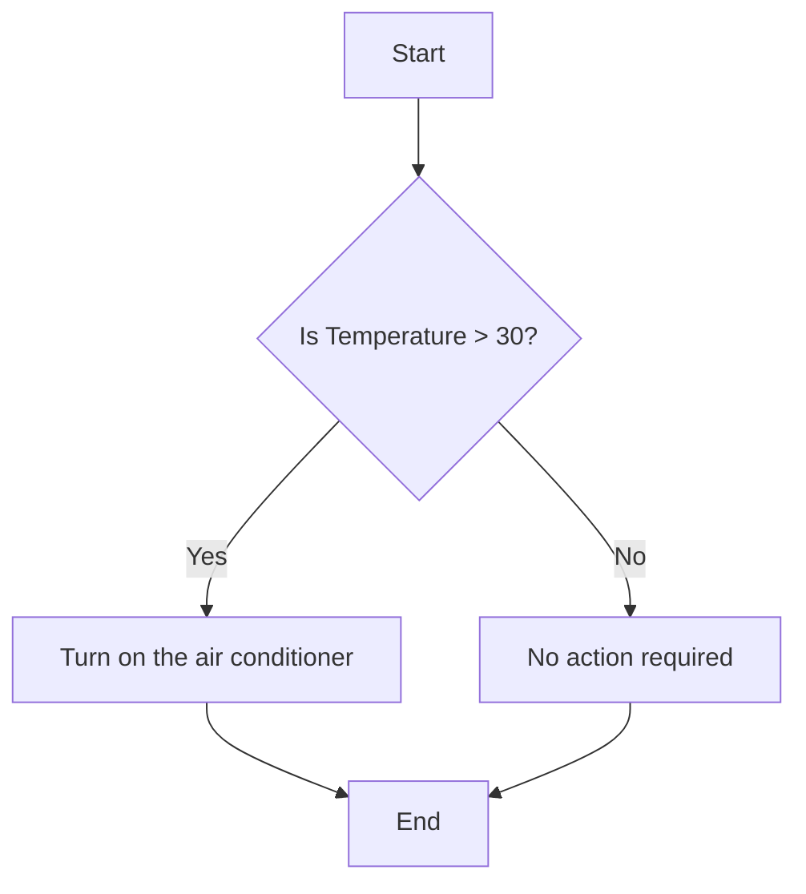
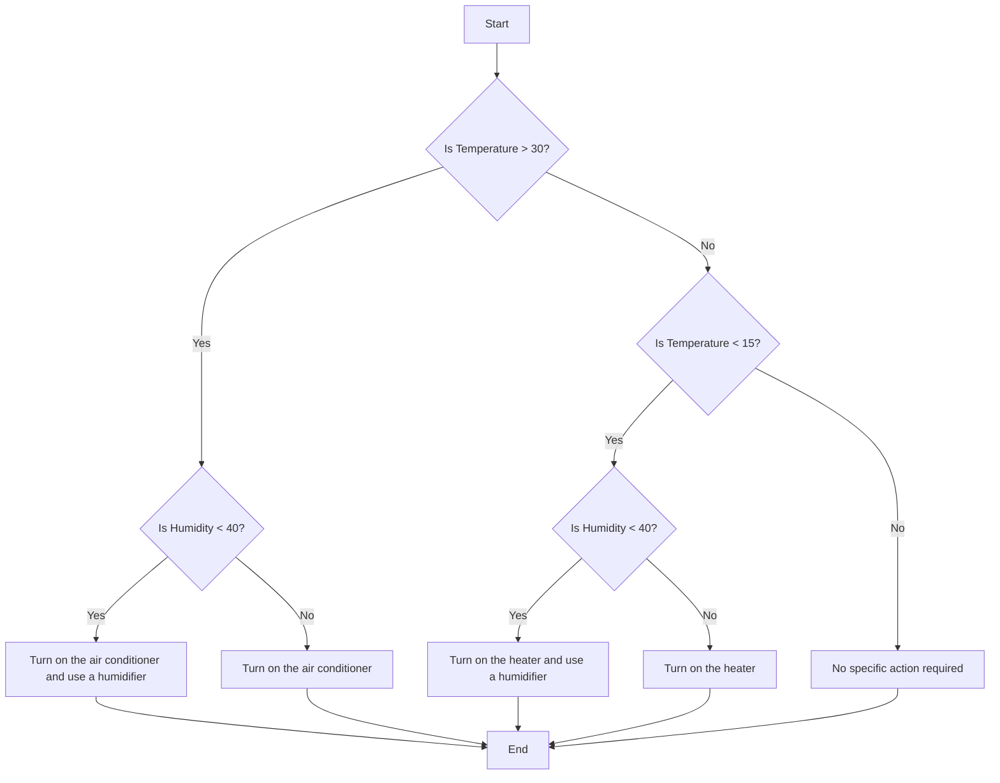
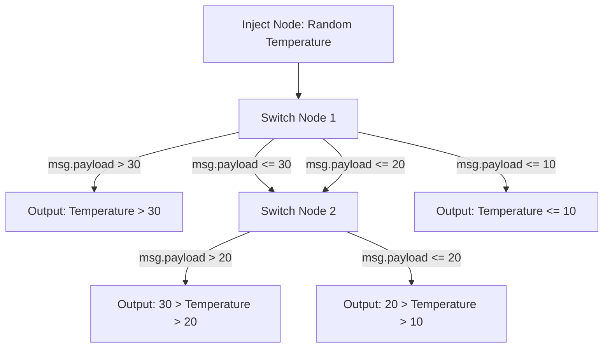

Human decision-making is often guided by a series of "if this, then that" choices—whether it's deciding what to wear based on the weather or determining the quickest route to work depending on traffic. In systems, especially those built in Node-RED, this kind of logic is equally crucial. Just as we make decisions based on various factors, systems need to evaluate conditions and choose the appropriate course of action.

<!--more-->

When developing automated solutions in Node-RED, the ability to replicate this human-like decision-making process is essential. By implementing If-Else logic, your system can intelligently navigate different scenarios, adapting its behavior based on the inputs it receives. This guide will show you how to effectively incorporate If-Else logic into your Node-RED flows, ensuring your system can make smart, context-aware decisions—just like you would.

## Understanding If-Else Logic

The concept of If-Else logic emerged from the need for computers to make decisions. As programming languages developed, it became essential to guide a computer through different actions based on varying conditions. This led to the creation of conditional statements, which allow programs to choose different paths depending on specific criteria.

### What is If-Else Logic?

If-Else logic is a way for programs to make decisions. It works like this:

- **If** a particular condition is true (e.g., "Is the temperature above 30°C?"), then execute a set of actions (e.g., "Turn on the air conditioner").
- **Else** (if the condition is not true), execute a different set of actions (e.g., "Turn off the air conditioner").

This approach allows systems to respond appropriately to different situations.

## Implementing Conditional Flows in Node-RED: A Practical Walkthrough

In Node-RED, implementing If-Else logic allows you to create dynamic and responsive flows that react to different inputs and conditions. Whether you're automating a smart home, managing IoT devices, or developing complex workflows, mastering conditional logic is essential for creating intelligent systems.

To implement If-Else logic in Node-RED, you can use the Function node. However, Node-RED also offers a low-code approach, and there’s another popular method to implement conditional logic without writing code, which we will also cover in this article.

### Using Function Node

The [Function](/node-red/core-nodes/function/) node in Node-RED is a node that lets you write custom JavaScript code to write complex logic. It is especially useful when you need to evaluate multiple conditions, perform complex calculations, or manage more intricate decision-making processes.

For demonstration purposes, let's use the same temperature example where we determine whether to turn the air conditioner on or off based on the temperature:

1. Drag the inject node onto the canvas and set the `msg.payload` to `$random() * 100` as JSONata expression; this inject node will simulate a temperature sensor by generating a random number.
2. Drag the function node onto the canvas, double-click on it, and paste the following code into it:

    ```javascript
    let Temperature = msg.payload;
    if (Temperature > 30) {
        msg.payload = "Turn on the air conditioner";
    } else {
        msg.payload = "No action required";
    }
    return msg;
    ```

    Before moving further, let's pause and understand what’s happening in the code and how `msg.payload` is being used.

    In Node-RED, `msg.payload` is used to carry data through the flow. Initially, it holds the temperature value injected by the Inject node. The Function node then processes this value using If-Else logic. If the temperature exceeds 30°C, `msg.payload` is set to `"Turn on the air conditioner"`, indicating that the air conditioner should be turned on. If the temperature is 30°C or lower, `msg.payload` is set to `"No action required"`, signaling that the air conditioner should remain off. This updated `msg.payload` is then passed on to the next node, ensuring that the system responds appropriately based on the temperature input.

    Many people find the messaging system in Node-RED confusing. For a deeper understanding of how messaging works in Node-RED, I recommend going through this document: [Node-RED Messaging Guide](#).

3. Next, drag the Debug node onto the canvas and connect it to the output of the Function node. This will allow you to see the results of your conditional logic in the Node-RED debug window.
4. Deploy the flow by clicking the "Deploy" button in the top-right corner of the Node-RED editor.
5. Once deployed, click the button on the Inject node to trigger it. You should see the output of the Function node in the debug window, which will show true or false depending on the temperature value.




[{"id":"dbd085ed607e41de","type":"inject","z":"70cca09da538731a","name":"Temperature","props":[{"p":"payload"}],"repeat":"","crontab":"","once":false,"onceDelay":0.1,"topic":"","payload":"$random()*100","payloadType":"jsonata","x":250,"y":1200,"wires":[["31d2e8f0c871143d"]]},{"id":"31d2e8f0c871143d","type":"function","z":"70cca09da538731a","name":"function 1","func":"let Temperature = msg.payload;\n    if (Temperature > 30) {\n        msg.payload = \"Turn on the air conditioner\";\n    } else {\n        msg.payload = \"No action required\";\n    }\nreturn msg;","outputs":1,"timeout":0,"noerr":0,"initialize":"","finalize":"","libs":[],"x":480,"y":1200,"wires":[["b169bf385ca85f6c"]]},{"id":"b169bf385ca85f6c","type":"debug","z":"70cca09da538731a","name":"debug 82","active":true,"tosidebar":true,"console":false,"tostatus":false,"complete":"false","statusVal":"","statusType":"auto","x":700,"y":1200,"wires":[]}]


_Node-RED flow using the Function node to implement simple If-Else logic for temperature control._

### Handling Multiple Flows with Node-RED's Function Node

We’ve seen how to handle a simple one-way flow using If-Else logic, but what if you need to direct messages along different paths based on various conditions or evaluate multiple values? In such cases, the Function node in Node-RED provides the flexibility to write complete JavaScript code, enabling more complex decision-making. Additionally, the Function node supports setting it for multiple output ports, which allows you to route messages to different destinations based on different conditions.

Let’s update our example to handle multiple values. In this scenario, we will incorporate both temperature and humidity into our decision-making process. We will use multiple output ports in the Function node to route messages based on different conditions.

1. Drag another inject node onto the canvas, set `msg.payload.temperature` to `$random() * 100` as the JSONata expression and `msg.payload.humidity` to `$random() * 100`.
2. Drag another function node onto the canvas, double-click on it, switch to the "Setup" tab, and increase the number of output ports to match the number of conditions you will handle. For our example, increase the number of outputs to 4 and click Done.

    ```javascript
    let Temperature = msg.payload.temperature;
    let Humidity = msg.payload.humidity;

    // Initialize output array
    let outputs = [null, null, null, null];

    if (Temperature > 30 && Humidity < 40) {
        // High temperature and low humidity
        outputs[0] = { payload: "High temperature and low humidity: Turn on the air conditioner and use a humidifier" };
    } else if (Temperature > 30 && Humidity >= 40) {
        // High temperature and high humidity
        outputs[1] = { payload: "High temperature and high humidity: Turn on the air conditioner" };
    } else if (Temperature < 15 && Humidity < 40) {
        // Low temperature and low humidity
        outputs[2] = { payload: "Low temperature and low humidity: Turn on the heater and use a humidifier" };
    } else if (Temperature < 15 && Humidity >= 40) {
        // Low temperature and high humidity
        outputs[3] = { payload: "Low temperature and high humidity: Turn on the heater" };
    }

    return outputs;
    ```

Now, you will see that the Function node has four outputs, each corresponding to the sequence of conditions we have written. For example, the message for the first condition will appear at the first output of the Function node, the message for the second condition will be at the second output, and so on.

Regarding the outputs we are sending, the Function node initializes an array with `null` values to ensure all outputs are accounted for. If a specific condition is met, the corresponding index in this array is updated with the desired message. For example, if the temperature is high and the humidity is low, the message will be set at `outputs[0]`, which is the first output. If no condition is met, the corresponding output will remain null, ensuring that only the relevant outputs are populated with messages.

3. Next, drag four Debug nodes onto the canvas. Connect each Debug node to one of the outputs from the Function node. This setup will allow you to see the messages routed through each output in the Debug panel.
4. Deploy the flow by clicking the "Deploy" button in the top-right corner of the Node-RED editor.
5. Once deployed, click the button on the Inject node to trigger it.


_Node-RED flow using the Function node with multiple outputs for handling various conditions like temperature and humidity._


[{"id":"dbd085ed607e41de","type":"inject","z":"70cca09da538731a","name":"Temperature && Humidity","props":[{"p":"payload.temperature","v":"$random() * 100","vt":"jsonata"},{"p":"payload.humidity","v":"$random() * 100","vt":"jsonata"}],"repeat":"","crontab":"","once":false,"onceDelay":0.1,"topic":"","x":250,"y":1200,"wires":[["31d2e8f0c871143d"]]},{"id":"31d2e8f0c871143d","type":"function","z":"70cca09da538731a","name":"function 1","func":"let Temperature = msg.payload.temperature;\nlet Humidity = msg.payload.humidity;\n\n// Initialize output array\nlet outputs = [null, null, null, null];\n\nif (Temperature > 30 && Humidity < 40) {\n    // High temperature and low humidity\n    outputs[0] = { payload: \"High temperature and low humidity: Turn on the air conditioner and use a humidifier\" };\n} else if (Temperature > 30 && Humidity >= 40) {\n    // High temperature and high humidity\n    outputs[1] = { payload: \"High temperature and high humidity: Turn on the air conditioner\" };\n} else if (Temperature < 15 && Humidity < 40) {\n    // Low temperature and low humidity\n    outputs[2] = { payload: \"Low temperature and low humidity: Turn on the heater and use a humidifier\" };\n} else if (Temperature < 15 && Humidity >= 40) {\n    // Low temperature and high humidity\n    outputs[3] = { payload: \"Low temperature and high humidity: Turn on the heater\" };\n}\n\nreturn outputs;","outputs":4,"timeout":0,"noerr":0,"initialize":"","finalize":"","libs":[],"x":500,"y":1200,"wires":[["b169bf385ca85f6c"],["aa7ab6452f4a7791"],["cc3e6e2c70643f6f"],["800508e428d74f5f"]]},{"id":"b169bf385ca85f6c","type":"debug","z":"70cca09da538731a","name":"debug 82","active":true,"tosidebar":true,"console":false,"tostatus":false,"complete":"payload","targetType":"msg","statusVal":"","statusType":"auto","x":720,"y":1140,"wires":[]},{"id":"aa7ab6452f4a7791","type":"debug","z":"70cca09da538731a","name":"debug 83","active":true,"tosidebar":true,"console":false,"tostatus":false,"complete":"false","statusVal":"","statusType":"auto","x":720,"y":1200,"wires":[]},{"id":"cc3e6e2c70643f6f","type":"debug","z":"70cca09da538731a","name":"debug 84","active":true,"tosidebar":true,"console":false,"tostatus":false,"complete":"payload","targetType":"msg","statusVal":"","statusType":"auto","x":720,"y":1260,"wires":[]},{"id":"800508e428d74f5f","type":"debug","z":"70cca09da538731a","name":"debug 85","active":true,"tosidebar":true,"console":false,"tostatus":false,"complete":"false","statusVal":"","statusType":"auto","x":720,"y":1320,"wires":[]}]


### Using Switch Node

The [Switch](/node-red/core-nodes/switch/) node in Node-RED is used for routing messages based on specific conditions, offering a straightforward, low-code approach to implementing conditional logic in your flows. Unlike the Function node, which requires writing JavaScript code, the Switch node allows you to set up rules using a visual interface, making it ideal for users who prefer a more intuitive method for handling conditions. However, it’s important to note that the Switch node represents a different, independent concept known as the "switch statement." While it serves a similar purpose to If-Else logic by building conditional flows, it operates under its own programming paradigm.

To demonstrate the Switch node, we'll set up a flow to make decisions based on the temperature value. We will route messages through different outputs based on temperature thresholds.

1. Drag the inject node onto the canvas and set the `msg.payload` to `$random() * 100` as JSONata expression; this inject node will simulate a temperature sensor by generating a random number.
2. Drag a Switch node onto the canvas. Double-click on it and set Property to `msg.payload`.
3. To add rules, click the + Add button at the bottom left of the configuration panel. You will see a prompt to select the condition and the prompt to enter the value to compare with. Add the following four rules and set it for checking all rules:

    - Rule 1: `msg.payload > 30` 
    - Rule 2: `msg.payload <= 30` 
    - Rule 3: `msg.payload <= 20` 
    - Rule 4: `msg.payload <= 10`

4. Now drag another Switch node and connect its input to the output of Switch nodes 2 and 3. We are adding this because we need to route messages based on ranges. A single Switch node doesn’t allow multiple checks in one rule, so to route the temperature based on ranges, we need to use another Switch node. Add the following rules and set it for stopping after the first match:

    - Rule 1: `msg.payload > 20` 
    - Rule 2: `msg.payload > 10` 

5. Now drag the Debug nodes and connect them to the Switch nodes' outputs according to our example. For messages greater than 30, connect the Debug node to the first output of the first Switch node. For the range between 30 to 20, connect the Debug node to the first output of the second Switch node. For the range between 20 to 10, connect the Debug node to the second output of the second Switch node. Finally, for messages less than 10, connect the Debug node to the fourth output of the first Switch node.
6. Deploy the flow by clicking the "Deploy" button in the top-right corner of the Node-RED editor.
7. Once deployed, click the button on the Inject node to trigger it. The Debug nodes will show the routed messages based on the temperature value.

Now, notice how messages are routed through the different outputs based on the temperature value. You may also have observed that in the Function node, you can update the msg object based on conditions within the same node. However, in the Switch node, it only evaluates a single value against different conditions and does not allow updating the msg object directly. To make updates, you can use the Change node.

Additionally, we needed to use a second Switch node because we want to route messages based on ranges. A single Switch node does not allow for multiple checks in one rule, which is why adding an additional Switch node was necessary to handle the different temperature ranges effectively.


_Node-RED flow using the Switch node to route messages based on temperature thresholds._


[{"id":"3370bfc8273ad207","type":"debug","z":"70cca09da538731a","name":"high temperature","active":true,"tosidebar":true,"console":false,"tostatus":false,"complete":"payload","targetType":"msg","statusVal":"","statusType":"auto","x":750,"y":1080,"wires":[]},{"id":"dbd085ed607e41de","type":"inject","z":"70cca09da538731a","name":"Temperature","props":[{"p":"payload"}],"repeat":"","crontab":"","once":false,"onceDelay":0.1,"topic":"","payload":"$random()*100","payloadType":"jsonata","x":250,"y":1200,"wires":[["b3d5ced2ee79426a"]]},{"id":"b3d5ced2ee79426a","type":"switch","z":"70cca09da538731a","name":"","property":"payload","propertyType":"msg","rules":[{"t":"gt","v":"30","vt":"num"},{"t":"lte","v":"30","vt":"num"},{"t":"lte","v":"20","vt":"num"},{"t":"lte","v":"10","vt":"num"}],"checkall":"true","repair":false,"outputs":4,"x":470,"y":1200,"wires":[["3370bfc8273ad207"],["3726786f035371ab"],["3726786f035371ab"],["5a521542f067c363"]]},{"id":"3726786f035371ab","type":"switch","z":"70cca09da538731a","name":"","property":"payload","propertyType":"msg","rules":[{"t":"gt","v":"20","vt":"num"},{"t":"gt","v":"10","vt":"num"}],"checkall":"false","repair":false,"outputs":2,"x":610,"y":1200,"wires":[["9b20ce1a276dfe26"],["44476304690c8434"]]},{"id":"9b20ce1a276dfe26","type":"debug","z":"70cca09da538731a","name":"for medium temperature","active":true,"tosidebar":true,"console":false,"tostatus":false,"complete":"payload","targetType":"msg","statusVal":"","statusType":"auto","x":870,"y":1160,"wires":[]},{"id":"5a521542f067c363","type":"debug","z":"70cca09da538731a","name":"for very low temperature","active":true,"tosidebar":true,"console":false,"tostatus":false,"complete":"payload","targetType":"msg","statusVal":"","statusType":"auto","x":750,"y":1320,"wires":[]},{"id":"44476304690c8434","type":"debug","z":"70cca09da538731a","name":"for low temperature","active":true,"tosidebar":true,"console":false,"tostatus":false,"complete":"payload","targetType":"msg","statusVal":"","statusType":"auto","x":850,"y":1240,"wires":[]}]


## Choosing Between the Function Node and Switch Node

When choosing between the Function node and the Switch node in Node-RED, consider the complexity of your logic. The Function node is ideal for handling complex conditions and calculations. It allows for detailed updates to the `msg` object and can evaluate multiple values simultaneously.

On the other hand, the Switch node is simpler and provides an easy way to route messages based on a single value with multiple outputs. It’s perfect for straightforward scenarios where you need to route messages based on simple conditions without the need for complex logic or message modifications.

Use the Function node for intricate decision-making and detailed updates, and the Switch node for easier, value-based routing.

## Conclusion

Whether you choose the Function node for more complex logic or the Switch node for simpler, visual routing, Node-RED provides flexible options to incorporate If-Else logic into your flows. By leveraging these tools, you can create dynamic and responsive systems that make intelligent decisions based on various conditions, just like human decision-making.

Understanding and implementing conditional logic will empower you to build more advanced and adaptable automations, enhancing the functionality and efficiency of your Node-RED applications. So, experiment with both methods and find the best approach for your needs.
