Version control is essential, especially when multiple people are working on the same Node-RED project. Without it, changes can easily overlap, or worse—accidental updates could break critical flows. FlowFuse solves this challenge with snapshots, allowing you to create backups of your flows, restore previous versions, and safeguard your project from unexpected issues. 

<!--more-->

In this guide, we’ll show you how to use snapshots in FlowFuse to manage your Node-RED projects with confidence and prevent costly mistakes.

## What is Version Control and Snapshots

Using **version control** for Node-RED flows can introduce complexity and effort, as it often requires frequent pushes of changes to keep everything in sync. This is especially challenging in environments where modifications occur rapidly and continuously.

**Snapshots** simplify this process by providing point-in-time backups of your flows. In the context of Node-RED, snapshots automatically capture the state of your work, ensuring that you can quickly restore them if needed. It captures the following:

- **Flows**: The flow, including all nodes and config nodes of your Node-RED flows.
- **Credentials**: Any sensitive information used within flows using config nodes.
- **Environment Variables**: Environment variables you have used or defined within that Node-RED instance.
- **NPM Packages**: The npm packages you have installed, including custom nodes and Node.js packages.
- **Runtime Settings**: The configurations that govern the behavior of your Node-RED runtime.

With snapshots in [FlowFuse](/), you can focus on developing your projects while having the confidence that your work is protected.

## Managing Snapshots in FlowFuse

Creating snapshots in FlowFuse is straightforward and can be done in just a few steps.

### Creating Snapshots for Cloud and Device Instances

With this understanding, let’s walk through the steps to create a snapshot in FlowFuse. But before that, let’s understand the differences between a cloud instance and a device instance.

- **Cloud Instance**: This is a Node-RED instance running on a server's virtual machine.

- **Device Instance**: This refers to a Node-RED instance running on your edge devices, which are connected to the FlowFuse platform through the [FlowFuse Device Agent](/product/device-agent/).

Taking snapshots for cloud instances and device instances is completely different. When a device is not assigned to an instance, it will have the same interface and the snapshot tab for creating snapshots, allowing you to create the snapshot in a similar way as you would for an cloud instance. However, once you assign any device to the cloud instance, you will need to follow a different procedure to create device snapshots manually.

#### Creating Snapshots for Cloud Instance

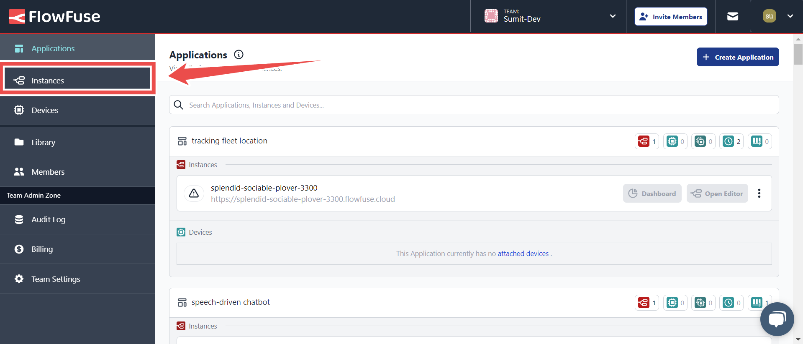{data-zoomable}
*Image showing the options in the sidebar for managing Node-RED instances in FlowFuse.*

1. Log in to your FlowFuse account and navigate to the instances by clicking on **"Instances"** in the sidebar.
2. Click on the instance you want to create a snapshot for. This will take you to the instance management interface, which includes different tabs for various settings.

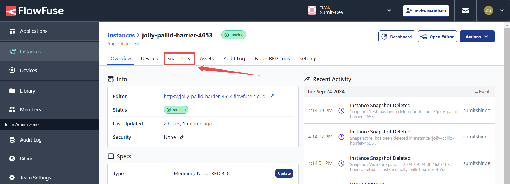{data-zoomable}
*Image showing the option to switch to the Snapshots tab in FlowFuse.*

3. Switch to the **“Snapshots”** tab by selecting it from the instance management options. Here, you will find options to create a new snapshot called **"Create Snapshot"**.

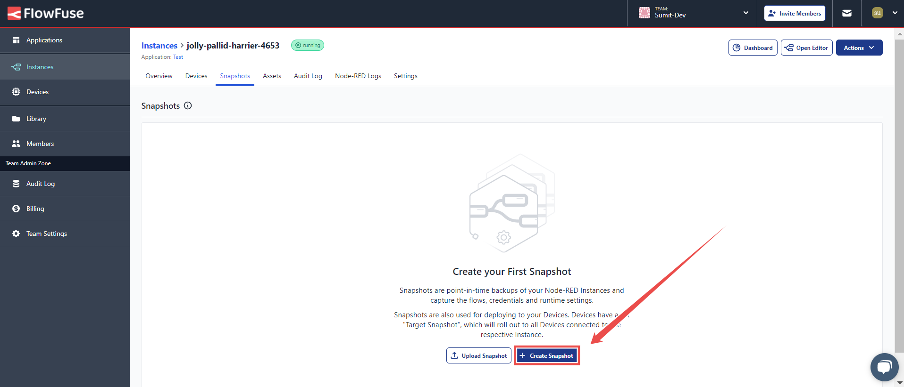{data-zoomable}
*Image showing the button to create a snapshot in FlowFuse.*

4. Click on the button to **create snapshot**. You will be prompted to enter a **name and description** for the snapshot, helping you identify it later. There’s also an option to restart all devices assigned to the instance with this newly created snapshot — enable this checkbox if needed.

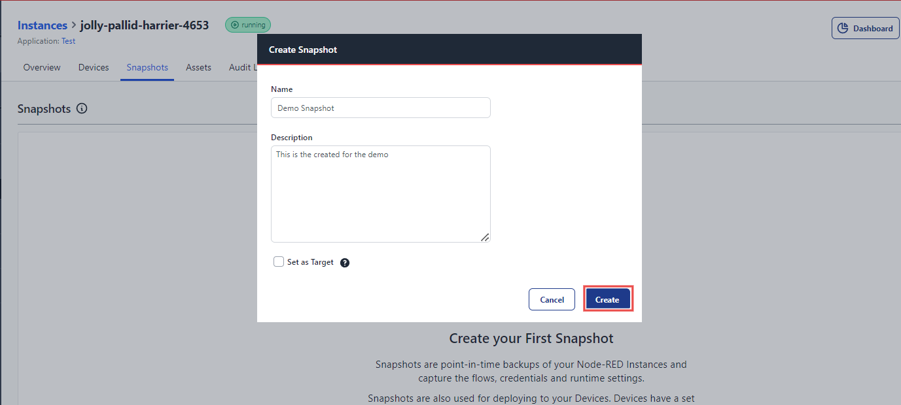{data-zoomable}
*Image showing the form to provide a name and description for the snapshot.*

5. After creating the snapshot, you will receive a confirmation message indicating that the snapshot has been successfully created.

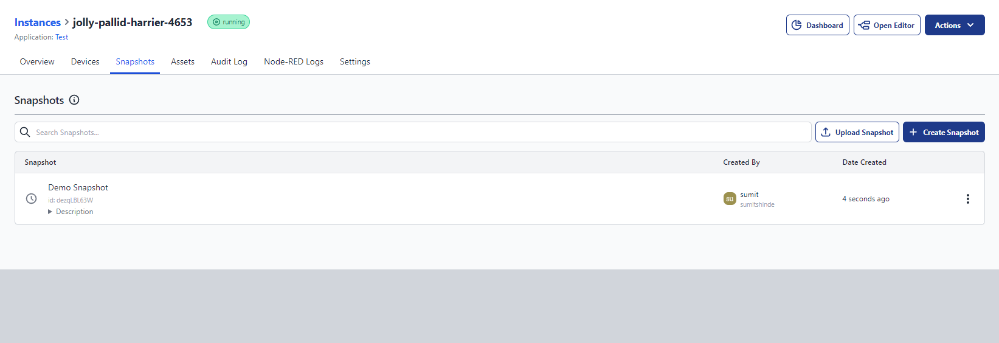{data-zoomable}
*Image showing a list of created snapshots with details in FlowFuse.*

Once a snapshot is created, it will be visible in a list format. Each snapshot will display details such as the name, description, creator, and creation date, along with a three-dot icon. 

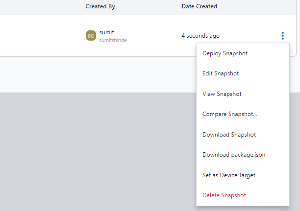{data-zoomable}
*Image showing available options for managing snapshots in FlowFuse.*

Clicking on the icon will open different options to manage and operate the snapshot.

### Creating Snapshot for Device Instances when assigned to Cloud Instance

To create a snapshot for the device instances when that device is assinged to cloud instance:

1. Go to **Devices** by clicking on the **Devices** option in the sidebar, and then click on the specific device.
2. Once clicked, a similar interface will open as with instances, allowing you to manage and monitor its settings and configuration. Ensure that the device has developer mode enabled.

{data-zoomable}
*Image showing the 'Create Snapshot' option in the Developer mode tab*

3. Switch to the **Developer Mode** tab by clicking on the **Developer Mode** option at the top. In the Developer Mode section, you will see the **Create Snapshot** button. Click on it to create a snapshot, then enter the details such as the name and description. If needed, set it as the device target snapshot, and then click **Create**.

### Viewing and Comparing Snapshots

In the **Snapshots** tab, you can view all snapshots associated with your instance. FlowFuse also allows you to compare two snapshots, enabling you to track changes between different versions of your flows. This is especially useful for identifying specific changes that may have caused issues or to review the progress over time.

#### Viewing a Snapshot:

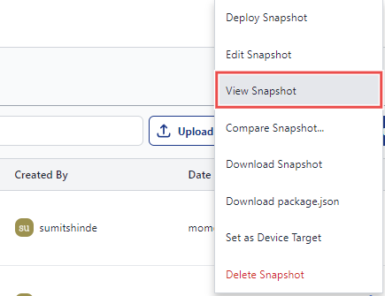{data-zoomable}
*Image showing the 'View Snapshot' option in the menu*

1. Click on the three-dot icon next to the corresponding snapshot you want to view, then select **View Snapshot** from the menu.

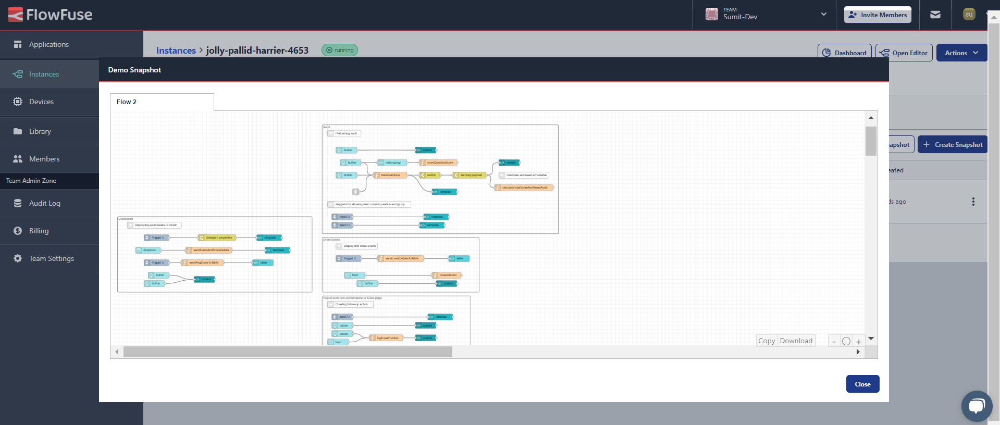{data-zoomable}
*Image showing the snapshot view window in FlowFuse.*

2. After clicking, a new window will open displaying the entire flow for that snapshot. At the bottom right of this window, you'll find options to **copy** or **download** the flow.

#### Comparing Snapshots:

If you have multiple snapshots and want to compare them, follow these steps:

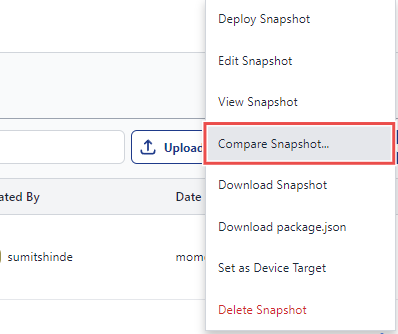{data-zoomable}
*Image showing the 'Compare Snapshot' option in the menu*

1. Click on the three-dot icon next to the snapshot you want to compare, then choose **Compare Snapshot**.

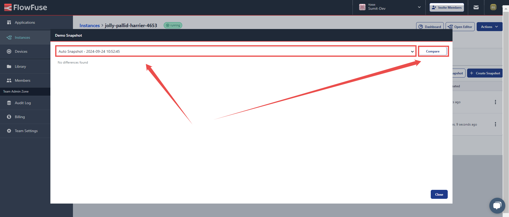{data-zoomable}
*Image showing the comparison window in FlowFuse, featuring a dropdown to select the instance to compare and a compare button*

2. In the newly opened window, select another snapshot from the dropdown to compare it with the one you chose.

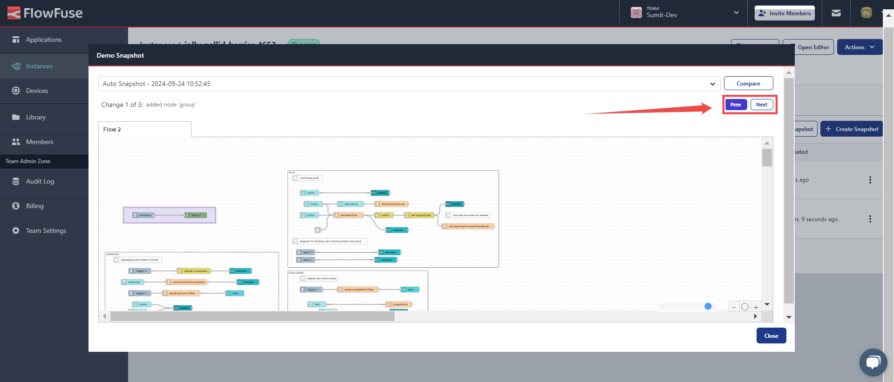{data-zoomable}
*Image showing the comparison window for snapshots in FlowFuse.*

3. The flows of both snapshots will be displayed side by side. At the top-right corner of the window, you will see two buttons, Use according to your preference:
   - **Prev**: Navigate to the previous difference between the two snapshots.
   - **Next**: Navigate to the next difference.

This comparison feature helps you easily identify changes, making it simple to spot issues or track flow modifications between versions.

### Downloading, Uploading, and Deploying Snapshots

Created snapshots can be downloaded locally, providing you with a backup of your Node-RED flows. This backup can be uploaded to another instance or restored in case of emergencies.

#### Downloading Snapshot:

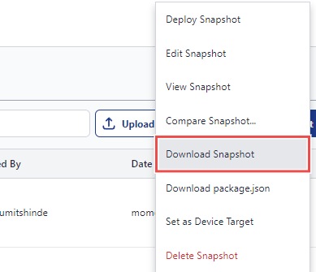{data-zoomable}
*Image showing the 'Download Snapshot' option in the menu*

1. Click on the **three-dot** icon next to the corresponding snapshot, then select **Download Snapshot** from the menu.

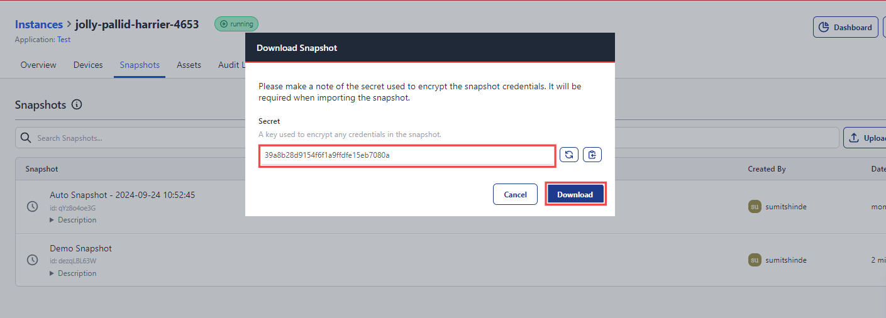{data-zoomable}
*Image showing the prompt to download a snapshot in FlowFuse, featuring a highlighted key and the download button*

2. A new prompt will open, displaying a **secret key**. This key is used to encrypt the configuration details of the snapshot. Copy the key and store it safely, as you will need it for restoring the snapshot.
   - You can also generate a new secret key by clicking the **Random Secret** button on the right.
3. After copying the secret key, click the **Download** button located at the bottom right of the prompt to download the snapshot.

#### Uploading Snapshots:

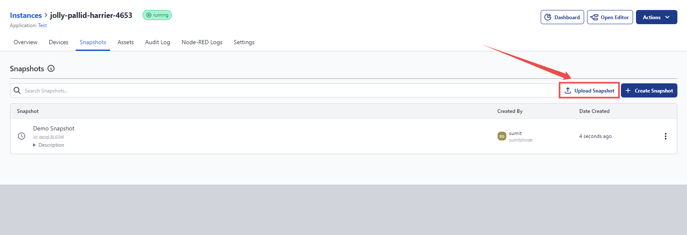{data-zoomable}
*Image showing the button to upload a snapshot in FlowFuse.*

1. In the **Snapshots** tab, click the **Upload Snapshot** button at the top-right corner.

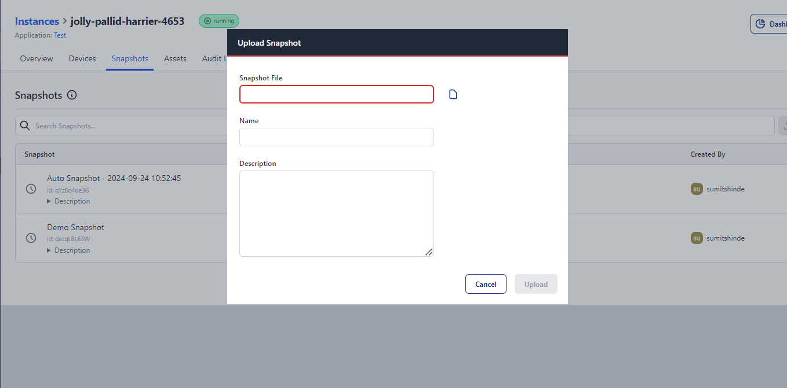{data-zoomable}
*Image showing the prompt to upload a snapshot in FlowFuse.*

2. Select the snapshot file from your local system, and then enter the secret key (the one that was used during the download) to decrypt the snapshot.
3. Click **Upload** to restore the snapshot to the desired instance.

With this process, you can easily manage your snapshots across different environments, ensuring the safety and portability of your Node-RED flows.

#### Deploying Snapshots

Once you have learned how to download and upload snapshots, deploying them is quite straightforward.

To deploy a snapshot:

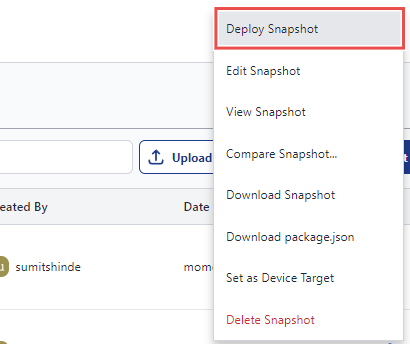{data-zoomable}
*Image showing the 'Deploy Snapshot' option in the menu*

1. Click on the three-dot icon next to the corresponding snapshot and select **Deploy Snapshot** from the menu.
2. Next, you will be prompted to confirm the deployment. Review the details to ensure you are deploying the correct snapshot.
3. Click **Confirm** to proceed with the deployment.

Upon successful deployment, the instance will restart with the state captured in the snapshot. This includes all flows, credentials, environment variables, NPM packages, and runtime settings as they were at the time of the snapshot. This process allows you to quickly recover from issues or revert to a previously stable state in your Node-RED instance.

## Introducing Auto Snapshot

Creating snapshots is crucial for documenting changes, and manually creating them gives users full control over when snapshots are taken. However, manually doing this can be time-consuming, and there is always the risk of forgetting to create one before making changes. To simplify this process, FlowFuse introduces the **Auto Snapshot** feature.

Auto Snapshots automatically create backups whenever you deploy changes, ensuring that your work is continuously backed up without requiring manual intervention. These snapshots are labeled as **"Auto snapshot - yyyy-mm-dd hh:mm:ss"** for easy identification.

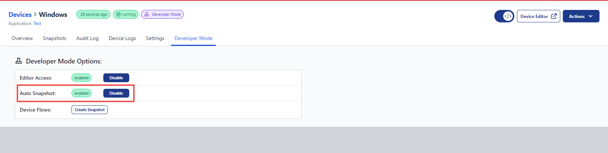{data-zoomable}
*Image showing option to enable/disable auto-snapshots for devices*

This feature allows you to focus on developing your Node-RED flows with the assurance that your changes are securely saved. If necessary, you can disable Auto Snapshots for devices only from the **Developer Mode** tab. This can be helpful to avoid excessive data usage when a device is in the field or on a cellular connection, or to prevent reaching the limit of auto snapshots with unnecessary snapshots.

### Disabling Auto Snapshots

1. Switch to the **Developer Mode** tab by clicking on the "Developer Mode" option at the top.
2. Once inside the Developer Mode tab, you will find the option to enable or disable the Auto Snapshot feature.

**Note:** A limit of 10 auto snapshots is maintained, with the oldest one being deleted when a new one is created. Also this feature is only available to **Team** and **Enterprise** users.

## Setting a Device Target Snapshot

When you set a device target snapshot, all devices associated with the instance will be restarted and updated to run that specified snapshot. This gives you full control over when devices receive the latest changes from your development instance.

With this feature, you can continue developing and testing your flows in FlowFuse without immediately impacting your devices. Once you're confident the flow is ready, you can push the changes to the devices by setting the target snapshot.

Device target snapshots can be assigned either during the creation of a snapshot or at a later time.

### To set the already creted Snapshot as a Device Target Snapshot:

1. Go to the **Snapshots** tab and click on the three-dot icon next to the desired snapshot.

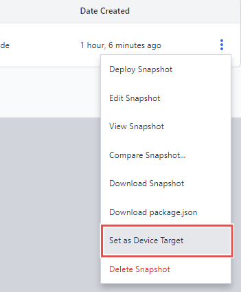{data-zoomable}
*Image showing the 'Set as Device Target' option in the menu*

2. Select **Set as Device Target** from the menu, prompt will open to conform then click on to the "Set Target".

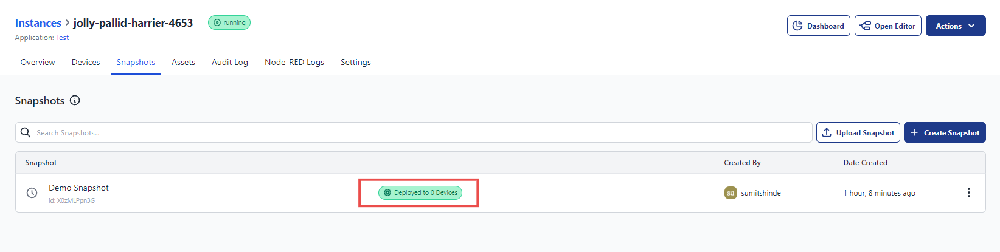{data-zoomable}
*Image showing the green status indicating how many devices have deployed this snapshot option in the menu.*

Once done you will be able to see the green mark in that snapshot showing on how much devices it is deployed on.

## Common Mistakes to Avoid

1. **Neglecting Regular Backups**: Don’t skip those snapshots! Regularly create backups, especially before making significant changes, moving devices through instances or applications, or disabling developer mode. Think of it as your safety net—ensuring you can always bounce back to a stable state if unexpected issues pop up.

2. **Overlooking Auto-Snapshot Limits**: Did you know that your **auto snapshots** have limits? Be mindful of how many you can retain, as older **auto snapshots** will be automatically deleted. If you have important **auto snapshots**, save them locally to keep them safe. Remember, manually created snapshots have no limits, so take advantage of that!

3. **Inadequate Secret Key Security**: Your secret key is your golden ticket! When downloading snapshots locally, **securely store that key**. Losing it could mean losing access to your snapshot and your ability to recover your work. Treat it like a password—keep it safe!

4. **Taking Device Snapshots in the Instance Snapshots Tab**: Make sure you're in the right place! Always take device snapshots in the **Developer Mode** tab. Some users mistakenly capture snapshots for devices in the instance associated with the devices, which only captures the snapshot for the instance itself. This can lead to losing valuable work done on specific device. 

5. **Deploying Unverified Snapshots**: A little caution goes a long way! Always review and verify the details of a snapshot before deploying it. Jumping into deployment without checking can lead to unexpected behavior or the loss of critical configurations. Take the time to ensure everything is in order.

### Conclusion

Using snapshots in FlowFuse is an effective way to manage your Node-RED projects with confidence. By regularly creating snapshots, you can ensure that you always have a backup of your work, allowing you to quickly recover from mistakes or accidental changes. 
