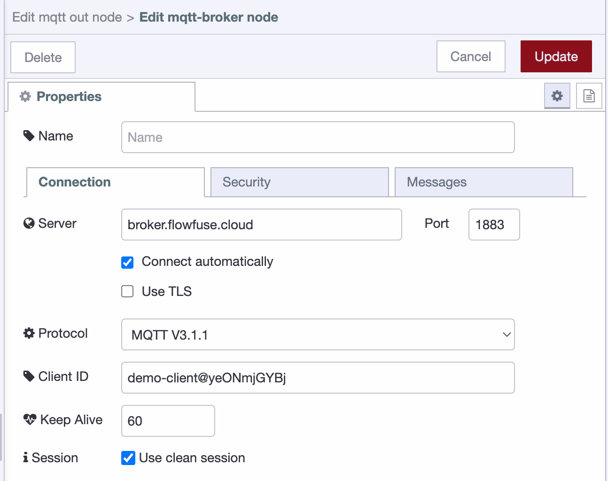

In our [recent product update](/blog/2024/10/flowfuse-release-2-10) we have added our very own MQTT service, built-in and ready to use alongside your Node-RED applications. We are always engaging with users and prospective customers and this has been a highly requested feature, and so we are delighted to announce that this is now live on FlowFuse Cloud for our Pro and Enterprise teams.

<!--more-->

The MQTT Service is available now on [FlowFuse Cloud](https://flowfuse.com/platform/cloud/). FlowFuse permits you to setup your own secure clients to begin publishing and subscribing to your own topics.

You can now use FlowFuse to manage your own MQTT Clients alongside your Node-RED instances, making it easier to build full-stack, event-driven applications within FlowFuse.

## Use Cases
FlowFuse MQTT Service simplifies access to real-time data, an important element in optimizing industrial processes. With the power of FlowFuse, Node-RED and the MQTT service, your integrations are now even easier. Here are some typical uses cases:
* Connect your MQTT enabled PLCs (like Omron N Series, Siemens S7, etc) to your Node-RED instance to open up such possibilities like:
   * Data collection and analysis, Predictive Maintenance, OEE, Condition Based Monitoring. 
   * Triggering actions like sending Emails or alerting your engineers about an event.
   * Realtime production monitoring of your facility.
* Make use of modern IIoT devices on legacy systems by bridging the gap with MQTT.
* Connect disparate systems together where Node-RED and FlowFuse act as the central hub for data processing and routing. This gives you the advantage of transforming data on the fly, applying extra contextual data from other systems, apply routing rules, and much more.

## Pricing

If you're on the Pro or Enterprise tiers of FlowFuse Cloud, then you don't have to pay any extra to get started with the MQTT Service. 

- **Pro Tier:** Includes **5 clients for free** as part of your existing plan
- **Enterprise Tier:** Includes **20 clients for free** as part of your existing plan

In the near future we'll be publishing extra packages of clients that you can add to your team, beyond the amounts included with the base tiers.

## Getting Started

To get started with your own MQTT Clients, navigate to [FlowFuse Cloud](https://app.flowfuse.com), and Sign In.

1. Click the new "Broker" option in the left navigation menu
2. Click "Create Client"

{data-zoomable}
_Screenshot of FlowFuse's "Create Client" interface_

3. Fill out the client's credentials (Username + Password)
4. Define the "Access Control Rules" (see more below)
5. Click "Confirm"

With your client created, you can then, in Node-RED, use the MQTT nodes to connect to your new client.

Setting up a new broker in Node-RED, you can use your credentials accordingly:

{data-zoomable}{width=400}
_Screenshot of the MQTT Config, "Connection" tab in the Node-RED Editor_

And the respective "Security" tab:

{data-zoomable}{width=440}
_Screenshot of the MQTT Config, "Security" tab in the Node-RED Editor_

### Access Control Rules

In MQTT, you can publish and subscribe to _topics_. 

These topics are strings that you can use to organise your data. In the Access Control Rules, you can define which topics your client can publish and subscribe to.

For example, in a flow deployed to many PLCs on your factory floor, you might be publishing to the topics `factory/body-shop/plc/1`, `factory/body-shop/plc/2`, etc.

{data-zoomable}
_Simplified example of MQTT data flow for a Factory Floor_

Then, in a Cloud-Hosted flow, you can subscribe to `factory/body-shop/plc/#` to receive all messages from all PLCs in the body shop, and display relevant data into a Dashboard.

Each client that you create can be constrained in two ways:

- **Action**: You can limit clients to whether than can _only_ subscribe, _only_ publish, or conduct both actions.
- **Topic**: You can control which topics a given client can interact with.

These constraints are particularly useful to ensure security throughout your MQTT network, and to ensure that data is only being sent and received by the correct components.