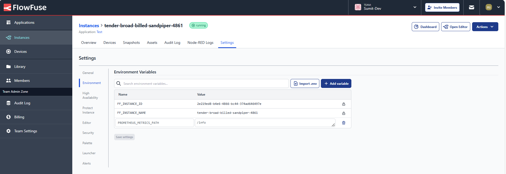

Prometheus is a popular tool for monitoring and collecting system metrics. It helps you track server performance, resource usage, and application health. It’s widely used in various applications, including IoT, where it can monitor data such as temperature and humidity. By collecting these metrics, you can gain valuable insights into your systems and ensure they run smoothly.
<!--more-->
In this guide, we will learn how to integrate Prometheus with Node-RED for sending and receiving metrics and visualizing them effectively. We’ll cover the basic installation steps and configuration and provide examples to help you set up your own Prometheus data dashboard in Node-RED.

## What is Prometheus?

Prometheus is a cutting-edge open-source monitoring and alerting toolkit that empowers organizations to gain real-time insights into their systems and applications. Designed for efficient handling of time series data, Prometheus captures critical metrics, organizes them, and stores them alongside timestamps, enabling you to track performance and identify issues as they arise.

With its unique ability to scrape metrics from various HTTP endpoints, Prometheus transforms raw data into actionable insights, allowing teams to seamlessly monitor everything from CPU usage to request counts. However, it is essential to note that Prometheus stores this data in memory. While this design provides quick access to metrics for real-time monitoring, there may be better options for long-term storage.

### Key Concepts and Components of Prometheus

Understanding some fundamental concepts will enhance your ability to utilize Prometheus effectively:

- Metrics: These are quantifiable data points collected by Prometheus over time, such as CPU usage, memory consumption, and request counts. Metrics fall into two primary categories:

   - Counters: Metrics that only increase, such as the total number of requests.
   - Gauges: Metrics that can increase or decrease, such as current memory usage.

Labels are key-value pairs associated with metrics that provide additional context and facilitate filtering and aggregation. For example, labels can specify the service name, environment (e.g., production or staging), or geographic region.

- Targets: These are endpoints that expose metrics for Prometheus to scrape. Each target can represent a service, application, or system providing metrics in a Prometheus-compatible format, typically accessible at the HTTP endpoint.

### Installing Prometheus on Your Device or Server

To get started with Prometheus, follow these steps to install it on your device or server:

### Step 1: Download Prometheus

1. Go to the [Prometheus download page](https://prometheus.io/download/). On the server without a GUI, you can utilize `curl` to download the latest version directly from the command line:
   ```bash
   curl -LO https://github.com/prometheus/prometheus/releases/latest/download/prometheus-<version>.linux-amd64.tar.gz
   ```
   Replace `<version>` with the actual version number you want to download.

2. Select the appropriate version for your operating system (Linux, macOS, or Windows).
3. Download the tarball or zip file.

### Step 2: Extract the Downloaded Files
- For Linux or macOS, use the following command to extract the tarball:
  ```bash
  tar xvfz prometheus-*.tar.gz
  ```
- For Windows, right-click on the zip file and choose "Extract All."

### Step 3: Navigate to the Prometheus Directory
Change to the directory where Prometheus was extracted:
```bash
cd prometheus-<version>
```

### Step 4: Configure Prometheus
1. Create a configuration file named `prometheus.yml` in the Prometheus directory. This file defines the scrape configurations and other settings. Here’s a basic example:

```yaml
   global:
  scrape_interval: 15s ## update the scrape interval according to your preference

  scrape_configs:
  - job_name: 'cpu usage'  # Replace with your custom job name
    static_configs:
      - targets: ['your_node_red_instance_url']  # Replace with your Node-RED instance URL
    metrics_path: "/info"  # Specify the path for the metrics   
```

Replace `your_job_name,` `your_node_red_instance_url,` and `metrics_path` with your specific details. Avoid using "/metrics" as the `metrics_path,` which is commonly the default but is blocked in the FlowFuse platform.

### Step 5: Start Prometheus
Run the following command to start Prometheus:
```bash
./prometheus --config.file=prometheus.yml
```
By default, Prometheus will start on port **9090**. You can access the web interface by navigating to `http://localhost:9090` in your browser.

### Step 6: Verify the Installation
1. Open your web browser and go to `http://localhost:9090`.
2. You should see the Prometheus dashboard, where you can query metrics and view the status of your targets or the metrics graphs.

{data-zoomable}
_Image showing the Prometheus dashboard UI running locally showing the CPU usage metrics in the graph_

## Building Prometheus data dashboard

In this section, we will focus on integrating Node-RED with Prometheus to create a dynamic dashboard for monitoring the CPU performance of a Node-RED instance. In this example, we’ll have two cases: one on the FlowFuse Cloud and another on a local machine where Prometheus is running. You could have a second Node-RED instance running elsewhere, but for now, my Prometheus instance runs locally, which can be challenging to query when Node-RED is on a different machine. To avoid this, you can run Prometheus on a server, making querying easier in a distributed setup.

The first instance will expose CPU usage metrics, while Prometheus, running locally, will pull this data. The second Node-RED instance will query Prometheus via its API to display the data as charts.

### Prerequisites

Before starting, ensure you have installed the following:

- **node-red-contrib-prometheus-exporter**: This Node-RED node will allow you to expose metrics in a format that Prometheus can scrape.
- **node-red-contrib-cpu**:  This node provides real-time CPU usage metrics, which can be used to monitor the performance of your Node-RED instance running machine.
- **flowfuse/node-red-dashboard**: A set of UI nodes is designed for building user interfaces within Node-RED 

### Exposing Data to Prometheus

1. Drag the ** Inject ** node onto the canvas. Set the repeat interval to match the duration configured in Prometheus's prometheus.yml file to ensure both systems reflect the same data at the same time. 

2. Next, drag the **CPU** node onto the canvas. Double-click it and check the option **"Send a message for overall usage."**

3. drag the **Prometheus Out** node onto the canvas. Double-click it and click the pencil icon to open the configuration tab. In this tab, enter the **Metric Name** (ensure no spaces), provide the **Metric Help**, add **Labels** (you can add as many labels as needed), and set the **Metric Type**. Once done, click **Done** to save the configuration.

{data-zoomable}
_Image showing the Prometheus Out node configuration_

4. After that, drag the **Change** node onto the canvas. Double-click it and set `msg.payload` to:

```json
{
    "op": "set",
    "labels": {"machine": "machine 1"},
    "val": payload
}
```

This structure assigns the CPU usage value from the payload to `val` while setting a label and operation. For a Counter metric, use "op": "inc" to increase the counter by val (default is 1 if value is not specified). For a Gauge metric, you can use "op": "set" to assign val (this is required), "op": "inc" to increase the gauge by val (default is 1), or "op": "dec" to decrease the gauge by val (default is 1). Make sure to adapt the operation type based on your metric requirements.

5. Connect the **Inject** node's output to input of **CPU** node, **CPU** nodes output to input of **Change** node and then **Change** node's output to input of **prometheus-out** node.
6. Deploy the flow.

### Configuring Endpoint for the Prometheus Exporter

Now that you are exposing the data at the `/metrics` endpoint, which is the default for the Prometheus exporter, you need to configure the Prometheus exporter with a different endpoint, as FlowFuse blocks the `/metrics` path for security reasons.

To configure the endpoint, follow these steps:

1. Go to the instance settings in the FlowFuse platform.
2. Switch to the **Environment** tab. Add a new variable called `PROMETHEUS_METRICS_PATH` in this tab and set the desired path for exposing metrics. If you are running Node-RED locally, add `process.env.PROMETHEUS_METRICS_PATH="/path"` at the beginning of the `settings.json` file.

{data-zoomable}
_Image showing the Environment tab in the FlowFuse instance settings, highlighting the addition of the environment variable to set the Prometheus metrics path._

3. Click **Save** and restart the Node-RED instance.

After restarting the Node-RED instance, your data will be exported at the specified endpoint. To confirm that the data is being exported correctly, request an HTTP to `https://<instance-url>/<endpoint>.` You should receive the metrics in a string format that Prometheus understands.

### Retriving Data from prometheus

Prometheus provides a powerful query language called PromQL, which allows for advanced querying of metrics. It also offers an API for querying, commonly used for retrieving data due to its simplicity. In this section, we will utilize the API provided by Prometheus to retrieve data.

### Building a Live Chart

{data-zoomable}
_Image showing a gauge visualizing live CPU usage data._

1. Drag the **Inject** node onto the canvas and set it to repeat at the same interval configured in Prometheus' config file.
2. Drag the **HTTP Request** node onto the canvas and set the URL to `<ip-address>:9090/API/v1/query?query=machine_cpu_usage`, replacing `<ip-address>` with your actual IP address of the machine running Prometheus. Set the return type to "a parsed JSON object."
3. Drag the Change node onto the canvas. Set `msg.ui_update.label` to `msg.payload.data.result[0].metric.machine` to assign the label value displayed in the gauge. Next, set `msg.payload` to `$number(payload.data.result[0].value[1])` using JSONata to assign the metric value. The data property contains the data retrieved from Prometheus, which includes the CPU usage value and associated metadata, as shown below Image:

{data-zoomable}
_Image showing the message containing the retrieved Prometheus metrics._

4. Drag the **Ui-Gauge** widget onto the canvas.
5. Connect the **Inject** node's output to the input of the **HTTP Request** node, the **HTTP Request** node's output to the input of the **Change** node, and finally, connect the **Change** node's output to the input of the **Ui-Gauge** widget.


[{"id":"945881cf1d2fa817","type":"inject","z":"a3aa840957f658c6","name":"","props":[],"repeat":"2","crontab":"","once":true,"onceDelay":0.1,"topic":"","x":290,"y":160,"wires":[["e66a7d3399a90a0c"]]},{"id":"e66a7d3399a90a0c","type":"http request","z":"a3aa840957f658c6","name":"","method":"GET","ret":"obj","paytoqs":"ignore","url":"http://localhost:9090/api/v1/query?query=machine_cpu_usage","tls":"","persist":false,"proxy":"","insecureHTTPParser":false,"authType":"","senderr":false,"headers":[],"x":530,"y":160,"wires":[["6d95c09a23a436c5"]]},{"id":"6d95c09a23a436c5","type":"change","z":"a3aa840957f658c6","name":"","rules":[{"t":"set","p":"ui_update.label","pt":"msg","to":"payload.data.result[0].metric.machine","tot":"msg"},{"t":"set","p":"payload","pt":"msg","to":"$number(payload.data.result[0].value[1])","tot":"jsonata"}],"action":"","property":"","from":"","to":"","reg":false,"x":760,"y":160,"wires":[["b67e1a281a455fd5"]]},{"id":"b67e1a281a455fd5","type":"ui-gauge","z":"a3aa840957f658c6","name":"","group":"8978d5f4322caefa","order":1,"width":3,"height":"5","gtype":"gauge-half","gstyle":"needle","title":"gauge","units":"units","icon":"","prefix":"","suffix":"","segments":[{"from":"0","color":"#5cd65c"},{"from":"4","color":"#ffc800"},{"from":"7","color":"#ea5353"},{"from":"10","color":"#a30000"}],"min":0,"max":"25","sizeThickness":16,"sizeGap":4,"sizeKeyThickness":8,"styleRounded":true,"styleGlow":false,"className":"","x":970,"y":160,"wires":[]},{"id":"8978d5f4322caefa","type":"ui-group","name":"CPU Performance","page":"6d984257ba12e6f4","width":"3","height":"6","order":1,"showTitle":true,"className":"","visible":"true","disabled":"false"},{"id":"6d984257ba12e6f4","type":"ui-page","name":"Page 1","ui":"c385dfc590b1308d","path":"/","icon":"home","layout":"grid","theme":"6be033291dd76b17","order":1,"className":"","visible":true,"disabled":false},{"id":"c385dfc590b1308d","type":"ui-base","name":"Borg Warner","path":"/dashboard","includeClientData":true,"acceptsClientConfig":["ui-notification","ui-control","ui-button"],"showPathInSidebar":false,"showPageTitle":false,"navigationStyle":"temporary","titleBarStyle":"default"},{"id":"6be033291dd76b17","type":"ui-theme","name":"Default Theme","colors":{"surface":"#202c34","primary":"#202c34","bgPage":"#eeeeee","groupBg":"#ffffff","groupOutline":"#ffffff"},"sizes":{"pagePadding":"12px","groupGap":"12px","groupBorderRadius":"4px","widgetGap":"12px","density":"default"}}]


Now, you will see the live gauge displaying the performance of the node-red instances.

### Building a Historical Chart

{data-zoomable}
_Image showing the historical chart visualizing CPU usage_

To build the historical dashboard, we need to specify the start time, end time, and the step or window duration. We'll use a form to capture user input. Our first step is to retrieve data for the specified time range.

1. Drag the **ui-form** widget onto the canvas. Add the elements shown in the following screenshot to capture the start date, start time, end date, end time, and window.

{data-zoomable}
_Image showing elements added in the form widget_

2. Drag the **function** node onto the canvas and insert the following JavaScript code into it to format the date and time correctly:

   ```javascript
   let startDate = msg.payload["start-date"]; // e.g., "2024-10-08"
   let startTime = msg.payload["start-time"]; // e.g., "10:01"
   let endDate = msg.payload["end-date"];     // e.g., "2024-10-08"
   let endTime = msg.payload["end-time"];     // e.g., "10:03"
   let window = msg.payload.window;

   // Store window in flow context
   flow.set("window", window);

   // Create Date objects using the local date and time input
   let startDateTime = new Date(`${startDate}T${startTime}:00`); // Start time
   let endDateTime = new Date(`${endDate}T${endTime}:00`);       // End time

   // Convert Date objects to UTC strings
   let finalStart = startDateTime.toISOString(); // Start in UTC format
   let finalEnd = endDateTime.toISOString();     // End in UTC format

   // Set final start and end in the message payload
   msg.payload.final_start = finalStart;
   msg.payload.final_end = finalEnd;

   return msg;
   ```

3. Drag the **http-request** node onto the canvas. Set the method to `GET` and configure the URL as follows:

   ```
   http://localhost:9090/api/v1/query_range?query=machine_cpu_usage&start={{payload.final_start}}&end={{payload.final_end}}&step={{payload.window}}
   ```

   Ensure that the return type is set to a parsed JSON object.

4. Drag the **debug** node onto the canvas and connect it to the output of the **http-request** node. This will allow you to view the data in the debug panel. Connect the input of the **HTTP-request** node to the output of the **ui-form** widget.

5. Deploy the flow and navigate to the dashboard. In the form, select the start date, start time, end date, end time, and window size, then submit the form.

   If data exists within the specified range, you will see the data in the following format, where each item in the `values` array contains two elements: the first element is the timestamp (in epoch format), and the second element is the metric value:

{data-zoomable}
_Image showing the message containing the retrieved Prometheus metrics using time range_

6. Drag the **split** node onto the canvas, and set the path to `payload.data.result[0].values`.

7. Drag a **change** node onto the canvas. Set the `msg.payload.x` to:

   ```json
      (payload.data.result[0].values[0]* 1000)
   ```

   Notice that the timestamp is multiplied by 1000 because Prometheus returns it in seconds, but Node-RED requires it in milliseconds.

   And set the `msg.payload.y` to:

   ```json
   payload.data.result[0].values[1]
   ```

8. Drag the **ui-chart** widget onto the canvas. Configure it to render in the correct group, select the "line" type, select the action to "append,"  and enter `msg.payload.x` in the X field and `msg.payload.y` in the Y field.

9. Finally, connect the **http-request** node's output to the input of the **split** node, the **split** node's output to the input of the **change** node, and the **change** node's output to the input of the **ui-chart** widget.

10. Deploy the flow, navigate to the dashboard, and select the start date, start time, end date, end time, and window size in the form, then submit the form.


[{"id":"2fb5f71a641b852e","type":"ui-form","z":"a3aa840957f658c6","name":"Date-time Selection Form For Showing Historical Data","group":"bbad16115003a778","label":"","order":1,"width":"9","height":"1","options":[{"label":"Start Date","key":"start-date","type":"date","required":true,"rows":null},{"label":"Start Time","key":"start-time","type":"time","required":true,"rows":null},{"label":"End Date","key":"end-date","type":"date","required":true,"rows":null},{"label":"End Time","key":"end-time","type":"time","required":true,"rows":null},{"label":"Window","key":"window","type":"text","required":false,"rows":null}],"formValue":{"start-date":"","start-time":"","end-date":"","end-time":"","window":""},"payload":"","submit":"submit","cancel":"clear","resetOnSubmit":false,"topic":"topic","topicType":"msg","splitLayout":"","className":"form","x":280,"y":280,"wires":[["45a64f3148671669"]]},{"id":"b2bc474dd7d7363f","type":"ui-chart","z":"a3aa840957f658c6","group":"99a978aa008a01bd","name":"","label":"CPU Usage Historical Chart","order":1,"chartType":"line","category":"cpu_usage","categoryType":"str","xAxisLabel":"","xAxisProperty":"x","xAxisPropertyType":"property","xAxisType":"time","xAxisFormat":"","xAxisFormatType":"auto","yAxisLabel":"","yAxisProperty":"y","ymin":"","ymax":"","action":"append","stackSeries":false,"pointShape":"crossRot","pointRadius":"","showLegend":false,"removeOlder":"1","removeOlderUnit":"60","removeOlderPoints":"","colors":["#d292ff","#aec7e8","#ff7f0e","#2ca02c","#98df8a","#d62728","#ff9896","#9467bd","#c5b0d5"],"textColor":["#666666"],"textColorDefault":true,"gridColor":["#e5e5e5"],"gridColorDefault":true,"width":"12","height":"6","className":"","x":1600,"y":280,"wires":[[]]},{"id":"45a64f3148671669","type":"function","z":"a3aa840957f658c6","name":"Format start and end time and date","func":"// Accessing the properties using bracket notation\nlet startDate = msg.payload[\"start-date\"]; // \"2024-10-08\"\nlet startTime = msg.payload[\"start-time\"]; // \"10:01\"\nlet endDate = msg.payload[\"end-date\"];     // \"2024-10-08\"\nlet endTime = msg.payload[\"end-time\"];     // \"10:03\"\nlet window = msg.payload.window;\n\n// Create a Date object using the local date and time\nlet startDateTime = new Date(`${startDate}T${startTime}:00`); // Construct a date object\nlet endDateTime = new Date(`${endDate}T${endTime}:00`);       // Construct a date object\n\n// Get the UTC date-time strings\nlet finalStart = startDateTime.toISOString(); // Converts to UTC string\nlet finalEnd = endDateTime.toISOString();     // Converts to UTC string\n\n// Assign final start and end to msg payload\nmsg.payload.final_start = finalStart;\nmsg.payload.final_end = finalEnd;\n\nreturn msg;\n\n","outputs":1,"timeout":"","noerr":0,"initialize":"","finalize":"","libs":[],"x":680,"y":280,"wires":[["a0c1bb45b75136d7"]]},{"id":"a0c1bb45b75136d7","type":"http request","z":"a3aa840957f658c6","name":"","method":"GET","ret":"obj","paytoqs":"ignore","url":"http://localhost:9090/api/v1/query_range?query=machine_cpu_usage&start={{payload.final_start}}&end={{payload.final_end}}&step={{payload.window}}","tls":"","persist":false,"proxy":"","insecureHTTPParser":false,"authType":"","senderr":false,"headers":[],"x":930,"y":280,"wires":[["af9fbf75a40d984b","05361ff686e715bc"]]},{"id":"af9fbf75a40d984b","type":"split","z":"a3aa840957f658c6","name":"","splt":"\\n","spltType":"str","arraySplt":1,"arraySpltType":"len","stream":false,"addname":"","property":"payload.data.result[0].values","x":1110,"y":280,"wires":[["4a14bea719eeb6e9"]]},{"id":"05361ff686e715bc","type":"change","z":"a3aa840957f658c6","name":"reset chart","rules":[{"t":"set","p":"payload","pt":"msg","to":"[]","tot":"json"}],"action":"","property":"","from":"","to":"","reg":false,"x":1210,"y":220,"wires":[["b2bc474dd7d7363f"]]},{"id":"4a14bea719eeb6e9","type":"change","z":"a3aa840957f658c6","name":"","rules":[{"t":"set","p":"payload.x","pt":"msg","to":"(payload.data.result[0].values[0]* 1000)","tot":"jsonata"},{"t":"set","p":"payload.y","pt":"msg","to":"payload.data.result[0].values[1]","tot":"msg"}],"action":"","property":"","from":"","to":"","reg":false,"x":1300,"y":280,"wires":[["b2bc474dd7d7363f"]]},{"id":"bbad16115003a778","type":"ui-group","name":"Select","page":"6d984257ba12e6f4","width":"9","height":"1","order":2,"showTitle":true,"className":"chart","visible":"true","disabled":"false"},{"id":"99a978aa008a01bd","type":"ui-group","name":"Historical Chart","page":"6d984257ba12e6f4","width":"12","height":"2","order":3,"showTitle":true,"className":"","visible":"true","disabled":"false"},{"id":"6d984257ba12e6f4","type":"ui-page","name":"Page 1","ui":"c385dfc590b1308d","path":"/","icon":"home","layout":"grid","theme":"6be033291dd76b17","order":1,"className":"","visible":true,"disabled":false},{"id":"c385dfc590b1308d","type":"ui-base","name":"Borg Warner","path":"/dashboard","includeClientData":true,"acceptsClientConfig":["ui-notification","ui-control","ui-button"],"showPathInSidebar":false,"showPageTitle":false,"navigationStyle":"temporary","titleBarStyle":"default"},{"id":"6be033291dd76b17","type":"ui-theme","name":"Default Theme","colors":{"surface":"#202c34","primary":"#202c34","bgPage":"#eeeeee","groupBg":"#ffffff","groupOutline":"#ffffff"},"sizes":{"pagePadding":"12px","groupGap":"12px","groupBorderRadius":"4px","widgetGap":"12px","density":"default"}}]


Once you submit the form, you will see the historical line chart visualizing the data retrieved from Prometheus.

Now that you've learned how to build a Prometheus dashboard and run basic queries refer to the [Prometheus API documentation](https://prometheus.io/docs/prometheus/latest/querying/api/) for more advanced queries.

## Conclusion

In this guide, we covered the fundamentals of Prometheus, starting with its role as a robust monitoring and alerting toolkit. We explored the installation process, ensuring you can effectively set up Prometheus on your system. Then, we demonstrated how to integrate Prometheus with Node-RED for sending and receiving metrics and a practical example of monitoring CPU usage. This setup can be easily extended to track various metrics, providing a holistic view of your system's performance.
