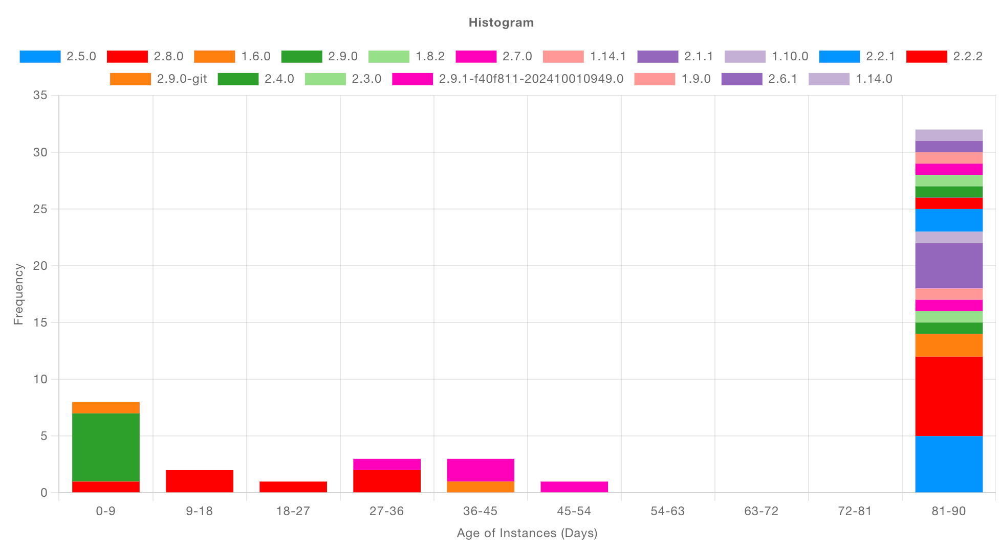
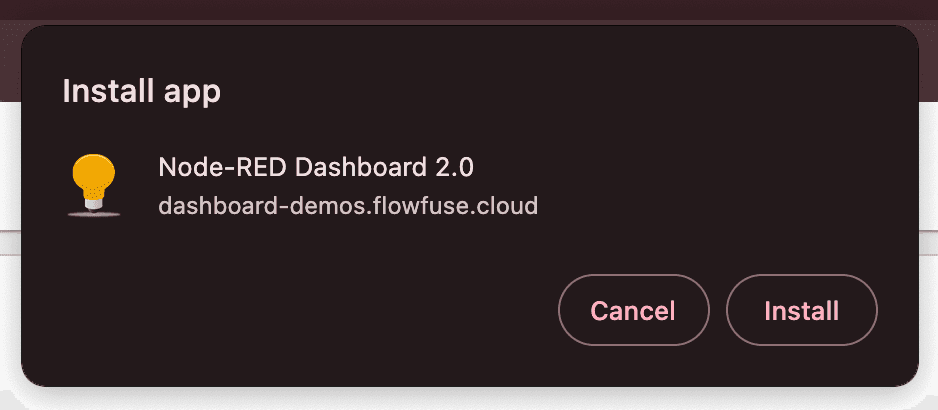

This update introduces new ways to enhance data visualization and customization in your dashboards. With key improvements, including a new chart type, customizable app icon support and a dialog feature for groups, this release helps tailor dashboards for better user interaction and flexibility.

<!--more-->

## New Chart Type: Histogram

Histograms are an essential tool for data analysis, offering a clear way to visualize distributions. The latest Dashboard update introduces a fully customizable histogram chart type, allowing you to present frequency distributions for your data.

Whether analyzing performance metrics or user activity, histograms can give you a clear view of how data points are distributed across predefined ranges. You can now easily group data and control the range, providing deeper insights at a glance.

{data-zoomable}
_Screenshot showing the new Histogram chart type_

The real advantage of this new Histogram chart type is that it simplifies the process for you. Just pass in the raw data, and the histogram will automatically organize it into meaningful ranges, then display how often each range occurs. This makes it incredibly easy to extract valuable insights without the need for manual data processing.

You can see an example flow for the Histogram chart type [here](https://dashboard.flowfuse.com/nodes/widgets/ui-chart.html#histograms) in our documentation.

## Customizable App Icon

Branding is an essential part of any user experience and with this new feature, you can customize your dashboard's app icon. The Node-RED Dashboard 2.0 now allows users to provide their own application icon, which appears in the browser tab and when the dashboard is installed as a Progressive Web App (PWA). This customization helps reinforce your brand, whether you’re developing IoT solutions, monitoring systems or creating dashboards for end-users.

{data-zoomable style="max-width: 400px; margin: auto;"}
_Screenshot showing the customizable app icon in browser and as a PWA_

You can configure the icon by navigating to the base UI settings (ui-base) and providing an icon URL. 

You can read more about how to use this feature in the [App Icon Documentation](https://dashboard.flowfuse.com/nodes/config/ui-base.html#application-icon)

## Building Dialogs

Organizing data on dashboards has become more efficient with the new "Dialog/Modal" feature. Groups in Dashboard now have a new ["Type"](https://dashboard.flowfuse.com/nodes/config/ui-group.html#type) property, so they can be rendered inline as before, or instead rendered as a Dialog. The display of the dialog groups can be controlled (opened/closed) via the [Control](https://dashboard.flowfuse.com/nodes/widgets/ui-control.html#show-hide) node.

This removes the need for building custom modals and dialogs in a Template node, and makes the entire experience of building your dialogs low-code.

{data-zoomable}
_Screenshot showing groups rendered as dialogs in the dashboard_

By utilizing groups as dialogs, users can maintain a clean dashboard while still having quick access to detailed data when required. 

You can read more about the new property, and see an example flow in the [UI Group Documentation](https://dashboard.flowfuse.com/nodes/config/ui-group.html#type)

## What else is new?

You can find the full 1.18.0 Release Notes [here](https://github.com/FlowFuse/node-red-dashboard/releases/tag/v1.18.0).

Just to highlight a few, particularly valuable, updates and fixes:
 - UI Chart - Group tooltips for line chart.
 - UI Button Group
    - Show node status
    - Add pointerdown/pointerup event handling and fix button theming bug
 - UI Table - Support key type option for entering fixed strings as item labels
 - UI Switch - Layout Switching with Dynamic Configuration Support

## What's Next?

Work has already begun on the next release, `1.19.0`, you can see what items we have queued up [here](https://github.com/orgs/FlowFuse/projects/15/views/1), if you've got any feedback or suggestions, please do let us know, and feel free to open new issues on our [GitHub](https://github.com/FlowFuse/node-red-dashboard/issues)