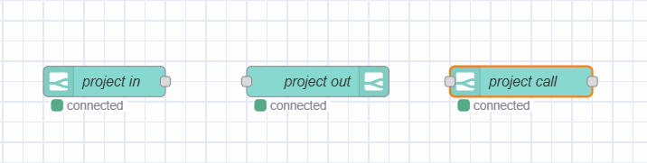
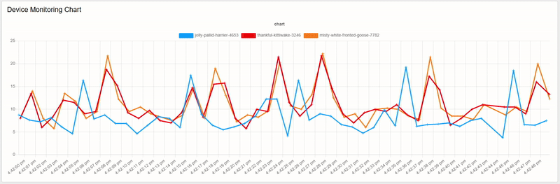
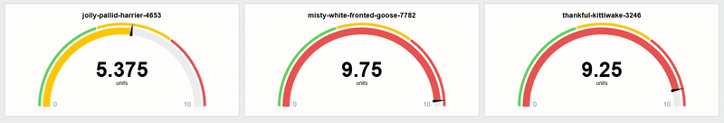

Node-RED is a powerful tool for IoT application development, connecting various services and devices. However, establishing communication between different Node-RED instances—whether for monitoring or control—can be complex. This often requires detailed configurations and protocols like MQTT, HTTP, or CoAP, despite its seamless integration with many protocols.
<!--more-->
FlowFuse addresses this challenge with project nodes designed for easy and efficient communication between Node-RED instances. This guide will show you how to use FlowFuse project nodes to enhance communication and integration, complete with practical demonstrations.

## What Are FlowFuse Project Nodes?

[FlowFuse](/) is a platform that helps manage multiple Node-RED instances in one place. This centralized management makes it easier for teams to collaborate and share resources while simplifying scaling and enhancing project security. 

To facilitate communication between these centrally organized instances, FlowFuse introduces specific project nodes that enable easy and secure message exchange without complex setup. Behind the scenes, these project nodes utilize MQTT, ensuring that communication is lightweight and fast.

These project nodes include three main types:

{data-zoomable}
_Left :Project-in node, Middle: Project-out node, Right: Project-call node_

- **Project In**: Listens for messages being broadcast by other Node-RED instances or for messages sent directly to this instance.
- **Project Out**: Sends messages to other Node-RED instances.
- **Project Call**:Sends messages to other Node-RED instances to trigger specific flows and waits for a response that can be sent using the project out node.

## Using FlowFuse Project nodes

In this section, we will explore how to use the FlowFuse project nodes. We’ll begin by explaining the Project In and Project Out nodes, followed by a detailed look at the Project Call node.

### Using Project in and out nodes 
To demostrate this nodes, we will use an example where a central instance monitors the CPU performance of multiple Node-RED instances every 10 seconds. 

Before we start, let’s understand their configurations:

#### Project In Node

- **Name**: A descriptive label for the node.
- **Source**:
  - **Receive**: Select this option to receive messages sent specifically to this instance.
  - **Receive Broadcast From**: Choose this option to listen for messages broadcast from other instances. A dropdown will include the names of all instances within your team.
- **Topic**: This field allows you to specify a topic, similar to MQTT, to categorize the messages.

#### Project Out Node

- **Name**: A descriptive label for the node.
- **Mode**: 
    - **Send Specified Project Node**: This option allows you to send a specific message or payload to the selected instance. Use this for one-way communication.
    - **Return Project Link Call**: This option sends used to sent response back using a Project Out node project call node.
- **Target**:
  - **Send Message To Instance**: A dropdown to select the instance.
  - **Broadcast Messages**: Option to send messages to all instances.
- **Topic**: This field allows you to specify a topic, similar to MQTT, to categorize the messages.

## Example: Monitoring CPU Performance Of Node-RED Instances

## Prerequisites

Before we begin, ensure you have installed the following nodes via the Palette Manager:

- **node-red-contrib-cpu**: This node is essential for monitoring CPU performance. Install it on the instances that you want to monitor.
- **@flowfuse/node-red-dashboard**: This node is used for creating a dashboard interface. Install it on the central instance, as we will be visualizing the CPU performance data collected from the monitored instances.

### Creating the Flow on the Instances to Monitor

In this section, we will learn how to create a flow that monitors CPU performance and sends data using **Project out**. We will also discuss how to make this flow reusable, allowing you to apply the same setup across multiple instances without editing the flow each time.

1. Drag the **Inject** node onto the canvas and set the repeat interval to "2 seconds". This will trigger the flow after every 2 seconds.
2. Drag the **CPU** node onto the canvas. Double-click it to configure, enable the option "Send message for overall usage," and click "Done".
3. Drag the **Change** node onto the canvas. Configure it to add metadata, including the instance name, instance ID, using default environment variablesand and the CPU data received from the CPU node.
4. Drag the **Project Out** node onto the canvas. Double-click it to set the Mode to "Send to specified project node." For the Target, select "Send message to instance" and choose the name of your centralized instance. 
5. Next, Enter the topic as "cpu-performance".
6. Connect the output of the **Inject** node to the input of the **CPU** node, the output of the **CPU** node to the input of the **Change** node, and finally, connect the **Change** node to the **Project Out** node.


[{"id":"dd182fedce6c532a","type":"inject","z":"fe61f54c8563279d","name":"","props":[{"p":"payload"}],"repeat":"1","crontab":"","once":false,"onceDelay":0.1,"topic":"","payload":"","payloadType":"date","x":190,"y":200,"wires":[["c47bc42f8a6f6884"]]},{"id":"e0dd915a7b37af2b","type":"project link out","z":"fe61f54c8563279d","name":"project out 1","mode":"link","broadcast":false,"project":"054bb5cf-20df-431f-a00b-29b28e160b27","topic":"cpu-performance","x":770,"y":200,"wires":[]},{"id":"05a9ec7b2ae57cc0","type":"change","z":"fe61f54c8563279d","name":"","rules":[{"t":"set","p":"data.name","pt":"msg","to":"FF_INSTANCE_NAME","tot":"env"},{"t":"set","p":"data.cpu","pt":"msg","to":"payload","tot":"msg"}],"action":"","property":"","from":"","to":"","reg":false,"x":560,"y":200,"wires":[["e0dd915a7b37af2b"]]},{"id":"c47bc42f8a6f6884","type":"cpu","z":"fe61f54c8563279d","name":"","msgCore":false,"msgOverall":true,"msgArray":false,"msgTemp":false,"x":370,"y":200,"wires":[["05a9ec7b2ae57cc0"]]}]


By utilizing environment variables, this flow becomes reusable, allowing you to copy and paste flow to monitor multple instances.

### Receiving Data to Monitor and Visualize

{data-zoomable}
_Image: Line chart visualizing CPU performance of all instances._

To receive the CPU data from monitored instances, follow these steps in your centralized Node-RED instance:

1. Open the editor for your central instance.
2. Drag the **Project In** node onto the canvas.
3. Double-click the **Project In** node and set the **Source** to "Listen for broadcast messages from." Select the name of the instances you want to monitor from the dropdown. If you want data from all instances, select "All instances and devices."
4. Enter the **Topic** as "cpu-performance" (or the topic you configured in the Project Out nodes).
5. Drag a **ui-chart** widget onto the canvas. Set the chart type to "line" and configure the series to `msg.payload`.
6. Connect the output of the **Project In** node to the input of the **ui-chart** node.
7. Click the "deploy" button.


[{"id":"2d681b19eb5799b7","type":"change","z":"d382bd2b5733a3a9","name":"","rules":[{"t":"set","p":"payload","pt":"msg","to":"data.cpu","tot":"msg"},{"t":"set","p":"topic","pt":"msg","to":"data.name","tot":"msg"}],"action":"","property":"","from":"","to":"","reg":false,"x":400,"y":220,"wires":[["307d9c5913509557"]]},{"id":"307d9c5913509557","type":"ui-chart","z":"d382bd2b5733a3a9","group":"d0dbd4016c7aac21","name":"","label":"chart","order":1,"chartType":"line","category":"topic","categoryType":"msg","xAxisLabel":"","xAxisProperty":"","xAxisPropertyType":"property","xAxisType":"time","xAxisFormat":"","xAxisFormatType":"auto","yAxisLabel":"","yAxisProperty":"","ymin":"","ymax":"","action":"append","stackSeries":false,"pointShape":"cross","pointRadius":4,"showLegend":true,"removeOlder":1,"removeOlderUnit":"3600","removeOlderPoints":"","colors":["#0095ff","#ff0000","#ff7f0e","#2ca02c","#a347e1","#d62728","#ff9896","#9467bd","#c5b0d5"],"textColor":["#666666"],"textColorDefault":true,"gridColor":["#e5e5e5"],"gridColorDefault":true,"width":"12","height":8,"className":"","x":630,"y":220,"wires":[[]]},{"id":"465ee550bf9d101d","type":"project link in","z":"d382bd2b5733a3a9","name":"project in 1","project":"all","broadcast":false,"topic":"cpu-performance","x":180,"y":220,"wires":[["2d681b19eb5799b7"]]},{"id":"d0dbd4016c7aac21","type":"ui-group","name":"Device Monitoring Chart","page":"39fae809f6f7fc7b","width":"12","height":"1","order":1,"showTitle":true,"className":"","visible":"true","disabled":"false"},{"id":"39fae809f6f7fc7b","type":"ui-page","name":"Device Monitoring","ui":"ded86f3820342985","path":"/charts-example","icon":"chart-box-outline","layout":"grid","theme":"5075a7d8e4947586","breakpoints":[{"name":"Default","px":"0","cols":"3"},{"name":"Tablet","px":"576","cols":"6"},{"name":"Small Desktop","px":"768","cols":"9"},{"name":"Desktop","px":"1024","cols":"12"}],"order":1,"className":"","visible":"true","disabled":"false"},{"id":"ded86f3820342985","type":"ui-base","name":"My Dashboard","path":"/dashboard","includeClientData":true,"acceptsClientConfig":["ui-notification","ui-control"],"showPathInSidebar":false,"showPageTitle":true,"navigationStyle":"default","titleBarStyle":"default"},{"id":"5075a7d8e4947586","type":"ui-theme","name":"Default Theme","colors":{"surface":"#ffffff","primary":"#0094CE","bgPage":"#eeeeee","groupBg":"#ffffff","groupOutline":"#cccccc"},"sizes":{"pagePadding":"12px","groupGap":"12px","groupBorderRadius":"4px","widgetGap":"12px"}}]


Once deployed, open the dashboard to view an interactive live line chart displaying the CPU performance of all monitored devices.

#### Visualizing Data for Specific Devices

{data-zoomable}
_Image: Gauges visualizing the CPU performance of different devices._

To visualize CPU data for specific devices separately, configure the **Project In** node to "Listen for broadcast messages from" and select the desired instance name that you want to monitor.

In the instance sending the CPU data for monitoring, set the **Project Out** node to "Broadcast messages." This will send CPU data to all instances within your team, allowing the centralized instance to capture and display the information.

If you prefer not to use broadcasting, configure the **Project Out** node with specific topics. This will ensure that receiving nodes capture only specific instance data based on the topic. You can then connect these nodes to gauge nodes to distinctly display the CPU performance for each instance.


[{"id":"c0021ca894dd3e17","type":"change","z":"d382bd2b5733a3a9","name":"","rules":[{"t":"set","p":"payload","pt":"msg","to":"data.cpu","tot":"msg"},{"t":"set","p":"ui_update.label","pt":"msg","to":"data.name","tot":"msg"}],"action":"","property":"","from":"","to":"","reg":false,"x":360,"y":140,"wires":[["932a6733d53ab87d"]]},{"id":"426925e74d8e30f5","type":"project link in","z":"d382bd2b5733a3a9","name":"project in 1","project":"04175120-ebeb-4813-8910-03f92f8ed429","broadcast":true,"topic":"cpu-performance","x":140,"y":140,"wires":[["c0021ca894dd3e17"]]},{"id":"932a6733d53ab87d","type":"ui-gauge","z":"d382bd2b5733a3a9","name":"","group":"087559f9b99f047a","order":1,"width":"4","height":"4","gtype":"gauge-half","gstyle":"needle","title":"gauge","units":"units","icon":"","prefix":"","suffix":"","segments":[{"from":"0","color":"#5cd65c"},{"from":"4","color":"#ffc800"},{"from":"7","color":"#ea5353"}],"min":0,"max":10,"sizeThickness":16,"sizeGap":4,"sizeKeyThickness":8,"styleRounded":true,"styleGlow":false,"className":"","x":590,"y":140,"wires":[]},{"id":"38539dc4bfdbf6be","type":"change","z":"d382bd2b5733a3a9","name":"","rules":[{"t":"set","p":"payload","pt":"msg","to":"data.cpu","tot":"msg"},{"t":"set","p":"ui_update.label","pt":"msg","to":"data.name","tot":"msg"}],"action":"","property":"","from":"","to":"","reg":false,"x":360,"y":240,"wires":[["bdbcd5f9f8ac610c"]]},{"id":"e36b12aa51d365fe","type":"project link in","z":"d382bd2b5733a3a9","name":"project in 2","project":"04175120-ebeb-4813-8910-03f92f8ed429","broadcast":true,"topic":"cpu-performance","x":140,"y":240,"wires":[["38539dc4bfdbf6be"]]},{"id":"bdbcd5f9f8ac610c","type":"ui-gauge","z":"d382bd2b5733a3a9","name":"","group":"6cf5326fe928c9cf","order":1,"width":"4","height":"4","gtype":"gauge-half","gstyle":"needle","title":"gauge","units":"units","icon":"","prefix":"","suffix":"","segments":[{"from":"0","color":"#5cd65c"},{"from":"4","color":"#ffc800"},{"from":"7","color":"#ea5353"}],"min":0,"max":10,"sizeThickness":16,"sizeGap":4,"sizeKeyThickness":8,"styleRounded":true,"styleGlow":false,"className":"","x":590,"y":240,"wires":[]},{"id":"a2e1fba0e9cd985a","type":"change","z":"d382bd2b5733a3a9","name":"","rules":[{"t":"set","p":"payload","pt":"msg","to":"data.cpu","tot":"msg"},{"t":"set","p":"ui_update.label","pt":"msg","to":"data.name","tot":"msg"}],"action":"","property":"","from":"","to":"","reg":false,"x":360,"y":340,"wires":[["c298b64b260df708"]]},{"id":"dcfe73c16e17648a","type":"project link in","z":"d382bd2b5733a3a9","name":"project in 3","project":"8a611136-6e3f-447e-9436-34b2d00eac8e","broadcast":true,"topic":"cpu-performance","x":140,"y":340,"wires":[["a2e1fba0e9cd985a"]]},{"id":"c298b64b260df708","type":"ui-gauge","z":"d382bd2b5733a3a9","name":"","group":"ee5fc3eb29a7ee4b","order":1,"width":"4","height":"4","gtype":"gauge-half","gstyle":"needle","title":"gauge","units":"units","icon":"","prefix":"","suffix":"","segments":[{"from":"0","color":"#5cd65c"},{"from":"4","color":"#ffc800"},{"from":"7","color":"#ea5353"}],"min":0,"max":10,"sizeThickness":16,"sizeGap":4,"sizeKeyThickness":8,"styleRounded":true,"styleGlow":false,"className":"","x":590,"y":340,"wires":[]},{"id":"087559f9b99f047a","type":"ui-group","name":"Device Group 1","page":"39fae809f6f7fc7b","width":"4","height":"2","order":3,"showTitle":false,"className":"","visible":"true","disabled":"false"},{"id":"6cf5326fe928c9cf","type":"ui-group","name":"Device Group 2","page":"39fae809f6f7fc7b","width":"4","height":"2","order":2,"showTitle":false,"className":"","visible":"true","disabled":"false"},{"id":"ee5fc3eb29a7ee4b","type":"ui-group","name":"Device Group 3","page":"39fae809f6f7fc7b","width":"4","height":"2","order":1,"showTitle":false,"className":"","visible":"true","disabled":"false"},{"id":"39fae809f6f7fc7b","type":"ui-page","name":"Device Monitoring","ui":"ded86f3820342985","path":"/charts-example","icon":"chart-box-outline","layout":"grid","theme":"5075a7d8e4947586","breakpoints":[{"name":"Default","px":"0","cols":"3"},{"name":"Tablet","px":"576","cols":"6"},{"name":"Small Desktop","px":"768","cols":"9"},{"name":"Desktop","px":"1024","cols":"12"}],"order":1,"className":"","visible":"true","disabled":"false"},{"id":"ded86f3820342985","type":"ui-base","name":"My Dashboard","path":"/dashboard","includeClientData":true,"acceptsClientConfig":["ui-notification","ui-control"],"showPathInSidebar":false,"showPageTitle":true,"navigationStyle":"default","titleBarStyle":"default"},{"id":"5075a7d8e4947586","type":"ui-theme","name":"Default Theme","colors":{"surface":"#ffffff","primary":"#0094CE","bgPage":"#eeeeee","groupBg":"#ffffff","groupOutline":"#cccccc"},"sizes":{"pagePadding":"12px","groupGap":"12px","groupBorderRadius":"4px","widgetGap":"12px"}}]


This example showcases one of many powerful use cases for FlowFuse project nodes. By utilizing these capabilities, you can transform how your Node-RED instances communicate, enabling efficient workflows and innovative solutions.

## Using Project Call Nodes

**Project Call** nodes are ideal for triggering flows deployed on another Node-RED instance and retrieving the final result as a response. While they function similarly to [webhooks](/node-red/integration-technologies/webhook/), they utilize [MQTT](/node-red/protocol/mqtt/) as their underlying mechanism instead of HTTP. In this section, we will demonstrate the use of a **Project Call** node through an example of making an on-demand temperature request.

### How Project Call Nodes Work

The **Project Call** node does not operate in isolation; it requires both **Project In** and **Project Out** nodes to function properly. The **Project Call** node triggers the **Project In** node deployed on the specified target instance, while the **Project Out** node handles the response. This means the flow that needs to be triggered should start with a **Project In** node and end with a **Project Out** node.

### Example: On-Demand Temperature Request

In this example, we will trigger a flow on a Raspberry Pi instance that reads the temperature using a DHT11 sensor and sends the response back to the instance where we use the **Project Call** node.

Before we start, let’s review the configuration options for the **Project Call** node:

#### Project Call Node Configuration

- **Name**: A descriptive label for the node.
- **Timeout**: Set the duration to wait for a response before timing out.
- **Target**: Specify the target instance where the flow is deployed.
- **Topic**: This field allows you to specify a topic, similar to MQTT, to categorize the messages.

#### Prerequisites

Before we begin, ensure you have the following prepared:

- **node-red-contrib-dht-sensor**: Install this node via the palette manager. This node is used to manage the connection to a DHT11 or DHT22 sensor on a Raspberry Pi.
- **FlowFuse Device Agent Setup**: Ensure you have set up and are running the FlowFuse device agent on your Raspberry Pi, and it is connected to the platform.

#### Developing a Flow to Handle On-Demand Data Requests

Throughout this section, we will explore how to utilize the **Project Call** node along with **Project In** and **Project Out** nodes to trigger a flow that retrieves temperature readings from a Raspberry Pi on demand. 

***Note**: Before proceeding, make sure your device is assigned to an instance. If the device is assigned to an application, you cannot use Project nodes, as they are designed to work with instances.*


[{"id":"bdb27b9ab0d94897","type":"inject","z":"b152a914653d9fce","name":"Trigger","props":[{"p":"payload"},{"p":"topic","vt":"str"}],"repeat":"5","crontab":"","once":true,"onceDelay":0.1,"topic":"","payload":"","payloadType":"date","x":260,"y":380,"wires":[["8a4fe9cf342b6156"]]},{"id":"4ece54ca3c91f7ff","type":"debug","z":"b152a914653d9fce","name":"debug 1","active":true,"tosidebar":true,"console":false,"tostatus":false,"complete":"true","targetType":"full","statusVal":"","statusType":"auto","x":680,"y":380,"wires":[]},{"id":"8a4fe9cf342b6156","type":"rpi-dht22","z":"b152a914653d9fce","name":"","topic":"rpi-dht22","dht":"11","pintype":"0","pin":4,"x":460,"y":380,"wires":[["4ece54ca3c91f7ff"]]}]


1. Copy/download the flow above and import/upload it into your Raspberry Pi Node-RED instance. Ensure you have correctly interfaced the DHT11 sensor with your Raspberry Pi. For more information, refer to our guide on [Setting Up Node-RED on Raspberry Pi 4](/node-red/hardware/raspberry-pi-4/), which explains how to install the device agent on the Raspberry Pi and read temperature data from the DHT11 sensor.
2. Deploy the flow.

Once you deploy the flow, you will see the temperature data displayed on the Debug panel if everything was done correctly. Now, let’s add the project nodes to trigger the temperature reading flow on demand and retrieve the data accordingly.

3. Drag the **Project In** node onto the canvas, double-click on it, and set the source to "Receive messages sent to this instance." Next, enter the topic.
4. Replace the **Inject** node with the **Project In** node.
5. Next, you can add a **Change** node to format the data received by the **DHT** node.
6. Drag the **Project Out** node onto the canvas, double-click on it, and set the mode to "Return to project link call."

Once the flow is ready, deploy it. The final flow should look like the one below:


[{"id":"020ede0bf68cf063","type":"change","z":"fe61f54c8563279d","name":"","rules":[{"t":"set","p":"data.temperature","pt":"msg","to":"payload","tot":"msg"},{"t":"set","p":"data.humidity","pt":"msg","to":"humidity","tot":"msg"},{"t":"delete","p":"payload","pt":"msg"},{"t":"delete","p":"humidity","pt":"msg"},{"t":"set","p":"topic","pt":"msg","to":"rpi-dht11","tot":"str"}],"action":"","property":"","from":"","to":"","reg":false,"x":560,"y":220,"wires":[["1a592414ab69f1d8"]]},{"id":"a39fcfcd133ecaae","type":"project link in","z":"fe61f54c8563279d","name":"project in 1","project":"all","broadcast":false,"topic":"temperature","x":160,"y":220,"wires":[["16e8a24545d3258f"]]},{"id":"1a592414ab69f1d8","type":"project link out","z":"fe61f54c8563279d","name":"project out 1","mode":"return","broadcast":false,"project":"b1dd1d7d-556e-4dd4-9b8f-d78ffe3f510d","topic":"","x":790,"y":220,"wires":[]},{"id":"16e8a24545d3258f","type":"rpi-dht22","z":"fe61f54c8563279d","name":"","topic":"rpi-dht11","dht":"11","pintype":"0","pin":4,"x":340,"y":220,"wires":[["020ede0bf68cf063"]]}]


Now that we have added the **Project In** and **Project Out** nodes, the flow can be triggered to read the temperature from any Node-RED instance within your team using the **Project Call** node and receive the response.

#### Triggering the Flow and Receiving Temperature Data

In this section, we will explore how to trigger the flow we created in the previous step and receive the on-demand temperature data.

1. Navigate to the instance within your team where you want to receive the data.
2. Drag the **Project Call** node onto the canvas. Double-click it to set the timeout according to your preference, then set the target to the instance where your flow needs to be triggered. Next, enter the topic you configured in the **Project In** node previously.
3. Drag an **Inject** node onto the canvas and connect it to the input of the **Project Call** node. This will allow you to trigger the **Project Call** node manually.
4. Finally, drag a **Debug** node onto the canvas and connect it to the output of the **Project Call** node. This will help you view the response received from the triggered flow in the Debug panel.
5. Deploy the flow.


[{"id":"8276fba516f3697b","type":"project link call","z":"d382bd2b5733a3a9","name":"","project":"d1b6cf3a-70fc-4ec4-b30c-e207338b2cc4","topic":"temperature","timeout":"30","x":530,"y":200,"wires":[["9ef6638382d7e9d5"]]},{"id":"0abdbf43350eb362","type":"inject","z":"d382bd2b5733a3a9","name":"","props":[{"p":"payload"}],"repeat":"","crontab":"","once":false,"onceDelay":0.1,"topic":"","payload":"","payloadType":"date","x":320,"y":200,"wires":[["8276fba516f3697b"]]},{"id":"9ef6638382d7e9d5","type":"debug","z":"d382bd2b5733a3a9","name":"debug 1","active":true,"tosidebar":true,"console":false,"tostatus":false,"complete":"true","targetType":"full","statusVal":"","statusType":"auto","x":740,"y":200,"wires":[]}]


Now, once you click the **Inject** button, you will see the response that includes the temperature in the debug panel, which is read by the flow deployed on the Raspberry Pi.

{data-zoomable}
_Image showing the project call node triggering the flow deployed on the device to read the temperature data._

Now that you understand how to use FlowFuse project nodes, you can significantly improve the way your Node-RED instances communicate with one another.

## Conclusion

FlowFuse project nodes streamline communication between Node-RED instances. By using these nodes, you can easily monitor performance, request data, and more. This makes your workflows smoother and more efficient. 

{% include "cta.njk", cta_url: "/get-started?utm_campaign=60718323-BCTA&utm_source=blog&utm_medium=cta&utm_term=high_intent&utm_content=Using%20FlowFuse%20Project%20Nodes%20for%20Faster%20and%20More%20Efficient%20Communication", cta_type: "signup", cta_text: "Streamline communication between your Node-RED instances—manage, scale, and secure them with ease to enhance industrial efficiency." %}
