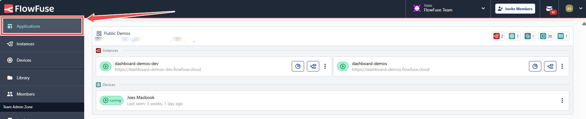
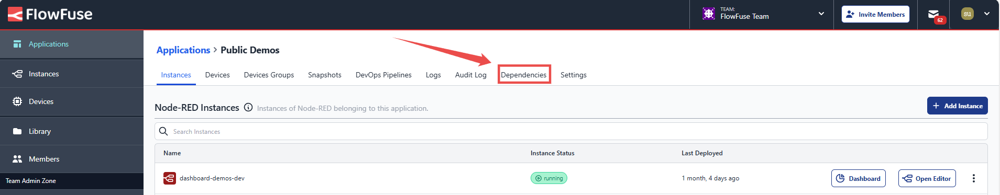
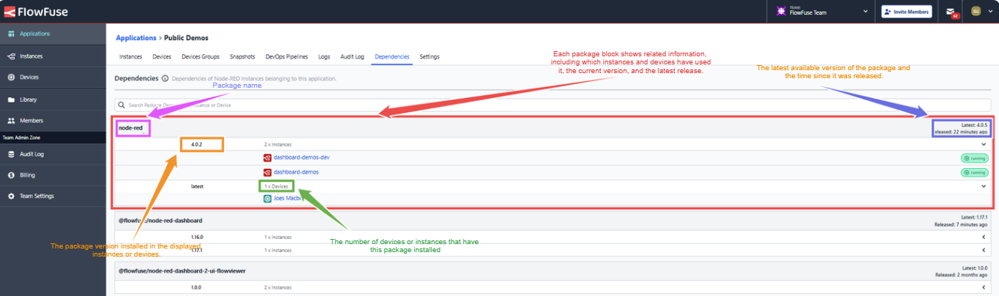

FlowFuse recently launched Software Bill of Materials (SBoM) for enterprise customers. This powerful tool enhances security and management within projects, particularly in the Node-RED ecosystem. As open-source libraries and software continue to play a pivotal role in the industry, monitoring third-party components used in projects becomes essential. The SBoM enables organizations to track dependencies and identify vulnerabilities, ensuring compliance and mitigating risks.

<!--more-->

## What is an SBoM, and How Does It Enhance Security?

A Software Bill of Materials (SBoM) is a detailed list of all the components that make up a software application. Just as a bill of materials for a physical product lists every part used in its construction, an SBoM provides a breakdown of all the software libraries, packages, and dependencies in a project.

This transparency is crucial for security, allowing developers and organizations to track what’s inside their software. By knowing precisely what components are in use, you can quickly identify outdated or vulnerable dependencies that may pose security risks. An SBoM helps you monitor third-party nodes, ensuring that any related security issues can be addressed promptly and reducing the chance of vulnerabilities being exploited.

## How You Can Use SBoM to Enhance Security in Your Node-RED Applications

Here are some effective strategies for leveraging SBoM in your Node-RED applications:

1. **Regular Monitoring**: Frequently review your SBoM to identify outdated or vulnerable packages. Proactive monitoring helps catch potential security threats early.

2. **Timely Upgrades**: When you spot vulnerabilities in your packages, prioritize upgrading them. Keeping dependencies up to date is crucial for maintaining security and performance.

3. **Evaluate Third-Party Nodes**: Assess the third-party nodes in your application. If any appear unmaintained or outdated, consider alternatives to ensure ongoing security.

By integrating these practices into your workflow, you can effectively manage dependencies and strengthen the security of your Node-RED solutions.

## Exploring the FlowFuse SBoM Feature

To support the effective monitoring and assessment of your dependencies, FlowFuse provides a dedicated Software Bill of Materials (SBoM) interface in the platform. For those who may not be familiar, **[FlowFuse](/)** offers a comprehensive platform that enables engineers to effectively build, manage, and secure their applications. By integrating IT and operational technology (OT) environments, FlowFuse streamlines the process of connecting, collecting, transforming, and visualizing industrial data.

### Accessing FlowFuse SBoM Interface

The Software Bill of Materials (SBoM) interface is available at the application level. For more information on the application, refer to the [Documentation](/docs/user/concepts/#application). To access it:

1. Navigate to your Node-RED application within the FlowFuse platform.

{data-zoomable}
_Image showing the 'Applications' option in the FlowFuse platform._

2. Click the **Dependencies** option at the top to switch to the SBoM interface.

{data-zoomable}
_Image showing the 'Dependencies' option in the FlowFuse platform for the SBoM interface._

*Note: This feature is only available for FlowFuse Enterprise customers.*

### Understanding What the SBoM Interface Shows

Once you navigate the tab, you will see a list of all the packages installed within your Node-RED Cloud instances and devices associated with that application. This includes the package names and versions, the number of devices and instances using each version, and additional details such as the latest available version of each package and the time since its release.

{data-zoomable}
_Image showing the Dependencies tab along with the detailed notes of each item displayed._

Incorporating a Software Bill of Materials into your development process not only enhances security but also fosters a culture of accountability and transparency within your team. By understanding your dependencies, you can make informed decisions that protect your applications and ensure compliance with industry standards. 

{% include "cta.njk", cta_query: "utm_campaign=60718323-BCTA&utm_source=blog&utm_medium=cta&utm_term=high_intent&utm_content=FlowFuse%27s%20Software%20bills%20of%20material%20helps%20enhance%20Application%20Security%20and%20Management", cta_type: "signup", cta_text: "Try FlowFuse today with a free trial! Discover how you can enhance your Node-RED projects and accelerate your production processes." %}
