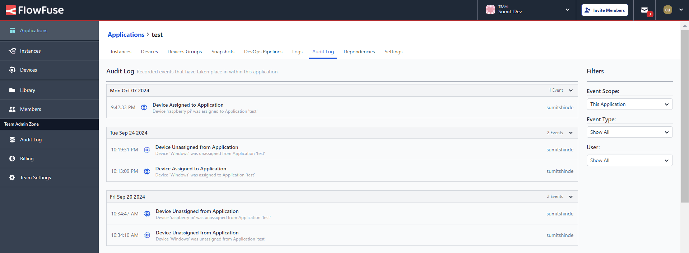
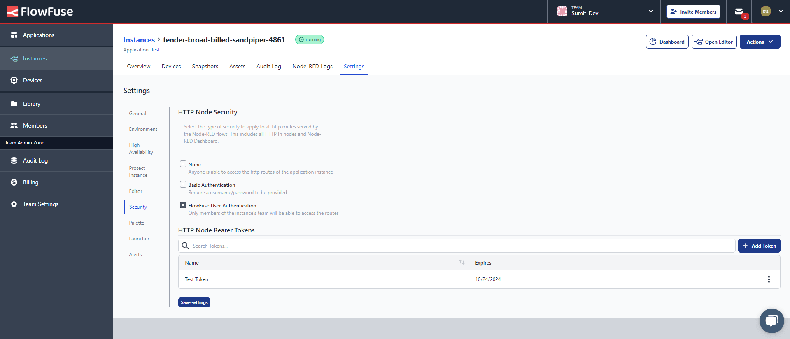
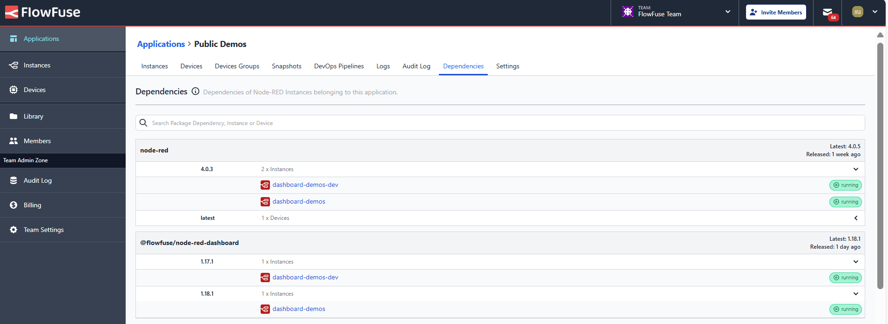

When it comes to securing Node-RED applications and its editor, ensuring that your flows and data are protected from unauthorized access can feel like a daunting task. Even after investing considerable time, achieving the right level of security often remains a complex challenge. For enterprises, this goes far beyond access control— security is a cornerstone of protecting sensitive data, maintaining operational continuity, and meeting strict regulatory requirements. A robust security framework not only prevents breaches but also safeguards intellectual property, preserves trust, and shields the organization from costly cyber threats.

<!--more-->

Here are 9 ways FlowFuse simplifies and strengthens your Node-RED deployments, ensuring you’re fully protected without the hassle.

## Default Security Measures to Keep Your Environment Safe

Securing your Node-RED applications is essential to protect sensitive data, proprietary business logic, and critical systems from unauthorized access or cyberattacks. Without proper safeguards, the risks of data loss, operational disruptions, and reputational damage are significant. FlowFuse implements robust security measures right from the start, ensuring your deployments remain safe. Data is encrypted during transmission, and rate limiting prevents traffic overloads, ensuring smooth operations. Additionally, secure tunnelling facilitates safe communication between your edge devices and the FlowFuse platform. To ensure that only authorized personnel have access to your FlowFuse team, we’ve implemented strong login authentication measures, which can be further enhanced with multi-factor authentication as needed.

Here’s the best part- we don’t just offer default protections; we empower you to fine-tune your security defences. FlowFuse features a user-friendly interface that allows you to customize your security settings and design a strategy tailored to your needs. Rest easy knowing that we've laid a solid security foundation while giving you the flexibility to enhance your defences.

If you're interested in learning more about how we safeguard your data privacy and security, we invite you to read our detailed [security statement](/platform/security/). Additionally, we are proud to announce that [FlowFuse has achieved SOC 2 Type 1 compliance](/blog/2024/01/soc2/), demonstrating our commitment to maintaining the highest standards in security and data protection.

### Single Sign-On (SSO) Integration

Every organization relies on various tools and platforms to enhance productivity and efficiency. Providing seamless access to these resources is vital for optimizing workflows. That’s where Single Sign-On (SSO) comes in, it simplifies the onboarding and offboarding processes. 

With SSO, team members can log in using their existing credentials, eliminating the hassle of remembering multiple passwords. This streamlines their login experience and enables them to be productive from day one.

To implement SSO for your self-hosted FlowFuse, refer to the following resources:

- [How to Set Up SSO SAML for Node-RED](/blog/2024/07/how-to-setup-sso-saml-for-the-node-red/)
- [How to Set Up SSO LDAP for Node-RED](/blog/2024/07/how-to-setup-sso-ldap-for-the-node-red/)

If you are using FlowFuse Cloud, please get in touch with us for configuration assistance.

### Two-Factor Authentication (2FA)

We've all been there, managing countless passwords, hoping they're strong enough to protect against security threats. But in today’s digital world, passwords alone aren’t sufficient. That’s why Two-Factor Authentication (2FA) has become essential.

FlowFuse understands this need. By enabling 2FA, even if someone gets hold of your password, they'll still require a second form of verification—like a code sent to your phone—to access your account. This simple yet powerful layer of security ensures your data is much safer from unauthorized access. However, when Single Sign-On (SSO) is enabled, 2FA will be replaced by SSO's authentication process.

To set up 2FA in FlowFuse, you’ll need to head over to **User Settings > Security > Two-Factor Authentication**. It’s as simple as clicking the "Enable Two-Factor Authentication" button, scanning the QR code displayed on the platform with your authenticator app, and then entering the code from your app back into FlowFuse. Once you've done that, 2FA will be up and running, adding that extra layer of security to your account!

{data-zoomable}
_Flowfuse: Two Factor Authentication_

## Granular Role-Based Access Management

With collaboration at its core, FlowFuse allows you to create teams and invite members to collaborate on projects. However, not all team members require access to every feature. Effective management is essential, as some members might feel overwhelmed by unnecessary options, and there's a risk of accidental changes being made by those who are unfamiliar with the configurations and settings.

To address this, FlowFuse offers [Role-Based Access Control (RBAC)](/blog/2024/04/role-based-access-control-rbac-for-node-red-with-flowfuse/). When inviting team members, you can assign specific roles that provide the appropriate level of access for their work:

- **Owner**: Has full control over the team settings, applications, instances, and flows. Can invite users and change their roles.
- **Member**: Can access applications and instances and modify flows, but with limited permissions compared to the Owner. Cannot manage team, application, or instance settings or invite users.
- **Viewer**: Can view instances and flows but cannot make any changes. Ideal for users who need to monitor without editing capabilities.
- **Dashboard Only**: Restricted to accessing the dashboard or HTTP endpoint. This role is for users who only need to monitor status without making any changes.

{data-zoomable}
_Flowfuse: Role Base Accesss control_

Additionally, you can later change the roles of team members in the "members" page. This helps prevent unauthorized changes and ensures a more secure and efficient workflow.

### Comprehensive Activity Audit Logs

Today, many organizations prioritize a culture of openness and transparency, but security remains a top concern. Our **Audit Logs** feature supports this dual focus by maintaining a comprehensive record of all actions in the platform. These logs detail who made changes, what was changed, and when it occurred, ensuring accountability and enabling teams to quickly identify any unauthorized access or mistakes that could jeopardize security.

We provide audit logs at three different levels: **instance level**, where all action logs related to a specific instance are recorded; **application level**, which groups logs from instances created within a particular application; and **team level**, where all platform activities are documented but visible only to admins. This layered approach helps organizations maintain secure workflows and demonstrates their commitment to transparency, ensuring that security concerns are effectively addressed without sacrificing openness.

To access the audit logs:  

- For **instance-level logs**, choose the specific instance you want to see and go to **Audit Logs**.  

{data-zoomable}
_FlowFuse: Instance-level Audit Logs_

- For **application-level logs**, select the application you want to view and navigate to **Audit Logs**.

{data-zoomable}
_Flowfuse: Application-level Audit Logs_

- For **team-level logs**, there will be an option labeled **"Audit Logs"** in the left sidebar, accessible only to admins.

{data-zoomable}
_Flowfuse: Team-level Audit Logs_

For more information refer to the [Documentation](/docs/user/logs/#audit-log)

### Instance Protection Mode

Imagine your Node-RED application running smoothly on the production line, seamlessly handling critical tasks and data flows. Now, picture the chaos that could ensue if someone from your team accidentally modified a flow. While we offer the [snapshot](/blog/2024/09/node-red-version-control-with-snapshots/) feature to recover previous changes, accidental modifications may not be identified quickly. Even when they are discovered, and the snapshot is used to restore the previous state, it can still take seconds or even minutes to recover, resulting in costly downtime.

To prevent such scenarios, we provide a feature called **Instance Protection Mode**. This mode allows you to set flows within your Node-RED instances to read-only, ensuring that modifications can only occur through a [DevOps pipeline](/blog/2024/10/how-to-build-automate-devops-pipelines-node-red-deployments/). This process guarantees that even the most critical flows can only be altered with thorough testing and approval.

{data-zoomable}
_Flowfuse: Option to Enable the Instance Protection Mode_

With Instance Protection Mode activated, team members can still view flows, but any attempts to modify them are blocked, providing an additional layer of security. This approach protects the integrity of your applications and fosters a controlled environment for making changes safely.

### Secure HTTP Nodes Endpoints

HTTP is one of the most widely used protocols for enabling communication between different applications and services. In Node-RED, you can quickly create these APIs using HTTP-In nodes, which allow for communication. However, while this convenience is excellent, ensuring that only authorized users can access your APIs is essential.

FlowFuse provides robust options for securing all HTTP endpoints served by Flow and the Node-RED Dashboard. To manage this, each instance has a dedicated interface that you can access by navigating to **your instance -> Settings -> Security**. Here, you’ll find several options for securing your APIs:

{data-zoomable}
_Flowfuse: Options to enable authentication for the HTTP endpoints created in the Node-RED instance._

1. **None (Default)**: No authentication is enabled by default, which means anyone can access your endpoints.

2. **Basic Authentication**: By selecting this option, two input fields will appear where you can enter a username and password. This ensures that only users with the correct credentials can access your APIs.

3. **FlowFuse User Authentication**: This option allows all team members to use their unique usernames and passwords when requesting API.

4. **Bearer Tokens**: For more advanced users, there’s an option to generate bearer tokens for secure API access without needing to send usernames and passwords. With this feature, you can also set expiration times for these tokens, ensuring that access is time-limited and reducing the risk of unauthorized use. To use bearer tokens, you must first enable **FlowFuse User Authentication**.

For more information, refer to [HTTP Authentication in Node-RED with FlowFuse](/blog/2024/03/http-authentication-node-red-with-flowfuse/).

With these features, FlowFuse gives you complete control over who can access your APIs created in the Node-RED instance.

### API Token Management for Secure Platform Interactions

We understand that organizations need to create integrations for automation, monitoring, and efficient workflows. FlowFuse provides REST APIs that allow easy interaction with various platform parts, including users, instances, teams, devices, and more. However, security settings are protected to ensure they can only be updated by admins or authorized team members directly on the platform, not via APIs.

{data-zoomable}
_FlowFuse: Interface for generating bearer tokens to ensure secure interactions with the platform APIs._

Protecting against unauthorized access is crucial, especially since you control and monitor your entire factory and production lines through this platform. To safeguard this, we offer an interface similar to the one used for bearer tokens. You can access this by navigating to **User Settings > Security > Tokens**.

For more information, refer to the [FlowFuse Platform API docs](/docs/api/).

## Software Bills of Materials 

Node-RED is an open-source platform maintained by dedicated community members who ensure it operates smoothly and remains free of security vulnerabilities. Similarly, there exists a vast ecosystem of open-source packages, nodes, and libraries that we frequently use in our projects. While these packages are often excellent and enhance our capabilities, some may need a regular team or individual to update and monitor them. This can lead to potential risks, as outdated or unmaintained packages can introduce vulnerabilities into our applications.

To address these concerns, we recently introduced the Software Bill of Materials (SBOM) feature, which adds an extra layer of security and compliance. An SBOM is a detailed list of all an application's components. It provides a comprehensive view of all third-party libraries used in each application instance and their latest versions. This allows teams to monitor dependencies and make informed decisions about upgrades, ensuring effective dependency management and enhanced resilience against security threats.

{data-zoomable}
_FlowFuse: Software Bills of Materials Inteface_

For more information, refer to the [Article on FlowFuse Software Bills of Materials](/blog/2024/10/exploring-flowfuse-sbom-feature/).

In conclusion, FlowFuse offers a comprehensive suite of security features designed to empower you with the tools to protect your Node-RED applications effectively. Understanding and utilizing these security features will help you maintain a secure and efficient environment for your Node-RED applications. With FlowFuse, you can confidently safeguard your deployments, ensuring robust protection against unauthorized access while enhancing collaboration within your team.

## Get Started with FlowFuse Today!

{% include "cta.njk", cta_url: "/get-started?utm_campaign=60718323-BCTA&utm_source=blog&utm_medium=cta&utm_term=high_intent&utm_content=FlowFuse%20Security%20Features%20You%20Didn%E2%80%99t%20Know%20You%20Needed", cta_type: "signup", cta_text: "Ready to secure and scale your Node-RED applications?" %}