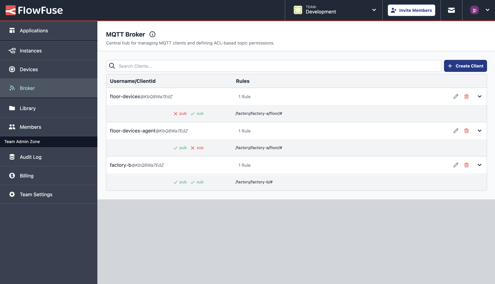
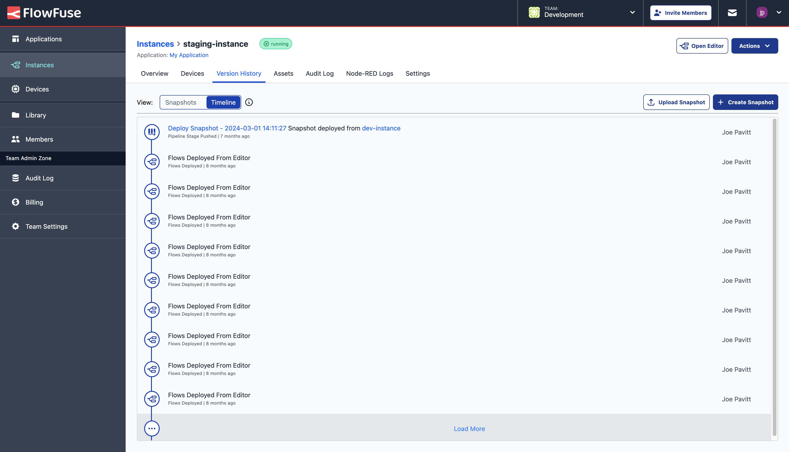
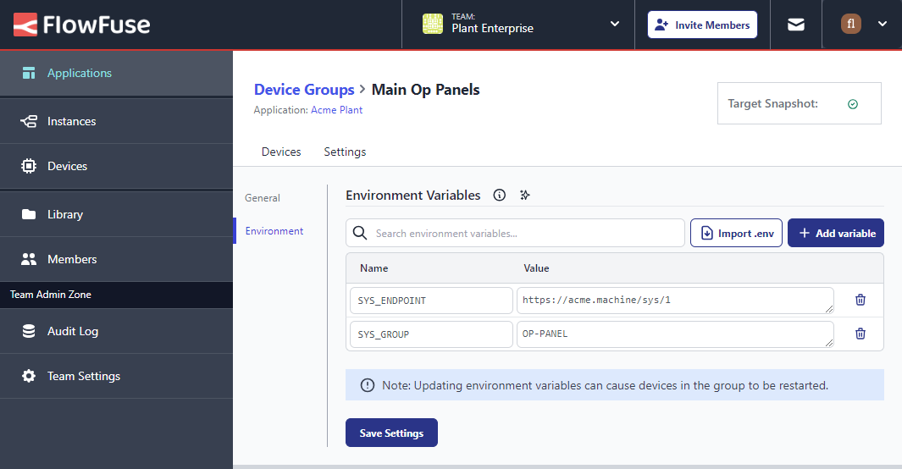

With FlowFuse 2.10 we've added some new major features, as well as improvements across the board for FlowFuse users.

Most notably, FlowFuse now offers it's own MQTT service, with the option to create MQTT client credentials for your teams, making it even easier and quicker to build your full-stack Node-RED applications.

<!--more-->

## MQTT Broker

This is a significant milestone for FlowFuse, as we're now offering our own MQTT service. We have listened to a lot of feedback from users and prospective customers, and this has consistently been a regularly requested offering, and so we are delighted to announce that this is now live on FlowFuse Cloud for our Enterprise teams.

{data-zoomable}

This feature allows you to run and manage your own MQTT Clients alongside your Node-RED instances, making it easier to build full-stack applications within FlowFuse.

### Pricing

From today, Enterprise teams on FlowFuse Cloud will be able to create up to 20 clients on their accounts at **no extra cost**.

In the near future, users will then be able to purchase additional packs of clients to add to their team.

Self-hosted Enterprise customers will be able to make use of this feature in our next release.
## Version History - Visual Timeline

Since early iterations of FlowFuse, Snapshots have played a key role in Version Control for your Node-RED flows, environment variables and settings. Whilst we still offer the same "Snapshots" view in the application, we've also added a new view to give a clearer picture of what flows are running on your Node-RED instances and _when_.

{data-zoomable}

In this view, you can see every time a new set of flows were deployed to your Node-RED instance, no matter the source, whether that's from the Editor itself, via our [DevOps Pipelines](/docs/user/devops-pipelines/), or restoring a Snapshot.

## Device Group Environment Variables

We've also added in the ability to define common environment variables in your Device Groups. 

{data-zoomable}

These will now be deployed to any devices contained within a given group, and can still be overridden by environment variables defined in the Device's settings directly.

See the [Device Group documentation](/docs/user/device-groups/) for more information on how to set environment variables for your device groups.

## And Much More...

For a full list of everything that went into our 2.10 release, you can check out the [release notes](https://github.com/FlowFuse/flowfuse/releases/tag/v2.10.0).

We're always working to enhance your experience with FlowFuse. We're always interested in your thoughts about FlowFuse too. Your feedback is crucial to us, and we'd love to hear about your experiences with the new features and improvements. Please share your thoughts, suggestions, or report any [issues on GitHub](https://github.com/FlowFuse/flowfuse/issues/new/choose). 

Together, we can make FlowFuse better with each release!

## Try FlowFuse

### Self-Hosted

We're confident you can have self managed FlowFuse running locally in under 30 minutes. You can install FlowFuse using [Docker](/docs/install/docker/) or [Kubernetes](/docs/install/kubernetes/).

### FlowFuse Cloud

The quickest and easiest way to get started with FlowFuse is on our own hosted instance, FlowFuse Cloud.

[Get started for free]() now, and you'll have your own Node-RED instances running in the Cloud within minutes.

## Upgrading FlowFuse

If you're using [FlowFuse Cloud]({{ site.appURL }}), then there is nothing you need to do - it's already running 2.10, and you may have already been playing with the new features.

If you installed a previous version of FlowFuse and want to upgrade, our documentation provides a guide for [upgrading your FlowFuse instance](/docs/upgrade/).

If you have an Enterprise license please make sure to review this [changelog entry](/changelog/2024/08/enterprise-license-update)

## Getting help

Please check FlowFuse's [documentation](/docs/) as the answers to many questions are covered there. Additionally you can go to the [community forum](https://discourse.nodered.org/c/vendors/flowfuse/24) if you have
any feedback or feature requests.