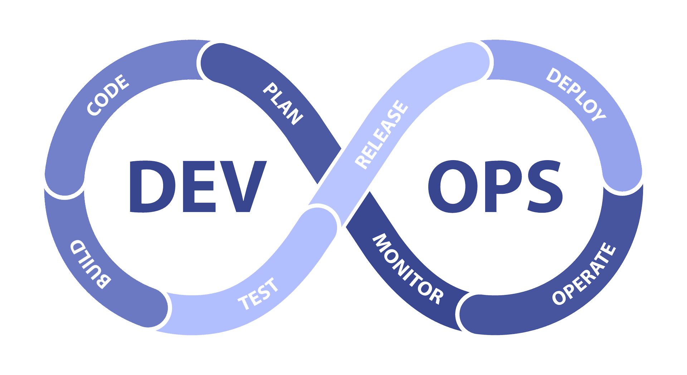
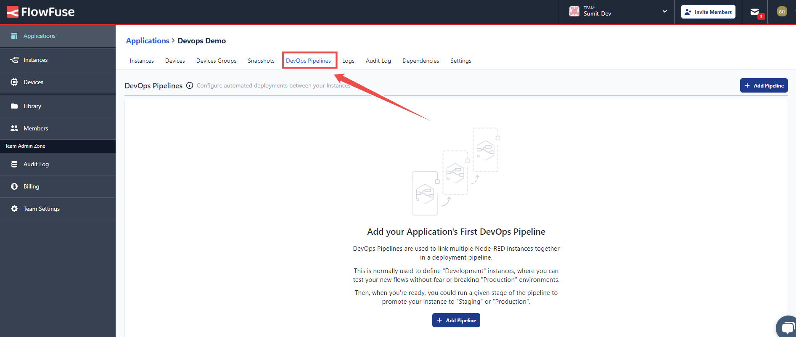
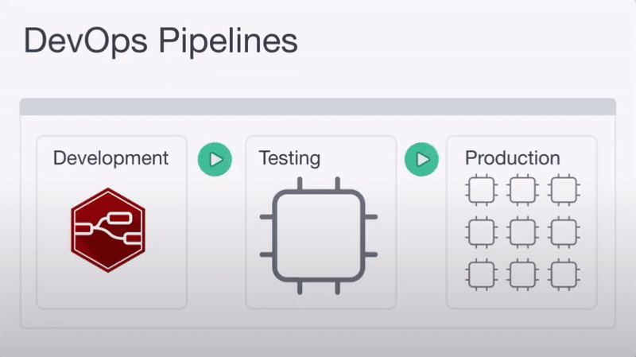

When deploying any update in your manufacturing or automotive process, it is important to perform testing and validation. The smallest errors can lead to a production outage. In such cases, having a quick and reliable deployment process is essential for maximising uptime and minimising downtime.
<!--more-->
For developers using Node-RED, setting up a comprehensive DevOps pipeline can make all the difference. In this blog, we’ll explore how to build and automate DevOps pipelines specifically for Node-RED deployments. You’ll discover practical tips and tools to streamline your process, ensuring your applications are always ready to support your operations.

## What Exactly is a DevOps Pipeline?

{data-zoomable}
_The DevOps Lifecycle illustrating the stages of development through to production_

A DevOps pipeline is an process that helps developers move their code from development to production smoothly. In a pipeline, each step depends on the one before it, ensuring every update is properly tested and ready for use. The most common stages of a pipeline are:

1. **Development:** This is where the application flows are created. A level of testing and checking is carried out as a natural step of the development.
2. **Staging/Testing:** In this stage, the code is deployed to a staging environment that closely mimics the live system. Here, the application goes through a level of QA and is tested in scenarios as close to real-world conditions as possible. This is stage designed to catch any issues that slipped through in the development stage.
3. **Production:** When the flows are tested and confirmed in staging and are ready to be deployed, this stage can be operated to promote the flows to production.

## How to Create DevOps Pipelines for Node-RED Deployments

Creating DevOps pipelines manually for your Node-RED deployments can be time-consuming, expensive, and require considerable technical expertise. **FlowFuse** simplifies the creation of DevOps pipelines for Node-RED deployments.

[FlowFuse](/) enhances collaboration, security, and scalability for your Node-RED applications, making the deployment and management of edge devices seamless. With a centralized platform and an intuitive visual interface, FlowFuse allows you to connect, collect, transform, and visualize data effortlessly.

### Steps to Create a DevOps Pipeline:

1. Go to the **FlowFuse platform** and navigate to the application where your Node-RED instances are located. Ensure you have instances set up for all stages, including production devices or instances.
2. Switch to the **DevOps Pipelines** option from the top menu.

{data-zoomable}
_Image showing option to switch to DevOps pipelines tab from top menu_

3. Click the **Add Pipeline** button in the top right corner to create the pipeline.

{data-zoomable}
_Click the 'Add Pipeline' button to start creating your DevOps pipeline in FlowFuse_

4. Enter the name for your pipeline and click **Create Pipeline**.

{data-zoomable}
_Fill out the form to give your pipeline a name_

5. Next, you'll see an option to create stages by clicking **Add Stage**.

{data-zoomable}
_Add stages to your pipeline for different deployment environments, such as development, testing, and production_

6. In the window that opens, select the **stage type** based on whether it's an instance, device, or device group.
7. Enter the name for the stage in the **Stage Name** field.
8. Choose an instance, device, or device group for the stage.
9. Next, configure which action should be performed when this stage is pushed to the next:
   - **Create New Snapshot:** Generates a new [Snapshot](/docs/user/high-availability/) using the current flows and settings.
   - **Use Latest Instance Snapshot:** Uses the most recent existing snapshot of the instance. The deployment will fail if no snapshot exists.
   - **Prompt to Select Snapshot:** Prompts at deploy time to select which snapshot from the source stage should be copied to the next stage.
10. Check the option **Deploy to Devices** if you want changes to be deployed to all devices connected to this stage’s instance when the stage is deployed.

{data-zoomable}
_Configure each stage by selecting an instance, device, or device group, and define the deployment actions_

Once you’ve created your initial stage, you can add more stages by following the same process. This flexibility allows you to tailor your DevOps pipeline to meet the specific needs of your Node-RED deployment.

For example, in development, you might have a Node-RED instance in the cloud to build your application. During staging, you could test the setup with a single device. Finally, in production, you can deploy the tested application to thousands of devices in a device group, saving time and ensuring smooth deployment at scale.

{data-zoomable}
*Image: DevOps animation demonstrating pipeline deployments.*

## Running a Pipeline Stage

Once your pipeline is set up, you can run it to deploy your changes across each stage. Here's how:

{data-zoomable}
*Click the 'Run Pipeline' button to initiate a pipeline deployment.*

1. Click the "Run Pipeline" button for the current stage to start the deployment. This button is available for all stages except the last one.

2. After clicking, the deployment automatically progresses to the next stage on the right. Since each pair of stages operates independently, you need to click the "Run" button for each stage to continue the deployment.

Pressing the "Run Pipeline" button for the current stage creates a new snapshot that includes all settings, environment variables, and flows for that stage. This snapshot is then copied and deployed to the next stage, but any existing environment variable keys in the target stage will remain unchanged.

When creating a pipeline, you can include only one Device Group, and it must be in the final stage. This ensures all changes are fully tested and verified before reaching production, guaranteeing a safe and reliable deployment.

## Conclusion

DevOps pipelines formalize deployment patterns, standardize testing, and streamline updates, minimizing errors and downtime. This clear process improves reliability and helps organizations adapt more easily thus ensuring smooth operation of critical applications in manufacturing and automotive environments.

{% include "cta.njk", cta_url: "/book-demo/?utm_campaign=60718323-BCTA&utm_source=blog&utm_medium=cta%20book%20demo&utm_term=high_intent&utm_content=Creating%20and%20Automating%20DevOps%20Pipelines%20for%20Node-RED%20in%20Industrial%20Environments", cta_type: "demo", cta_text: "Want to learn how FlowFuse can help you scale, manage, and optimize your industrial processes?" %}