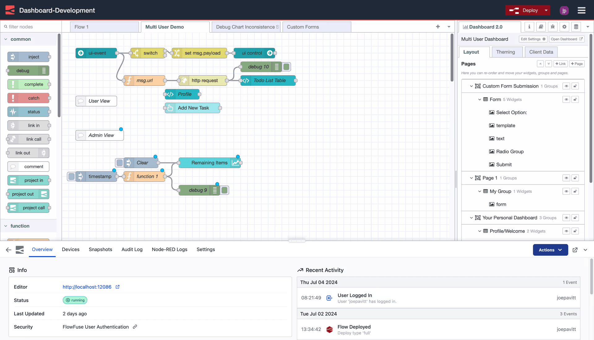

Managing a single Node-RED instance involves setting up and configuring a server, securely tunneling for remote access to edge devices, and ensuring proper networking and firewall configurations, all of which can be complex. The complexity increases when overseeing multiple Node-RED instances spread across various projects, edge devices, or environments.
<!--more-->
This situation brings additional challenges that can make management a really difficult task, often leading to confusion and frustration as teams try to keep everything running smoothly, troubleshoot issues, and ensure clear communication between instances. Consolidating control into a single platform simplifies deployment, configuration, collaboration, and oversight, making it easier to manage multiple Node-RED instances. Let’s explore how FlowFuse can centralize this management.

## What is a Node-RED Instance?

A [Node-RED](/node-red/) instance refers to a single, operational setup of the Node-RED application. Whether you start Node-RED on your computer, a cloud server, or an edge device, you create an instance. Each instance operates independently, allowing you to build and run automation flows or applications.

## What are the Challenges of Managing Multiple Node-RED Instances?

Managing multiple Node-RED instances can quickly become complicated as operations grow. Each new instance adds complexity, from configuration issues to security concerns. These challenges highlight the need for a centralized solution to simplify management and improve efficiency.

1. **Deployment and Configuration Management:** Setting up Node-RED instances on a server requires technical knowledge and ongoing maintenance. As the number of instances grows, maintaining them can become time-consuming and resource-intensive.

2. **Egde Node-RED Management:** Managing Node-RED instances on edge devices introduces additional challenges, such as the need for on-site troubleshooting when issues arise.

3. **Monitoring and Troubleshooting:** Keeping track of the health and performance of multiple instances requires constant attention. Checking logs across different instances can become overwhelming.

4. **Security Management:** Each instance requires its own security settings. Ensuring that all instances are secure and up to date can be a difficult task, especially as the number of instances increases.

5. **Backup and Recovery:** Having a solid backup and recovery plan is critical. If a system crashes, you need a way to quickly restore it without losing important data.

6. **Scaling:** As applications grow in complexity, scaling Node-RED instances becomes necessary. This requires expertise in server management and the ability to handle multiple instances efficiently.

7. **Ensuring High Availability:** In production environments, keeping all Node-RED instances running smoothly and avoiding downtime is essential which also requires high technical exepertise

A centralized platform is essential to handle deployment, configuration, and management efficiently, providing a visual interface to maintain and update instances.

> "As organizations navigate the complexities of the digital age, adopting a holistic approach that integrates technology, processes, and people is essential for reaping the full benefits of IoT."

## FlowFuse: Centralize Your Node-RED and IoT Device Management

FlowFuse is a powerful platform designed to simplify the management of multiple Node-RED instances. By providing a centralized interface, FlowFuse enables users to manage, scale, secure, and collaborate on Node-RED solutions.

  
*Image showing how multiple Node-RED instances are organized and managed under one roof.*

With FlowFuse, you can organize your Node-RED instances into teams for improved collaboration, allowing seamless teamwork on projects without the need to navigate between different instance locations physically. You can create as many teams as needed, ensuring that instances are organized based on the team members assigned to them. Additionally, you can ensure that each member has the correct permissions they require through role-based access control (RBAC), providing precise management of access and responsibilities.

  
*Image showing how FlowFuse's immersive editor simplifies managing settings and configuration within the Node-RED editor.*

FlowFuse also simplifies the [monitoring and controlling of edge devices](/solutions/edge-connectivity/) through the [FlowFuse Device Agent](/platform/device-agent/), which quickly connects your devices to the cloud platform and allows you to build and monitor applications remotely.

  
*Image showing remote edge devices connected through the FlowFuse platform for remote monitoring and control.*

Additionally, FlowFuse enables the creation of [DevOps pipelines](/blog/2024/10/how-to-build-automate-devops-pipelines-node-red-deployments/) that ensure your application is well-tested and evaluated before deployment to production. Deploying the same flow to hundreds or thousands of devices becomes effortless with these pipelines.

  
*Image showing feature to create the devops pipeline for Node-RED instances*

You can efficiently [monitor logs](/docs/user/logs/#logs) for each instance and receive instant email alerts if any crashes occur, facilitating quick troubleshooting.

  
*Image showing the Node-RED instance logs.*

FlowFuse also allows you to quickly add [high availability](/docs/user/high-availability/) features to your instances, ensuring smooth and efficient operation of your production applications. The platform includes an auto-snapshot feature that lets you recover from accidental changes to flows, ensuring you always have a backup of your application.

  
*Image showing the feature that allows to enable high availability for instances*

  
*Image showing snapshots feature*

We have highlighted just a few features of FlowFuse; there are many more—potentially three to four times what has been presented—and the team is continuously working to develop and introduce new functionalities to improve collaboration, scalability, security, and overall performance.

### How FlowFuse Transforms Production Operations

In manufacturing, downtime is costly, and managing machines, sensors, and systems across multiple sites can be complex. FlowFuse simplifies this by centralizing management, giving you a single platform to oversee all your Node-RED instances efficiently.

With its intuitive interface, FlowFuse handles deployments, updates, and real-time monitoring, ensuring smooth production. It collects data from hardware, APIs, and services using a drag-and-drop interface, enabling teams to easily connect, transform, and analyze data. The high-availability feature ensures critical operations continue even during failures, minimizing downtime.

FlowFuse also enhances security with advanced settings, keeping your systems safe while boosting collaboration. As operations grow, FlowFuse scales seamlessly, integrating new devices and systems without added complexity.

By simplifying system management, FlowFuse cuts costs, keeps production running smoothly, and lets your team focus on growth and innovation.

{% include "cta.njk", cta_query: "utm_campaign=60718323-BCTA&utm_source=blog&utm_medium=cta&utm_term=high_intent&utm_content=Transform%20Chaos%20into%20Control%3A%20Centralize%20Node-RED%20Management%20with%20FlowFuse", cta_type: "signup", cta_text: "" %}

## Conclusion

FlowFuse transforms how you manage Node-RED instances, turning chaos into clarity. With centralized control, teams can collaborate and reduce operational costs while ensuring critical applications remain available and secure. Automated backups and high availability translate to less downtime and more focus on innovation. 
