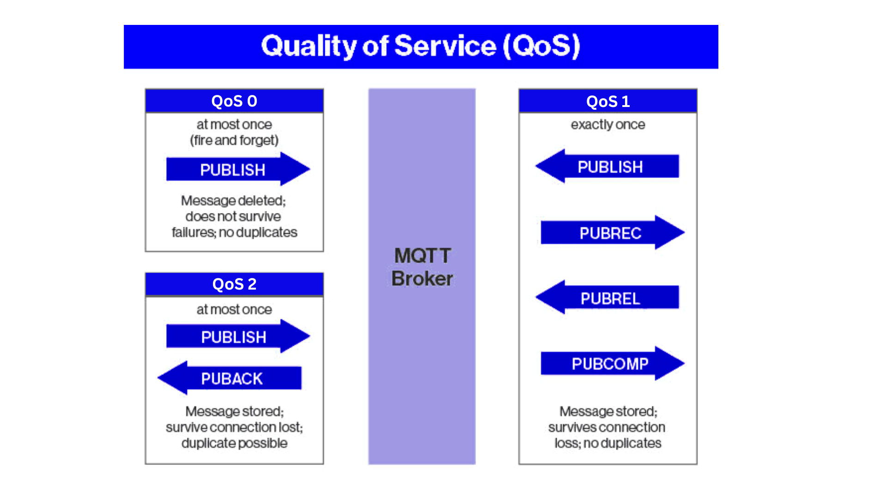
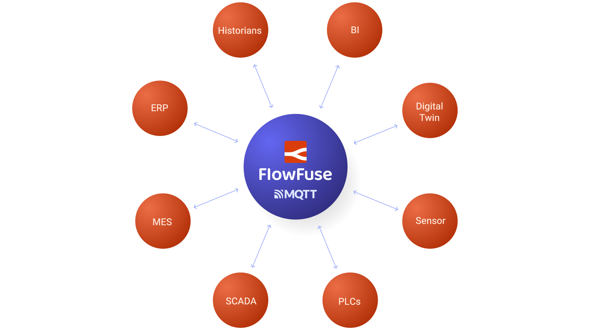
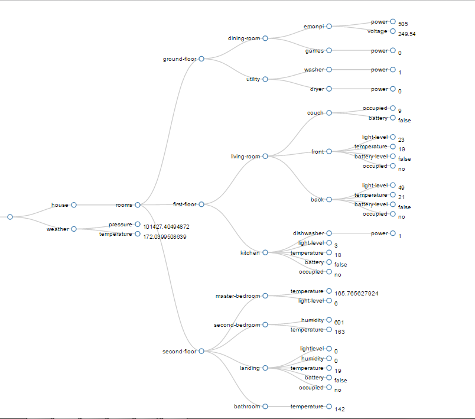

--- 
title: "MQTT: The Frontrunner for Your UNS Broker" 
subtitle: "Why MQTT is the Best Choice for Your UNS Broker"
description: "Learn why MQTT is the top choice for Unified Namespace (UNS) brokers and explore the ideal platform that simplifies the connection of devices and services while providing a reliable MQTT broker service."
date: 2024-10-29
authors: ["sumit-shinde"]
image: 
keywords: mqtt unified namespace, why use mqtt in uns, mqtt in unified namespace, mqtt data modeling UNS, Best protocols for UNS IoT, Implementing UNS with MQTT, Unified Namespace protocols
tags: 
 - posts
 - mqtt
 - uns
 - unified namespace
---

Is MQTT truly the go-to option for your UNS broker, or are there better alternatives out there? As the IoT landscape evolves, it's worth questioning whether its lightweight design can meet the demands of complex systems. Despite this, MQTT (Message Queuing Telemetry Transport) has proven its worth in real-world applications time and again. In this blog, we’ll delve into why MQTT continues to be a top choice for Unified Namespace implementations, revealing its unique advantages and why it might just be the solution you’re looking for.

<!--more-->

The [Unified Namespace (UNS)](/blog/2023/12/introduction-to-unified-namespace/) is a way to organize data from all parts of your IoT environment, making it easy for different systems to talk to each other. It provides a real-time single source of truth, ensuring that all users have access to the same accurate information, which prevents confusion and data silos.

When choosing a protocol for your UNS broker, it’s crucial to consider how well the selected protocol fits the specific requirements of your IoT environment, the types of devices and systems involved, as well as factors like scalability, reliability, and ease of integration. Several options are available alongside MQTT, such as AMQP, WebSocket, and OPC UA. While these alternatives offer unique features, But 
it’s important to evaluate whether they truly meet the specific needs of various IoT scenarios.

For instance, AMQP is more complex that require robust messaging patterns and advanced features, which might be overkill for simpler IoT setups. WebSocket, while excellent for real-time communication, can introduce additional overhead and complexity when dealing with numerous low-power devices that need to maintain persistent connections. On the other hand, OPC UA excels in industrial automation but is often more intricate to implement and may not offer the lightweight efficiency needed for large-scale IoT deployments.

## Why MQTT Stands Out?

MQTT began its journey in the late 1990s, developed by IBM to address communication challenges in low-bandwidth, unreliable networks. In those formative years, it was a pioneering solution, laying the groundwork for the Internet of Things (IoT).

As the IoT landscape grew, MQTT adapted, evolving from the widely embraced MQTT 3.1.1 to the more robust MQTT 5.0. Each iteration not only enhanced its capabilities but also reflected the changing needs of an interconnected world.

**So, what exactly makes MQTT the frontrunner for Unified Namespace (UNS) implementations?**

To answer that question, let’s take a step back and reflect on my journey through the world of messaging protocols. Over the past few months, as I prepared content on different protocols, I absorbed a wealth of insights from articles, videos, and LinkedIn posts, along with conversations with my team. Each piece of information revealed strengths and weaknesses, but one protocol kept catching my attention: MQTT. I heard from industry experts about how it is the go-to choice for IoT and for UNS. Recently, I started exploring why it is the frontrunner for UNS.

As I began my exploration, I first sought to understand the cost of downtime to grasp its impact on operational efficiency. To gain insight, I reached out to Steve, a seasoned engineer with over 25 years of experience in the automotive sector. During our conversation, I learned about the significant effects of downtime. When I asked him about its costs, he revealed that a minute of downtime can cost a company, on average, $15,000 to $20,000 or more. This revelation struck me deeply. For engineers monitoring machines, waiting for data can lead to substantial financial losses. This urgency underscored the necessity for a low-latency protocol, making it clear that such solutions are essential for any Unified Namespace.

This is where MQTT truly shines. Designed for lightweight messaging, MQTT operates on a simple yet powerful **publish-subscribe model**. Unlike traditional request-response protocols that can cause delays due to constant querying, MQTT establishes a persistent connection. Once devices connect, they can publish messages or subscribe to topics in real-time, eliminating the need for repeated requests.

  
_Image showing the MQTT Topic Structer_

In addition to its efficiency in message handling, MQTT keeps message sizes compact—a crucial factor when working with **low-bandwidth networks** or a high number of connected devices. The MQTT protocol itself introduces **minimal overhead**, as its messages typically consist of just a few bytes, making it perfect for constrained devices like sensors that need to transmit data without overloading the network. The result? As soon as a sensor detects a change—whether it’s a temperature spike or a production error—it can instantly send that data in a compact message to the relevant applications or systems. Decisions can be made on the fly, and proactive measures can be implemented immediately, significantly reducing the risk of costly downtimes.

Another critical aspect of any broker in a UNS context is reliability. What happens if communication fails? MQTT excels with its **Quality of Service (QoS)** levels, ensuring message delivery even under challenging network conditions.

MQTT provides three levels of Quality of Service (QoS) to ensure message delivery reliability, catering to different application needs. QoS 0 delivers messages on a "best-effort" basis, meaning they may be lost if the connection fails. QoS 1 guarantees that messages are delivered at least once, ensuring that even if there’s a temporary disruption, the message will reach its destination. QoS 2 is the highest level, ensuring that messages are delivered exactly once, preventing duplicates and ensuring data integrity.

  
_MQTT Quality of Service's diffrent levels_

In a world where data integrity is paramount, especially in industrial environments, the ability to choose the right QoS level ensures that all components—whether they are sensors, devices, or applications—are working with the most accurate and up-to-date information.

  
_MQTT can connect with everything_

Then the next question arises in my mind: does MQTT **connect with a variety of devices and systems**? This is a primary requirement for any Unified Namespace (UNS), as it serves as a single source of truth collected from every part of the IoT environment. MQTT’s long-standing standardization since the 1990s enables it to bridge the gap between legacy PLCs and modern IoT devices. This compatibility eliminates the need for extensive changes to existing infrastructures, allowing organizations to leverage their current investments while integrating new technologies.

For example, a manufacturing facility can use MQTT to connect older machines that previously operated in isolation with newly installed IoT devices. This integration facilitates smooth communication and data sharing across the board. As a result, organizations can enhance operational efficiency while supporting a cohesive data ecosystem that maximizes the value of every device, regardless of its age or manufacturer.

As I continued my exploration, **scalability** emerged as another key factor. The UNS broker must easily adapt to the evolving needs of a factory, which may start with a few sensors but could expand to hundreds or even thousands over time. Would MQTT accommodate this growth? Absolutely. Its lightweight architecture, characterized by a publish-subscribe model, allows for seamless scalability.

Each new device can be added without disrupting existing operations, and the system can handle thousands of concurrent connections. This adaptability is especially crucial in industries where rapid expansion is common. Imagine a manufacturing facility that begins with a handful of devices monitoring key performance indicators and then expands to hundreds or thousands of sensors as they grow. MQTT’s architecture accommodates this scaling effortlessly. 

This realization filled me with confidence—MQTT wasn’t just a short-term solution; it was future-proof, ready to grow alongside the organization. 

However, **Security** was my the next concern. In an age where data breaches are common, the need for robust security measures is critical, especially in a Unified Namespace (UNS), which represents a complete digital picture of your factory. A UNS integrates critical machine performance data and sensor readings, making it essential to protect this vital information from unauthorized access. So, could MQTT safeguard sensitive information? I was pleased to find that MQTT employs TLS (Transport Layer Security) encryption to secure data in transit. This means that all communications between devices are encrypted, safeguarding them against eavesdropping and tampering.

But MQTT doesn’t stop there. It incorporates robust authentication methods, allowing only trusted devices to connect to the network. This can range from simple username and password combinations to more advanced methods like client certificates, which provide a higher level of security. Furthermore, Access Control Lists (ACLs) enable administrators to define who can access specific data streams, ensuring that sensitive information is only available to authorized individuals or devices.

I finally discovered the MQTT community—a vibrant network of developers and users eager to share their experiences and help each other. Picture this: when challenges arise, whether they’re bugs or integration issues, there’s a wealth of knowledge at our fingertips. To illustrate this, I’ve included an image of Google Trends, which highlights the growing interest in MQTT.

The availability of open-source tools, libraries, and forums means that when you face a problem, there’s a good chance someone has encountered it before and can provide guidance. This active support network makes the journey much less daunting and encourages innovation within the ecosystem. 

Imagine having access to countless tutorials, example projects, and troubleshooting tips from a community that thrives on collaboration. This support network is invaluable, providing reassurance that you are never alone in your MQTT journey. Whatever challenge you face, someone in the MQTT ecosystem has likely encountered it before and can offer a solution.

After examining MQTT's strengths, it’s clear that it’s a strong choice for your Unified Namespace (UNS) broker. Its lightweight design, scalablity, security and ability to handle many concurrent connections make it appealing. But this brings up an important question: with a UNS overflowing with data, how do we find the information that truly matters?

The sheer volume of data can be overwhelming. In a Unified Namespace (UNS), the digital representation of your business needs to be more than just a collection of data—it must provide meaningful context. 

MQTT helps with this by allowing to use its structured topics that clarify the flow of information from various devices. For example, to organize data in a broker for a house, the topic structure might look like following image, where accessing the kitchen temperature topic would be: `house/rooms/first-floor/kitchen/temperature`

  
_Exmample of MQTT Topics tree heirarchy_

Additionally, MQTT’s support for wildcards allows monitoring of multiple data streams simultaneously.

In summary, MQTT is not just a protocol; it’s a strategic advantage for your UNS broker. Its efficiency, security, and scalability equip your organization to handle the complexities of IoT seamlessly. By choosing MQTT, you’re setting a solid foundation for both current needs and future growth. Now is the time to leverage its capabilities and drive your data strategy forward.

## FlowFuse’s New MQTT Broker Service

At FlowFuse, our goal has always been to empower engineers to build, manage, scale, and secure their Node-RED solutions. We help teams seamlessly connect IT and OT environments, supporting thousands of devices and protocols. This integration enables quick data collection, transformation, and visualization to optimize industrial workflows and create a Unified Namespace (UNS).

We’ve listened closely to our customers, who expressed the need for a reliable MQTT broker service. To address this challenge, we’re excited to announce that we are enhancing the FlowFuse platform by adding our own MQTT broker service!

This new feature will allow you to connect, manage, and analyze data from all your devices without the hassle of juggling multiple services. With the FlowFuse MQTT Broker, you can oversee all your MQTT clients, Node-RED instances, and devices from a single, centralized platform. This eliminates reliance on external broker services, streamlining your operations and allowing you to focus on driving innovation.

As your operations grow—from small projects to large-scale IoT deployments—our MQTT broker will scale with you. Additionally, robust role-based permissions will keep your data secure, ensuring that only authorized personnel can access sensitive information.
Stay tuned for updates on this exciting enhancement! You can track our progress [here](https://github.com/FlowFuse/flowfuse/issues/1350).

**Ready to take your IoT solutions to the next level?** [Join FlowFuse today](https://app.flowfuse.com/account/create) and experience the power of seamless integration and management for your IoT environment!
