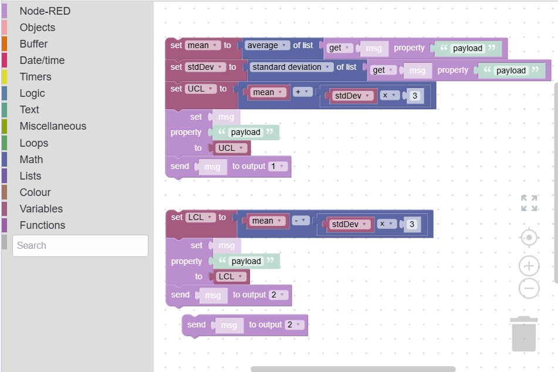

Node-RED is a powerful tool for building automation flows through its visual interface and low-code nodes. However, there are times when this low-code approach falls short, particularly when you need to implement complex JavaScript logic. That’s where the Function Node comes into play. Many Node-RED developers excel in their domains—such as IoT integration and PLCs—but may lack a strong foundation in JavaScript.
<!--more-->
In this guide, I will share strategies for making writing in Function Nodes straightforward and efficient. You’ll learn how to leverage JavaScript's capabilities without needing extensive knowledge, empowering you to handle more complex logic with confidence and ease.

## What are function nodes and the challenges related to them?

{data-zoomable}
_Image showing the function node_

## What Are Function Nodes and Common Challenges?

[Function Nodes](/node-red/core-nodes/function/) in Node-RED allow you to write custom JavaScript for processing messages. While they provide flexibility, many users find it challenging to turn complex business rules into code and manage variables. For more details on the benefits and drawbacks of using Function Nodes, refer to this [Article](/blog/2023/03/why-should-you-use-node-red-function-nodes/).

Before using Function Nodes, consider if existing low-code nodes can fulfill your needs. Using standard low-code nodes can simplify your approach and enhance collaboration and clarity. If you still feel the need to use Function Nodes, don’t worry, In the following section, we’ll explore straightforward strategies to make working with Function Nodes easier.

## Quick Ways to Simplify Writing in Function Nodes

### Using Blockly-Based Function Nodes

For users seeking to simplify the process of writing complex logic, Blockly-based Function Nodes serve as a valuable tool within Node-RED. Designed to facilitate JavaScript code generation, Blockly allows you to construct logic visually using a drag-and-drop interface with pre-defined blocks. This makes it easier to translate intricate business rules into functional code. As you build your logic, Blockly automatically generates the corresponding JavaScript.

Before proceeding, make sure you have installed the following Node-RED package via the palette manager:

- **node-red-contrib-blockly**: This package adds the Blockly custom node in your Node-RED sidebar to use.

For the demonstration, let's consider we have an array of temperatures, and we wanted to calculate the Upper Control Limit (UCL) and Lower Control Limit (LCL) to send to different outputs.

1. Drag the Blockly node onto the canvas and double-click it to open the editor.
2. Once open, you will see the block categories on the left side, a plain canvas on the right side, and an option to set output and timeout at the bottom. Set the output to 2.
3. In the left sidebar, you’ll find different categories starting with Node-RED, each containing related operation blocks. For example, in Node-RED, you’ll find blocks to get the value of `msg.payload`, set `msg.payload`, and more. In the Math category, there are various blocks for different mathematical operations.
4. We must first calculate the mean to calculate UCL and LCL. Switch to the Math category and drag the block labeled "`sum` of the list." Click on the sum in the block to see other options; select "average" from it. Then, in the Node-RED category, find the block labeled "get the `msg` property from `payload`" and connect it to the end of the "`sum` of the list" block. Now, to create a variable to store the mean, switch to the Variables category, click "create variable," and name it `mean`. Once you make the variable, you’ll get different blocks related to its perform operations on that var, such as setting and changing its value. Drag the block labeled "set to mean" and place it at the start of the "`average` of list" block.
6. Next, we know the formulas to calculate UCL and LCL (where we pick z = 3):

- UCL = mean + (stdDev * z)
- LCL = mean - (stdDev * z)
   
7. To calculate the standard deviation, switch to the Math category and drag the "`sum` of the list" block again. Click on the sum and select the "standard deviation" option. Again, drag the block "get the `msg` property from `payload`" and connect it to the end of the standard deviation block. Create a variable called `stdDev,` drag the "set stdDev to" block, and place it at the start of the "`standard deviation` of the list" block.
8. Now, it’s time to calculate UCL and LCL. First, create a variable for UCL and then Drag the "set UCL to" block, then switch to the Math category and drag the "1 + 1" block. Place the `mean` variable in one of the positions for "1." Drag the same block again and place it in the second position of 1, then switch to Variables again and drag the `stdDev` variable to replace one of the "1s" in the second 1+1 block, and set the second "1" to 3.
9. Next, switch to Node-RED and drag the "set `msg` property `payload` to" block. Then, drag the UCL from the variable and place it in place of "to." s value, Drag the "send "`msg` block to output 1". Repeat the same steps for LCL, but make sure that you subtract from the mean (`stdDev * z`) and set LCL to the payload, returning it to output 2.
10. Finally, click Done to save it.
11. Drag the inject node, having set the payload to an array of simulated temperature data, and connect its output to the input of the blockly node,
12. Then, drag the two debug nodes onto the canvas. Connect one debug node to output 1 of the Blockly node (this will display the UCL) and the other debug node to output 2 (this will display the LCL).
13. Deploy the flow and click the inject button. You will see both UCL and LCL printed on the debug panel

The final blockly canvas should look like the below image:

{data-zoomable}
_Image showing collection of blockly blocks that are calculating UCL and LCL_

Using Blockly-based Function Nodes simplifies the creation of complex logic in Node-RED. However, a basic understanding of JavaScript is still beneficial, especially as your logic becomes more complicated. While beginners may appreciate the visual interface initially, it can become confusing when trying to implement more advanced features. Additionally, the Blockly Function Node is a modified version of the original Function Node, which may lead to differences in behavior and functionality. Nevertheless, it remains a valuable node for users looking to simplify writing function logics in Node-RED.

### Using FlowFuse Expert

{data-zoomable}
_Image showing the quick function node generation with FlowFuse Expert_

The FlowFuse Expert is an AI-based plugin integrated into the FlowFuse platform within the Node-RED editor, making it incredibly easy to generate complex functions using prompts.

For this example, let’s use the same logic we demonstrated with Blockly:

Before proceeding, ensure you have updated Node-RED to the latest version on the FlowFuse platform.

1. Open the Node-RED instance editor on the platform.
2. Click the magic button in the top right corner.
3. A popup prompt will appear, asking for your input to generate the function node.
4. Enter the prompt for your logic. For this example, you can use:  
   > "Generate JavaScript code that takes an array of numbers, calculates the Upper Control Limit (UCL) and Lower Control Limit (LCL), then sends UCL to the first output of the function node and LCL to the second output."
5. Click "Generate." After 2-3 seconds, the Function Node with the requested JavaScript code will appear directly on your canvas.
6. To test it, connect an inject node containing an array of simulated temperature data, then drag two debug nodes onto the canvas. Connect one debug node to output 1 of the function node (this will display the UCL) and the other debug node to output 2 (this will display the LCL).
7. Deploy the flow and click the inject button; both UCL and LCL will be displayed on the debug panel.

Using the FlowFuse Expert is significantly easier than Blockly, as it streamlines the process and saves you valuable time. You can articulate your goals in plain English or other languages, such as Spanish or Dutch, and the assistant generates your Function Node seamlessly. This allows you to focus more on your project objectives rather than getting bogged down in coding or block arrangements. Additionally, it provides you with the original Function Node, maintaining standard functionality.

{% include "cta.njk", cta_query: "utm_campaign=60718323-BCTA&utm_source=blog&utm_medium=cta&utm_term=high_intent&utm_content=Exploring%20Quick%20Ways%20to%20Write%20Complex%20Logic%20in%20Function%20Nodes%20in%20Node-RED", cta_type: "signup", cta_text: "" %}

## Conclusion 

In summary, both Blockly and FlowFuse Expert simplify writing complex logic in Node-RED, but FlowFuse is easier to use. Blockly’s visual approach can be confusing, while FlowFuse allows you to generate code by stating your goals in plain English or other languages. Although Blockly can be helpful, it often requires JavaScript knowledge. FlowFuse Expert simplifies the process, allowing you to focus on your project.
