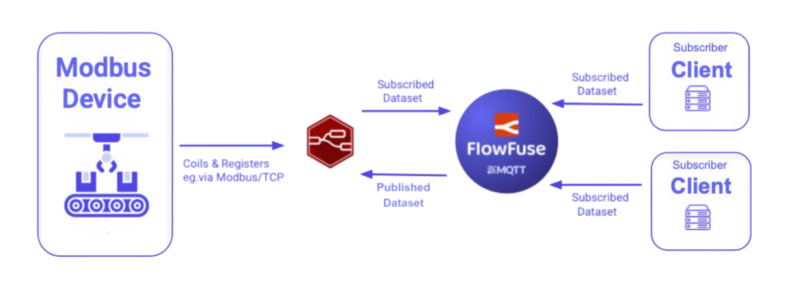

Modbus is a popular protocol in industrial automation, used to connect devices like sensors and PLCs, but it’s not designed to connect easily with cloud platforms or modern IoT systems. MQTT, however, is well-suited for real-time data transfer to the cloud. Using Node-RED, you can bridge the gap between Modbus and MQTT, allowing older equipment to connect to modern IoT networks. Let’s take a look at how you can set this up.

<!--more-->

## Why Bridge Modbus with MQTT?

For decades, Modbus has been a cornerstone of industrial communication, particularly in manufacturing. It's simple, reliable, and effective for machine-to-machine communication, connecting devices like sensors, motors, and PLCs. But as industries shift toward Industry 4.0 and embrace cloud-based solutions, the need to integrate these older systems with modern platforms has become more urgent.

This challenge is known as the OT/IT gap—the difficulty of linking operational technology (OT) like Modbus devices to information technology (IT) systems and cloud platforms that use newer protocols. While Modbus works well for local control and data collection, it doesn’t easily integrate with cloud or IoT systems. That’s where MQTT comes in.

MQTT is a lightweight, real-time messaging protocol that efficiently transmits data from devices to the cloud, even in environments with limited network connectivity, bandwidth, or power. It’s a perfect fit for IIoT applications. However, Modbus and MQTT aren’t natively compatible, which is why bridging the two protocols with a solution like Node-RED is essential.

By connecting Modbus to MQTT, you can send data from legacy systems to the cloud for remote monitoring and analysis. This setup enables you to track performance, detect issues, and gain insights from anywhere, without the need to replace existing equipment. The result is improved efficiency, reduced downtime, and better decision-making based on real-time data.

For instance, in a factory where Modbus is still in use, machines like motors, pumps, and conveyors can send their data to the cloud via MQTT. This provides real-time visibility into machine performance and supports predictive maintenance, helping prevent unexpected failures and minimizing costly downtime.

## How to Bridge Modbus to MQTT

In this section, we will cover the steps to bridge Modbus data to MQTT using FlowFuse, leveraging Node-RED's capabilities. The process involves retrieving data from a Modbus device (For Practical example, we are using OpenSim to simulate Modbus data), transforming and processing the data (e.g., scaling raw sensor data into human-readable formats), and sending it to an MQTT broker for cloud integration.

{data-zoomable}
_Bridging Modbus Data to MQTT using Node-RED_

## Prequsite

- A **Modbus data source**, such as a real Modbus device or a simulator like ModSim.
- A **FlowFuse account** that will allow us to create and deploy **Node-RED** instances securely on the cloud with a single click, collaborate on Node-RED projects with your team, centrally manage and monitor edge devices, manage data pipelines effectively, and use an MQTT broker with an interface for securely managing clients.

If you haven’t signed up for a FlowFuse account yet, [sign up](https://app.flowfuse.com/account/create) now.

### Step 1: Collect Data from Modbus Devices

The first step is to collect data from your Modbus devices. Node-RED doesn't include Modbus nodes by default, but you can easily add them to your palette.

**Step 1.1: Install Modbus Nodes**

1. Open the **Palette Manager** by clicking the menu icon in the top-right corner of Node-RED and selecting **Palette Manager**.
2. In the Palette Manager, search for `node-red-contrib-modbus` in the search bar.
3. Click **Install** to add the Modbus nodes to your Node-RED environment.
4. Once the nodes are installed, you will see them in the left-side palette under the **Modbus** category. These nodes will allow you to interact with Modbus devices in your flow.

**Step 1.2: Configure the Modbus Connection**

Next, you'll need to configure the Modbus connection based on your device type. Modbus devices can communicate using two primary protocols: **Modbus RTU** (over serial) or **Modbus TCP** (over Ethernet/Wi-Fi). The specific choice depends on the type of device you are working with.

1. Drag a **Modbus Read** node onto your Node-RED Canvas.
2. Double-click on the **Modbus Read** node to open its configuration.
3. In the configuration window:
   - Enter the **Unit ID** (this is the device address, typically **1**, but it may vary depending on your device).
   - Choose the **Function** you need, such as **Read Holding Registers**, **Read Input Registers**, etc. (this depends on the type of data you want to read).
   - Specify the **Start Address** (the address of the first register from which you want to start reading).
   - Set the **Quantity** (the number of registers to read).
   - Specify the **Poll Rate** (e.g., how often you want to collect data, such as every 1 second).
4. In the **Server** field, click the **+** button to add a new Modbus server, and select the type.
   - For **Modbus TCP**: Enter the **IP address** and **Port** (the default Modbus TCP port is **502**).
   - For **Modbus RTU**: If you're using a serial connection, you'll need to specify the serial port (such as `/dev/ttyUSB0` on Linux or `COM1` on Windows), as well as the baud rate and other serial settings.
   - Set the **Unit ID** (again, this should match the Unit ID you entered earlier).

{data-zoomable}
_Image showing Modbus node configuration for reading holding registers_

{data-zoomable}
_Image showing Modbus client node configuration_

5. Once the connection details are filled in, click **Add** to save the configuration, then click **Done**.

**Step 1.3: Test the Modbus Connection**

After configuring the connection, it's time to test the data collection.

1. Drag a **Debug** node onto the canvas.
2. Connect the **Modbus Read** node's output to to the input of **Debug** node.
3. Click **Deploy** in the top-right corner of Node-RED to deploy your flow.
4. Open the **Debug Panel** on the right side of the Node-RED interface. If the connection is successful, you should see the raw data from your Modbus device in the Debug Panel.

If no data appears, check the connection settings (IP address, Unit ID, port, etc.) and ensure that your Modbus device is correctly configured and accessible. If you're using a simulator like ModSim, ensure it’s running and properly configured to send data.

For more information on how to use Modbus with Node-RED, please read our tutorial on [Using Modbus with Node-RED](/node-red/protocol/modbus/).

### Step 2: Transforming Modbus Data for Cloud Integration

After collecting data from your Modbus device, the next step is to transform it so it's in a usable format for cloud-based IoT applications. Modbus data typically comes in raw register values, and you may need to convert these values into human-readable formats like temperature, pressure, or other measurements.

Let's walk through the transformation process step by step.

**Step 2.1: Parsing and Converting Raw Modbus Data**

Modbus devices often return data in registers that need to be interpreted. For example, a temperature sensor might return a register value like 350, which represents 35.0°C if the sensor stores values in tenths of degrees.

Here’s an example of the raw Modbus data I am receiving from ModSim: `[225, 1013, 29, 50, 603]`. These values represent the following:

{data-zoomable}
_The ModSim interface, generating simulated Modbus data_

- `225`: Temperature (in tenths of degrees, which would be 22.5°C)
- `1013`: Part 1 of the pressure value (higher register)
- `29`: Part 2 of the pressure value (lower register)
- `50`: Vibration (in tenths of degrees, which would be 5g)
- `603`: Humidity (in tenths of degrees, which would be 60.3%)

Now, we need to convert these raw register values into human-readable formats for cloud integration. For instance, we divide the temperature and vibration by 10 to get the actual values in degrees Celsius and g, respectively, and similarly for other parameters like humidity. For pressure, the higher and lower register values are combined to compute the complete value accurately.

To determine how to process raw Modbus data, such as whether to divide by a specific value, concatenate, or apply other transformation formulas, refer to the manual of the sensor you are using for specific instructions.

For transformation, in Node-RED, you can use various nodes. You can choose the Function node for advanced processing, the Change node for simpler operations, or the Template node for defining schemas. In this article, I will demonstrate a low-code approach using the Change node to process the data in a clean and organized way.

Additionally, for better organization and accessibility, I will send each metric separately and include additional metadata such as the `timestamp` and `unit`.

**For Temperature**:

1. Drag a **Change** node onto the canvas.
2. Double-click the node to open its configuration panel.
3. Set the following in the **Set** rules:
   - Set `msg.data` to `msg.payload`.
   - Set `msg.payload` to `{}`.
   - Set `msg.payload.timestamp` to the timestamp function of the Change node.
   - Set `msg.payload.value` to `data[0] / 10`.
   - Set `msg.payload.unit` to `'c'`.

{data-zoomable}
_Image showing the Change node rules transforming temperature data_

4. Click **Done** to save the configuration.
5. Connect the first output of the **Modbus Read** node to the input of this **Change** node.

**For Pressure**:

1. Drag another **Change** node onto the canvas.
2. Double-click the node to open its configuration panel.
3. Set the following in the **Set** rules:
   - Set `msg.data` to `msg.payload`.
   - Set `msg.payload` to `{}`.
   - Set `msg.payload.timestamp` to the timestamp function of the Change node.
   - Set `msg.payload.value` to `$number($string(data[1]) & $string(data[2]))` as a JSONata expression.
   - Set `msg.payload.unit` to `'ppm'`.

{data-zoomable}
_Image showing the Change node rules transforming pressure data_

4. Click **Done** to save the configuration.
5. Connect the first output of the **Modbus Read** node to the input of this **Change** node.

**For Vibration**

1. Drag another **Change** node onto the canvas.
2. Double-click the node to open its configuration panel.
3. Set the following in the **Set** rules:
   - Set `msg.data` to `msg.payload`.
   - Set `msg.payload` to `{}`.
   - Set `msg.payload.timestamp` to the timestamp function of the Change node.
   - Set `msg.payload.value` to `data[3] / 10` as a JSONata expression.
   - Set `msg.payload.unit` to `'g'`.

{data-zoomable}
_Image showing the Change node rules transforming vibration data_

4. Click **Done** to save the configuration.
5. Connect the first output of the **Modbus Read** node to the input of this **Change** node.

**For Humidity**

1. Drag another **Change** node onto the canvas.
2. Double-click the node to open its configuration panel.
3. Set the following in the **Set** rules:
   - Set `msg.data` to `msg.payload`.
   - Set `msg.payload` to `{}`.
   - Set `msg.payload.timestamp` to the timestamp function of the Change node.
   - Set `msg.payload.value` to `data[4] / 10` as a JSONata expression.
   - Set `msg.payload.unit` to `'%'`.

{data-zoomable}
_Image showing the Change node rules transforming humidity data_

4. Click **Done** to save the configuration.
5. Connect the first output of the **Modbus Read** node to the input of this **Change** node.

Once you have configured all the Change nodes and connected them, add a **Debug** node to each Change node's output to verify that the transformed data appears as expected. Deploy the flow, then check the output in the Debug Panel to ensure that each metric is correctly formatted with the appropriate timestamp, value, and unit.

### Step 3: Send Data to an MQTT Broker

Now that the Modbus data is transformed into a human-readable format, the next step is to send it to an MQTT broker. In this step, we’ll configure Node-RED to publish the transformed data to an MQTT broker.

**Step 3.1: Preparing MQTT Broker**

With FlowFuse, you don’t need to set up an MQTT broker separately. FlowFuse provides an integrated MQTT broker service teams and enterprise users, streamlining the entire process. To use the broker, you’ll first need to create MQTT clients on the platform. These clients are secured with username/password authentication, ensuring that only authorized devices can publish or subscribe to topics.

**To create MQTT clients:**

1. Navigate to the FlowFuse platform and click on "Broker" in the left sidebar.
2. In the newly opened interface, click the Create Client button.
3. Enter a username and password for the client.
4. Configure topic access control patterns if needed, specifying which topics the client can publish or subscribe to.
5. Click Save to create the client.
6. Once saved, copy the newly added client's Client ID from the list and save it for later use.

**Step 3.2: Configure MQTT Nodes in Node-RED**

1. In the Node-RED editor, drag the **mqtt out** node onto the canvas.
2. Double-click the node, then click the **+** icon next to the **Server** field to configure your broker details:
   - For FlowFuse MQTT, use `broker.flowfuse.cloud` as the server address.
   - Enter the **Client ID**, **username**, and **password** that you generated earlier.

{data-zoomable}
_Image mqtt broker node configuration_

3. Click **Add** to save the configuration.
4. Select the appropriate **QoS** (Quality of Service) level based on your needs.
5. Enter the Topic for the MQTT message, such as `plant2/Area4/Cell2/DeviceA/temperature`. This naming convention organizes data by plant, area, cell, and device, making it easier to manage, filter, and scale your system. It also simplifies data segmentation and provides straightforward access when monitoring specific devices or cells.

{data-zoomable}
_Image showing the MQTT Out node configuration_

*Note: For the configuration of MQTT nodes and Modbus, environment variables are used to prevent accidental exposure when sharing. For more information, refer to [Using Environment Variables with Node-RED](/blog/2023/01/environment-variables-in-node-red/).*

6. Click **Done** to save the node.
7. Connect the output of the Change node, which is transforming the metrics you are sending via MQTT, to the mqtt out node.

Repeat these steps for each metric (e.g., pressure, vibration, humidity), giving each one its own **mqtt out** node with a unique topic.

For more information on how to use MQTT with Node-RED, please read [Using MQTT with Node-RED](/blog/2024/06/how-to-use-mqtt-in-node-red/).

Once you’ve configured the MQTT nodes for all your metrics and deployed the flow, check the status at the bottom of each MQTT node. If it shows "connected", your Node-RED flow is successfully publishing data to the MQTT broker. From here, you can integrate the data with cloud-based analytics platforms, Build IoT dashboards with [FlowFuse Dashboard](https://dashboard.flowfuse.com/), or other systems to enable real-time monitoring, predictive maintenance, and automated decision-making. This setup effectively bridges the gap between legacy Modbus devices and modern IoT infrastructure, empowering smarter, more efficient industrial operations.

To monitor the data being sent to the cloud, you can use MQTT client monitoring software like MQTT Explorer or similar tools.

{data-zoomable}
_Image showing the MQTT Explorer interface monitoring an MQTT broker_

## Final Thought

Node-RED makes it easy to connect both legacy industrial systems and modern IoT devices. It supports a wide range of protocols, from Modbus and OPC to MQTT, HTTP, and more. This flexibility helps you bridge the gap between older equipment and cloud-based platforms without needing to replace your existing infrastructure.

With Node-RED, you can streamline data collection, enable real-time monitoring, and integrate your systems with cloud services for smarter decision-making. Whether you're using traditional or modern protocols, Node-RED provides a simple, scalable solution to make your operations more efficient and connected.
