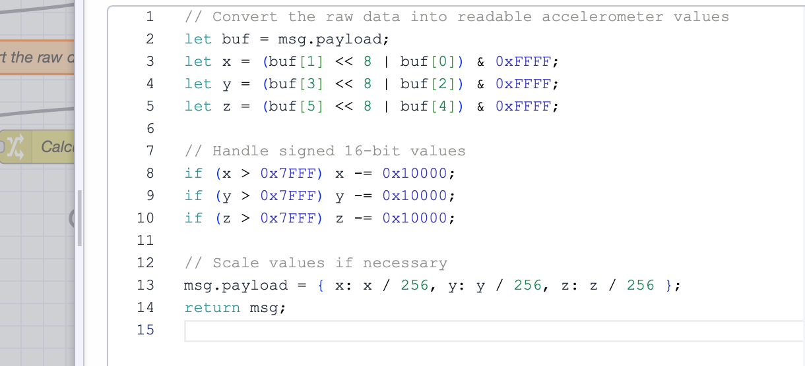
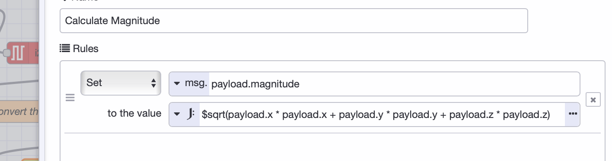
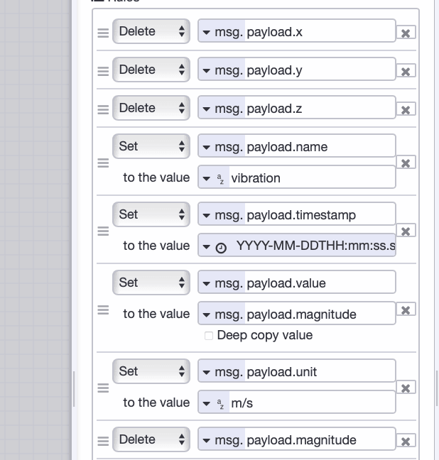
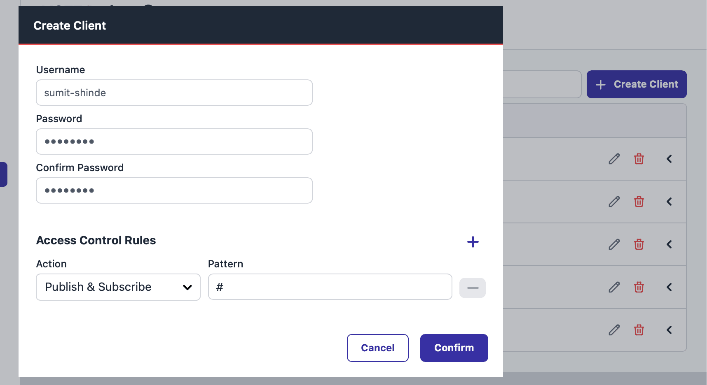
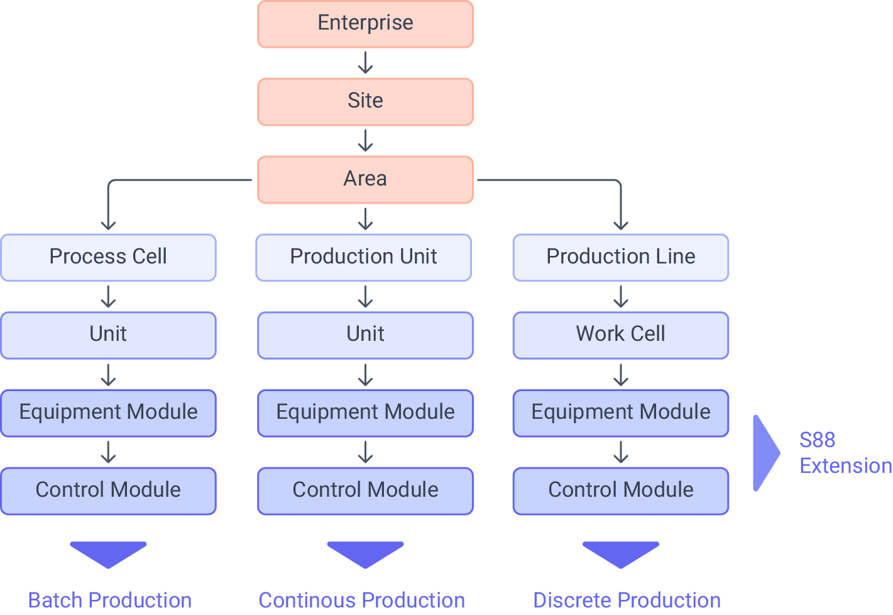
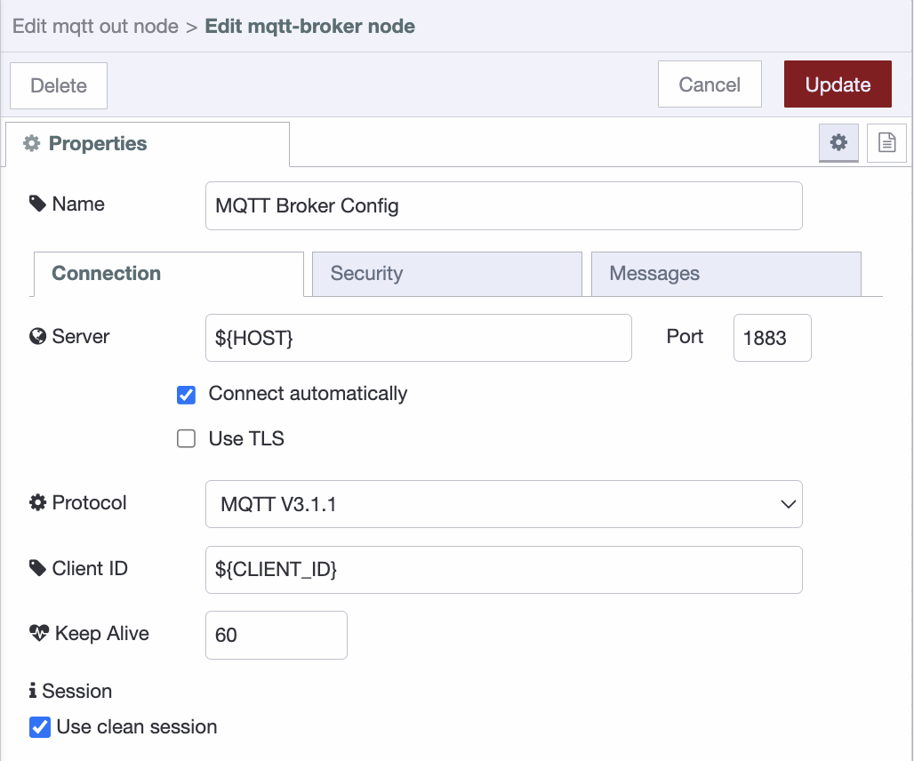
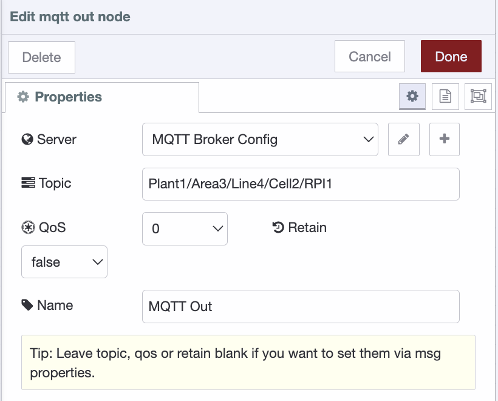
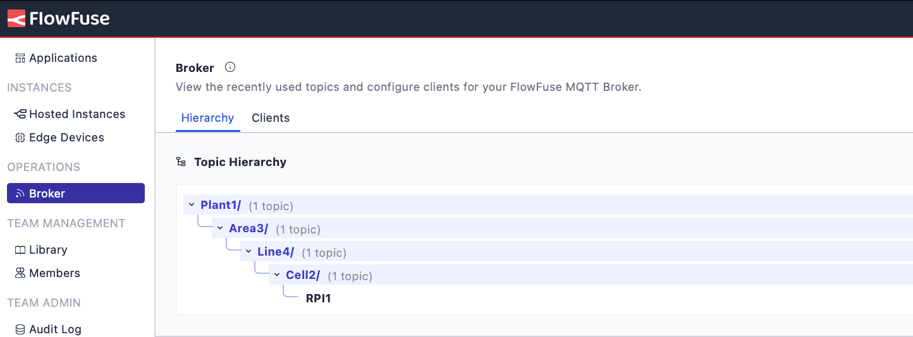
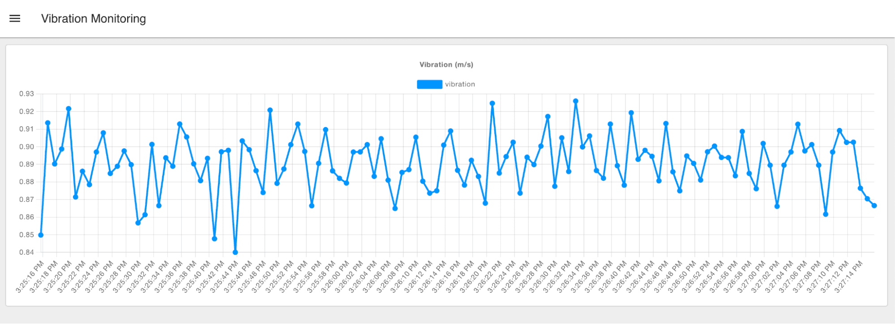

As systems and devices become more connected, managing data from different sources can be tricky. A [Unified Namespace (UNS)](/solutions/uns/) solves this by centralizing all your data in one place, making it easy to access and use.

<!--more-->

[FlowFuse](/) makes building a UNS simple. It connects old and new systems, collects data from devices and applications, and streamlines workflows. With tools like Node-RED for data flow, MQTT for real-time updates, and a central management layer, FlowFuse helps you improve efficiency and make better decisions.

This article will show you how to build your UNS using FlowFuse, step by step.

## Building a UNS with Real-Time Sensor Data

This section explains how to set up a Unified Namespace (UNS) using FlowFuse, a Raspberry Pi, and an ADXL345 sensor. The Raspberry Pi collects data from the sensor, which we collect and process in Node-RED, calculate vibration magnitude, format it, and send it to the UNS using standardized topic names.

### Step 1: Collect Metrics from Devices

The first step in building your UNS is collecting data from your devices. The method you choose will depend on the type of device and the communication protocol it supports. For example, many devices use traditional communication standards like Modbus, while others, such as industrial controllers, might rely on OPC-UA.

Fortunately, Node-RED provides support for a wide range of industrial protocols, from legacy to modern ones. While older protocols like Modbus and OPC-UA were originally designed for machine-to-machine (M2M) communication and are not directly compatible with cloud systems, Node-RED acts as a bridge to overcome this limitation.

By leveraging Node-RED, you can collect data from these legacy systems, process and transform the data using low-code workflows, and then seamlessly send it to the cloud via modern protocols such as MQTT, Kafka, AMQP, and more.

In our example, Node-RED can directly collect metrics from sensor using [I2C](https://flows.nodered.org/node/node-red-contrib-i2c) on the Raspberry Pi. This approach simplifies the process by eliminating the need for additional communication layers. To run Node-RED on the Raspberry Pi, we use [FlowFuse Device Agent](/product/device-agent/), This agent enables you to remotely monitor, manage, and build Node-RED flows securely through the FlowFuse platform remotely. [See here](/node-red/hardware/) for more details on how to set up and run FlowFuse Device Agent on different devices. 

### Step 2: Transform and Process the Collected metrics

Once you've collected data from your devices, the next step is to transform it using Node-RED. Industrial systems often use different protocols such as Modbus and OPC UA, and each might have its own data structure, which can create challenges for integration. For example, the ADXL345 sensor which we are uisng in our practile example outputs raw data as electrical signals (buffer data). We first need to format it into a human-readable format and then calculate the Magnitude, a standard vibration monitoring unit.

**Why Data Transformation Matters:**

* **Consistency**: Ensures data from different sources follows the same structure.  
* **Integration**: It makes integrating data from various systems easier.  
* **Speed**: Simplifies data access for faster insights and decision-making.

#### Example: Transforming Data from ADXL345 Sensor (Raspberry Pi)

Raw data from the ADXL345 sensor might look like this:

```json 
[26,0,244,255,37,255]  
```  

Using a [Function node](/node-red/core-nodes/function/) in Node-RED, we can convert this into a human-readable format.

{data-zoomable}
_Function node: Transforming Raw Data into Readable Format_

After transformation, the data will look as shown below.

```json
{
    "x":0.09765625,
    "y":-0.046875,
    "z":-0.8828125
}  
```

While this is more readable, it can still be challenging to monitor changes in vibration quickly or detect anomalies. To simplify monitoring, we can calculate the Magnitude, a single metric commonly used in vibration monitoring.

{data-zoomable}
_Change node: Calculating Magnitude_

After calculating the Magnitude using a [Change node](/node-red/core-nodes/change/), the data might look like this:

```json
{
    "x":0.00390625,
    "y":-0.07421875,
    "z":-0.8515625,
    "magnitude":0.8547996098775871
}  
```

Now, the data is easier to monitor with a single metric (Magnitude), but this structure is still not optimal for a UNS. We need to transform it further to provide more context.

**Enhanced Data Structure for UNS:**

To make the data more useful for integration and interpretation in a UNS, we can transform it to include additional context, such as units and timestamps, while removing unnecessary metrics like the three-axis components (`x`, `y`, `z`). The easiest and most low-code approach for achieving this in Node-RED is to use the Change node, which is specifically designed for formatting and structuring payloads.

{data-zoomable}
_Change Node: Formatting and structuring payload for UNS_

After formatting, the data will look as shown below:

```json
{
  "name": "vibration",
  "timestamp": "2024-11-13T10:00:00Z",
  "unit": "m/s²",
  "value": 0.8547996098775871
}
```

This format is more structured and consistent, with important labels like `value`, `unit`, and `timestamp` that provide meaningful context. It clarifies that the value represents the Magnitude of vibration in **m/s²** and provides the precise time when the data was collected.

### Step 3: Setting Up Your UNS Broker

Now, it's time to configure your UNS broker. As mentioned, we’ll use the [FlowFuse MQTT Broker](/blog/2024/10/announcement-mqtt-broker/). This broker is integrated within the FlowFuse platform to simplify your workflow by eliminating the need for multiple separate services. With FlowFuse, you can monitor and configure everything from a single, centralized platform. This ensures you can efficiently monitor, manage, and configure your UNS without juggling multiple tools or services.

**Steps to Set Up the FlowFuse MQTT Broker:**

1. Log in to the FlowFuse platform and navigate to **"Broker"** in the left sidebar.  
2. Click the **"Create Client"** button at the top-right corner to add a new MQTT client.  
3. **Configure the client**:  
   * Provide a **Username** and **Password** for secure access.  
   * Define an **Access Pattern** to manage client permissions.  
4. Click **"Create"** to generate the client.

*Note: Enterprise-level teams can register up to 20 clients, and teams-level teams can register up to 5 clients as part of their plan. The ability to purchase additional packs of clients will come in a near future release.* 

5. Copy the client ID you generated from the list and save it somewhere for later use.

{data-zoomable}
_FlowFuse Interface for creating MQTT Client_

### Step 4: Choosing Your Topic Naming Convention

The key to building a successful UNS is organizing your data with a clear and consistent naming convention. A well-designed convention ensures data is accessible and understandable across systems and users, simplifying communication and integration.

**ISA-95** is a standard for industrial systems encompassing various manufacturing and communication aspects. However, when it comes to communication, ISA-95 often relies on point-to-point (P2P) connections between systems and devices. These connections can introduce complexity, delays, and other challenges.

While we are building a UNS to address the problems and limitations we observed with point-to-point communication, we can still leverage key elements of ISA-95 that remain valuable for improving production efficiency. One of the central aspects of ISA-95 is its equipment hierarchical model, which links various layers of a factory, from physical devices to enterprise systems. By adapting this model to your data architecture, you can simplify data access and management across the entire system.

{data-zoomable}
_ISA-95 : Equipment Hierarchical Model_

For example, following an ISA-95-based equipment hierarchy to define your topic naming convention allows you to access data from devices, sensors, or any other source without knowing their specific addresses or tags—such as for a PLC. With clarity and ease, this logical structure enables you to retrieve relevant information from different system layers (e.g., from control systems to MES or ERP).

Example topic structure based on ISA-95 equipment model hierarchy:

`Plant1/Area3/Line4/Cell2/DeviceA`

`Plant1/Area4/Line5/Cell6/DeviceB`

You can also use the [**Sparkplug B**](/blog/2024/08/using-mqtt-sparkplugb-with-node-red/) naming convention for MQTT topics, which offers a structured hierarchy and standard. However, the Sparkplug B convention has some limitations in terms of flexibility. A typical **Sparkplug B topic** follows this structure:

`spBv1.0/{groupID}/{edgeNodeID}/{deviceID}/{messageType}`

While Sparkplug B provides a standardized topic model, its hierarchy may not always suit the specific needs of your architecture. Alternative methods, such as the Paris and Schultz models, help address these limitations with Sparkplug B topics. However, to keep things simple and avoid unnecessary complexity, we will use plain MQTT with the ISA-95 hierarchy.

### Step 5: Sending Collected metrics to UNS

With your topic naming convention chosen, it’s time to send the data to the UNS. In Node-RED, we will use the [MQTT Out](/node-red/core-nodes/mqtt-in/) node to send the transformed data to the broker.

1. Drag an MQTT out node into your flow.  
2. Configure the node to connect to the FlowFuse MQTT Broker using the client credentials generated earlier.

**Note**: Use environment variables to secure configuration and prevent exposing credentials when sharing flows. This ensures that sensitive data remains secure and allows easy sharing without compromising security. For more details, refer to the [Article: Using Environment Variables in Node-RED](/blog/2023/01/environment-variables-in-node-red/).

{data-zoomable}
_Configuring mqtt-broker-config node_

{data-zoomable}
_Configuring mqtt-broker-config node_

3. Set the **topic** using your predefined naming convention (e.g., `Plant1/Area3/Line4/Cell2/RPI1`).

{data-zoomable}
_Configuring mqtt-out node_

4. Connect the input of the mqtt out node to your data transformation flow and deploy the flow.

For information on how to use MQTT with Node-RED, refer to [Using MQTT with Node-RED](/blog/2024/06/how-to-use-mqtt-in-node-red/)

After deploying, you can monitor the topic hierarchy on the FlowFuse platform by switching to the "Hierarchy" tab in the Broker interface.

{data-zoomable}
_Monitoring your mqtt topic hierarchy within FlowFuse_

Once your data is in the UNS, you have a centralized, real-time view of your operations. This unified structure enables easier access, sharing, and analysis of data across systems, helping you drive better decisions, improve efficiency, and gain valuable insights to optimize your processes.

With real-time data access, you can create monitoring dashboards using the [FlowFuse Dashboard](/product/dashboard/) with a low-code approach, integrate with other cloud solutions, or leverage it further for enhanced analytics or automation.

{data-zoomable}
_FlowFuse Dashboard Monitoring Vibrations_

## Conclusion

FlowFuse makes building a Unified Namespace (UNS) easy by centralizing data from systems, devices, and sensors. With seamless integration of Node-RED, MQTT, and its enterprise layer, FlowFuse ensures smooth data flow, real-time insights, and efficient management. It simplifies operations, enhances productivity, and improves system interoperability, making it easy to adapt your UNS to specific needs and support real-time analytics and automation.

{% include "cta.njk", cta_url: "/book-demo/?utm_campaign=60718323-BCTA&utm_source=blog&utm_medium=cta%20book%20demo&utm_term=high_intent&utm_content=Building%20a%20Unified%20Namespace%20%28UNS%29%20with%20FlowFuse", cta_type: "demo", cta_text: "Curious about how FlowFuse can simplify building your Unified Namespace?" %}
