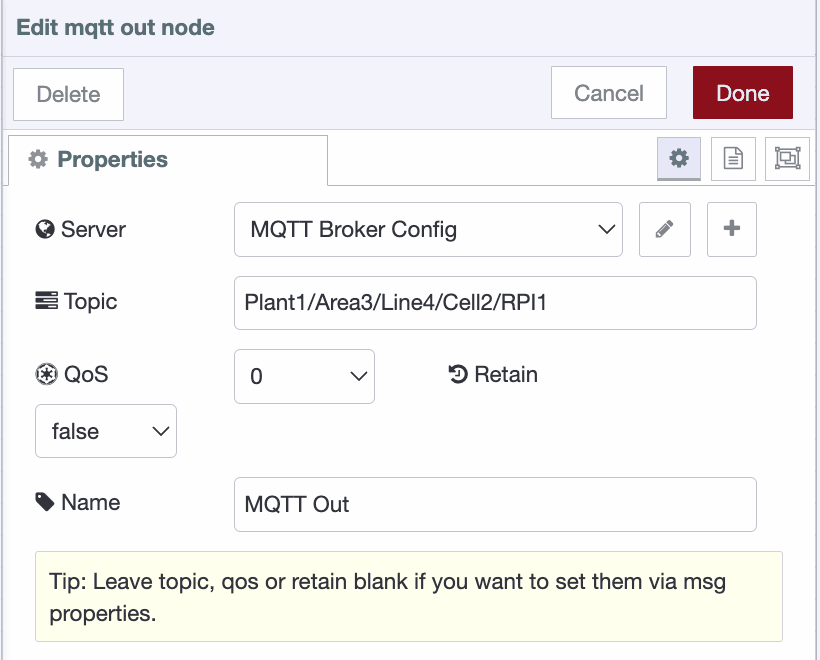

As operations become more connected, managing data from different systems and devices can be challenging. A Unified Namespace (UNS) centralizes your data, making it easy to access and use across your network. In this guide, we’ll show you how to build a UNS with FlowFuse, helping you streamline your data flow and gain real-time insights.

<!--more-->

## What is the Unified Namespace?

{data-zoomable}
_Unified Namespace_

A **Unified Namespace (UNS)** is a data architecture that allows connecting all your systems, sensors, and machines into a single, easy-to-access network. It helps organize data from different sources in a consistent way, making it simple for everyone in your business to share and find the information they need. By unifying your data, UNS speeds up application development, simplifies system integration, and provides faster insights to improve productivity.  

For more information on what UNS is, please read our article [What is UNS](/unified-namespace/).

## The Role of FlowFuse in Industrial Data Operations and Building your UNS

[FlowFuse](/) bridges the gap between legacy systems and modern technologies, enabling seamless data collection from edge devices, systems, and services, while also allowing business applications to contribute data to the UNS through its data pipelines.

FlowFuse offers a complete toolkit for building and managing your UNS, featuring Node-RED for data orchestration, MQTT for real-time communication, and an enterprise layer for centralized management and collaboration. This unified solution simplifies the integration of devices, applications, and legacy systems, ensuring smooth data flow and real-time insights across your organization.

## Building UNS with FlowFuse

In this section, we will demonstrate how to build a UNS with FlowFuse using a practical example. We will send data from a Raspberry Pi connected to an ADXL345 (for measuring vibration) to the UNS.

The Raspberry Pi will collect real-time data from the ADXL345 sensor. We’ll then process and structure this raw data using FlowFuse, converting the raw data into human-readable formats and performing calculations with the three-axis accelerometer data from the sensor to calculate vibration magnitude. We will apply standardized topic naming conventions to send this data to the UNS, helping you centralize and manage data seamlessly across your systems.

### **Step 1: Collect Metrics from Devices**

The first step in building your Universal Node System (UNS) is to collect data from your devices. The method you choose will depend on the type of device and the communication protocol it supports. For instance, many devices use serial communication standards like Modbus, while others, such as industrial controllers, might use OPC-UA for communication.

As mentioned earlier, Node-RED supports a wide range of industrial protocols, from legacy to modern ones. While older protocols like Modbus and OPC-UA were initially designed for machine-to-machine (M2M) communication and lack the ability to directly interact with cloud systems, Node-RED bridges this gap. By using Node-RED, you can collect data from these legacy systems, transform and format it using low-code workflows, and then send it to the cloud via protocols like MQTT, Kafka, AMQP, or others.

In our example, Node-RED can directly collect metrics from sensors using I2C on the Raspberry Pi. This approach simplifies the process by eliminating the need for additional communication layers. To run Node-RED on the Raspberry Pi, we use [FlowFuse Device Agent](/product/device-agent/), which enables you to remotely monitor and build flows securely from the FlowFuse platform in your edge devices. For more details on how to set up and run FlowFuse Device Agent on different devices, refer to this [documentation section](/node-red/hardware/).

### Step 2: Transform and Process the Collected metrics

Once you've collected data from your devices, the next step is to transform it using Node-RED. Industrial systems often use different protocols (e.g., Modbus, OPC UA), and each might have its own data structure, which can create challenges for integration. For example, the ADXL345 sensor outputs raw data as electrical signals (buffer data). We first need to format it into a human-readable format, and then calculate the magnitude, which is a common unit for vibration monitoring.

**Why Data Transformation Matters:**

* **Consistency**: Ensures data from different sources follows the same structure.  
* **Integration**: Makes it easier to integrate data from various systems.  
* **Speed**: Simplifies data access for faster insights and decision-making.

#### **Example: Transforming Data from ADXL345 Sensor (Raspberry Pi)**

Raw data from the ADXL345 sensor might look like this:

```json 
[26,0,244,255,37,255]  
```  

Using a function node in Node-RED, we can convert this into a human-readable format.

{data-zoomable}
_Function node: Tranforming Raw Data into Readable Format_

After Tranformation Data will look as below

```json
{
    "x":0.09765625,
    "y":-0.046875,
    "z":-0.8828125
}  
```

While this is more readable, it can still be challenging to quickly monitor changes in vibration or detect anomalies. To simplify monitoring, we can calculate the **magnitude**, which is a single metric commonly used in vibration monitoring.

{data-zoomable}
_Change node: Calculating Magnitude_

After calculating the magnitude using a Change node, the data might look like this:

```json
{
    "x":0.00390625,
    "y":-0.07421875,
    "z":-0.8515625,
    "magnitude":0.8547996098775871
}  
```

Now, the data is easier to monitor with a single metric (magnitude), but for a Unified Namespace (UNS), this structure is still not optimal. We need to transform it further to provide more context.

**Enhanced Data Structure for UNS:**

To make the data more useful for integration and interpretation in a Unified Namespace (UNS), we can transform it to include additional context, such as units and timestamps, while removing unnecessary metrics like the three-axis components (`x`, `y`, `z`). The easiest and most low-code approach for achieving this in Node-RED is by using the Change node, which is specifically designed for formatting and structuring payloads.

{data-zoomable}
_Change Node: Formatting and structuring payload for UNS_

After formatting, the data will look as shown below:

```json
{
 “name”: “vibration”: 
 "timestamp": "2024-11-13T10:00:00Z",
 "unit": "m/s²",
 “value”: 0.8547996098775871
 }
```

This format is more structured and consistent, with important labels like `value`, `unit`, and `timestamp` that provide meaningful context. It makes it clear that the value represents the magnitude of vibration in **m/s²** and provides the precise time when the data was collected.

### Step 3: Setting Up Your UNS Broker

Now it's time to configure your UNS broker. As mentioned earlier, we’ll be using the [FlowFuse MQTT Broker](/blog/2024/10/announcement-mqtt-broker/). This broker is integrated within the FlowFuse platform to simplify your workflow by eliminating the need for multiple separate services. With FlowFuse, you can monitor and configure everything from a single, centralized platform. This ensures you can monitor, manage, and configure your UNS efficiently without juggling multiple tools or services.

**Steps to Set Up the FlowFuse MQTT Broker:**

1. Log in to the FlowFuse platform and navigate to **"Broker"** in the left sidebar.  
2. Click the **"Create Client"** button at the top-right corner to add a new MQTT client.  
3. **Configure the client**:  
   * Provide a **Username** and **Password** for secure access.  
   * Define an **Access Pattern** to manage client permissions.  
4. Click **"Create"** to generate the client.

*Note: Enterprise level Teams can register up to 20 and Teams level Teams can register up to 5 clients as part of their plan. The ability to purchase additional packs of clients will come in a near future release.* 

5. Copy the client ID you generated from the list and save it somewhere for later use.

{data-zoomable}
_FlowFuse Interface for creating MQTT Client_

### Step 4 : Choosing Your Topic Naming Convention

The key to building a successful UNS is organizing your data with a clear and consistent naming convention. A well-designed convention ensures that data is accessible and understandable across systems and users, simplifying communication and integration.

**ISA-95** is a standard for industrial systems that encompasses various aspects of manufacturing and communication. However, when it comes to communication, ISA-95 often relies on point-to-point (P2P) connections between systems and devices. These connections can introduce complexity, delays, and other challenges.

While we are building a UNS to address the problems and limitations we observed with point-to-point communication, we can still leverage key elements of ISA-95 that remain valuable for improving production efficiency. One of the central aspects of ISA-95 is its equipment hierarchical model, which links various layers of a factory, from physical devices to enterprise systems. By adapting this model to your data architecture, you can simplify access to and management of data across the entire system.

{data-zoomable}
_ISA-95 : Equipment Hierarchical Model_

For example, by following an ISA-95-based equipment hierarchy to define your topic naming convention, you can access data from devices, sensors, or any other source without needing to know their specific addresses or tags—such as for a PLC. This logical structure enables you to retrieve relevant information from different layers of the system (e.g., from control systems to MES or ERP) with clarity and ease.

Example topic structure based on ISA-95 equipment model hierarchy:

`Plant1/Area3/Line4/Cell2/DeviceA`

`Plant1/Area4/Line5/Cell6/DeviceB`

You can also use the [**Sparkplug B**](/blog/2024/08/using-mqtt-sparkplugb-with-node-red/) naming convention for MQTT topics, which offers a structured hierarchy and standard. However, the Sparkplug B convention has some limitations in terms of flexibility. A typical **Sparkplug B topic** follows this structure:

`spBv1.0/{groupID}/{edgeNodeID}/{deviceID}/{messageType}`

While Sparkplug B provides a standardized topic model, its hierarchy may not always suit the specific needs of your architecture. Alternative methods, such as the **Paris** and **Schultz** models, help address these limitations with Sparkplug B topics. However, to keep things simple and avoid unnecessary complexity, we will use **plain MQTT** with the **ISA-95 hierarchy**.

### Step 5 : Sending Collected metrics to UNS 

With your  topic naming convention chosen, it’s time to send the data to the **UNS**. In **Node-RED**, we will use the **MQTT Out** node to send the transformed data to the broker.

1. Drag an MQTT out node into your flow.  
2. Configure the node to connect to the FlowFuse MQTT Broker using the client credentials generated earlier.

**Note**: For secure configuration and to prevent exposing credentials when sharing flows, use environment variables. This ensures sensitive data remains secure and allows for easy sharing without compromising security. For more details, refer to the [Article: Using Environment Variables in Node-RED](https://flowfuse.com/blog/2023/01/environment-variables-in-node-red/).

{data-zoomable}
_Configuring mqtt-broker-config node_

{data-zoomable}
_Configuring mqtt-broker-config node_

3. Set the **topic** using your predefined naming convention (e.g., `Plant1/Area3/Line4/Cell2/RPI1`).

{data-zoomable}
_Configuring mqtt-out node_

4. Connect the input of the mqtt out node to your data transformation flow and deploy the flow.

For information how to use MQTT with Node-RED refer to [Using MQTT with Node-RED](/blog/2024/06/how-to-use-mqtt-in-node-red/)

After deploying, you can monitor the topic hierarchy on the FlowFuse platform by switching to the "Hierarchy" tab in the Broker interface.

{data-zoomable}
_Monitoring your mqtt topic hierarchy within FlowFuse_

Once your data is in the UNS, you have a centralized, real-time view of your operations. This unified structure enables easier access, sharing, and analysis of data across systems, helping you drive better decisions, improve efficiency, and gain valuable insights to optimize your processes.

With real-time data access, you can create monitoring dashboards using the FlowFuse Dashboard with a low-code approach, integrate with other cloud solutions, or leverage it further for enhanced analytics or automations..

{data-zoomable}
_FlowFuse Dashboard Monitoring Vibrations_

## Final Thoughts

FlowFuse makes building a Unified Namespace (UNS) easy by centralizing data from systems, devices, and sensors. With seamless integration of Node-RED, MQTT, and its enterprise layer, FlowFuse ensures smooth data flow, real-time insights, and efficient management. It simplifies operations, enhances productivity, and improves system interoperability, making it easy to adapt your UNS to specific needs and support real-time analytics and automation.
