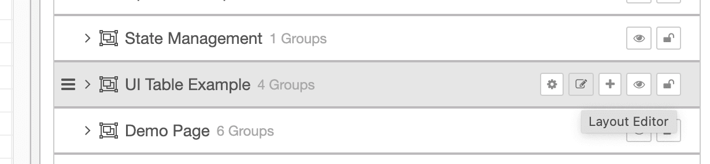
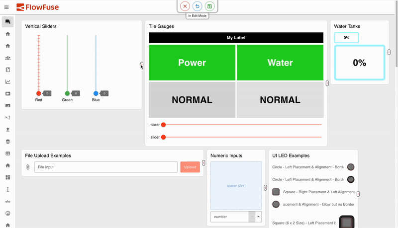
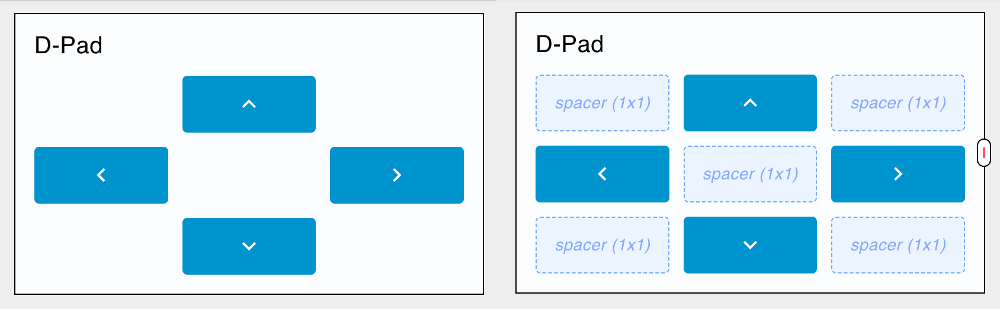

It has been one of the most requested features for FlowFuse Dashboard, and is now available in its first iteration. It is now possible to resize and move groups in the Dashboard itself using the new "Edit Layout" feature. That's not all though, we've added a new "Spacer" widget to assist with layouts, added improvements to the rendering of charts and plenty more.

<!--more-->

## Layout Editor - Quick Guide

For those transitioning over from the original Node-RED Dashboard 1.0, you'll notice some difference in how you can now edit the layout of your dashboard. Now, the editing is done directly in the Dashboard itself, rather than in the Node-RED editor.

To open the Dashboard in "Edit Mode", click the "Edit Layout" button for the relevant page in the Dashboard sidebar:

{data-zoomable}{width="500px"}
_Screenshot to show the buttons available to "Edit Layout" for a given page_

This will open the relevant page in "Edit Mode":

{data-zoomable}
_Short recording to show resizing and reordering in the visual layout editor_

The three controls at the top of the page are:

- **Save Changes:** Deploy any changes to the underlying Node-RED flow.
- **Discard Changes:** Clear any in-browser changes that have not yet been saved.
- **Exit Edit Mode:** Stop "Edit Mode" and interact with teh Dashboard as a standard end-user.

You can then use the handles on each group to resize them, or click and drag to re-position the groups on the page. How this re-positioning is done is controlled by the "Layout" property of the page. The Visual Editor is currently available for "Grid" and "Fixed" layouts only.

Once you're happy with your changes clicked the "Save Changes" button to deploy them to the underlying Node-RED flow. Not you will then be made aware that _"your flows have been updated"_ by Dashboard when you return to your Node-RED Editor.

Note that you can only enter "Edit Mode" via the Node-RED Editor, this is to ensure security and stability of your Dashboard, in cases where you may have users for your Dashboard that should not have access to modify your Dashboard's layout.

## Layout Editor - Next Steps

We are very aware that is this is just the first iteration of the Layout Editor, and we have plenty of plans to improve it further. Here are some of the features we are considering for future releases:

- Include widget resizing and ordering in the Layout Editor
- Overhauling sizing options for groups and widgets [#835](https://github.com/FlowFuse/node-red-dashboard/issues/835)

If there are any other key editor features you'd like to see, then please do reach out to us, open GitHub issues and help us shape the future of FlowFuse Dashboard.

## New Widget: UI Spacer

In the Dashboard sidebar, you now have the option to add a "Spacer", this is just an empty widget that can be used to shift the position of other widgets. This can be useful for creating more complex layouts, or for adding space between widgets. For example, if you wanted to have some directional controls with up/down/left/right buttons, you could use a spacer to separate and align them:

{data-zoomable}
_(left) A d-pad controller layout using spacers, (right) the spacer's highlighted to demonstrate their positioning_

Spacers can be any width and height, and will always render empty-space. To add a new spacer, you can click the "+" button in the Dashboard sidebar next to any Groups. You can then re-order the widgets there too (re-ordering of widgets in the visual layout editor will be coming soon).

## What else is new?

You can find the full 1.19.0 Release Notes [here](https://github.com/FlowFuse/node-red-dashboard/releases/tag/v1.19.0).

Work has already begun on the next release, `1.20.0`, you can see what items we have queued up [here](https://github.com/orgs/FlowFuse/projects/15/views/1), if you've got any feedback or suggestions, please do let us know, and feel free to open new issues on our [GitHub](https://github.com/FlowFuse/node-red-dashboard/issues)

## We are Hiring!

You may have seen already that we are hiring for a full-time Front-End Engineer to join our team, and work on Dashboard, full-time. If you are interested in working with us, please do check out the job listing [here](https://job-boards.greenhouse.io/flowfuse/jobs/5185319004).