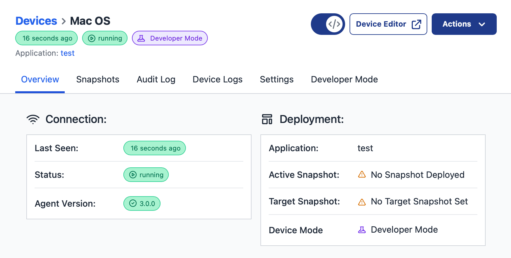

The FlowFuse Device Agent is a tool that enables you to run Node-RED on various hardware devices, such as Raspberry Pi, Windows, MacOS, and PLCs. Running Node-RED directly on the device helps when your application flow needs direct access to sensors and actuators connected to the hardware, facilitating seamless integration with the FlowFuse platform. This integration enables secure management, monitoring, and remote editing of flows from a centralized platform, even at the edge.

<!--more-->

In this article, we will explore how to run the FlowFuse Device Agent as a service on MacOS using Docker. This setup ensures that the Device Agent runs in the background, automatically starts on boot, and maintains a continuous connection the FlowFuse platform for remotely managing your Node-RED flows, even after a device restart. This eliminates the need to manually start the agent after each reboot, saving you time and effort.

### Prerequisites

Before starting, ensure that you have the following set up:

- **FlowFuse Account**: You need an active FlowFuse account to register your device and manage your flows remotely. If you don't have an account, you can [sign up](?utm_campaign=60718323-BCTA&utm_source=blog&utm_medium=cta&utm_term=high_intent&utm_content=Run%20FlowFuse%20Device%20Agent%20as%20a%20service%20on%20MacOS%20using%20Docker) at FlowFuse.

*NOTE: The instructions in this guide were tested on MacBook M1 & M4 MacBook Pro*

### Step 1: Install Homebrew

Homebrew is the MacOS package manager for installing packages and libraries. You can install it using the following command:

```bash
/bin/bash -c "$(curl -fsSL https://raw.githubusercontent.com/Homebrew/install/HEAD/install.sh)"
```

This script will install the Homebrew package manager on your Mac. Once installed, you can easily install other packages like Docker and Colima.

### Step 2: Install Docker

With Homebrew installed, you can now install Docker by running:

```bash
brew install docker-credential-helper docker
```

This will install Docker and its credential helper, which is useful for managing authentication with Docker registries.

### Step 3: Install Colima

Colima is a free alternative to Docker Desktop, particularly useful for MacOS, and offers better compatibility with Apple Silicon hardware. We’ll need it to run the Flowfuse Device Agent container that we will create later. To install Colima, run:

```bash
brew install colima
```

### Step 4: Start Colima

Once Colima is installed, start it with:

```bash
colima start
```

This command starts the Colima virtual machine, which Docker will then use to run containers. If Colima is not running, Docker won't have the necessary environment to create and run containers.

```bash
colima status
```

{data-zoomable}
_CLI: Showing the result of `colima status`_

### Step 5: Set Colima to Run as a Service

To ensure Colima starts automatically in the background, run the following:

```bash
brew services start colima
```

This will set Colima to run as a service, so it will start automatically every time your Mac boots up. 

### Step 6: Adding the Device to the FlowFuse Platform

Now, you'll need to add a new device to the FlowFuse platform and download the device configuration file. This configuration will allow to connect your MacOS device to your FlowFuse team. For more information on how to add a device and generate the configuration, refer to [Generating "Device Configuration"](/docs/device-agent/register/).

### Step 7: Run the FlowFuse Device Agent Container

You can now run the FlowFuse Device Agent container using Docker. Replace `/path/to/device.yml` with the actual path to the device configuration file you have downloaded. The following command will launch the container:

```bash
docker run -d --restart unless-stopped \
 --mount type=bind,src=/path/to/device.yml,target=/opt/flowfuse-device/device.yml \
  -p 1880:1880 flowfuse/device-agent:latest
```

Explanation of the command:

- `-d`: Run the container in detached mode (in the background).
- `--restart` unless-stopped: Ensure the container restarts automatically unless explicitly stopped.
- `--mount type=bind,src=/path/to/device.yml,target=/opt/flowfuse-device/device.yml`: Mounts your local device.yml file into the container so it can be accessed by the agent.
- `-p 1880:1880`: Exposes port 1880 on your host machine, which is typically used for the Node-RED web interface.
- `flowfuse/device-agent:latest`: The Docker image for the FlowFuse Device Agent.

### Step 8: Verify the Device Agent is Running

To verify that the Device Agent is running correctly, you can use the following command:

```bash
docker ps
```

{data-zoomable}
_CLI: Showing the result of `docker ps` indicating the device agent is running correctly_

This will list all running containers, and you should see the FlowFuse Device Agent listed there. If it's not running, you can check the logs to troubleshoot:

```bash
docker logs <container_id>
```

Additionally, you can confirm that the Device Agent is running and successfully connected to the FlowFuse platform by following these steps:

1. Navigate to the FlowFuse platform.
2. In the left sidebar, click on "Edge Devices".
3. Then, select the device you added for MacOS.

{data-zoomable}
_FlowFuse Platform: showing the status of your edge device_

Now, you can start developing applications on the device remotely from any location and manage it efficiently.

### Step 9: Ensure the Device Agent Restarts Automatically After a Reboot

The `--restart unless-stopped` flag in the Docker command ensures that your FlowFuse Device Agent container will automatically restart if your Mac reboots. However, it's always good to verify this by restarting your system:

1. Restart your Mac.
2. After rebooting, check the status of the FlowFuse Device Agent:

```bash
   docker ps
```

### Conclusion

By following these steps, you've successfully set up the FlowFuse Device Agent on your macOS system using Docker and Colima. Now, the agent will run seamlessly in the background and restart automatically after a system reboot.
