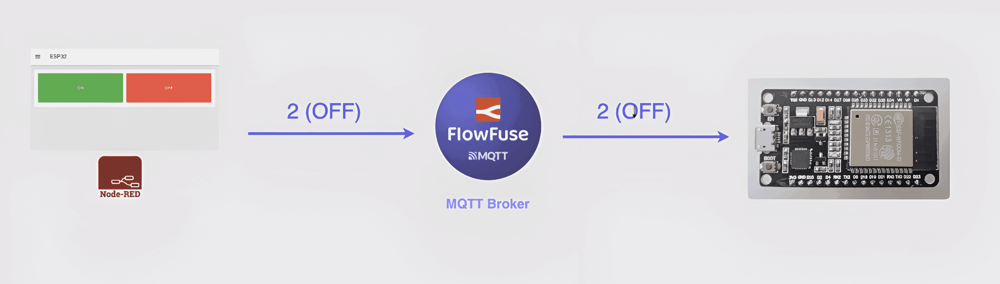

The ESP32 is an affordable and powerful microchip that combines Wi-Fi and Bluetooth in one small package. It's commonly used in smart devices like home automation systems, wearables, and other IoT projects. Despite its low cost (around $6), it offers strong performance, and low power consumption, and is compatible with popular platforms like Arduino. Whether you're a hobbyist or a business, the ESP32 provides great value, making it easy to create wireless devices without a big investment. This tutorial demonstrates how to set up communication between the ESP32 and Node-RED using MQTT, along with an interactive dashboard via FlowFuse for a user-friendly interface. 

<!--more-->

<iframe width="100%" height="315" src="https://www.youtube.com/embed/ecfJ-9MxyVE" title="YouTube video player" frameborder="0" allow="accelerometer; autoplay; clipboard-write; encrypted-media; gyroscope; picture-in-picture" allowfullscreen></iframe>

## Prerequisites

To follow this tutorial, you'll need the following:

- **ESP32 microcontroller**: The hardware you'll be using for this project.
- **USB cable**: To connect the ESP32 to your computer.
- **Arduino IDE**: Installed and set up to program your ESP32. [Download](https://support.arduino.cc/hc/en-us/articles/360019833020-Download-and-install-Arduino-IDE) the Arduino IDE if you haven't already done so.
    - Additionally, if you haven't set up the Arduino IDE for the ESP32 board, please follow this tutorial: [How to Set Up ESP32 with Arduino IDE](https://www.youtube.com/watch?v=CD8VJl27n94)
- **FlowFuse account**: This will allow you to create and deploy Node-RED instances securely on the cloud with a single click, collaborate on your Node-RED projects with your team, manage and program your edge devices remotely, and provide an MQTT broker with an interface for securely managing clients.

If you haven’t signed up for a FlowFuse account yet, [sign up](/get-started?utm_campaign=60718323-BCTA&utm_source=blog&utm_medium=cta&utm_term=high_intent&utm_content=Interacting%20with%20ESP32%20Using%20Node-RED%20and%20MQTT) now.

## Getting Started with ESP32 and Node-RED

In this section, we’ll set up Node-RED on FlowFuse, create an MQTT connection, and configure everything to interact with your ESP32. This will lay the foundation for building your IoT flows and controlling devices.

### Step 1: Creating Node-RED instance on FlowFuse Cloud

Start by logging into your [FlowFuse](/) account and creating a new Node-RED instance. For more information on creating a Node-RED instance, refer to the [FlowFuse documentation](/docs/user/introduction/#creating-a-node-red-instance).

Once the instance is created, open the Node-RED editor.

### Step 2: Creating and Configuring MQTT Clients in FlowFuse

In this step, we’ll set up MQTT to enable communication between Node-RED and the ESP32. MQTT (Message Queuing Telemetry Transport) is a lightweight messaging protocol designed for reliable, low-bandwidth communication between devices in IoT applications.

We use MQTT because it allows devices to communicate over a network (like Wi-Fi) without the need for a direct physical connection. This makes it perfect for long-distance communication, where devices need to send and receive data efficiently, even when they are not physically connected or close to each other.

{data-zoomable}
_Diagram showing the flow of data and how commands are sent to the ESP32 using MQTT using Node-RED_

In our setup, Node-RED will publish commands to the MQTT broker, and the ESP32 will subscribe to topics to receive responses. The ESP32 will then perform actions, such as controlling an LED. To facilitate this, we’ll create two MQTT clients in FlowFuse (since the MQTT broker is already set up and managed by FlowFuse, you don’t need to worry about its configuration or maintenance). One client will be for Node-RED, and the other will be for the ESP32. These clients will handle the secure and reliable exchange of messages, ensuring smooth communication between the two devices.

**To Create MQTT Clients in FlowFuse:**

1. Navigate to your FlowFuse platform and log in to your account.
2. In the left sidebar, click on "Broker".
3. In the newly opened interface, click the “Create Client” button.
4. Enter a username and password for your MQTT client. Confirm the password.
    - You can leave the default pattern as `#` for access control, or set a custom pattern if needed.

{data-zoomable}
_Interface for setting MQTT client details and credentials_

5. Click "Create" to generate the client.
6. Copy the client ID and save it somewhere secure for later use.
7. Repeat the same steps to create the second MQTT client for the ESP32.

### Step 3: Building a Node-RED Dashboard to Send Commands Over MQTT

Now that we’ve created the MQTT clients, it’s time to build a Node-RED dashboard and create a flow that will publish commands to the FlowFuse MQTT broker. This will later allow you to interact with your ESP32 using a user-friendly interface.

**Let's first create a flow to connect to the MQTT broker with the client config we have created:**

1. Drag the **mqtt out** node onto the canvas in Node-RED.
2. Double-click the **mqtt out** node to open the settings.
3. Click the pencil icon next to the Server field to open the MQTT broker configuration.
4. In the configuration, enter the following details:
    - Server: `broker.flowfuse.cloud`
    - Client ID: The Client ID you created earlier.
    - Username: The MQTT username (Client ID).
    - Password: The MQTT password.
5. Click "Add" to save the configuration, then select the newly added configuration.
6. In the Topic field, enter a topic name, such as `/LEDControl`.
7. Click "Done" to close the settings.
8. Click "Deploy" in the top-right corner to deploy the flow.
9. Once deployed, check the MQTT out node for a Connected status, confirming the connection to the MQTT broker.

For this example, we will create a very simple dashboard. If you're not familiar with FlowFuse Dashboard, you can refer to the following blog to get started: [FlowFuse Dashboard: Getting Started](/blog/2024/03/dashboard-getting-started/)

1. Install the `@flowfuse/node-red-dashboard` from the Node-RED Palette Manager.
2. Drag two **ui-button** widgets onto the canvas.
3. Double-click on the first button and set the Label to "ON", the Background Color to Green, and the Payload to `1`. Adjust the Width and Height as needed.
4. Double-click on the second button and set the Label to "OFF", the Background Color to Red, and the Payload to `2`.
5. Connect the output of both buttons to the input of the **mqtt out** node.
6. Click "Deploy" to save the flow.


[{"id":"59887a8115c95eae","type":"tab","label":"Flow 1","disabled":false,"info":"","env":[]},{"id":"02c25e8a30f9379d","type":"ui-base","name":"My Dashboard","path":"/dashboard","appIcon":"","includeClientData":true,"acceptsClientConfig":["ui-notification","ui-control"],"showPathInSidebar":false,"showPageTitle":true,"navigationStyle":"default","titleBarStyle":"default"},{"id":"cfb2ab9ff30660fc","type":"ui-theme","name":"Default Theme","colors":{"surface":"#ffffff","primary":"#0094CE","bgPage":"#eeeeee","groupBg":"#ffffff","groupOutline":"#cccccc"},"sizes":{"density":"default","pagePadding":"12px","groupGap":"12px","groupBorderRadius":"4px","widgetGap":"12px"}},{"id":"d263574af6876c7a","type":"ui-page","name":"ESP32","ui":"02c25e8a30f9379d","path":"/page1","icon":"home","layout":"grid","theme":"cfb2ab9ff30660fc","breakpoints":[{"name":"Default","px":"0","cols":"3"},{"name":"Tablet","px":"576","cols":"6"},{"name":"Small Desktop","px":"768","cols":"9"},{"name":"Desktop","px":"1024","cols":"12"}],"order":1,"className":"","visible":"true","disabled":"false"},{"id":"3ae115ea7ede6827","type":"ui-group","name":"Group 1","page":"d263574af6876c7a","width":"6","height":"1","order":1,"showTitle":false,"className":"","visible":"true","disabled":"false","groupType":"default"},{"id":"def97b29f5f7baab","type":"mqtt-broker","name":"","broker":"broker.flowfuse.cloud","port":"1883","clientid":"","autoConnect":true,"usetls":false,"protocolVersion":"4","keepalive":"60","cleansession":true,"autoUnsubscribe":true,"birthTopic":"","birthQos":"0","birthRetain":"false","birthPayload":"","birthMsg":{},"closeTopic":"","closeQos":"0","closeRetain":"false","closePayload":"","closeMsg":{},"willTopic":"","willQos":"0","willRetain":"false","willPayload":"","willMsg":{},"userProps":"","sessionExpiry":""},{"id":"5a9162986a34a4d6","type":"ui-button","z":"59887a8115c95eae","group":"3ae115ea7ede6827","name":"","label":"ON","order":1,"width":"3","height":"2","emulateClick":false,"tooltip":"","color":"","bgcolor":"","className":"","icon":"","iconPosition":"left","payload":"1","payloadType":"num","topic":"topic","topicType":"msg","buttonColor":"green","textColor":"","iconColor":"","enableClick":true,"enablePointerdown":false,"pointerdownPayload":"","pointerdownPayloadType":"str","enablePointerup":false,"pointerupPayload":"","pointerupPayloadType":"str","x":190,"y":120,"wires":[["9239f8a7cca5c858"]]},{"id":"f9c194994d9491a8","type":"ui-button","z":"59887a8115c95eae","group":"3ae115ea7ede6827","name":"","label":"OFF","order":2,"width":"3","height":"2","emulateClick":false,"tooltip":"","color":"","bgcolor":"","className":"","icon":"","iconPosition":"left","payload":"2","payloadType":"num","topic":"topic","topicType":"msg","buttonColor":"red","textColor":"","iconColor":"","enableClick":true,"enablePointerdown":false,"pointerdownPayload":"","pointerdownPayloadType":"str","enablePointerup":false,"pointerupPayload":"","pointerupPayloadType":"str","x":190,"y":160,"wires":[["9239f8a7cca5c858"]]},{"id":"9239f8a7cca5c858","type":"mqtt out","z":"59887a8115c95eae","name":"","topic":"/LedControl","qos":"","retain":"","respTopic":"","contentType":"","userProps":"","correl":"","expiry":"","broker":"def97b29f5f7baab","x":390,"y":140,"wires":[]}]


Now, when you click either the "ON" or "OFF" button on the dashboard, it will send either 1 or 2 as the payload. The ESP32 will use this payload in its code to turn the LED on or off. To view the dashboard, switch to the Dashboard 2.0 tab on the right side and click the Open Dashboard button. The dashboard will look similar to the image below.

{data-zoomable}
_FlowFuse Dashboard Build to control the ESP32 LED_

### Step 4: Programming ESP32 to receive commands from MQTT and Control LED

Now, let's move on to the final step. Before proceeding, make sure your ESP32 is **connected to your laptop or computer via USB***. The USB connection is essential for uploading the code (sketch) to the ESP32, which will enable it to connect to the internet and communicate with the MQTT broker.
The ESP32 will subscribe to the MQTT topic we configured earlier (e.g., /LEDControl). Based on the received payload (1 or 2), it will control the LED accordingly — turning it on or off.

**Setting up Arduino IDE:**

1. Open the Arduino IDE on your computer.
2. Ensure you have selected the correct board and port in the Tools menu.
3. Install the necessary library:
4. Go to Tools > "Manage Libraries".
5. Search for and install the "EspMQTTClient" library by Patrick Lapointe.
6. The library installation will prompt you to install its dependencies—ensure that you tick that option and proceed to install.

**Code for ESP32:**

1. Copy the following code into the Arduino IDE:

```cpp
#if defined(ESP32)
#include <WiFi.h>
#elif defined(ESP8266)
#include <ESP8266WiFi.h>
#endif

#include <PubSubClient.h>

#define LedPin 2 // ESP32 built-in LED pin

// WiFi and MQTT settings
const char* ssid = ""; // Change this to your WiFi SSID
const char* password = ""; // Change this to your WiFi password
const char* mqtt_server = "broker.flowfuse.cloud"; // FlowFuse MQTT broker server

// MQTT client credentials
const char* mqtt_client_id = ""; // Replace with your MQTT client ID
const char* mqtt_username = ""; // Replace with your MQTT username
const char* mqtt_password = ""; // Replace with your MQTT password

WiFiClient espClient;
PubSubClient client(espClient);

// Function to connect to WiFi
void setup_wifi() {
    delay(10);
    Serial.println();
    Serial.print("Connecting to ");
    Serial.print(ssid);
    WiFi.begin(ssid, password);

    while(WiFi.status() != WL_CONNECTED) {
        delay(500);
        Serial.print(".");
 }

    Serial.println("\nWiFi connected");
    Serial.print("IP address: ");
    Serial.println(WiFi.localIP());
}

// Callback function to handle messages from subscribed topics
void callback(char* topic, byte* payload, unsigned int length) {

 String msg;
    for (int i = 0; i < length; i++) {
 msg += (char)payload[i];
 }

 // Control LED based on message
    if (msg == "1") {
        digitalWrite(LedPin, HIGH); // Turn LED on
 }
    else if (msg == "2") {
        digitalWrite(LedPin, LOW); // Turn LED off
 }
}

// Function to connect to MQTT broker
void reconnect() {
    while (!client.connected()) {
        Serial.println("Attempting MQTT connection...");

 // Connect to MQTT broker with the client ID, username, and password
        if (client.connect(mqtt_client_id, mqtt_username, mqtt_password)) {
            Serial.println("Connected to MQTT broker");
            client.subscribe("/LedControl");
 }
        else {
            Serial.print("Failed, rc=");
            Serial.print(client.state());
            Serial.println(" trying again in 5 seconds");
            delay(5000);
 }
 }
}

void setup() {
    Serial.begin(115200);
    pinMode(LedPin, OUTPUT);
    setup_wifi();
    client.setServer(mqtt_server, 1883);
    client.setCallback(callback);
}

void loop() {
    if (!client.connected()) {
        reconnect();
 }
    client.loop();
}
```

2. Replace the placeholder values in the code: SSID (your Wi-Fi network's SSID), Wi-Fi Password (your Wi-Fi network's password), MQTT Client ID (the MQTT client ID you generated for esp32), MQTT Username and Password (the MQTT credentials you created).
3. After you've made these changes, click "Upload" in the Arduino IDE to upload the code to your ESP32.
4. Once the upload is complete, open the Serial Monitor (set the baud rate to 115200) to monitor the output.

If everything is set up correctly, you should see the output in the Serial Monitor as shown in the image.

{data-zoomable} 
_Serial monitor displays the result when everything is set up correctly._

Once you verify the setup, you can unplug the USB from the computer and connect the ESP32 to a power adapter. With this, your ESP32 is now powered and connected to Wi-Fi (make sure your device is on the same Wi-Fi network as the one configured in the code), allowing you to control the LED from anywhere in the world via the MQTT commands sent through Node-RED.

### Troubleshooting

1. **Can't Upload Code to ESP32**
    - Solution: Make sure the correct board and port are selected in the Arduino IDE.
Check Tools > Board for the right ESP32 model and Tools > Port for the correct connection.
If the port is missing, [Download](https://www.silabs.com/developer-tools/usb-to-uart-bridge-vcp-drivers?tab=downloads) and reinstall the CP210x USB drivers.

2. **ESP32 Keeps Disconnecting from MQTT**
- Solution: Make sure both the ESP32 and Node-RED have unique MQTT client IDs.
If both devices share the same client ID, they will conflict and cause disconnections.

3. **ESP32 Doesn’t Respond to Commands (LED Not Turning On/Off)**
    - Solution: Verify the topic in the ESP32 code matches the one in Node-RED (e.g., /LedControl). If it still doesn't work, try rebooting your ESP32.

## Conclusion

In this tutorial, we successfully connected the ESP32 to Node-RED using MQTT, enabling remote control of an LED via a FlowFuse dashboard. This simple IoT setup demonstrates how easy it is to interact with devices using MQTT and Node-RED, offering a flexible and scalable solution for future projects. With the ESP32, Node-RED, and FlowFuse, you can easily expand and integrate more devices into your IoT system.