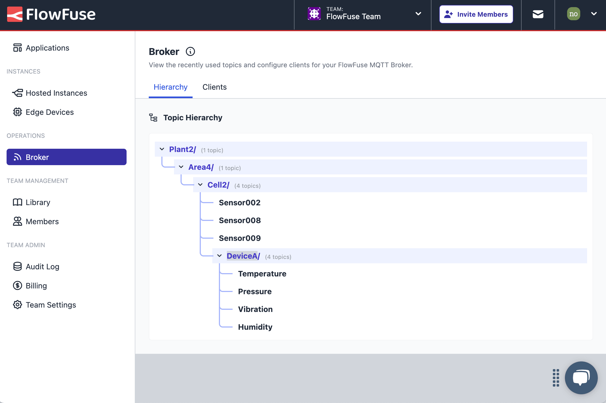

The focus of the FlowFuse 2.11 release has all been about providing clarity for our users and reducing friction in our user experience. 

Navigation in FlowFuse has been streamlined with a new sidebar and team-wide search feature. We've provided an interactive visualization for your MQTT topic hierarchy, ensuring you have a clear view of your own MQTT/UNS architecture, and, we've re-architected the audit logging to ensure you have an easy-to-understand and searchable view of everything going on in your FlowFuse Team and it's respective Applications, Instances and Devices.

<!--more-->

## Navigation Revamp

If you're using FlowFuse Cloud, you'll have already noticed a big improvement to our navigation sidebar on the left of the user interface that was released a couple of weeks ago. This is now packaged up into FlowFuse 2.11 and available to our self-hosted customers too.

{data-zoomable}
_Screenshot of the improve left-side navigation in FlowFuse_

This is the first stage of a navigation revamp we're working on, that will represent a big improvement for navigation around FlowFuse, and help make managing your applications easier.

You'll notice we've renamed "Devices" to "Edge Devices" to make it clearer that these are _instances of Node-RED_ that are running on devices, rather than just a record of the device itself. We've also separated out many of the pages into sections, making it easier to find what you're looking for, and giving us scope to add in more in the coming weeks, which will make it easy to jump straight to the features you need.

### Team-wide Search

A very popular feature in the "home" view of FlowFuse is the search bar that helps you find the relevant Application, Instance, or Device you're looking for. This has been moved into the top header and will be available on every page of FlowFuse, making it even easier to find what you're looking for, wherever you are.

{data-zoomable}
_Screenshot of the team-wide search_

This will soon be followed by an update to our "Applications" view which is currently quite over-crowded. We're always looking to reduce friction for our users, and this is a big step in doing that.

## MQTT Topic Hierarchy

We recently [announced our very own MQTT Service](/blog/2024/10/announcement-mqtt-broker), and we're following that up with an update that lets you see what topics are being used by your MQTT clients in the UI:

{data-zoomable}
_Screenshot of the UI to explore your MQTT topic hierarchy_

This will make managing your event-driven applications even easier, giving you clarity on the structure of your topic-space, whether you're using the MQTT Broker for a unified namespace (UNS) or any other use case.

## Audit Logging Improvements

We've improved the Audit Log views at the Team and Application levels to given you better visibility on the actions taken by users across your whole team in FlowFuse. 

Previously, only events associated to that "level" (e.g. Team, Application, Instance) were shown in the respective log. However, now, when you view the "Team" Audit Log, it shows not just events on that team specifically, e.g. a settings change, but also all Audit events for it's "children", i.e. the Applications, Instances, Pipelines, etc. that are part of that team too.

New filters on the right-side also make it easy to explore everything taking place in your FlowFuse Team, allowing you to dive into a given Instance, all from the top-level "Team" view.

{data-zoomable}
_Screenshot of the improved audit log view_

For a full list of everything that went into our 2.11 release, you can check out the [release notes](https://github.com/FlowFuse/flowfuse/releases/tag/v2.11.0).

We're always working to enhance your experience with FlowFuse. We're always interested in your thoughts about FlowFuse too. Your feedback is crucial to us, and we'd love to hear about your experiences with the new features and improvements. Please share your thoughts, suggestions, or report any [issues on GitHub](https://github.com/FlowFuse/flowfuse/issues/new/choose). 

Together, we can make FlowFuse better with each release!

## Try FlowFuse

### Self-Hosted

We're confident you can have self managed FlowFuse running locally in under 30 minutes. You can install FlowFuse using [Docker](/docs/install/docker/) or [Kubernetes](/docs/install/kubernetes/).

### FlowFuse Cloud

The quickest and easiest way to get started with FlowFuse is on our own hosted instance, FlowFuse Cloud.

[Get started for free]() now, and you'll have your own Node-RED instances running in the Cloud within minutes.

## Upgrading FlowFuse

If you're using [FlowFuse Cloud]({{ site.appURL }}), then there is nothing you need to do - it's already running 2.10, and you may have already been playing with the new features.

If you installed a previous version of FlowFuse and want to upgrade, our documentation provides a guide for [upgrading your FlowFuse instance](/docs/upgrade/).

If you have an Enterprise license please make sure to review this [changelog entry](/changelog/2024/08/enterprise-license-update)

## Getting help

Please check FlowFuse's [documentation](/docs/) as the answers to many questions are covered there. Additionally you can go to the [community forum](https://discourse.nodered.org/c/vendors/flowfuse/24) if you have
any feedback or feature requests.