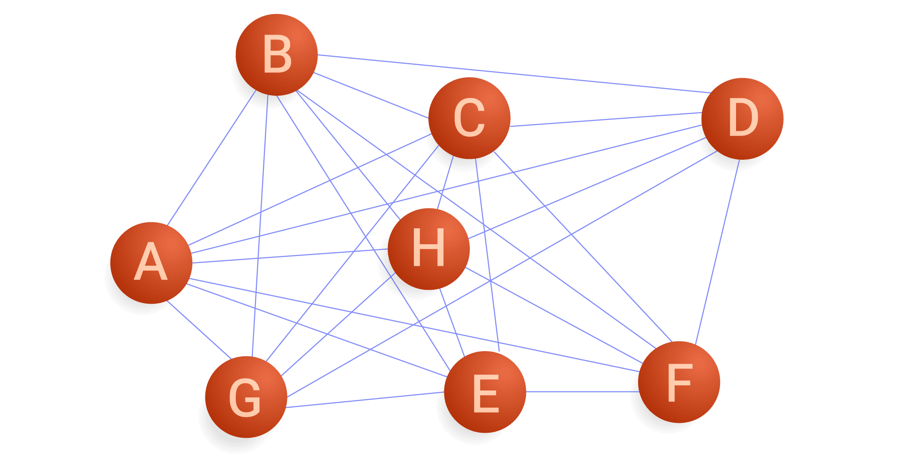
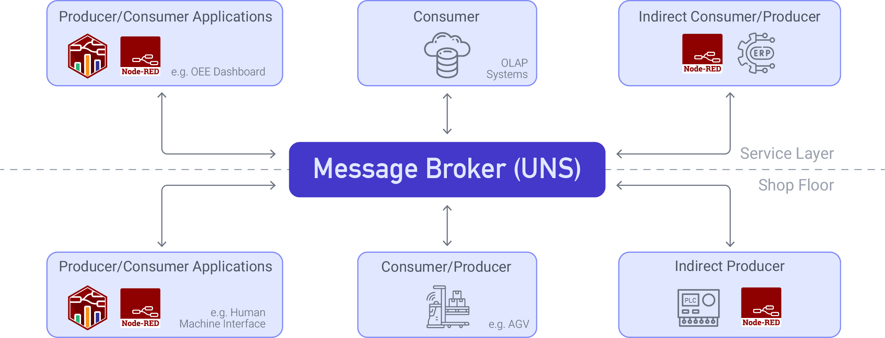

Manufacturing has changed significantly over the years, driven by new technology and the need for better communication between systems. In the past, point-to-point (P2P) connections, where devices communicate directly with each other, were the standard. However, as factories become more complex, P2P connections are no longer practical. This article explains why P2P connections are outdated and how a Unified Namespace (UNS) offers a better, more flexible solution.

<!--more-->

## What are Point-to-Point Connections?

{data-zoomable}
_Point-to-point connection_

Point-to-point (P2P) connections are direct links between two systems or devices, allowing them to communicate with each other. They can be physical, like cables, or network-based (client-server), like a machine sending data to a server.

In a P2P setup, each connection links exactly two systems. These systems could be hardware, software, or even databases, exchanging data tailored to their needs.

For example, a machine might send performance data directly to a control system, or a sensor could send real-time measurements to a monitoring device. It’s a straightforward way to get systems talking, but as the number of devices grows, it becomes increasingly complex to manage.

## Why Point-to-Point Connections No Longer Work

As manufacturing moves toward more modern, interconnected approaches like Industry 4.0, the limitations of point-to-point connections become more apparent. Here's why P2P connections are no longer sufficient for today’s manufacturing environments:

### 1. Limited Data Sharing, Visibility, and Delayed Data

Point-to-point connections often lead to data silos, where devices or machines communicate only with their immediate hierarchy level. This isolation severely limits system-wide visibility, making it challenging to share critical data in real-time. Consequently, problems such as defective products, unexpected downtime, and the need for rework may go unnoticed until the damage is done.

In modern manufacturing, real-time data is indispensable for maintaining operational efficiency. However, point-to-point connections introduce significant delays, as data must traverse multiple layers—control systems (Level 1), supervisory control (Level 2), manufacturing execution systems (Level 3), and finally, higher-level management systems (Level 4) as outlined in the ISA-95 model. Each additional layer compounds latency, slowing response times and postponing the detection of issues, see also our post on [Why the Automation Pyramid slows you down](https://flowfuse.com/blog/2023/08/isa-95-automation-pyramid-to-unified-namespace/).

Without integrated, real-time data across teams, such as quality control, problems like defective parts may not be addressed promptly, leading to increased waste and customer dissatisfaction. The lack of seamless data sharing results in visibility gaps that impede decision-making, reducing the ability to act swiftly. In fast-paced environments, these delays not only hinder operational efficiency but also have a direct negative impact on profitability.

### 2. Inflexibility, Limiting Innovation, and Causing Downtime

Point-to-point connections create a rigid and inflexible network. When new technology or equipment is added, the entire system often requires reconfiguration, leading to significant downtime. For instance, if a new machine is introduced to the production line, many connections may need to be adjusted or re-established, which can temporarily halt production.

This downtime disrupts the flow of operations and makes it harder to implement new technologies quickly, slowing down innovation. As a result, manufacturers may struggle to stay competitive, as they can't integrate advancements like automation, real-time analytics, or AI without significant delays and costly interruptions.

### 3. High Costs Over Time and Maintenance Complexity

At first glance, point-to-point (P2P) connections may appear to be a cost-effective and straightforward solution. However, as systems expand, the true costs and complexities become increasingly apparent. In the automation pyramid (ISA-95 model), communication occurs across multiple hierarchical levels, with field devices interacting with controllers, controllers with SCADA, and SCADA with higher-level systems such as MES and ERP.

While this layered structure can keep connections orderly, it quickly becomes a logistical nightmare when scaling. Introducing new devices often triggers a cascade of necessary updates and reconfigurations across various levels. For example, adding a new field device typically requires adjustments to the controller, followed by updates to the SCADA system, creating a ripple effect that impacts the entire system.

This ongoing need for constant reconfiguration not only drives up costs but also introduces significant complexity in maintenance. As the system grows, so does the effort and resources required to manage it, making the P2P model inefficient and prohibitively expensive in environments that demand agility, scalability, and long-term sustainability. Ultimately, the simplicity of P2P connections gives way to an increasingly cumbersome and expensive maintenance burden, undermining its initial advantages.

### 4. Security Vulnerabilities

As the number of point-to-point connections increases, so does the risk of security breaches. Each connection represents a potential vulnerability, and if one connection in the network is compromised, the entire system becomes a target for attackers.

In large manufacturing environments, securing every individual connection becomes daunting. Any new device or system can introduce additional vulnerabilities, creating more opportunities for attackers to exploit. A compromised point-to-point connection could lead to production halts, loss of sensitive data, or even physical damage to machinery.

For example, imagine a situation where a hacker gains access to a machine’s control system through a compromised point-to-point connection. The attacker could intentionally cause a malfunction, halt production, or extract confidential information. The complexity of managing security for each connection makes it difficult to maintain a secure, reliable network.

### 5. Scalability Issues

One of the most significant drawbacks of P2P connections in manufacturing is their inability to scale efficiently. As production lines grow, so too do the number of devices, systems, and connections that must be managed. With a P2P architecture, each new device or system typically requires a direct, dedicated connection to each relevant part of the network. This creates a spaghetti network of interwoven links that becomes increasingly unwieldy and difficult to manage as the system expands.

In a traditional P2P setup, scaling the network means manually creating additional links, configuring them, and ensuring that the new connections fit seamlessly into the existing infrastructure. This process is time-consuming, error-prone, and highly resource-intensive, leading to increased complexity and longer downtimes as you scale.

When scaling a P2P network, changes made to one part of the system often trigger a ripple effect throughout the entire network. For instance, adding a new sensor may require updating the controller, the SCADA system, and even the Manufacturing Execution System (MES). This cascading need for updates across different layers of the network makes scaling more complicated and costly. Furthermore, the introduction of new devices means additional configuration and troubleshooting, often leading to disruptions in operations and extended downtimes while the new devices are integrated.

These issues compound when scaling across multiple production lines or sites, creating an increasingly complex web of p2p connections. As the number of devices grows, so does the risk of errors, network failures, and delays. This makes it difficult for manufacturers to respond to the growing demands of production while maintaining efficiency, reliability, and uptime.

## Unified Namespace: The Modern Solution

{data-zoomable}{width="400px"}
_Hub and Spoke Model_

A Unified Namespace (UNS) is a more straightforward way to connect devices and systems in a factory. Instead of having separate connections between each device, everything is connected through one central hub, which we call the **hub-and-spoke** model. This means devices don’t need to be directly linked to each other, making the system easier to manage and maintain; for more information on Unified Namespace, read our article: [Introduction to unified namespace](/blog/2023/12/introduction-to-unified-namespace/).

With a UNS, adding new devices or systems becomes straightforward. Rather than setting up multiple direct connections—like in a point-to-point system—new devices (spokes) connect to the central hub. This reduces the complexity of growing your system and eliminates downtime. If equipment is replaced or updated, only that device needs to be reconnected to the hub rather than reconfiguring the entire network.

A UNS also improves data sharing. All data is collected in one place, so any system that needs it can access it in real time. This leads to quicker decisions and faster responses to problems. With fewer connections to manage, the costs of maintaining the system are lower. Plus, the central hub makes the whole system more secure, as fewer direct connections need to be protected.

{data-zoomable}
_Publish-Subscribe Archtecture_

We use a **publish-subscribe (pub/sub)** architecture to implement a hub-and-spoke model in a UNS. In this architecture, devices, systems send data to a central broker, and other devices can subscribe to the data they need. This approach eliminates the need for a complex network of point-to-point connections, making it easier to scale, update, and maintain the system.

This model addresses all the significant problems of point-to-point connections. For more information on how pub/sub solves these problems or why UNS needs pub/sub, read the article: [Why UNS Needs Pub/Sub](/blog/2024/11/why-pub-sub-in-uns/).

[MQTT](/blog/2024/06/how-to-use-mqtt-in-node-red/) is a widely used for implementing the publish-subscribe model. It is lightweight, efficient, and works well in manufacturing environments where network reliability can be inconsistent. 

{data-zoomable}
_Unified Namespace_

To simplify the creation of a UNS in your manufacturing environment, [FlowFuse](/) provides an integrated MQTT broker service. The platform makes building, scaling, and managing Node-RED solutions easy. It supports seamless connections between devices, services, and APIs using over 5,000 community-contributed nodes for data collection. FlowFuse also enables efficient data transformation and visualization with a low-code approach, remote management of edge devices, and team collaboration on projects. With everything centralized on one platform, FlowFuse offers high security, scalability, and availability to optimize and maintain your system effectively.

[Sign up](https://app.flowfuse.cloud/account/create/?utm_campaign=60167396-BCTA&utm_source=blog&utm_medium=cta&utm_term=high_intent&utm_content=The%20Death%20of%20Point-to-Point%3A%20Why%20You%20Need%20a%20Unified%20Namespace) now to [start building your own Unified Namespace with FlowFuse](/blog/2024/11/building-uns-with-flowfuse/) and take the first step toward a more efficient and connected manufacturing system.

## Summary

Due to complexity, high maintenance costs, and security risks, point-to-point (P2P) connections are becoming less effective in modern factories. A Unified Namespace (UNS) solves these problems by connecting devices through a central hub, making managing, scaling, and securing systems easier. UNS improves data sharing and reduces downtime. Tools like FlowFuse make it simple to set up and manage a UNS, offering a more efficient and flexible solution for manufacturing.
