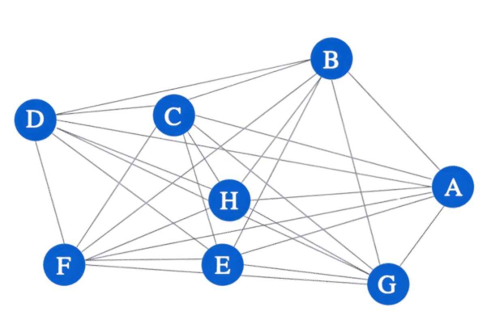
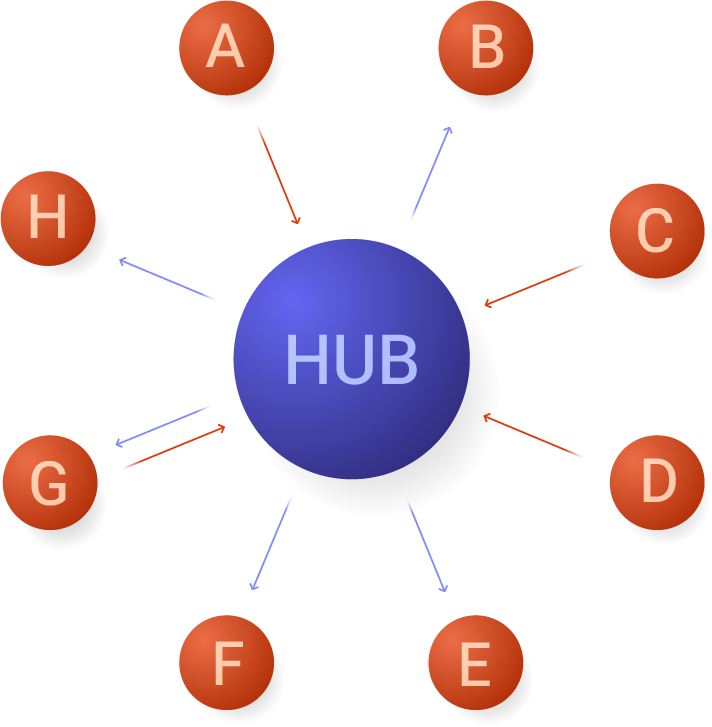

Manufacturing has changed significantly over the years, driven by new technology and the need for better communication between systems. In the past, point-to-point (P2P) connections—where devices communicate directly with each other—were the standard. However, as factories become more complex, P2P connections are no longer practical. This article explains why P2P connections are outdated and how a Unified Namespace (UNS) offers a better, more flexible solution.

<!--more-->

## What are Point-to-Point Connections?

{data-zoomable}
_Point-to-point connection_

Point-to-point (P2P) connections are direct links between two systems or devices, allowing them to communicate with each other. They can be physical, like cables, or network-based (client-server), like a machine sending data to a server.

In a P2P setup, each connection links exactly two systems. These systems could be hardware, software, or even databases, exchanging data tailored to their needs.

For example, a machine might send performance data directly to a control system, or a sensor could send real-time measurements to a monitoring device. It’s a straightforward way to get systems talking, but as the number of devices grows, it becomes increasingly complex to manage.

## Why Point-to-Point Connections No Longer Work

As manufacturing moves toward more modern, interconnected approaches like Industry 4.0, the limitations of point-to-point connections become more apparent. Here's why P2P connections are no longer sufficient for today’s manufacturing environments:

### 1. Scalability Issues

Initially, point-to-point connections are simple to set up, but managing the growing web of connections becomes increasingly difficult as more devices and systems are added. Each new machine, sensor, or system requires its own set of links to the existing control systems, data storage, and monitoring tools. This doesn't scale well.

For example, adding an assembly line with multiple machines requiring individual connections to various systems creates a tangled web of connections that can quickly become unmanageable. Over time, this makes the system inefficient and hard to maintain, especially in environments that require agility. 

As the factory expands, every new addition increases the number of connections, each of which must be configured, tested, and maintained separately. This scaling issue is particularly problematic in industries where operations must be agile and adaptable.

### 2. High Costs Over Time and Maintenance Complexity

While P2P connections may appear cost-effective in the short term, their maintenance becomes increasingly expensive as the number of systems grows. Each new system requires additional connections, increasing the installation, labor, and maintenance costs. Over time, the complexity of managing an extensive web of connections adds a significant financial and technical burden.

The costs are not just monetary but also operational. Every change or system update requires careful reconfiguration, testing, and validation, which becomes increasingly complex as more devices are added. Maintaining and troubleshooting such a network can quickly consume resources, reducing the operation's overall efficiency. 

For example, let’s say a company starts with 10 systems, each requiring 1 connection to every other system. At first, this means a manageable number of connections—specifically, 10 systems would need 45 connections. This can be calculated using the formula: 

**Number of connections = (n * (n - 1)) / 2**

Where "n" is the number of systems.

However, as the company grows and adds more systems, the number of required connections increases exponentially. If the company adds just 10 more systems, the total connections rise to over 100, and with each system added, the number of connections grows quickly. For example:

- **10 systems** = 45 connections  
- **20 systems** = 190 connections  
- **30 systems** = 435 connections  

As the number of connections increases, so do the costs for installation, labor, maintenance, and troubleshooting. Initially, the cost of setting up these connections may be low, but as the system scales, the cost of managing, updating, and fixing the growing number of connections becomes much higher.

The exponential growth in connections makes the system harder to maintain and more expensive over time. Each change or update requires significant labor to adjust multiple systems, increasing operational costs and reducing flexibility.

### 3. Inflexibility, Limiting Innovation, and Causing Downtime

Point-to-point connections create a rigid and inflexible network. When new technology or equipment is added, the entire system often requires reconfiguration, leading to significant downtime. For instance, if a new machine is introduced to the production line, many connections may need to be adjusted or re-established, which can temporarily halt production.

This downtime disrupts the flow of operations and makes it harder to implement new technologies quickly, slowing down innovation. As a result, manufacturers may struggle to stay competitive, as they can't integrate advancements like automation, real-time analytics, or AI without significant delays and costly interruptions.

### 4. Limited Data Sharing, Visibility, and Delayed Data

Point-to-point connections often result in data silos, where each device or machine communicates only with its direct counterpart. This isolation limits visibility across the system, making it difficult to share critical data in real time. As a result, issues such as defective products, downtime, and rework can go unnoticed until it’s too late.

In modern manufacturing, real-time data is essential for efficiency. However, point-to-point connections introduce delays as data must pass through multiple layers (following ISA-95 model) such as control systems (Level 1), supervisory control (Level 2), and manufacturing execution (Level 3)—before reaching higher-level systems (Level 4). Each additional layer adds latency, slowing response times and delaying the identification of problems.

Without integrated data across teams, like quality control, issues such as defective parts may not be addressed in time, leading to waste and customer complaints. The lack of seamless data sharing creates visibility gaps, slowing decision-making and hindering the ability to act quickly. In fast-paced environments, this lack of timely data can significantly impact both efficiency and profitability.

### 5. Security Vulnerabilities

As the number of point-to-point connections increases, so does the risk of security breaches. Each connection represents a potential vulnerability, and if one connection in the network is compromised, the entire system becomes a target for attackers.

In large manufacturing environments, securing every individual connection becomes daunting. Any new device or system can introduce additional vulnerabilities, creating more opportunities for attackers to exploit. A compromised point-to-point connection could lead to production halts, loss of sensitive data, or even physical damage to machinery.

For example, imagine a situation where a hacker gains access to a machine’s control system through a compromised point-to-point connection. The attacker could intentionally cause a malfunction, halt production, or extract confidential information. The complexity of managing security for each connection makes it difficult to maintain a secure, reliable network.

## Unified Namespace: The Modern Solution

{data-zoomable}
_Hub and Spoke Model_

A Unified Namespace (UNS) is a more straightforward way to connect devices and systems in a factory. Instead of having separate connections between each device, everything is connected through one central hub, which we call the **hub-and-spoke** model. This means devices don’t need to be directly linked to each other, making the system easier to manage and maintain; for more information on Unified Namespace, read our article: [Introduction to unified namespace](/blog/2023/12/introduction-to-unified-namespace/).

With a UNS, adding new devices or systems becomes straightforward. Rather than setting up multiple direct connections—like in a point-to-point system—new devices (spokes) connect to the central hub. This reduces the complexity of growing your system and eliminates downtime. If equipment is replaced or updated, only that device needs to be reconnected to the hub rather than reconfiguring the entire network.

A UNS also improves data sharing. All data is collected in one place, so any system that needs it can access it in real time. This leads to quicker decisions and faster responses to problems. With fewer connections to manage, the costs of maintaining the system are lower. Plus, the central hub makes the whole system more secure, as fewer direct connections need to be protected.

{data-zoomable}
_Publish-Subscribe Archtecture_

We use a **publish-subscribe (pub/sub)** architecture to implement a hub-and-spoke model in a UNS. In this architecture, devices, systems send data to a central broker, and other devices can subscribe to the data they need. This approach eliminates the need for a complex network of point-to-point connections, making it easier to scale, update, and maintain the system.

This model addresses all the significant problems of point-to-point connections. For more information on how pub/sub solves these problems or why UNS needs pub/sub, read the article: [Why UNS Needs Pub/Sub](/blog/2024/11/why-pub-sub-in-uns/).

[MQTT](/blog/2024/06/how-to-use-mqtt-in-node-red/) is a widely used for implementing the publish-subscribe model. It is lightweight, efficient, and works well in manufacturing environments where network reliability can be inconsistent. 

{data-zoomable}
_Unified Namespace_

To simplify the creation of a UNS in your manufacturing environment, [FlowFuse](/) provides an integrated MQTT broker service. The platform makes building, scaling, and managing Node-RED solutions easy. It supports seamless connections between devices, services, and APIs using over 5,000 community-contributed nodes for data collection. FlowFuse also enables efficient data transformation and visualization with a low-code approach, remote management of edge devices, and team collaboration on projects. With everything centralized on one platform, FlowFuse offers high security, scalability, and availability to optimize and maintain your system effectively.

[Sign up](https://app.flowfuse.cloud/account/create/) now to start building your own Unified Namespace and take the first step toward a more efficient and connected manufacturing system.

## Summary

Due to complexity, high maintenance costs, and security risks, point-to-point (P2P) connections are becoming less effective in modern factories. A Unified Namespace (UNS) solves these problems by connecting devices through a central hub, making managing, scaling, and securing systems easier. UNS improves data sharing and reduces downtime. Tools like FlowFuse make it simple to set up and manage a UNS, offering a more efficient and flexible solution for manufacturing.
