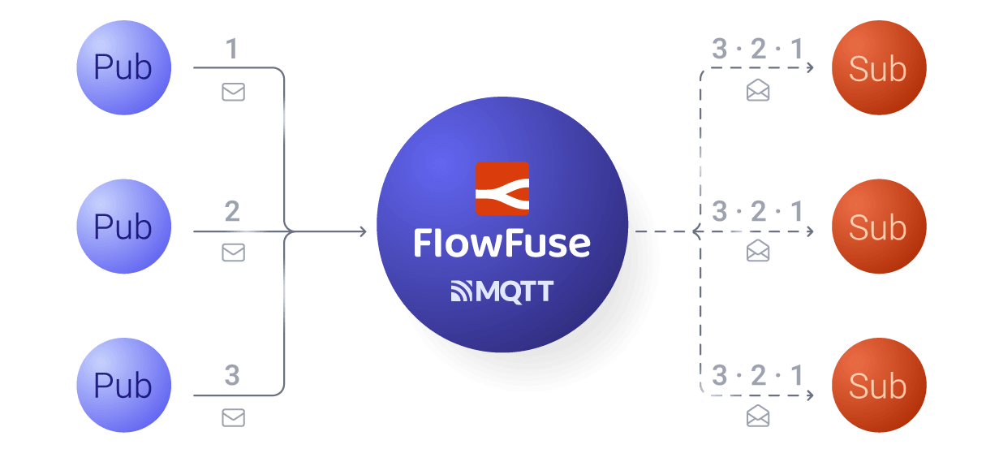

As the manufacturing industry evolves and becomes increasingly connected through the Industrial Internet of Things, the concept of a Unified Namespace (UNS) has emerged as a critical architecture for centralizing and organizing data. UNS serves as a central reference point where all operational data, from machines to the enterprise, can be accessed in a consistent and structured way. Over time, more and more manufacturers have adopted UNS to simplify data integration and improve real-time visibility across systems.

If you're unfamiliar with UNS, please read our [Introduction to Unified Namespace](/blog/2023/12/introduction-to-unified-namespace/) for a basic understanding of UNS.

<!--more-->

If you're familiar with or already using a UNS, you might be asking: **Why does a UNS need Pub/Sub**? Here, we’ll explore how combining the Pub/Sub model with a Unified Namespace can help manufacturers streamline data flow, reduce latency, and enable more responsive and scalable operations.

## What is Pub/Sub?

Before discussing why Publish-Subscribe (Pub/Sub) is essential for a UNS, let's first define the Pub/Sub model.

{data-zoomable}
_Publish Subscribe Model_

The Pub-Sub model is a way for systems to communicate where one component, called the publisher, sends messages to a central system ( Broker such [MQTT](/blog/2024/06/how-to-use-mqtt-in-node-red/), [RabitMQ](/node-red/protocol/amqp/), and [Kafka](/blog/2024/03/using-kafka-with-node-red/) ), and other components, called subscribers, receive those messages. The publisher doesn’t need to know who the subscribers are, and the subscribers don’t know who the publishers are. The central system, or broker, ensures the right messages go to the right subscribers based on their interests.

## Why Does a UNS Need Pub/Sub?

Now that you have a basic understanding of Pub/Sub, let’s dive into why this architecture is essential for a Unified Namespace.

### Decoupling Producers and Consumers with Flexible Communication

In a typical manufacturing setup, various systems and machines operate in silos. Sensors, control systems, maintenance platforms, and quality control software often struggle to share data. This leads to inefficiencies and delays in accessing the right data when it’s needed most. Traditional approaches—such as point-to-point integrations—often become cumbersome as more devices and systems are added to the factory floor.

This is where the Pub-Sub model shines. In a Pub-Sub system, publishers (such as IoT devices or machines) generate data, which is then distributed to subscribers (other systems, applications, or users). Crucially, these publishers and subscribers don’t need to know about each other directly. Instead, they rely on a central Namespace to act as a common point for all data streams.

By using Pub-Sub in UNS, industries can create a single reference point for all operational data, allowing systems to "subscribe" to specific data streams that are relevant to them, regardless of where that data originates. For example, a production line monitoring system can easily access data from temperature sensors, pressure gauges, and robotic arms across the factory floor without needing to integrate directly with each individual system.

The Pub-Sub model not only decouples producers from consumers, but it also offers flexible communication patterns to meet the diverse needs of modern manufacturing. Whether it’s one-to-one, one-to-many, or many-to-many, Pub-Sub allows data to flow effortlessly across systems without direct connections. This flexibility ensures that as your factory evolves, new devices and applications can easily integrate into the UNS. For example, a sensor can send data to multiple systems simultaneously, or multiple machines can share data with various subscribers, all without being tightly coupled.

### Event-driven and Asynchronous Communication

The Pub/Sub model is particularly well-suited for event-driven architectures, where systems react to changes in data rather than periodically polling for updates. This is important in environments where responsiveness is key—such as in predictive maintenance, supply chain optimization, or automated decision-making.

For instance, a predictive maintenance system can subscribe to real-time sensor data from machines in a UNS. When the system detects an anomaly (e.g., a machine vibration out of normal parameters), it can immediately trigger an alert or maintenance action. This type of asynchronous communication is more efficient and scalable than synchronous polling or direct communication between producers and consumers.

### Less Delay, More Efficiency

In industries where IIoT-enabled operations are prevalent, real-time data is essential for effective decision-making. Traditional systems often introduce delays due to multiple layers of data collection, storage, and processing. These delays can result in inefficiencies such as slow machine adjustments, missed production targets, or equipment failures.

The Pub-Sub model reduces latency by immediately pushing data to subscribers as soon as it’s available. There’s no need for systems to poll or wait for periodic updates. Instead, they can respond to real-time events as soon as they occur.

For instance, in a smart factory, if a machine’s temperature exceeds a threshold, a maintenance system could instantly react by scheduling a technician, triggering an alert, or even pausing operations. Without Pub-Sub, the system would have to rely on polling mechanisms, which are less efficient and often introduce unnecessary delays.

In real-time environments, these immediate actions can make the difference between preventing costly downtime or catching a problem too late.

### Easy to Scale as You Grow

Manufacturers are always expanding—whether by adding more machines to the production line, introducing new automation systems, or scaling up to handle more products or more data. Scaling traditional systems to keep up with this growth can be complex and costly, especially when new devices or technologies need to be integrated.

The beauty of Pub-Sub is that it scales effortlessly. When new machines or sensors are introduced, they simply publish their data to the namespace. No complex reconfiguration or integration is required. Similarly, if a new application needs to access this data, it can simply subscribe to the relevant streams.

For example, consider a car manufacturer adding new robotic arms to the production line. These robots can publish real-time performance data, such as arm movement speeds, energy consumption, and fault alerts, directly into the UNS. The factory’s existing data systems can then subscribe to this new data without requiring changes to the entire system, making integration quick and cost-effective.

This level of scalability helps manufacturers keep up with growth without worrying about complex system upgrades or slowdowns.

### Making Your Systems More Reliable

In manufacturing, system downtime is costly. However traditional, monolithic systems often rely on point-to-point connections, which can create vulnerabilities. If one part of the system goes down, it can bring down other systems or halt production entirely.

With a Pub-Sub architecture, this is less of a concern. If one publisher (like a sensor or machine) fails or goes offline, the rest of the systems can continue operating as normal. Other sensors or machines can continue to send their data, and subscribers can still receive real-time updates from other sources.

Consider a delivery system In a Point-to-Point setup, all vehicles send data directly to a central dispatch system. If the central dispatch system fails, data from all vehicles is lost. In a Pub-Sub setup, vehicles send their data to a central namespace instead of directly to the dispatch system. If the central dispatch system fails, it doesn’t result in data loss. Vehicles can still send their updates.

This decoupling of systems improves resilience, meaning that your factory can continue running smoothly even if individual components experience issues.

### Taking Action

As we've discussed, the Pub/Sub model is a game-changer for Unified Namespace architectures in the manufacturing industry. One of the most widely adopted protocols for implementing Pub/Sub is MQTT (Message Queuing Telemetry Transport). MQTT is known for its simplicity, efficiency, and low-bandwidth requirements, making it an ideal choice for Industrial applications.

To help you leverage the power of MQTT in your manufacturing operations along with Node-RED, Flowfuse offers a robust MQTT broker service. Now, Flowfuse will not only help you build, scale, and manage Node-RED solutions, collaborate across teams, and manage edge devices, but it will also simplify your integration of IoT data streams into your Unified Namespace. For more information on how our FlowFuse MQTT broker Service, read our [MQTT Broker Service announcement](/blog/2024/10/announcement-mqtt-broker/).

[Sign Up](https://app.flowfuse.com/account/create) now to streamline your IIoT operations from centralized place.

## Conclusion 

Integrating Pub/Sub with a Unified Namespace enhances manufacturing operations by enabling real-time data flow, reducing latency, and improving scalability. This combination ensures efficient, resilient, and future-ready systems, empowering manufacturers to stay competitive in the IIoT era.
