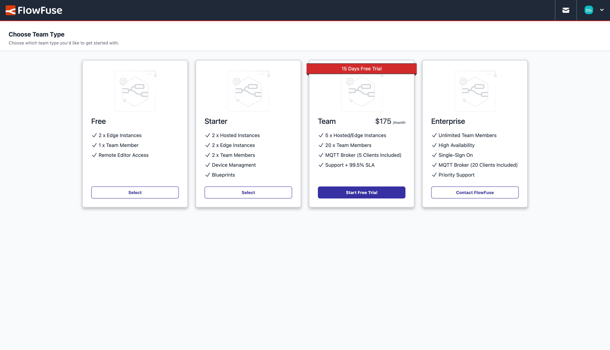
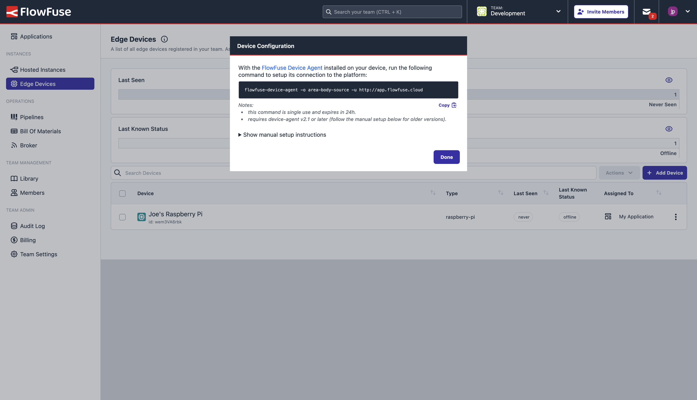

The new Free plan on FlowFuse Cloud will allow you to manage two remote instances using FlowFuse Device Agent, completely free of charge, forever! The new plan also provides Device Auto Snapshots, so any changes to your Node-RED flows running on your devices are backed up automatically.

<!--more-->

FlowFuse is an industrial data platform that enables engineers to build, manage, scale, and secure their Node-RED solutions for digitalizing processes and operations. More fundamentally though, it's a great platform to manage multiple instances of Node-RED.


<div class="blog-update-notes">
    <p>After careful consideration, we've decided to withdraw the free plan. You can still sign up for a 2 week trial to experience all that FlowFuse has to offer, or try out our Starter plan for $20/month.</p>
</div>

## What's Included?

Whether you're running multiple Node-RED instances at home for Home Automation, or running thousands of Node-RED instances in your factory, FlowFuse provides an easy-to-use, centralised view of your Node-RED instances, making it easy to manage and monitor them in one place.

In our new free tier on FlowFuse Cloud you get:

- 2 x Remote Node-RED Instances, managed through the FlowFuse [Device Agent](/docs/device-agent/quickstart)
- Version control for your Node-RED flows with FlowFuse's [Snapshots](/docs/user/snapshots/#introduction)
- Remote access to your Node-RED instances through FlowFuse Cloud, utilizing the Device Agent's [Developer Mode](/docs/device-agent/quickstart/#developer-mode)

## Getting Started

### Create Your Free Team

To create a free team, simply [sign up to FlowFuse Cloud](https://app.flowfuse.com/create).

Once you've filled in your details, you'll be presented with the option to choose your team type. Select the "Free" option, and you're good to go.

{data-zoomable}
_Screenshot showing the UI for selecting your Team's type, when onboarding through on FlowFuse Cloud._

<!--  -->

### Remote Instances

When you create a Free team, an Application is created for you automatically. Applications in FlowFuse help you organise and group your resources, from Instances to DevOps Pipelines and Snapshots for Version Control. Within your new application, you can "register" your first Remote Instance. 

A "Remote Instance" in FlowFuse is a just a term for an instance Node-RED, managed by FlowFuse, but running somewhere different from FlowFuse, e.g. on Edge hardware in a factory or your home. FlowFuse connects to these Remote Instances using the FlowFuse Device Agent, which is easy to setup and get running.

To get started with your Remote Instance, you need to complete two steps:

1. **Install Device Agent**: The FlowFuse Device Agent is installed onto the hardware where you want your Node-RED Instance to run.
2. **Add Your Remote Instance**: In the FlowFuse UI, add a new "Remote Instance", and connect to your hardware.

### Install Device Agent

Firstly, wherever you want your Node-RED to run, e.g. on a Raspberry Pi or your own Laptop, install the `flowfuse-device-agent` package:

#### Linux/MacOS

```bash
sudo npm install -g @flowfuse/device-agent
```

#### Windows

Issue the below command in an elevated command prompt:

```bash
npm install -g @flowfuse/device-agent
```

For alternative installation options and more details, please refer to our [documentation](/docs/device-agent/).

### Connect Your Hardware to FlowFuse

To connect your Device Agent, in the FlowFuse Platform, click on the "Remote Instances" option in the left-hand menu, and then click the "Add Remote Instance" button.

Fill out the name, device type and select the application you've just created, and you'll be presented with the following:

{data-zoomable}
_Screenshot showing the dialog with the one-time-code to connect your remote Node_RED instance to FlowFuse_

The command presented is used to connect your device to FlowFuse. Run this where you just installed the `@flowfuse/device-agent` package. This will connect your remote Node-RED instance to the FlowFuse platform.

The final step to take is to then start running the device agent, which you can do by simply calling:

```bash
flowfuse-device-agent
```

### Developing on your Remote Instance

FlowFuse offers remote development capabilities, allowing you to edit your Node-RED flows directly, and securely, from the FlowFuse Cloud platform. This is done through "Developer Mode". 

To get started with developing flows with your Remote Instance, simply select your newly created Instance in the FlowFuse UI, toggle on 'Developer Mode", and click "Open Editor"!

### Version Control with Snapshots

FlowFuse makes version control easy with [Snapshots](/docs/user/snapshots/#introduction). The new Free plan includes Device Auto Snapshots, which will automatically create a snapshot any time a flow is deployed to your device.

## What Else is New?

In addition to the Free plan, we've also added two new views to the FlowFuse platform:

- **Pipelines**: This view provides a way to manage all of your DevOps Pipelines, making it even easier to manage your development, testing, staging and production environments.
- **Bill of Materials**: This view provides a way to manage all of your Node-RED dependencies, making it easy to see what versions of nodes are being used across all of your Node-RED instances.

For a full list of everything that went into our 2.12 release, you can check out the [release notes](https://github.com/FlowFuse/flowfuse/releases/tag/v2.12.0).

We're always working to enhance your experience with FlowFuse. We're always interested in your thoughts about FlowFuse too. Your feedback is crucial to us, and we'd love to hear about your experiences with the new features and improvements. Please share your thoughts, suggestions, or report any [issues on GitHub](https://github.com/FlowFuse/flowfuse/issues/new/choose). 

Together, we can make FlowFuse better with each release!

## Try FlowFuse

### Self-Hosted

We're confident you can have self managed FlowFuse running locally in under 30 minutes. You can install FlowFuse using [Docker](/docs/install/docker/) or [Kubernetes](/docs/install/kubernetes/).

### FlowFuse Cloud

The quickest and easiest way to get started with FlowFuse is on our own hosted instance, FlowFuse Cloud.

[Get started for free]() now, and you'll have your own Node-RED instances running in the Cloud within minutes.
