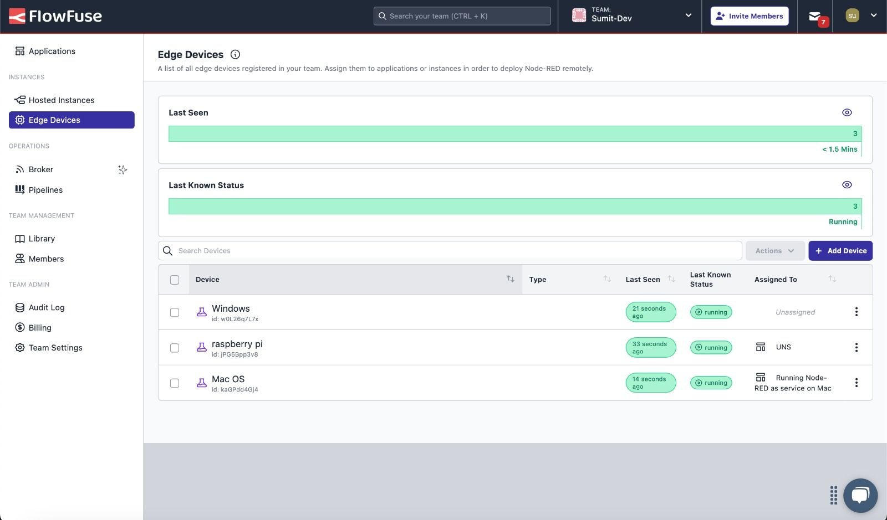
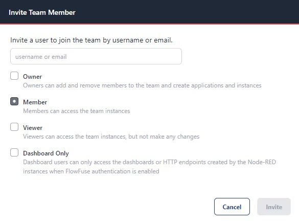
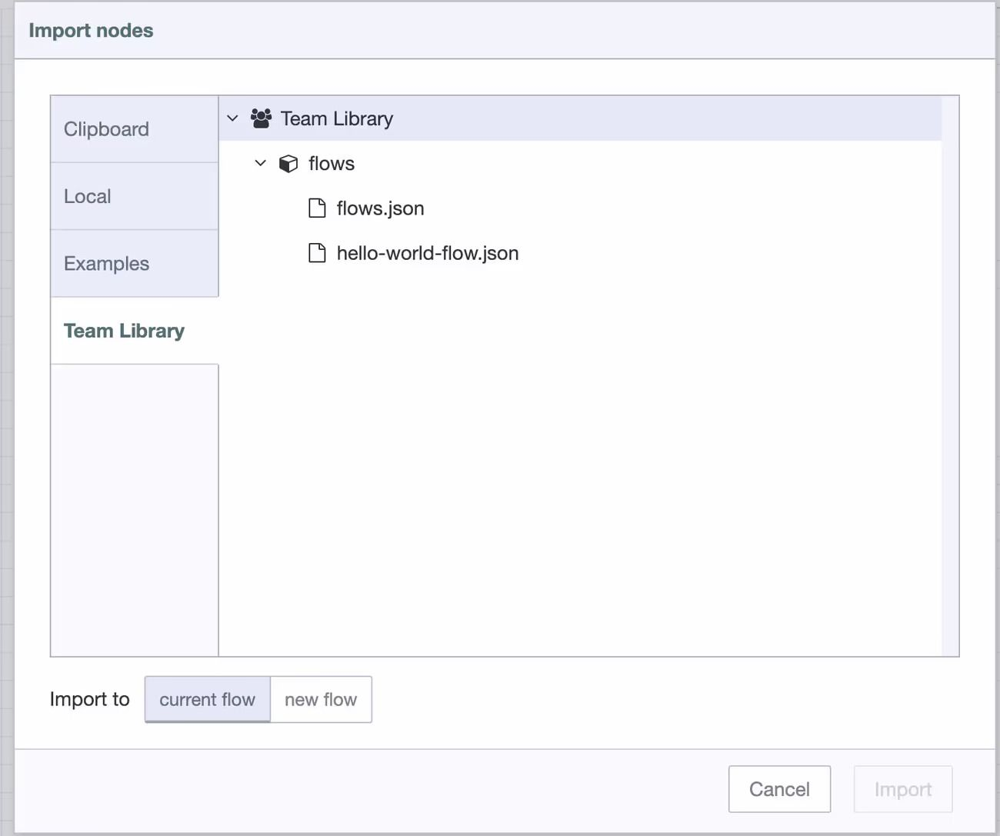

A few weeks ago, we discussed how [FlowFuse centralizes edge device and Node-RED management](/blog/2024/10/managing-node-red-instances-in-centralize-platfrom/), as well as its [security features](/blog/2024/10/exploring-flowfuse-security-features/). Now, we're focusing on another key benefit of FlowFuse—making collaboration easier for teams in industrial environments.

<!--more-->

As more manufacturing companies use FlowFuse for edge device management, data pipelines, and bridging IT-OT systems, the platform is becoming a key tool for handling complex data operations. Collaboration is critical in manufacturing environments with thousands of devices and data flows. FlowFuse accelerates industrial data operations by simplifying real-time collaboration while ensuring security and scalability.

Now, let’s look at how FlowFuse makes collaboration effortless. With features like centralized management, real-time updates, and easy sharing, FlowFuse helps teams stay on the same page—whether working on the same flow or across multiple projects. The platform eliminates the usual pain points of collaboration, allowing teams to quickly deploy, modify, and scale Node-RED solutions confidently while maintaining control and security.

## Laying the Foundation for Better Collaboration with Centralization

Effective collaboration starts with everyone having access to the same interface and information. When team members work with different versions of flows or data, things can easily get out of sync, making collaboration difficult.

This is exactly why centralized management is so crucial. With FlowFuse, everything—your Node-RED Instances, edge devices, settings, and data—is in one place. Everyone on your team sees the same interface, accesses the same up-to-date information, and works from the same set of resources. There’s no more hunting for the correct version or trying to sync up tools.

Everything in one place means fewer mistakes, fewer mix-ups, and much easier collaboration. Whether you're working in a single instance or managing a whole network of edge devices, FlowFuse makes it easy to stay aligned. You can move quickly and confidently without worrying about missing something important.

{data-zoomable}
_A centralized view of applications with Node-RED instances organized under each application for easier management._

{data-zoomable}
_A list of all Node-RED instances is displayed centrally, allowing team members to manage and access them easily._

{data-zoomable}
_A centralized view of edge devices, providing streamlined management for all devices within the platform._

In short, centralization makes everything simpler. It’s the backbone of effective teamwork, ensuring everyone works from the same starting point. With FlowFuse, you don't have to worry about syncing — everything's already in sync for you.

If you want to dive deeper into how FlowFuse centralizes things, check out this article: [Managing Node-RED Instances in a Centralized Platform](/blog/2024/10/managing-node-red-instances-in-centralize-platfrom/).

## Creating and Managing Teams

Collaboration begins with the right team setup. In FlowFuse, you can quickly [create a team](/docs/user/team/#creating-a-new-team) and assign it a name. Once your team is set up, you can easily [invite members to join](/docs/user/team/#adding-team-members). As mentioned earlier, all your Node-RED instances, edge devices, configurations, settings, and data are organized and centralized within that team.

However, simply creating a team and inviting members isn’t enough. Not all team members need access to all information, features, or controls. It’s essential to ensure that the right people have the right level of access to do their work effectively. Providing excessive access to members who don’t require it or who might lack the necessary expertise can lead to accidental changes or mistakes.

{data-zoomable}
_A centralized view of edge devices, providing streamlined management for all devices within the platform._

{data-zoomable}
_A comprehensive list of team members with assigned roles and permissions_

This is where [FlowFuse’s Role-Based Access Control (RBAC)](/blog/2024/04/role-based-access-control-rbac-for-node-red-with-flowfuse/) comes in. When inviting new team members, you can assign them specific roles, each with different permissions and access scopes. This ensures that each team member has the appropriate level of access based on their role, reducing the risk of unintended changes or disruptions.

You can later update roles to adjust permissions as your team, and projects evolve if needed. FlowFuse’s RBAC helps maintain control and security while empowering each team member to contribute effectively to the project.

## Real-Time Collaboration and Monitoring

Once team members have been invited, Node-RED instances have been created, and edge devices have been added by the team owner, FlowFuse's real-time collaboration capabilities come into play. Team members, whether they have owner or member roles, can work on the same project simultaneously. They can update flows, deploy them, and monitor real-time progress.

With FlowFuse, tracking who is working on which project and at what stage is easy. The platform lets you see who has opened the Node-RED editor you are working on, which flow they are working on, and even which specific node they are interacting with. This visibility ensures that team members are always aligned and that collaboration happens seamlessly without stepping on each other’s toes.

{data-zoomable}
_Multiple users collaborate on the same Node-RED flow in real-time within FlowFuse._

For instance, if two members modify different parts of the same flow, they can do so without interrupting each other’s work. They’ll both be able to see each other's updates in real-time, ensuring the project moves forward smoothly. This collaborative approach enhances teamwork and helps avoid mistakes, as everyone has the information they need when needed.

In addition, FlowFuse’s real-time monitoring features allow you to track the status of edge devices, Node-RED instances, and overall system health. You can also monitor Node-RED logs for troubleshooting, ensuring no issue slips through the cracks as your team works together efficiently.

## Version Controlling

In any collaborative environment, accidental changes or conflicts are inevitable, especially when multiple team members are working on the same project. While collaboration is essential for progress, the ability to track changes, roll back versions, and understand who made what updates is critical for maintaining control and continuity.

FlowFuse provides robust version control features that make it easier to manage changes across your Node-RED flows. Whether you revert to a previous version of a flow, roll back accidental changes, or track updates over time, FlowFuse ensures that you never lose critical work.

To view the version history, navigate to your Node-RED Instance view and switch to the 'Version History' tab. Here, you’ll find two key sections:

- Timeline: This section displays a timeline of who deployed, what is updated, and for which flow and when. Each deployment automatically creates a snapshot of your Node-RED instance. You can easily roll back to any previous version by clicking the three-dot icon on the right and selecting Restore Snapshot. You also have the option to compare the current version of your Node-RED instance with previous snapshots, download it, and more.

{data-zoomable}
_A version history timeline shows deployment and changes made in flows, making it easy to track updates and revert to previous versions._

Snapshots: The second tab, Snapshots, provides a clean, list-style interface that shows all available snapshots. Unlike the timeline view, this section focuses solely on snapshots without the detailed deployment history. You can upload or download snapshots and even create a snapshot of your instance at any time by clicking the Create Snapshot button.

{data-zoomable}
_The snapshots list interface in FlowFuse provides an organized view of all available snapshots for easy restoration or comparison._

This version control functionality allows you to manage and recover Node-RED instances seamlessly, ensuring that your team can collaborate effectively without the risk of losing or overwriting important work.

## Shared Flow Library

When working on projects, it's common to develop reusable flows that can save time and effort for the entire team. For example, you might create a flow to calculate Overall Equipment Efficiency (OEE) or other valuable flows that can be reused across multiple projects.

FlowFuse makes this process easy with the [Shared Flow Library](/docs/user/shared-library/). This feature allows owners and members to export significant flows and store them in a shared library, making them available to all team members. Once a flow is added to the library, anyone within the same team can import and use it in any Node-RED instance whenever needed.

{data-zoomable}
_Shared Flow Library in FlowFuse displays a list of reusable flows that team members can import and use across multiple Node-RED instances._

This shared approach streamlines development, eliminates redundant work, and ensures project consistency, ultimately saving time. Whether it’s a reusable function, a typical configuration, or a flow for recurring tasks, FlowFuse’s Shared Flow Library enables your team to easily access and integrate these resources, boosting productivity and fostering better collaboration.

## Audit Logs

Accountability is essential when multiple team members collaborate on complex industrial projects. FlowFuse offers comprehensive Audit Logs to track every action taken within the platform. This feature provides a detailed record of who made which changes, when those changes were made, and the specifics of each action.

{data-zoomable}
_Audit logs in FlowFuse, tracking every action taken within the platform to ensure accountability and transparency among team members._

With Audit Logs, you can easily trace who deployed a flow, modified settings, or interacted with assets. This transparency ensures that all team members are accountable for their actions, enhancing security and reducing the risk of errors or unauthorized changes.

Audit Logs are especially valuable for troubleshooting. They allow you to pinpoint when issues arise and identify who made changes that could have contributed to the problem, providing crucial context for resolution.

For more information on using Audit Logs effectively, refer to our documentation on [Audit Logs in FlowFuse](/docs/user/logs/#audit-log).

These are just a few of the features we’ve covered. FlowFuse has many more tools and capabilities that can further enhance collaboration, streamline workflows, and optimize your industrial operations.

In summary, FlowFuse is a platform that streamlines collaboration on Node-RED projects. Centralizing your Node-RED instances, devices, and data ensures that everyone on your team is aligned and has access to the same resources. Features like real-time updates, role-based access, version control, and audit logs make collaborating easier, staying secure, and avoiding errors easier. Whether you're managing small flows or large-scale industrial systems, FlowFuse helps your team work together more efficiently and effectively.

With FlowFuse, factories can achieve faster, safer, and more scalable collaboration on data pipelines, edge device management, and IT-OT integration.

*Ready to Improve Your Manufacturing Team’s Collaboration?*

Start using FlowFuse today to streamline your industrial projects, enhance teamwork, and securely manage your Node-RED instances. 

[Talk to experts](/book-demo/?utm_campaign=60167396-BCTA&utm_source=blog&utm_medium=cta&utm_term=high_intent&utm_content=Streamlining%20Node-RED%20Collaboration%20with%20FlowFuse) and learn more about how FlowFuse can optimize your operations.

## Up Next

Explore more resources and deepen your understanding of FlowFuse with these articles:

- **[Managing Node-RED Instances in a Centralized Platform](/blog/2024/10/managing-node-red-instances-in-centralize-platfrom/)**  
  Learn how to effectively manage Node-RED instances in a centralized environment with FlowFuse, simplifying deployment and ensuring scalability.

- **[Exploring FlowFuse Security Features](/blog/2024/10/exploring-flowfuse-security-features/)**  
  Discover the security tools and features built into FlowFuse to help protect your industrial data and keep your systems secure.

- **[Building on FlowFuse: Working with Devices](/blog/2024/07/building-on-flowfuse-devices/)**  
  Dive into how FlowFuse supports device management, enabling you to build, deploy, and monitor edge devices more efficiently.
