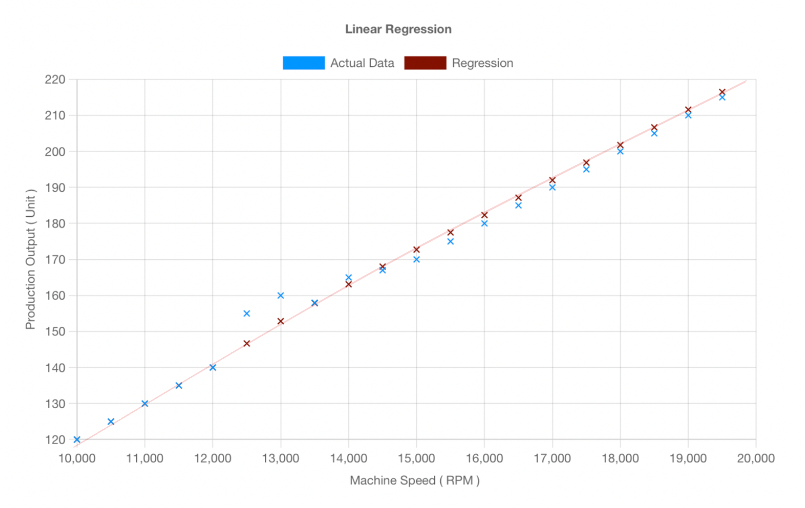

Predicting how your factory will perform tomorrow, next week, or next month doesn’t have to be a challenge. **Linear regression** helps by identifying patterns in your existing data to forecast things like production levels, equipment maintenance needs, and more.

<!--more-->

With **Flowfuse's low-code platform**, applying linear regression models becomes simple. The real value comes from the **Flowfuse dashboard**, which visualizes these predictions in real-time, enabling you to make quick, data-driven decisions.

In this post, we’ll explain how linear regression works, how to apply it effectively, and how to visualize the results using **Flowfuse D2.0** for improved operational insights.

## What is Linear Regression?

Linear regression is a statistical method used to understand the relationship between two variables. In manufacturing, this technique helps you predict one variable based on the value of another. For example, you might want to know how changing machine speed impacts production output. Linear regression helps you quantify this relationship.

**Here’s how it works**: You gather data from past production cycles, such as machine speed and production output, and use it to fit a linear model. The linear model will show how the **dependent variable** (e.g., output) changes in response to the **independent variable** (e.g., machine speed).

### The Formula

The formula for linear regression is:

**Y = β₀ + β₁ * X**

Where:
- **Y** is the **dependent variable** (also called the "response" or "outcome"), the value you're trying to predict (e.g., production output).
- **X** is the **independent variable** (also called the "predictor" or "explanatory variable"), the factor that influences the dependent variable (e.g., machine speed).
- **β₀** is the **intercept** (also called the "constant"), representing the value of **Y** when **X = 0**. In simple terms, this is the baseline level of output when machine speed is zero.
- **β₁** is the **slope** (also called the "coefficient" or "regression coefficient"), indicating how much **Y** changes when **X** increases by one unit. This tells you how sensitive the output is to changes in machine speed.

In simple terms, this equation tells you that **Y** (production output) changes in a predictable way as **X** (machine speed) changes. The values of **β₀** and **β₁** describe the exact relationship between the two variables. For example, if **β₁ = 2**, it means that for every 1 RPM increase in machine speed, production output increases by 2 units.

With this model, you can make data-driven predictions and decisions. For instance, if you know how machine speed affects output, you can adjust the machine speed to achieve the desired production level.

## Building Your Predictive Dashboard with Flowfuse

Now that you understand linear regression, it’s time to build a predictive dashboard with Flowfuse D2.0. The Flowfuse platform allows you to easily apply regression models and visualize predictions, giving you real-time insights into your manufacturing operations.

In this section, we’ll walk you through how to build a predictive dashboard using a machine speed vs. production output dataset.

For practice, we’ll use the following dataset based on machine speed (RPM) and production output (units). This will allow us to predict how adjusting the machine speed will affect production output.

| Machine Speed (RPM) | Production Output (Units) |
| ------------------- | ------------------------- |
| 10,000              | 120                       |
| 10,500              | 125                       |
| 11,000              | 130                       |
| 11,500              | 135                       |
| 12,000              | 140                       |
| 12,500              | 155                       |
| 13,000              | 160                       |
| 13,500              | 158                       |
| 14,000              | 165                       |
| 14,500              | 167                       |
| 15,000              | 170                       |
| 15,500              | 175                       |
| 16,000              | 180                       |
| 16,500              | 185                       |
| 17,000              | 190                       |
| 17,500              | 195                       |
| 18,000              | 200                       |
| 18,500              | 205                       |
| 19,000              | 210                       |
| 19,500              | 215                       |

### **Prerequisites**

Before diving into building your predictive dashboard with Flowfuse D2.0, make sure you have the following:
- **Flowfuse Account**: A FlowFuse account, which enables you to create and deploy Node-RED instances securely on the cloud with a single click, collaborate on projects with your team, manage and monitor edge devices centrally, handle data pipelines efficiently. If you haven’t signed up for Flowfuse yet, you can create an account [here](https://app.flowfuse.com/account/create).
- **Flowfuse Dashboard Package**: Ensure you have the **Flowfuse Dashboard package** (`@flowfuse/node-red-dashboard`) installed. This package is essential for building and visualizing dashboards on the platform.
- **Linear Regression Calculation Node**: You will need to install the **Linear Regression Node** (`node-red-contrib-regression`) to perform the regression calculations in your Flowfuse environment.

### **Step 1: Load Data and Apply the Linear Regression Model**

The first step is to load the historical data you’ve collected, including both dependent and independent variables. In our example, we will inject this data in JSON format. You could also add a flow that retrieves actual historical data from a database or file.

1. Drag the Inject node onto the canvas.
2. Drag the Change node onto the canvas, and configure it to set `msg.payload` to the following JSON. This represents the dataset for machine speed vs. production output:

```json
[
    {
        "x": 10000,
        "y": 120
    },
    {
        "x": 10500,
        "y": 125
    },
    {
        "x": 11000,
        "y": 130
    },
    {
        "x": 11500,
        "y": 135
    },
    {
        "x": 12000,
        "y": 140
    },
    {
        "x": 12500,
        "y": 155
    },
    {
        "x": 13000,
        "y": 160
    },
    {
        "x": 13500,
        "y": 158
    },
    {
        "x": 14000,
        "y": 165
    },
    {
        "x": 14500,
        "y": 167
    },
    {
        "x": 15000,
        "y": 170
    },
    {
        "x": 15500,
        "y": 175
    },
    {
        "x": 16000,
        "y": 180
    },
    {
        "x": 16500,
        "y": 185
    },
    {
        "x": 17000,
        "y": 190
    },
    {
        "x": 17500,
        "y": 195
    },
    {
        "x": 18000,
        "y": 200
    },
    {
        "x": 18500,
        "y": 205
    },
    {
        "x": 19000,
        "y": 210
    },
    {
        "x": 19500,
        "y": 215
    }
]
```

3. Drag the Split node onto the canvas; we need to split the JSON into single messages as our regression node works on each separate message.
4. Drag the Change node onto the canvas, double-click on it, set `msg.data` to `msg.payload`, as later we need to draw the regression line as well as plot the actual data points so setting payload to `data` will ensure it doesn’t get overridden by the regression node.
5. Drag the Regression node onto the canvas. This node is where we apply the linear regression model. In this node, we'll specify the parameters to configure the regression calculation:
   - **Regression Type**: Set this to "linear", which tells the Regression node that we are using a simple linear regression model. This model fits a straight line to the data points (i.e., it tries to find the best-fitting straight line to describe the relationship between x and y).
   - **Polynomial Order**: Set this to 1, which indicates that we want a linear regression (as opposed to higher-order polynomial regressions).
   - **Precision**: Set this to 2, meaning that the output values for the slope and intercept will be rounded to two decimal places. This makes the results easier to interpret.
   - **Data Size**: Set this to 10 (or 0 for unlimited), which specifies how many data points should be used in the regression calculation. In our case, we'll use all 10 data points, but setting it to 0 allows for more flexible usage with larger datasets.
   - **X Input Property**: Set this to `msg.payload.x`, which tells the Regression node that the machine speed (independent variable) will be found in `msg.payload.x`.
   - **Y Input Property**: Set this to `msg.payload.y`, which tells the Regression node that the production output (dependent variable) will be found in `msg.payload.y`.
   - **Y Output Property**: Set this to `msg.payload.Y`, which will allow the regression node to output the predicted values for y based on the model.
   - **Function Output Property**: Set this to `msg.payload`, which will allow the regression node to output the model’s function (i.e., the linear equation used for predictions).

6. Drag the Change node onto the canvas, set `msg.payload.x` to `msg.data.x`, `msg.payload.y` to `msg.payload.Y`, and `msg.topic` to `'Regression'`.
7. Finally, connect the Inject node to the Change node, the Change node to the Split node, and the Split node to the Regression node, then the Regression node to the Switch node, and the Switch node to the Change node.
8. Connect the Debug node to the output of the Regression node, then click deploy.

Once you have deployed the flow, test the output by clicking the inject button. After clicking the inject button, you will receive an output message for each of the data points you fed. For example, let's look at the first message printed on the debug panel. It should look something like this:

```json
{
  "equation": [0, 120],
  "r2": null,
  "string": "y = 0x + 120",
  "Y": 120
}
```

The output message shows the regression line equation y = 0x + 120, where 0 is the slope (indicating no change in output with speed) and 120 is the intercept (predicted output at speed 0). The R² value is null because there’s not enough data to calculate it. The Y value (120) is the predicted output, which matches the actual value. The string "y = 0x + 120" represents the equation, meaning the output stays at 120 units regardless of the machine speed. In future messages, you’ll see the calculated R² value, the changing regression equation, and the updated predicted output (Y). This node makes it easy to perform and visualize linear regression.

### **Step 2: Visualize the Predictions**

Now it's time to visualize the linear regression chart on the dashboard. Follow these steps to set up the visualization:

1. Drag the `ui-chart` node onto the canvas.
2. Double-click on it and add a new group. Select the group where you want to render it. Set the chart type to "line", interpolation to "linear", and action to "append". In the axis configuration, set the x-axis type to "scatter", x-axis label to "Machine Speed", and y-axis label to "Production Output". Then, set the Series to `msg.topic`, x to `msg.payload.x`, and y to `msg.payload.y`. Make sure to choose the colors for your series.
3. Connect the input of the `ui-chart` widget to the Change node connected to both the Regression node, as well as the Change node connected to the Split node. One will plot the actual data points, and the other will draw the regression line.
4. Deploy the flow.

 Below is the complete flow build throughout the blog:


[{"id":"FFF0000000000001","type":"tab","label":"FlowFuse Device Flow","disabled":false,"info":""},{"id":"fcc37659ba227f0b","type":"inject","z":"FFF0000000000001","name":"Inject Historical Data","props":[{"p":"payload"}],"repeat":"","crontab":"","once":false,"onceDelay":0.1,"topic":"","payload":"[   {\"x\":10000,\"y\":120},   {\"x\":10500,\"y\":125},   {\"x\":11000,\"y\":130},   {\"x\":11500,\"y\":135},   {\"x\":12000,\"y\":140},   {\"x\":12500,\"y\":155},   {\"x\":13000,\"y\":160},   {\"x\":13500,\"y\":158},   {\"x\":14000,\"y\":165},   {\"x\":14500,\"y\":167},   {\"x\":15000,\"y\":170},   {\"x\":15500,\"y\":175},   {\"x\":16000,\"y\":180},   {\"x\":16500,\"y\":185},   {\"x\":17000,\"y\":190},   {\"x\":17500,\"y\":195},   {\"x\":18000,\"y\":200},   {\"x\":18500,\"y\":205},   {\"x\":19000,\"y\":210},   {\"x\":19500,\"y\":215} ]","payloadType":"json","x":110,"y":220,"wires":[["ccb0de1a66a22773"]]},{"id":"ccb0de1a66a22773","type":"split","z":"FFF0000000000001","name":"","splt":"\\n","spltType":"str","arraySplt":1,"arraySpltType":"len","stream":true,"addname":"","property":"payload","x":270,"y":220,"wires":[["b0b5f9c291e87839","295a462e15aa4f02"]]},{"id":"dba70b7f73d3077c","type":"regression","z":"FFF0000000000001","name":"","dataSetSize":"0","regressionType":"linear","polynomialOrder":"1","precision":2,"xInputField":"payload.x","xInputFieldType":"msg","yInputField":"payload.y","yInputFieldType":"msg","yOutputField":"payload.Y","yOutputFieldType":"msg","functionOutputField":"payload","functionOutputFieldType":"msg","resultOnly":false,"x":590,"y":180,"wires":[["8493799eb3bf8408"]]},{"id":"b0b5f9c291e87839","type":"change","z":"FFF0000000000001","name":"","rules":[{"t":"set","p":"data","pt":"msg","to":"payload","tot":"msg"}],"action":"","property":"","from":"","to":"","reg":false,"x":410,"y":180,"wires":[["dba70b7f73d3077c"]]},{"id":"295a462e15aa4f02","type":"change","z":"FFF0000000000001","name":"Set series name for actual data","rules":[{"t":"set","p":"topic","pt":"msg","to":"Actual Data","tot":"str"}],"action":"","property":"","from":"","to":"","reg":false,"x":470,"y":280,"wires":[["a459257742deaf04"]]},{"id":"a459257742deaf04","type":"ui-chart","z":"FFF0000000000001","group":"26fe6998510b4120","name":"Linear Regression","label":"Linear Regression","order":1,"chartType":"scatter","category":"topic","categoryType":"msg","xAxisLabel":"Machine Speed ( RPM ) ","xAxisProperty":"payload.x","xAxisPropertyType":"msg","xAxisType":"linear","xAxisFormat":"","xAxisFormatType":"auto","xmin":"","xmax":"","yAxisLabel":"Production Output ( Unit )","yAxisProperty":"payload.y","yAxisPropertyType":"msg","ymin":"","ymax":"","bins":10,"action":"append","stackSeries":false,"pointShape":"crossRot","pointRadius":4,"showLegend":true,"removeOlder":1,"removeOlderUnit":"3600","removeOlderPoints":"","colors":["#0095FF","#831100","#FF7F0E","#2CA02C","#A347E1","#D62728","#FF9896","#9467BD","#C5B0D5"],"textColor":["#666666"],"textColorDefault":true,"gridColor":["#E5E5E5"],"gridColorDefault":true,"width":"9","height":8,"className":"","interpolation":"linear","x":930,"y":280,"wires":[[]]},{"id":"8493799eb3bf8408","type":"change","z":"FFF0000000000001","name":"","rules":[{"t":"set","p":"payload.x","pt":"msg","to":"data.x","tot":"msg"},{"t":"set","p":"payload.y","pt":"msg","to":"payload.Y","tot":"msg"},{"t":"set","p":"topic","pt":"msg","to":"Regression","tot":"str"}],"action":"","property":"","from":"","to":"","reg":false,"x":820,"y":180,"wires":[["a459257742deaf04"]]},{"id":"26fe6998510b4120","type":"ui-group","name":"Group 1","page":"df6e6b75ff7765cc","width":"9","height":"1","order":2,"showTitle":false,"className":"","visible":"true","disabled":"false","groupType":"default"},{"id":"df6e6b75ff7765cc","type":"ui-page","name":"Page 1","ui":"61d647e1b382d246","path":"/page1","icon":"home","layout":"grid","theme":"50da5c3a64220cf8","breakpoints":[{"name":"Default","px":0,"cols":3},{"name":"Tablet","px":576,"cols":6},{"name":"Small Desktop","px":768,"cols":9},{"name":"Desktop","px":1024,"cols":12}],"order":1,"className":"","visible":"true","disabled":"false"},{"id":"61d647e1b382d246","type":"ui-base","name":"My Dashboard","path":"/dashboard","appIcon":"","includeClientData":true,"acceptsClientConfig":["ui-notification","ui-control"],"showPathInSidebar":false,"showPageTitle":true,"navigationStyle":"default","titleBarStyle":"default"},{"id":"50da5c3a64220cf8","type":"ui-theme","name":"Default Theme","colors":{"surface":"#FFFFFF","primary":"#0094CE","bgPage":"#EEEEEE","groupBg":"#FFFFFF","groupOutline":"#CCCCCC"},"sizes":{"density":"default","pagePadding":"12px","groupGap":"12px","groupBorderRadius":"4px","widgetGap":"12px"}}]


### **What the Chart Tells Us About Production**

{data-zoomable}
_near regression analysis chart showing actual data along with the regression line._

This chart shows how machine speed (RPM) affects production output. It has two key parts: the blue dots and the red line.

The **blue dots** represent actual production data. Each dot shows how many units were produced at a specific machine speed. For example, at 10,000 RPM, the machine produced 120 units, and at 19,500 RPM, it produced 255 units. These dots reflect the real data from the production process.

The **red line** represents the predicted relationship between machine speed and output. It shows the general trend: as machine speed increases, production output tends to increase as well. This positive slope indicates that higher speeds generally lead to more units being produced.

However, not all blue dots are close to the red line. Some dots, like those at 12,500 RPM and 13,000 RPM, are higher than the predicted output. At 12,500 RPM, the machine produced 155 units, which is more than what the red line predicted. Similarly, at 13,000 RPM, the output was 160 units, also above the prediction. These points suggest that the machine might have been running at peak efficiency or that other factors, such as better materials or optimal conditions, boosted production.

This chart is useful for predicting production output at various speeds. For example, at 13,000 RPM, the red line predicts 160 units. If the actual output is higher or lower than this prediction, it may indicate something unusual, such as an improvement in efficiency or unexpected changes in conditions.

Overall, the chart helps you understand the relationship between machine speed and output, make predictions, and identify any factors that might be causing production to exceed or fall short of expectations. It’s a useful tool for making data-driven decisions and optimizing production.

## **Final Thoughts**

Linear regression helps predict outcomes based on past data, and with Flowfuse D2.0, you can easily visualize these predictions in real-time. By building predictive dashboards, you gain insights into your manufacturing processes, allowing you to make smarter decisions and improve efficiency.

With the data and regression analysis displayed on the dashboard, you can monitor trends and adjust operations based on accurate predictions, leading to more efficient production and better decision-making.
