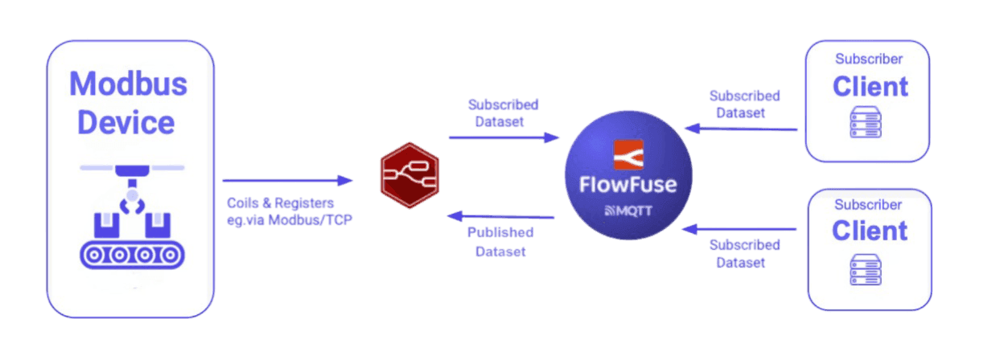
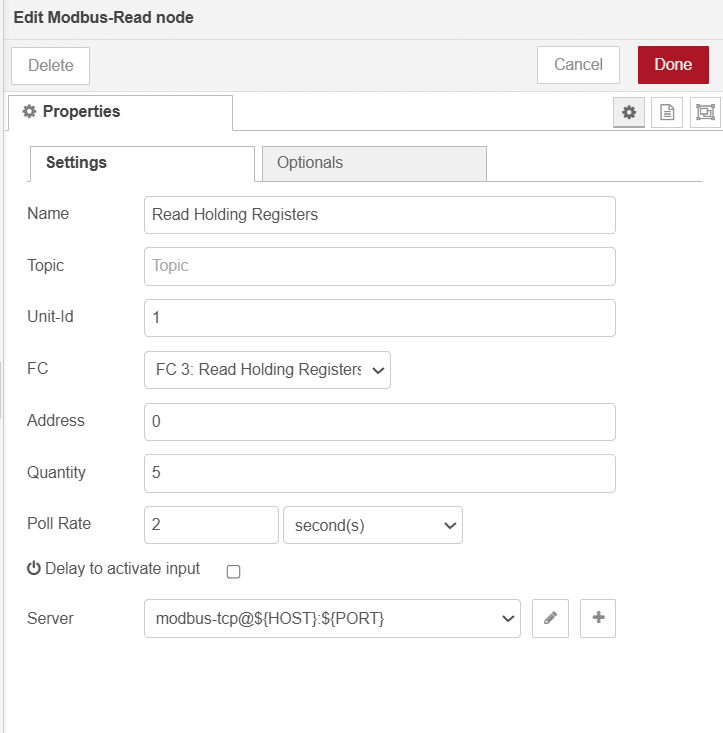
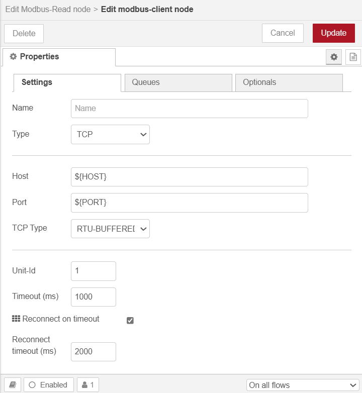
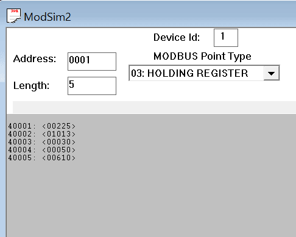
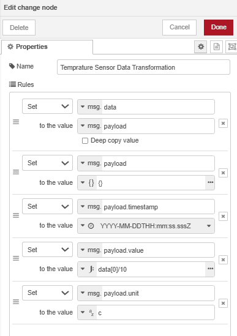
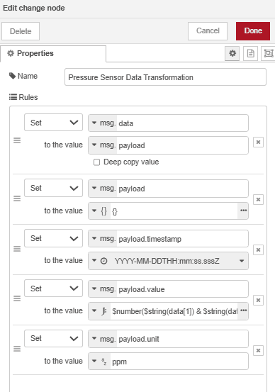
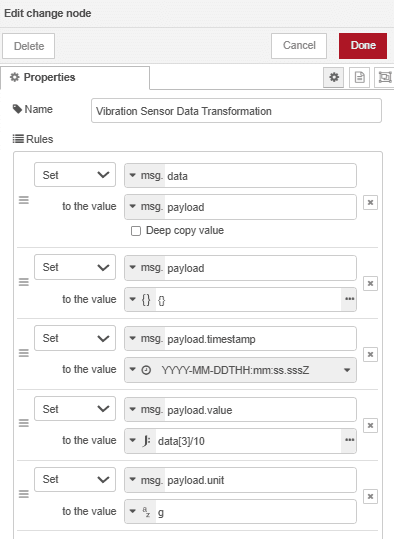
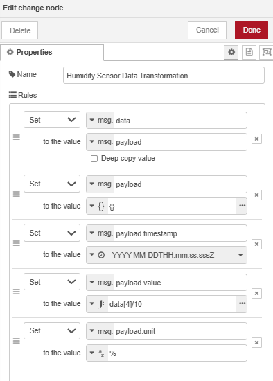
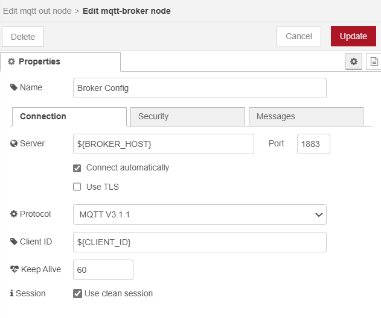
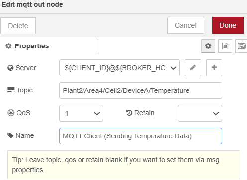

Industrial facilities face a common challenge: legacy Modbus equipment generates valuable operational data, but that data remains locked in local control systems. Getting this information into cloud platforms, dashboards, or analytics tools requires a translation layer.

<!--more-->

This is the protocol mismatch problem. Modbus operates as a request-response protocol where a master device polls slaves for data. MQTT uses publish-subscribe messaging where devices push data to a broker, and any interested system can subscribe. These are fundamentally different communication patterns that don't interoperate directly.

The solution is protocol bridging. You need an intermediary that speaks both languages: reading data from Modbus devices on one side and publishing it as MQTT messages on the other. This guide shows you how to build that bridge using Node-RED and FlowFuse.

## Why Bridge Modbus to MQTT?

Modbus handles local device communication effectively. A PLC polls sensors, reads holding registers, writes control signals—standard automation workflows that have proven reliable for decades. The limitation appears when you need that same data elsewhere: in a cloud database, on a remote dashboard, or feeding a predictive maintenance algorithm.

The constraint is architectural. Modbus requires a master-slave relationship. One device initiates requests, others respond. You can't have multiple systems independently accessing the same Modbus device without coordination, and you can't push data—only pull it through polling. This creates the operational technology (OT) and information technology (IT) integration gap.

MQTT removes these constraints through its broker-based architecture. Devices publish data once to the broker. Any authorized system—whether on-premises or cloud-based—subscribes to relevant topics and receives updates. No polling loops, no master-slave coordination, no point-to-point connections to manage.

This is where the [Unified Namespace](/blog/2024/11/building-uns-with-flowfuse/) concept becomes practical. Instead of data scattered across disconnected Modbus networks, PLCs, and SCADA systems, you establish a single MQTT broker as the central data hub. All operational data flows through standardized topics organized by facility hierarchy: `enterprise/site/area/line/equipment`. Applications consume what they need through subscriptions.

Consider a production line running legacy Modbus equipment—VFDs controlling motor speeds, pressure transmitters monitoring hydraulic systems, temperature sensors on critical bearings. Historically, this data stays within the local control network. Bridge it to MQTT, and suddenly the maintenance team accesses real-time vibration data on their tablets, the operations dashboard displays line efficiency metrics, and the cloud analytics platform builds predictive models from historical trends—all from the same data stream.

FlowFuse provides both the Node-RED runtime for building these bridges and the MQTT broker infrastructure for the Unified Namespace. The integration is straightforward: Node-RED flows poll Modbus devices and publish to FlowFuse's MQTT broker, where any authorized application can subscribe.

## How to Bridge Modbus to MQTT

Let's look at the steps to bridge Modbus data to MQTT using FlowFuse, leveraging Node-RED's capabilities. The process involves retrieving data from a Modbus device (For Practical example, we are using OpenSim to simulate Modbus data), transforming and processing the data (e.g., scaling raw sensor data into human-readable formats), and sending it to your Unified Namespace.

{data-zoomable}
_Bridging Modbus Data to MQTT using Node-RED_

## Prerequisites

Before you start, make sure you have:

- **Modbus data source**: An actual Modbus device or a simulator like ModSim.
- **Node-RED Instance**: The easiest and production-ready option is FlowFuse—run Node-RED on edge devices, manage and build flows remotely with your team. Deploy, scale, and secure hundreds or thousands of instances with built-in team collaboration, version control, and production-grade features. [Sign up here](https://app.flowfuse.com/) and follow [this guide to run Node-RED with FlowFuse on your edge device](/blog/2025/09/installing-node-red/). Alternatively, install Node-RED locally on hardware with access to your Modbus network.
- **MQTT Broker**: You need broker connection details (host, port, credentials). If you're using FlowFuse Pro or Enterprise, there's an integrated broker at `broker.flowfuse.cloud`—just create a client in the platform and you're done.

### Step 1: Collect Data from Modbus Devices

The first step is to collect data from your Modbus devices. To do this, you'll need to run Node-RED on your Device. If your Modbus device communicates via a serial port, Node-RED will need access to that port, which you can manage with the appropriate configuration. If you're using Modbus TCP and both Node-RED and your Modbus device are on the same network, the connection is straightforward.

**Step 1.1: Running the FlowFuse device agent on your edge device**

To run Node-RED on your edge device with just a few simple steps, you can use the [FlowFuse Device Agent](/blog/2025/09/installing-node-red/). This allows you to run Node-RED locally and also connect it to FlowFuse Cloud for remote monitoring and management, making it easier to keep track of your devices and workflows from anywhere.

**Step 1.2: Install Modbus Nodes**

While Node-RED doesn't include Modbus nodes by default, adding them to your palette is simple. Installing the necessary Modbus nodes from the Node-RED library will enable communication with your Modbus devices, whether they’re connected via serial or TCP. This step ensures you can start reading data from your Modbus devices and processing it for further integration.

1. Open the **Palette Manager** by clicking the menu icon in the top-right corner of Node-RED and selecting **Palette Manager**.
2. In the Palette Manager, search for `node-red-contrib-modbus` in the search bar.
3. Click **Install** to add the Modbus nodes to your Node-RED environment.
4. Once installed, the nodes appear in the left-side palette under the **Modbus** category. These nodes will allow you to interact with Modbus devices in your flow.

**Step 1.3: Configure the Modbus Connection**

Next, you'll need to configure the Modbus connection based on your device type. Modbus devices can communicate using two primary protocols: **Modbus RTU** (over serial) or **Modbus TCP** (over Ethernet/Wi-Fi). The specific choice depends on the type of Device you are working with.

1. Drag a **Modbus Read** node onto your Node-RED Canvas.
2. Double-click on the **Modbus Read** node to open its configuration.
3. In the configuration window:
   - Enter the **Unit ID** (this is the device address, typically **1**, but it may vary depending on your device).
   - Choose the **Function** you need, such as **Read Holding Registers**, **Read Input Registers**, etc. (this depends on the type of data you want to read).
   - Specify the **Start Address** (the address of the first register you want to start reading).
   - Set the **Quantity** (the number of registers to read).
   - Specify the **Poll Rate** (e.g., how often you want to collect data, such as every 1 second).
4. In the **Server** field, click the **+** button to add a new Modbus server, and select the type.
   - For **Modbus TCP**: Enter the **IP address** and **Port** (the default Modbus TCP port is **502**).
   - For **Modbus RTU**: If you're using a serial connection, you'll need to specify the serial port (such as `/dev/ttyUSB0` on Linux or `COM1` on Windows), as well as the baud rate and other serial settings.
   - Set the **Unit ID** (again, this should match the Unit ID you entered earlier).

{data-zoomable}
_Image showing Modbus node configuration for reading holding registers_

{data-zoomable}
_Image showing Modbus client node configuration_

5. Once the connection details are filled in, click **Add** to save the configuration, then click **Done**.

**Step 1.4: Test the Modbus Connection**

After configuring the connection, it's time to test the data collection.

1. Drag a **Debug** node onto the canvas.
2. Connect the **Modbus Read** node's output to to the input of **Debug** node.
3. Click **Deploy** in the top-right corner of Node-RED to deploy your flow.
4. Open the **Debug Panel** on the right side of the Node-RED interface. If the connection is successful, you should see the raw data from your Modbus device in the Debug Panel.

If no data appears, check the connection settings (IP address, Unit ID, port, etc.) and ensure your Modbus device is correctly configured and accessible. If you use a simulator like ModSim, ensure it’s running and properly configured to send data.

For more information on using Modbus with Node-RED, please read our tutorial on [Using Modbus with Node-RED](/node-red/protocol/modbus/).

### Step 2: Transforming Modbus Data for UNS

After collecting data from your Modbus device, the next step is transforming it into a usable format for cloud-based IoT applications. Modbus data typically comes in raw register values, and you may need to convert these values into human-readable formats like temperature, pressure, or other measurements.

Let's walk through the transformation process step by step.

**Step 2.1: Parsing and Converting Raw Modbus Data**

Modbus devices often return data in registers that need to be interpreted. For example, a temperature sensor might return a register value like 350, which represents 35.0°C if the sensor stores values in tenths of degrees.

{data-zoomable}
_The ModSim interface, generating simulated Modbus data_

Here’s an example of the raw Modbus data I am receiving from ModSim: `[225, 1013, 29, 50, 603]`. These values represent the following:

- `225`: Temperature (in tenths of degrees, which would be 22.5°C)
- `1013`: Part 1 of the pressure value (higher register)
- `29`: Part 2 of the pressure value (lower register)
- `50`: Vibration (in tenths of degrees, which would be 5g)
- `603`: Humidity (in tenths of degrees, which would be 60.3%)

We must convert these raw register values into human-readable formats for cloud integration. For instance, we divide the temperature and vibration by 10 to get the actual values in degrees Celsius and g, respectively, and similarly for other parameters like humidity. For pressure, the higher and lower register values are combined to compute the complete value accurately.

To determine how to process raw Modbus data, such as dividing by a specific value, concatenating, or applying other transformation formulas, refer to the manual of the sensor you use for specific instructions.

In Node-RED, you can use various nodes for transformation. You can choose the [Function node](/node-red/core-nodes/function/) for advanced processing, the [Change node](/node-red/core-nodes/change/) for simpler operations, or the [Template node](/node-red/core-nodes/template/) for defining schemas. For more complex data parsing scenarios—such as handling multiple data types (floats, 32-bit integers, strings), dealing with big-endian/little-endian conversions, or performing byte swapping—consider using the `node-red-contrib-buffer-parser` node. This specialized node simplifies parsing Modbus buffers into various data formats without writing custom code. Learn more in our guide on [using Buffer Parser for industrial data](/blog/2025/12/node-red-buffer-parser-industrial-data/). In this article, I will demonstrate a low-code approach using the Change node to process the data cleanly.

Additionally, for better organization and accessibility, I will send each metric separately and include additional metadata such as the `timestamp` and `unit`.

**For Temperature**:

1. Drag a **Change** node onto the canvas.
2. Double-click the node to open its configuration panel.
3. Set the following in the **Set** rules:
   - Set `msg.data` to `msg.payload`.
   - Set `msg.payload` to `{}`.
   - Set `msg.payload.timestamp` to the timestamp function of the Change node.
   - Set `msg.payload.value` to `data[0] / 10`.
   - Set `msg.payload.unit` to `'c'`.

{data-zoomable}
_Image showing the Change node rules transforming temperature data_

4. Click **Done** to save the configuration.
5. Connect the first output of the **Modbus Read** node to the input of this **Change** node.

**For Pressure**:

1. Drag another **Change** node onto the canvas.
2. Double-click the node to open its configuration panel.
3. Set the following in the **Set** rules:
   - Set `msg.data` to `msg.payload`.
   - Set `msg.payload` to `{}`.
   - Set `msg.payload.timestamp` to the timestamp function of the Change node.
   - Set `msg.payload.value` to `$number($string(data[1]) & $string(data[2]))` as a JSONata expression.
   - Set `msg.payload.unit` to `'ppm'`.

{data-zoomable}
_Image showing the Change node rules transforming pressure data_

4. Click **Done** to save the configuration.
5. Connect the first output of the **Modbus Read** node to the input of this **Change** node.

**For Vibration**

1. Drag another **Change** node onto the canvas.
2. Double-click the node to open its configuration panel.
3. Set the following in the **Set** rules:
   - Set `msg.data` to `msg.payload`.
   - Set `msg.payload` to `{}`.
   - Set `msg.payload.timestamp` to the timestamp function of the Change node.
   - Set `msg.payload.value` to `data[3] / 10` as a JSONata expression.
   - Set `msg.payload.unit` to `'g'`.

{data-zoomable}
_Image showing the Change node rules transforming vibration data_

4. Click **Done** to save the configuration.
5. Connect the first output of the **Modbus Read** node to the input of this **Change** node.

**For Humidity**

1. Drag another **Change** node onto the canvas.
2. Double-click the node to open its configuration panel.
3. Set the following in the **Set** rules:
   - Set `msg.data` to `msg.payload`.
   - Set `msg.payload` to `{}`.
   - Set `msg.payload.timestamp` to the timestamp function of the Change node.
   - Set `msg.payload.value` to `data[4] / 10` as a JSONata expression.
   - Set `msg.payload.unit` to `'%'`.

{data-zoomable}
_Image showing the Change node rules transforming humidity data_

4. Click **Done** to save the configuration.
5. Connect the first output of the **Modbus Read** node to the input of this **Change** node.

Once you have configured and connected all the Change nodes, add a **Debug** node to each Change node's output to verify that the transformed data appears as expected. Deploy the flow, then check the output in the Debug Panel to ensure that each metric is correctly formatted with the appropriate timestamp, value, and unit.

### Step 3: Publishing Modbus Data to MQTT

After transforming the Modbus data into a human-readable format, the next step is to publish it via MQTT to build your Unified Namespace (UNS). The UNS is created by organizing your MQTT topics into a standardized hierarchy—when you publish data to these structured topics, you're establishing the namespace that other systems can subscribe to.

**Step 3.1: Preparing Your MQTT Broker**

As mentioned in the prerequisites, FlowFuse provides an integrated MQTT broker service for Team and Enterprise users. The broker uses username and password authentication—you create clients on the platform with credentials that control topic access.

**To create MQTT clients:**

1. Navigate to the FlowFuse platform and click **Broker** in the left sidebar.
2. Click the **Create Client** button.
3. Enter a **username** and **password** for the client.
4. Configure **topic access control patterns** if needed, specifying which topics the client can publish to or subscribe from.
5. Click **Save** to create the client.
6. Once saved, copy the **Client ID** from the client list and save it for the next step.

For more details about the FlowFuse MQTT broker service, refer to the [MQTT Broker Service Announcement](/blog/2024/10/announcement-mqtt-broker/).

**Step 3.2: Configure MQTT Nodes**

Now you'll configure Node-RED to publish your transformed Modbus data to the MQTT broker.

1. In the Node-RED editor, drag an **mqtt out** node onto the canvas.
2. Double-click the node, then click the **+** icon next to the **Server** field to add a new broker connection:
   - **Server**: Enter `broker.flowfuse.cloud` (for FlowFuse MQTT).
   - **Port**: Use the default MQTT port (1883 for non-TLS, 8883 for TLS).
   - **Client ID**: Paste the Client ID you copied earlier.
   - **Username**: Enter the username you created.
   - **Password**: Enter the password you created.

{data-zoomable}
_MQTT broker node configuration_

3. Click **Add** to save the broker configuration.
4. Back in the mqtt out node configuration:
   - **Topic**: Enter a topic following the ISA-95 equipment hierarchy, such as `plant2/Area4/Cell2/DeviceA/temperature`. This naming convention organizes data by enterprise, site, area, line, and equipment, making it easier to filter, manage, and scale your system as it grows.
   - **QoS**: Select the appropriate Quality of Service level:
     - **0** (At most once) - Fastest, but no delivery guarantee
     - **1** (At least once) - Ensures delivery, possible duplicates
     - **2** (Exactly once) - Slowest, but guarantees single delivery
   - **Retain**: Enable this if you want the broker to store the last message for new subscribers.

{data-zoomable}
_MQTT Out node configuration for temperature data_

*Note: This example uses environment variables for sensitive configuration data to prevent accidental exposure when sharing flows. For more information, refer to [Using Environment Variables with Node-RED](/blog/2023/01/environment-variables-in-node-red/).*

5. Click **Done** to save the node configuration.
6. Connect the output of the **Change** node (which transforms your temperature data) to the input of this **mqtt out** node.

**Using FlowFuse MQTT Nodes**

If you're using the FlowFuse MQTT broker, FlowFuse provides specialized MQTT nodes that simplify configuration. These nodes automatically configure the broker connection details when you drop them onto the canvas—no manual setup of server address, Client ID, username, or password required. You also won't need to manually create clients in the broker; they're automatically created when you use these nodes. This streamlines the development process and reduces configuration errors. Learn more about [FlowFuse MQTT nodes](https://flowfuse.com/node-red/flowfuse/mqtt/).

**Step 3.3: Configure MQTT Nodes for Remaining Metrics**

Repeat the configuration process for each metric (pressure, vibration, humidity), creating separate **mqtt out** nodes with unique topics:

- **Pressure**: `plant2/Area4/Cell2/DeviceA/pressure`
- **Vibration**: `plant2/Area4/Cell2/DeviceA/vibration`
- **Humidity**: `plant2/Area4/Cell2/DeviceA/humidity`

Each mqtt out node should:
- Use the same broker configuration (click the pencil icon next to Server and select your existing broker)
- Have its own unique topic
- Be connected to the corresponding Change node output

**Step 3.4: Deploy and Verify the Connection**

1. Click **Deploy** in the top-right corner of Node-RED to activate your flow.
2. Check the status indicator beneath each **mqtt out** node:
   - **Green dot with "connected"**: Successfully connected and publishing data
   - **Red dot with "disconnected"**: Connection failed—check your broker credentials and network connectivity
   - **Yellow dot**: Connecting or waiting for data

3. To verify data is flowing to your UNS:
   - Navigate to the **Broker** section in the FlowFuse platform
   - Click the **Hierarchy** tab to view your topic structure
   - You should see your topics organized by the ISA-95 hierarchy you defined

{data-zoomable}
_FlowFuse topic hierarchy interface showing UNS structure_

Once your flow is successfully publishing data, you've established your Unified Namespace. Other systems can now subscribe to these MQTT topics to consume the data for:

- **Cloud analytics platforms** for historical analysis and reporting
- **[FlowFuse Dashboard](https://dashboard.flowfuse.com/)** for real-time monitoring and visualization
- **Predictive maintenance systems** for equipment health monitoring
- **Business intelligence tools** for operational insights
- **Alert and notification systems** for automated responses to threshold breaches

This setup effectively bridges legacy Modbus devices with modern IoT infrastructure, enabling data-driven decision-making and unlocking the full potential of your industrial operations.

For more information on using MQTT with Node-RED, please read [Using MQTT with Node-RED](/blog/2024/06/how-to-use-mqtt-in-node-red/).
