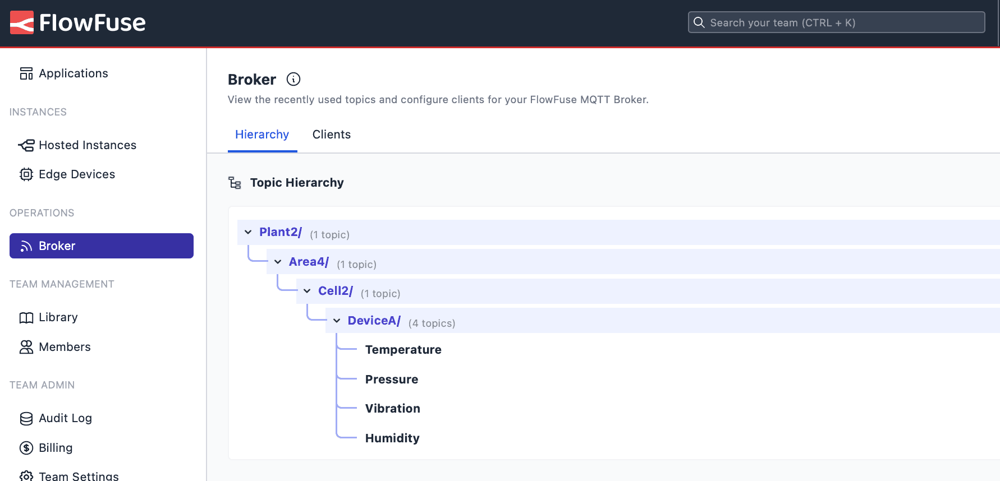

As industries evolve towards Industry 4.0, integrating legacy systems like Modbus with modern cloud technologies becomes essential. While effective for local machine-to-machine communication, Modbus doesn't naturally connect with cloud platforms.

This article shows you how to bridge Modbus data to MQTT using FlowFuse and Node-RED. By publishing this data into a [Unified Namespace (UNS)](/solutions/uns/), you can seamlessly integrate legacy systems with cloud services for real-time monitoring and analysis, unlocking the full potential of your industrial data.

<!--more-->

If you haven’t built a Unified Namespace yet, please read our article on [building a UNS with FlowFuse](/blog/2024/11/building-uns-with-flowfuse/) and create your own in just 15 minutes.

## The Importance of Bridging Modbus Data to MQTT for Cloud Integration and UNS

Modbus has been a go-to protocol in industrial environments for a long time, providing reliable communication between devices like PLCs, sensors, and motors. It’s been essential for operational technology (OT) for decades. But as industries move towards Industry 4.0, there’s a growing need to connect older OT systems like Modbus with modern IT platforms, such as cloud systems and IoT applications. This is where the OT/IT gap becomes a challenge.

While Modbus does a great job at local control and data collection, it has some limitations when it comes to cloud integration and real-time IoT solutions. Without a centralized approach, data often remains locked in silos—isolated within different systems and devices. That’s where a Unified Namespace (UNS) comes in. A UNS acts as a bridge to break down these data silos. It’s a centralized architecture that allows different systems to communicate seamlessly, no matter the underlying technology. By setting up a UNS, you can easily bring in data from various systems, including Modbus, and consolidate it into one accessible point.

At FlowFuse, we support both Modbus and MQTT protocols, making it easy to integrate Modbus data into the UNS. We’ve chosen MQTT as the broker for our UNS because it’s lightweight, uses a pub-sub architecture, and is well-suited for real-time communication and cloud integration.

Once the Modbus data is in the UNS, it can be used for real-time monitoring, predictive maintenance, and analytics. For instance, in a factory still running Modbus with older systems, data from machines like motors, pumps, and conveyors can be sent to the UNS. This means stakeholders can access that data in real time, gaining insights into machine performance and system health. By consolidating data that was once trapped in silos into one place, the UNS helps organizations streamline operations, make better decisions, and boost efficiency.

## How to Bridge Modbus to MQTT

Let's look at the steps to bridge Modbus data to MQTT using FlowFuse, leveraging Node-RED's capabilities. The process involves retrieving data from a Modbus device (For Practical example, we are using OpenSim to simulate Modbus data), transforming and processing the data (e.g., scaling raw sensor data into human-readable formats), and sending it to your Unified Namespace.

{data-zoomable}
_Bridging Modbus Data to MQTT using Node-RED_

## Prequsite

- A **Modbus data source**, such as an actual Modbus device or a simulator like ModSim.
- A **FlowFuse account**, which enables you to create and deploy Node-RED instances securely on the cloud with a single click, collaborate on projects with your team, manage and monitor edge devices centrally, handle data pipelines efficiently, and leverage its integrated MQTT broker service for seamless UNS management, with an intuitive interface for securely managing clients.

If you haven’t signed up for a FlowFuse account yet, do so now by clicking [sign up](https://app.flowfuse.com/account/create).

### Step 1: Collect Data from Modbus Devices

The first step is to collect data from your Modbus devices. To do this, you'll need to run Node-RED on your Device. If your Modbus device communicates via a serial port, Node-RED will need access to that port, which you can manage with the appropriate configuration. If you're using Modbus TCP and both Node-RED and your Modbus device are on the same network, the connection is straightforward.

**Step 1.1: Running the FlowFuse device agent on your edge device**

To run Node-RED on your edge device with just a few simple steps, you can use the [FlowFuse Device Agent](/docs/device-agent/quickstart/). This allows you to run Node-RED locally and also connect it to FlowFuse Cloud for remote monitoring and management, making it easier to keep track of your devices and workflows from anywhere.

**Step 1.2: Install Modbus Nodes**

While Node-RED doesn't include Modbus nodes by default, adding them to your palette is simple. Installing the necessary Modbus nodes from the Node-RED library will enable communication with your Modbus devices, whether they’re connected via serial or TCP. This step ensures you can start reading data from your Modbus devices and processing it for further integration.

1. Open the **Palette Manager** by clicking the menu icon in the top-right corner of Node-RED and selecting **Palette Manager**.
2. In the Palette Manager, search for `node-red-contrib-modbus` in the search bar.
3. Click **Install** to add the Modbus nodes to your Node-RED environment.
4. Once installed, the nodes appear in the left-side palette under the **Modbus** category. These nodes will allow you to interact with Modbus devices in your flow.

**Step 1.3: Configure the Modbus Connection**

Next, you'll need to configure the Modbus connection based on your device type. Modbus devices can communicate using two primary protocols: **Modbus RTU** (over serial) or **Modbus TCP** (over Ethernet/Wi-Fi). The specific choice depends on the type of Device you are working with.

1. Drag a **Modbus Read** node onto your Node-RED Canvas.
2. Double-click on the **Modbus Read** node to open its configuration.
3. In the configuration window:
   - Enter the **Unit ID** (this is the device address, typically **1**, but it may vary depending on your device).
   - Choose the **Function** you need, such as **Read Holding Registers**, **Read Input Registers**, etc. (this depends on the type of data you want to read).
   - Specify the **Start Address** (the address of the first register you want to start reading).
   - Set the **Quantity** (the number of registers to read).
   - Specify the **Poll Rate** (e.g., how often you want to collect data, such as every 1 second).
4. In the **Server** field, click the **+** button to add a new Modbus server, and select the type.
   - For **Modbus TCP**: Enter the **IP address** and **Port** (the default Modbus TCP port is **502**).
   - For **Modbus RTU**: If you're using a serial connection, you'll need to specify the serial port (such as `/dev/ttyUSB0` on Linux or `COM1` on Windows), as well as the baud rate and other serial settings.
   - Set the **Unit ID** (again, this should match the Unit ID you entered earlier).

{data-zoomable}
_Image showing Modbus node configuration for reading holding registers_

{data-zoomable}
_Image showing Modbus client node configuration_

5. Once the connection details are filled in, click **Add** to save the configuration, then click **Done**.

**Step 1.4: Test the Modbus Connection**

After configuring the connection, it's time to test the data collection.

1. Drag a **Debug** node onto the canvas.
2. Connect the **Modbus Read** node's output to to the input of **Debug** node.
3. Click **Deploy** in the top-right corner of Node-RED to deploy your flow.
4. Open the **Debug Panel** on the right side of the Node-RED interface. If the connection is successful, you should see the raw data from your Modbus device in the Debug Panel.

If no data appears, check the connection settings (IP address, Unit ID, port, etc.) and ensure your Modbus device is correctly configured and accessible. If you use a simulator like ModSim, ensure it’s running and properly configured to send data.

For more information on using Modbus with Node-RED, please read our tutorial on [Using Modbus with Node-RED](/node-red/protocol/modbus/).

### Step 2: Transforming Modbus Data for UNS

After collecting data from your Modbus device, the next step is transforming it into a usable format for cloud-based IoT applications. Modbus data typically comes in raw register values, and you may need to convert these values into human-readable formats like temperature, pressure, or other measurements.

Let's walk through the transformation process step by step.

**Step 2.1: Parsing and Converting Raw Modbus Data**

Modbus devices often return data in registers that need to be interpreted. For example, a temperature sensor might return a register value like 350, which represents 35.0°C if the sensor stores values in tenths of degrees.

{data-zoomable}
_The ModSim interface, generating simulated Modbus data_

Here’s an example of the raw Modbus data I am receiving from ModSim: `[225, 1013, 29, 50, 603]`. These values represent the following:

- `225`: Temperature (in tenths of degrees, which would be 22.5°C)
- `1013`: Part 1 of the pressure value (higher register)
- `29`: Part 2 of the pressure value (lower register)
- `50`: Vibration (in tenths of degrees, which would be 5g)
- `603`: Humidity (in tenths of degrees, which would be 60.3%)

We must convert these raw register values into human-readable formats for cloud integration. For instance, we divide the temperature and vibration by 10 to get the actual values in degrees Celsius and g, respectively, and similarly for other parameters like humidity. For pressure, the higher and lower register values are combined to compute the complete value accurately.

To determine how to process raw Modbus data, such as dividing by a specific value, concatenating, or applying other transformation formulas, refer to the manual of the sensor you use for specific instructions.

In Node-RED, you can use various nodes for transformation. You can choose the [Function node](/node-red/core-nodes/function/) for advanced processing, the [Change node](/node-red/core-nodes/change/) for simpler operations, or the [Template node](/node-red/core-nodes/template/) for defining schemas. In this article, I will demonstrate a low-code approach using the Change node to process the data cleanly.

Additionally, for better organization and accessibility, I will send each metric separately and include additional metadata such as the `timestamp` and `unit`.

**For Temperature**:

1. Drag a **Change** node onto the canvas.
2. Double-click the node to open its configuration panel.
3. Set the following in the **Set** rules:
   - Set `msg.data` to `msg.payload`.
   - Set `msg.payload` to `{}`.
   - Set `msg.payload.timestamp` to the timestamp function of the Change node.
   - Set `msg.payload.value` to `data[0] / 10`.
   - Set `msg.payload.unit` to `'c'`.

{data-zoomable}
_Image showing the Change node rules transforming temperature data_

4. Click **Done** to save the configuration.
5. Connect the first output of the **Modbus Read** node to the input of this **Change** node.

**For Pressure**:

1. Drag another **Change** node onto the canvas.
2. Double-click the node to open its configuration panel.
3. Set the following in the **Set** rules:
   - Set `msg.data` to `msg.payload`.
   - Set `msg.payload` to `{}`.
   - Set `msg.payload.timestamp` to the timestamp function of the Change node.
   - Set `msg.payload.value` to `$number($string(data[1]) & $string(data[2]))` as a JSONata expression.
   - Set `msg.payload.unit` to `'ppm'`.

{data-zoomable}
_Image showing the Change node rules transforming pressure data_

4. Click **Done** to save the configuration.
5. Connect the first output of the **Modbus Read** node to the input of this **Change** node.

**For Vibration**

1. Drag another **Change** node onto the canvas.
2. Double-click the node to open its configuration panel.
3. Set the following in the **Set** rules:
   - Set `msg.data` to `msg.payload`.
   - Set `msg.payload` to `{}`.
   - Set `msg.payload.timestamp` to the timestamp function of the Change node.
   - Set `msg.payload.value` to `data[3] / 10` as a JSONata expression.
   - Set `msg.payload.unit` to `'g'`.

{data-zoomable}
_Image showing the Change node rules transforming vibration data_

4. Click **Done** to save the configuration.
5. Connect the first output of the **Modbus Read** node to the input of this **Change** node.

**For Humidity**

1. Drag another **Change** node onto the canvas.
2. Double-click the node to open its configuration panel.
3. Set the following in the **Set** rules:
   - Set `msg.data` to `msg.payload`.
   - Set `msg.payload` to `{}`.
   - Set `msg.payload.timestamp` to the timestamp function of the Change node.
   - Set `msg.payload.value` to `data[4] / 10` as a JSONata expression.
   - Set `msg.payload.unit` to `'%'`.

{data-zoomable}
_Image showing the Change node rules transforming humidity data_

4. Click **Done** to save the configuration.
5. Connect the first output of the **Modbus Read** node to the input of this **Change** node.

Once you have configured and connected all the Change nodes, add a **Debug** node to each Change node's output to verify that the transformed data appears as expected. Deploy the flow, then check the output in the Debug Panel to ensure that each metric is correctly formatted with the appropriate timestamp, value, and unit.

### Step 3: Send Data to an UNS

After transforming the Modbus data into a human-readable format, the next step is to send it to a Unified Namespace (UNS). MQTT is one of the most popular choices for implementing a UNS because it is lightweight, efficient, and designed for real-time data transmission. Its low bandwidth requirements, message queuing capabilities, and secure and reliable communication support make it ideal for industrial IoT applications.

**Step 3.1: Preparing MQTT Broker**

FlowFuse simplifies the setup process by providing an integrated MQTT broker service for teams and enterprise users. This built-in service eliminates the need to set up an external broker. To use the FlowFuse MQTT broker, you need to create MQTT clients on the platform. These clients are secured with username and password authentication, ensuring only authorized devices can publish or subscribe to topics. For more details about the MQTT broker service provided by FlowFuse, refer to the [MQTT Broker Service Announcement](/blog/2024/10/announcement-mqtt-broker/).

**To create MQTT clients:**

1. Navigate to the FlowFuse platform and click "Broker" in the left sidebar.
2. click the "Create Client" button in the newly opened interface.
3. Enter a username and password for the client.
4. Configure topic access control patterns if needed, specifying which topics the client can publish or subscribe to.
5. Click "Save" to create the client.
6. Once saved, copy the newly added client's Client ID from the list and save it for later use.

**Step 3.2: Configure MQTT Nodes in Node-RED**

1. In the Node-RED editor, drag the **mqtt out** node onto the canvas.
2. Double-click the node, then click the **+** icon next to the **Server** field to configure your broker details:
   - For FlowFuse MQTT, use `broker.flowfuse.cloud` as the server address.
   - Enter the **Client ID**, **username**, and **password** that you generated earlier.

{data-zoomable}
_Image mqtt broker node configuration_

3. Click **Add** to save the configuration.
4. Select the appropriate **QoS** (Quality of Service) level based on your needs.
5. Enter the Topic for the MQTT message, such as `plant2/Area4/Cell2/DeviceA/temperature`. This naming convention organizes data by plant, area, cell, and Device, following the ISA-95 equipment hierarchy. It is widely used across industries because it makes managing, filtering, and scaling your system easier. Additionally, this approach simplifies data segmentation and provides straightforward access when other parts of the IoT ecosystem need it.

{data-zoomable}
_Image showing the MQTT Out node configuration_

*Note: For the configuration of MQTT nodes and Modbus, environment variables are used to prevent accidental exposure when sharing. For more information, refer to [Using Environment Variables with Node-RED](/blog/2023/01/environment-variables-in-node-red/).*

6. Click **Done** to save the node.
7. Connect the output of the Change node, which is transforming the metrics you are sending via MQTT, to the mqtt out node.

Repeat these steps for each metric (e.g., pressure, vibration, humidity), giving each one its own **mqtt out** node with a unique topic.

For more information on using MQTT with Node-RED, please read [Using MQTT with Node-RED](/blog/2024/06/how-to-use-mqtt-in-node-red/).

Once you’ve configured the MQTT nodes for all your metrics and deployed the flow, check the status at the bottom of each MQTT node. If it shows "connected," your Node-RED flow is successfully connected to the broker and publishes data to the UNS. From here, you can integrate the data with cloud-based analytics platforms. Build IoT dashboards with [FlowFuse Dashboard](https://dashboard.flowfuse.com/), or other systems to enable real-time monitoring, predictive maintenance, and automated decision-making. This setup effectively bridges the gap between legacy Modbus devices and modern IoT infrastructure, empowering smarter, more efficient industrial operations.

To view the topic hierarchy in UNS, go to the FlowFuse platform, navigate to the Broker section, and click on the Hierarchy tab. The interface will look similar to the one shown below:

{data-zoomable}
_Image showing FlowFuse topic heirachy intergace for UNS_

## Final Thought

Bridging Modbus data to MQTT and publishing it to a Unified Namespace (UNS) is crucial in modernizing industrial systems. With FlowFuse, you can easily connect legacy Modbus devices to the cloud, enabling real-time monitoring, analytics, and predictive maintenance.

FlowFuse offers a complete toolkit for building and managing your UNS. It combines MQTT for real-time communication, a robust data orchestration layer, and a centralized management platform for enterprise-level control. This unified approach simplifies the integration of devices, applications, and legacy systems, ensuring smooth data flow and delivering real-time insights across your organization.

With FlowFuse, you can optimize industrial data workflows, improve decision-making, and unlock the full potential of your operational data, all while reducing complexity and enhancing system scalability.
