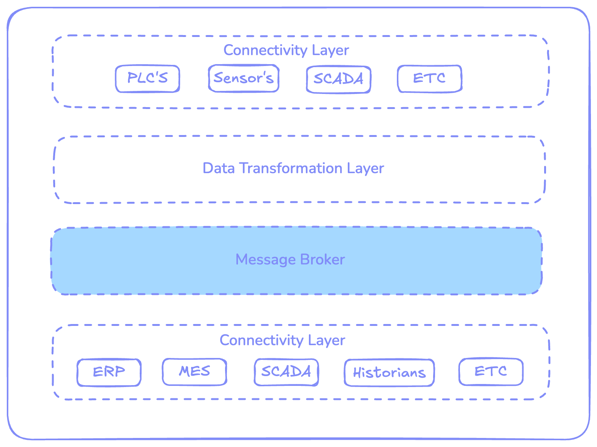

Unified Namespace (UNS) is changing the way data is managed in industrial environments. It’s becoming the key to more successful and productive operations. Many organizations have already implemented it, and others are still figuring out the best approach and platform to implement it. There are so many tools out there; how do you know which one is right for your UNS? It’s a big decision, and it can be overwhelming. The good news? FlowFuse is the toolkit you’ve been looking for! It’s an all-in-one platform to build your UNS—and it’s open-source!

<!--more-->

At its core, a **Unified Namespace** ([UNS](/solutions/uns/)) is a data architecture that centralizes all your data from devices, sensors, and systems into a single hub. It helps you make sense of everything by organizing, structuring, and standardizing your data for easy access and analysis. Instead of dealing with fragmented data silos, you get a unified, real-time view of your entire operation. 

Think of it as the brain of your entire operation, connecting all your business events in one place. Whether you're tracking performance, optimizing workflows, or making real-time decisions, a well-designed UNS makes it all possible. For more details, check out our article: [Introduction to the Unified Namespace](/blog/2023/12/introduction-to-unified-namespace/).

## **Core Components of UNS and How FlowFuse Fits In**

To truly understand why FlowFuse is the ultimate toolkit for building and managing UNS, we need to explore its core components and see how FlowFuse enhances each one to help create a successful Unified Namespace in industrial IoT environments.

{data-zoomable}  
_Core Components of UNS: Key Elements to Consider When Building Your UNS_

#### **1. Connectivity Layer**

The **Connectivity Layer** is the first step. It’s what collects data from all your devices and systems—whether that’s sensors on the factory floor, PLCs, or IoT devices—and sends it to your UNS. Without a strong connectivity layer, your UNS won’t have the data it needs to create a complete view of your operations.

**How FlowFuse Helps:**

FlowFuse is built on Node-RED with, a tool that makes it simple to connect all kinds of devices, even if they use different communication methods. Whether you're working with older systems (like Modbus or OPC-UA) or newer IoT devices (like MQTT or HTTP), FlowFuse makes sure everything can talk to each other and feed data into the UNS.

With more than 5,000 available community contributed nodes, FlowFuse helps bridge the gap between old and new technologies. For example, if you have machines that use Modbus and new sensors using MQTT, FlowFuse can help them all send data into your UNS without any issues.

#### **2. Data Transformation Layer**

Once data flows into your UNS, it often comes in different formats, units, or structures. The **Data Transformation Layer** is responsible for standardizing and enriching this data to make it usable across the entire system. Without this layer, you'd end up with fragmented and inconsistent data, which makes integration challenging in your IIoT environment. also, without standardized and structured data, we can't call it uns; it will be just a data repository.

**How FlowFuse Fits In:** 

FlowFuse simplifies data transformation with its intuitive Node-RED interface, which allows you to set up complex data processing workflows with minimal effort. Whether it’s converting units of measurement, cleaning raw data, or reformatting it, FlowFuse offers a low-code environment where engineers can drag and drop nodes to handle these tasks without needing to write extensive custom code.

In addition to transforming the data’s format, FlowFuse enables data contextualization. This means that as raw data flows in, it can be augmented with important metadata—like timestamps, equipment IDs, or sensor locations—that provide context and make the data more meaningful. This is essential for accurate analysis and decision-making.

For instance, imagine temperature readings coming from multiple devices, with some sensors reporting in Celsius, others in Fahrenheit, and others in Kelvin. FlowFuse can automatically standardize all these readings to a single unit (like Celsius) and add contextual information, such as which machine the data came from and its current operating status. This makes the data easy to understand and act upon in your UNS.

#### **3. Message Broker**

In a Unified Namespace (UNS), the Message Broker is the essential component that ensures your data flows smoothly between systems in real-time. It works on a publish-subscribe (pub-sub) model, where systems "subscribe" to specific topics and get updates automatically when new data is available. This keeps all systems connected and ensures your data is always up-to-date.

**How FlowFuse Fits In:** 

FlowFuse provides a built-in **MQTT Broker**, eliminating the need to set up and manage a separate MQTT infrastructure. MQTT is widely used in UNS setups because it’s lightweight and works well in environments with limited bandwidth.

With FlowFuse’s integrated MQTT Broker, all your devices and systems are effortlessly connected, enabling smooth data exchange across your UNS. You can manage connections, organize topics, and configure security features (such as TLS encryption and username/password authentication) directly within FlowFuse, simplifying the entire setup. Additionally, FlowFuse adheres to open-source standards, ensuring compatibility and flexibility.

The MQTT Broker supports hierarchical topic structuring, making it easy to organize and manage data flows. In FlowFuse, there are two key interfaces to assist with this process: one simplifies the management of MQTT clients, while the other allows you to monitor all your UNS topics in a tree view.

Additionally, Node-RED within FlowFuse includes standard MQTT nodes, allowing you to configure connections to the broker with key security features like TLS encryption and username/password authentication. These nodes also enable dynamic configuration of topics and brokers, making it simple to customize your MQTT setup and ensure secure, efficient communication throughout your UNS.

FlowFuse makes building and managing a Unified Namespace (UNS) easy. It connects devices, transforms data into a usable format, and ensures smooth communication using an MQTT broker. Powered by Node-RED, it works with old and new systems, helping you scale and adapt quickly.

## **What Makes FlowFuse Stand Out in Industrial IoT?**

FlowFuse isn’t just another tool—it’s the complete solution for building and managing a UNS. Unlike other platforms that only focus on one area, FlowFuse brings everything together: connectivity, data transformation, and message brokering.

Other tools might do one thing really well but struggle with other parts. Some are great at connecting devices but can’t handle older systems or transform data properly. FlowFuse solves these problems by providing a simple, all-in-one platform that works with both new and old systems.

And because it’s open-source, you’re not locked into any one vendor. If needed, you can easily transform it into another service without worrying about future compatibility.

FlowFuse also offers some unique features designed for industrial needs. One key feature is [real-time collaboration](/blog/2024/12/flowfuse-team-collaboration/), allowing multiple engineers to work on Node-RED flows simultaneously, speeding up the deployment process. It also lets you [remotely manage edge devices](/blog/2024/07/building-on-flowfuse-devices/), saving time and costs by avoiding on-site visits for troubleshooting or reprogramming.

When it comes to scaling, FlowFuse excels. It supports horizontal scaling, which helps manage workloads across multiple instances, and vertical scaling, making it easy to add more resources to handle growing demands. Whether your operations are expanding or dealing with heavy workloads, FlowFuse keeps your infrastructure stable and efficient.

[Security](/blog/2024/10/exploring-flowfuse-security-features/) is another strength of FlowFuse. It includes features like [role-based access control](/blog/2024/04/role-based-access-control-rbac-for-node-red-with-flowfuse/), strong and different types of authentications, encrypted communication, and detailed [audit logs](/docs/user/logs/#audit-log) to protect your data and meet industry standards.

## **Summary**

FlowFuse is a complete platform for building and managing a Unified Namespace. It combines everything you need—connectivity, data transformation, and message brokering—into one easy-to-use solution. Open-source flexibility makes it simple to connect devices, scale your system, and keep data secure.

***Want to learn more about how FlowFuse can help? [Talk with Our experts!](/book-demo/)***
