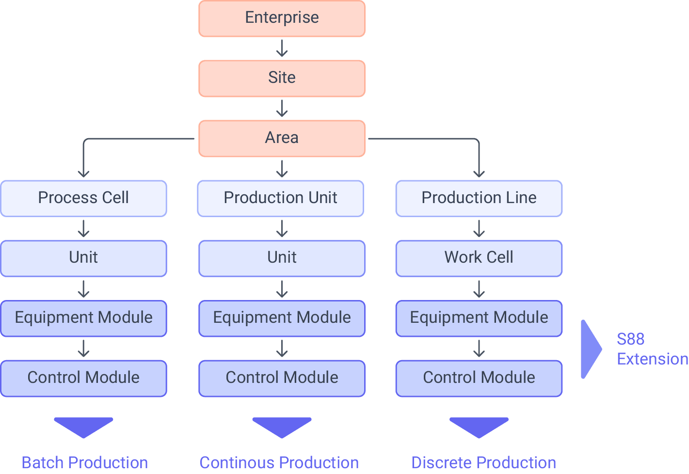

A well-designed topic structure isn’t just a technical requirement—it’s a fundamental part of building a scalable, high-performance Unified Namespace (UNS). In manufacturing, where data flows constantly from machines, sensors, and systems, the way you organize your topics can make a big difference. With the right structure, you can ensure smooth data flow, simplify scaling, and improve overall efficiency. In this post, we’ll explain why topic structuring is so important for the success of your UNS and share practical strategies and best practices for creating a flexible, intuitive hierarchy that grows with your business.

<!--more-->

## Why Topic Structuring is Crucial for Your Unified Namespace (UNS)

When designing a UNS for a manufacturing environment, topic structuring is more than just a convenience—it’s essential for ensuring scalability, data accuracy, and operational efficiency. Particularly when using MQTT (a common protocol for UNSs), how you structure your topics can directly impact how your system grows, performs, and adapts to future manufacturing needs.

In a manufacturing environment, the complexity of the data can quickly escalate. MQTT topics are hierarchical, following a tree-like structure with each level separated by a forward slash (/). Think of it as a way to organize the vast number of sensors, devices, and production systems into an easily navigable framework.

```
/factory/line1/machine1/temperature
```

In this case, the topic structure reflects the factory's organization, with topics organized by production line, machine, and sensor type (e.g., temperature, vibration). This hierarchy mirrors the factory floor layout, making it intuitive for managing production data at scale.

A key benefit of a well-thought-out topic structure is scalability. As your manufacturing operations expand, you will add more machines, sensors, and production lines. A poorly structured topic system could quickly become a disorganized mess, making it harder to manage and analyze the data.

For instance, as your factory adds a second production line, you can simply add topics like:

- `/factory/line2/machine1/temperature`
- `/factory/line2/machine1/vibration`
- `/factory/line2/machine2/temperature`

Instead of trying to cram all machines under one generic topic (e.g., `/factory/machines`), the hierarchical structure lets you grow your system without creating bottlenecks or confusion.

Efficient topic structuring improves system performance by allowing consumers (e.g., monitoring systems or edge devices) to subscribe only to the data they need, cutting down on unnecessary traffic and reducing the load on both the network and devices. For example, if a maintenance team needs to monitor the temperature of machines in line 1, they would only subscribe to the relevant topic:

```
/factory/line1/machine1/temperature 
/factory/line1/machine2/temperature
```

This means they don't receive irrelevant data, such as vibration readings or temperatures from machines in other production lines. This reduces the volume of data transmitted, ensuring the system performs efficiently and that edge devices don't get overwhelmed.

Also A clear topic structure is invaluable when it comes to maintenance and troubleshooting in a smart factory. When a machine fails or a sensor reports faulty data, the hierarchical structure allows you to quickly locate and resolve the issue.

For example: Imagine a temperature sensor on `machine3` in `line2` starts reporting abnormal values. A well-structured topic like `/factory/line2/machine3/temperature` immediately shows you which machine and production line are affected, allowing your team to respond faster and more effectively. Without this clear topic structure, it would be much harder to trace back to the problem in the system.

Additionally, as new equipment or sensors are added to the factory, the hierarchical structure helps onboard engineers and technicians more easily by providing a visual map of the system.

## Designing a Topic Structure for Your UNS

Before you start collecting data in your UNS, it’s essential to design your topic structure. While it might seem like a small step, it’s the foundation of your system. Taking the time to plan will save you significant time and effort down the road. More importantly, it gives you a clear, high-level view of your entire factory, which is crucial for scaling effectively.

### Organizing the Hierarchy

First, think about the key components of your factory. For example, in a manufacturing setting, you might have different plants or production lines. Within each production line, there will be machines or devices that produce data. Then, you’ll have various data points coming from sensors on these machines, such as temperature, humidity, or pressure.

By organizing your topics around these components, you’re setting up a structure that’s easy to scale.

Next, remember that MQTT topics are hierarchical, so think of them like a tree. At the top of the tree, you’ll have the broadest categories (like plants or regions). As you go down, you’ll get more specific, with production lines, machines, and then individual data points like sensor readings. The key is to keep things logical, so you can quickly locate the data you need. This organization lets you easily expand your system later by adding new plants, lines, or machines without disrupting the entire structure.

The concept of structuring topics in a logical, hierarchical manner draws from a well-known framework in manufacturing: ISA-95. ISA-95 is a standard that defines a hierarchical model for organizing and managing manufacturing systems. It divides operations from the company level down to individual machines, providing a clear structure for system management.

{data-zoomable}
_ISA-95 Equipment Hierarchy Model_

Here’s a brief breakdown of the ISA-95 levels and how they can be translated to MQTT topics:

- **Level 0 – Physical Devices and Control**

This is where the physical data originates: sensors, actuators, and devices that directly interact with machinery and production lines. These are typically represented as devices in your MQTT topic structure.

Example Topics:

`/plantA/productionLine1/machineB/sensor/temperature`

`/plantA/productionLine1/machineB/sensor/pressure`

`/plantA/productionLine2/machineC/sensor/humidity`

At this level, you're dealing with specific machines and sensors. The topic name clearly defines the device type (e.g., "sensor") and the type of data it generates (e.g., "temperature"). This structure makes it easy to track sensor data per machine or production line.

- **Level 1 – Control Devices and Systems**

This level represents the control systems that operate the machinery and manage the data flow. These systems might include PLCs, SCADA systems, or other control devices that manage real-time operations.

Example Topics:

`/plantA/productionLine1/machineB/PLC/status`

`/plantA/productionLine1/machineB/PLC/mode`

`/plantA/productionLine2/machineC/SCADA/alerts`

Topics at this level might focus on the status and control functions of the machines. By separating control systems like PLCs or SCADA, you're ensuring that operational data (e.g., machine modes or alerts) is distinct from raw sensor data. This approach ensures that each system component can be monitored and managed independently.

- **Level 2 – Monitoring and Supervisory Control**

At this level, systems are monitoring and managing operations. It might include higher-level systems that oversee the production lines, collect data from multiple PLCs, and trigger alerts or analyses based on predefined criteria.

Example Topics:

`/plantA/productionLine1/supervisor/alerts`

`/plantA/productionLine1/supervisor/performance`

`/plantA/productionLine2/supervisor/utilization`

Here, you might aggregate data from several control devices (like PLCs) and provide higher-level insight into the overall system. For example, a "performance" topic could aggregate sensor data to monitor the efficiency of a production line, while "alerts" might be used for system-wide warnings.

- **Level 3 – Manufacturing Operations Management**

This level encompasses the management of the overall production process, such as scheduling, production orders, and resource management. This is often where MES (Manufacturing Execution Systems) comes into play.

Example Topics:

`/plantA/productionLine1/MES/productionOrder`

`/plantA/productionLine2/MES/scheduling`

`/plantB/productionLine1/MES/inventoryStatus`

At this level, the data becomes more abstract, as you're dealing with business logic, production orders, and scheduling systems. For example, the "productionOrder" topic could track orders for specific products, while "inventoryStatus" could provide data on material availability for each production line.

- **Level 4 – Enterprise Resource Planning (ERP)**

The highest level in the ISA-95 hierarchy is focused on enterprise-wide resource planning, financials, and decision-making processes. ERP systems integrate with manufacturing systems to provide broader business insights.

Example Topics:

`/enterprise/ERP/inventory/overview`

`/enterprise/ERP/sales/orders`

`/enterprise/ERP/production/metrics`

At the ERP level, topics might reflect cross-plant business data like inventory, order management, or performance metrics. These are less granular than lower levels and serve to provide decision-makers with high-level insights into the health of the overall business.

## Best Practices for Managing Your Topic Structure

As your UNS scales, following some essential best practices will ensure your topic structure remains efficient, secure, and easy to manage.

1. Maintain Clear Documentation:

First and foremost, maintaining clear documentation is key. A well-documented topic hierarchy acts as a reference point for everyone involved in the system—from developers and engineers to system administrators. This documentation should outline the naming conventions, the purpose of each topic, and how new topics should be added. Without it, there's a risk of inconsistency creeping into your system, especially as new data streams and devices are introduced. A clear, organized reference ensures that your team can efficiently navigate and expand the system without confusion.

2. Ensuring Consistency in Naming and Structure:

Using clear, descriptive names for each topic and sticking to a consistent naming pattern across your system is essential for long-term success. A well-defined naming convention ensures that everyone involved—whether it’s developers, engineers, or system administrators—can easily understand the purpose of each topic. When topics are consistently named, navigating your UNS becomes intuitive, and troubleshooting issues is much easier.

For instance, avoid vague or overly generic names like `/sensor1/data`, which don’t offer much context. Instead, adopt more descriptive, hierarchical names that reflect the actual source and nature of the data, such as `/plantA/productionLine1/machineB/temperature`. A consistent structure not only enhances system readability but also ensures scalability.

3. Keep Topic Names Simple and Avoid Special Characters:

While it’s important to have descriptive topic names, they should also be simple and easy to use. Long topic names can make it harder to work with your UNS quickly and efficiently. Additionally, avoid using spaces or special characters, as they might cause compatibility issues with some MQTT brokers or clients.

4. Perform Regular Topic Cleanup and Expiration:

Next, don’t overlook the importance of topic cleanup and expiration. Over time, unused or obsolete topics can accumulate, adding unnecessary complexity and overhead to the system. Left unchecked, these stale topics can lead to unwanted confusion. It’s important to regularly audit the topics in your UNS, archiving or removing those that are no longer needed. While some MQTT systems support automatic topic expiration, it’s still a good practice to implement manual checks as part of your routine system maintenance. You’ll also want to manage the use of retained messages carefully. While they can be useful for providing the latest state to new subscribers, overuse or misuse can lead to outdated information circulating across the system. Be mindful about which topics should retain data and ensure they are updated or cleaned up regularly.

5. Implement Robust Access Control:

Access control is essential in managing a large-scale UNS. The hierarchical structure of MQTT topics naturally supports role-based access control (RBAC), allowing you to assign permissions based on topics. This ensures users and devices only access the data they need.

For example, engineers might only need access to machine-level sensor data, while plant managers require broader visibility into performance metrics across production lines. Additionally, you can restrict which devices are allowed to publish data to certain topics, ensuring only authorized systems send critical updates.

By defining clear access rules, you enhance security, maintain data integrity, and ensure that your UNS can scale efficiently as your organization grows.

## Effortless MQTT and Topic Management with FlowFuse

FlowFuse is more than just a low-code platform; it’s a game-changer for building and scaling your Unified Namespace (UNS). By seamlessly integrating MQTT, FlowFuse empowers you to connect, manage, and scale your industrial data systems with unmatched efficiency.

With FlowFuse's built-in MQTT broker, you get high-performance data handling with no additional infrastructure overhead. The platform also features an interface for managing MQTT clients with access control for topics and an intuitive Topic Hierarchy View, which provides a real-time, visual representation of your entire MQTT topic structure. This makes it easy to organize, monitor, and manage your topics, ensuring clarity and consistency as your system grows.

{data-zoomable}
_Image showing FlowFuse topic hierarchy interface for UNS_

What makes FlowFuse truly stand out is its ability to handle both legacy and modern industrial protocols, bridging the gap between old and new systems effortlessly. Whether you’re adding new devices, integrating data streams, or scaling to thousands of devices, FlowFuse gives you the flexibility, scalability, and security you need to optimize your UNS at every step.

FlowFuse doesn’t just help you manage topics—it streamlines collaboration, enhances system performance, and accelerates your journey toward a fully integrated, future-proof UNS.

**Looking to simplify your UNS management? [Start](https://app.flowfuse.com/account/create) using FlowFuse today and unlock the full potential of your data architecture. If you need more information, feel free to [reach out to our experts.](/book-demo/)**
