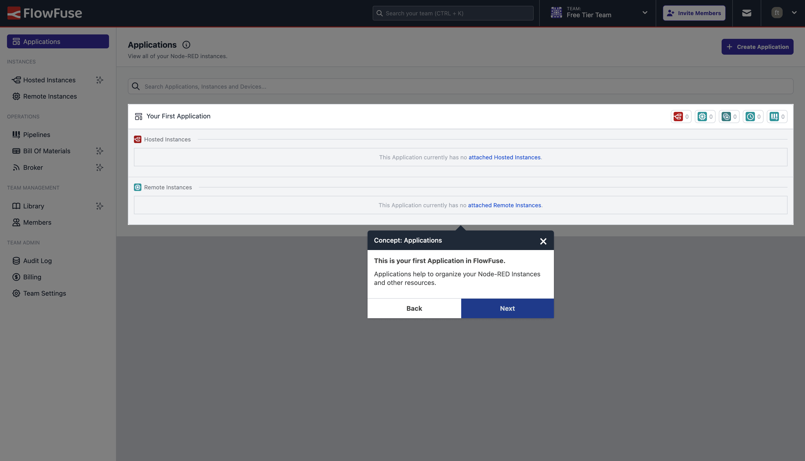

Happy New Year everyone! We're back with another release of FlowFuse, and whilst it's been a shorter sprint for us this time round, with most of the team out for a well-earned break over Christmas and New Year, that hasn't stopped us packing in lot of great new value into FlowFuse nonetheless.

<!--more-->

## Hosted & Remote Instances

This release you'll notice that we've changed the terminology of two of our key concepts in FlowFuse:

- **Instances** are now referred to as **Hosted Instances**
- **Devices** are now referred to **Remote Instances** 

We were finding that customers and prospects were getting confused over the term "Device", when in fact, it is a running _Instance_ of Node-RED. You can have many Remote Instances running on the same piece of hardware, all using the FlowFuse Device Agent, and the term, "Device" made that misleading.

Remote Instances are just instances of Node-RED, deployed onto your own hardware and managed via FlowFuse and the FlowFuse Device Agent. We hope this change will make it clearer for everyone, and wanted to include this graphic which shows the updated terminology in the hierarchy of FlowFuse:

{data-zoomable}
_Diagram to show the hierarchy of different concepts in FlowFuse_

## Documenting Your UNS

Just under three months ago, we [released our own MQTT Service](/blog/2024/10/flowfuse-release-2-10/), making it easy for your to configure MQTT clients through FlowFuse, and connect your hardware and applications. With the Unified Namespace (UNS) growing in popularity in Industry, we wanted to make sure that if you're using MQTT to run your UNS, then FlowFuse offers the best experience for managing it.

{data-zoomable}

With this in mind, we're now generating a formal schema for your MQTT Broker's topic hierarchy automatically, and we've made it possible to access the underlying schema through the FlowFuse interface. The schema we generate is using the industry-standard, open-sourced, [AsyncAPI](https://www.asyncapi.com/).

If you're interested in learning more about UNS, then we recommend taking a look at some of the following resources:

- [Introduction to the Unified Namespace](/blog/2023/12/introduction-to-unified-namespace/)
- [Why you need a Unified Namespace](/blog/2024/11/why-point-to-point-connection-is-dead/)
- [Building a Unified Namespace (UNS) with FlowFuse](/blog/2024/11/building-uns-with-flowfuse/)
- [**Free whitepaper:** UNS - Decoupling data producers and consumers](/whitepaper/uns-decoupling-data-producers-and-consumers/)

### Future Plans

This is very much a first iteration and we have work underway to improve it. Right now, the generated spec is pretty minimal - there is lots of scope to add more information and present it in a clearer and more interactive format. This will make it easy for your whole development team, and anyone else that needs to know, to get a clear picture of the topics and payloads that are being used in your MQTT Broker.

We're also looking at how this information can enhance the development experience within Node-RED itself.

## Managing Groups of Instances

We've introduced a new view in FlowFuse which you can find in the "Operations" section of the side navigation. This new view is called "Groups" and it allows you to group your Remote Instances together, making it easier to manage and deploy to multiple instances at once.

{data-zoomable}

This functionality has been in FlowFuse for a little while, but was buried down in the "Applications" view, and found users were missing it. We've now brought it to the forefront, and made it easier to use, and help you deploy out to thousands of Remote Instances with the single click of a button.

## New Onboarding Tour

{data-zoomable}

We have a new onboarding tour that will be shown to those users signing up to our [new Free Tier on FlowFuse Cloud](/blog/2024/12/flowfuse-release-2-12/).

This tour is purpose built to help you get up and running with your first Remote Instance in FlowFuse, setting up the Device Agent on your own hardware, and accessing your Remote Instance via FlowFuse Cloud.

## In Case You Missed It...

Last month we [released a new Free Tier on FlowFuse Cloud](/blog/2024/12/flowfuse-release-2-12/), but announced it in the same article as our latest release and so a lot of the other new features we'd added to FlowFuse were lost in the weeds a little. We had a few self-hosted customers mention that they missed the updates for 2.12, so we also wanted to re-highlight some new features from that release too:

- **Pipelines** - New view at the team-level to manage your DevOps Pipelines, making it easier to deploy between development, test and production environments. Pipelines can also be used to push updates out to thousands of Remote Instances at once using the new "Groups" feature.
- **Bill of Materials** - New view at the team-level to get a clear picture of all dependencies that your Instances are using. Makes it easier to manage out-of-date packages, and help with auditing and compliance.
- **Device Agent Performance Improvements** - For those running Node-RED 4.0.x and higher, the Device Agent has had some significant updates to performance, making the experience of remote editing much faster and smoother, especially when the device is on a slow network link.
- **Dashboards in iFrames** - FlowFuse-hosted Dashboards can now be configured to run inside iFrames. You can find this option under the "Settings" of the Instance in question.

## What Else Is New?

For a full list of everything that went into our 2.13 release, you can check out the [release notes](https://github.com/FlowFuse/flowfuse/releases/tag/v2.13.0).

We're always working to enhance your experience with FlowFuse. We're always interested in your thoughts about FlowFuse too. Your feedback is crucial to us, and we'd love to hear about your experiences with the new features and improvements. Please share your thoughts, suggestions, or report any [issues on GitHub](https://github.com/FlowFuse/flowfuse/issues/new/choose). 

Together, we can make FlowFuse better with each release!

## Try FlowFuse

### Self-Hosted

We're confident you can have self managed FlowFuse running locally in under 30 minutes. You can install FlowFuse using [Docker](/docs/install/docker/) or [Kubernetes](/docs/install/kubernetes/).

### FlowFuse Cloud

The quickest and easiest way to get started with FlowFuse is on our own hosted instance, FlowFuse Cloud.

[Get started for free]() now, and you'll have your own Node-RED instances running in the Cloud within minutes.
