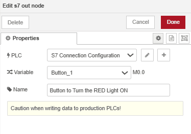

Siemens S7 PLCs are commonly used in industrial automation for everything from simple control tasks to more complex processes. But connecting these PLCs to other systems for things like remote monitoring or data sharing can be tricky. Node-RED makes this easier by providing a simple way to link Siemens S7 PLCs with other platforms. Its flow-based interface allows you to easily build custom workflows and dashboard without extensive technical knowledge.

<!--more-->

Siemens S7 PLCs are typically programmed using TIA Portal, Siemens' integrated development environment. For remote control and communication with external systems, the S7 protocol (ISO over TCP/IP) is commonly used. In this article, we'll guide you through leveraging Node-RED to read from and write to Siemens S7 PLCs, helping you unlock the full potential of your industrial automation systems.

## Prequsite

Before integrating your Siemens S7 PLC with Node-RED make sure you have following :

1. Make sure before downloading the ladder program and all configurations and settings to plc, has following setting:

- Allow PUT/GET Communication from remote partners.

{data-zoomable}
_PUT/GET Communication from remote partners is Allowed_

- Provide Full Access to the PLC (no protection), allowing unrestricted access for data exchange.

{data-zoomable}
_Providing complete access to the PLC_

1. Make sure you have the appropriate ladder program (or any other logic) written for your requirements and successfully downloaded to the PLC. This program should contain the necessary logic for interacting with the PLC's I/O and sensors/actuators as needed.

2. Install Node-RED on your device (e.g., Revolutionary Pi) to connect and transform data across systems. Use [FlowFuse Device Agent](/product/device-agent/) to manage Node-RED remotely, allowing control, monitoring, and flow creation without on-site visits. FlowFuse also supports enterprise features like collaboration, device management, and DevOps pipelines. For setup, refer to the [installation guide](/docs/device-agent/install/).

3. Verify that the device running Node-RED is in the same network as the PLC and can successfully ping the PLC. Also, ensure that the S7 port (typically port 102) is not blocked by a firewall.

```bash
ping <PLC_IP>
```

```bash
netstat -an | findstr 102
```

## Integrating Siemens S7 PLCs with Node-RED

Now that everything is set up, you're ready to start integrating your Siemens S7 PLC with Node-RED. In this article, I’ll demonstrate the process using a real Siemens S7-1212C PLC. I’ve wired it to a stack/tower light and will walk you through how to write data to the PLC to control this light. Later, I’ll show you how to read data and reflect the status of the light on the Node-RED dashboard using LED indicators.

The program I have in TIA Portal looks like Below, which uses M (internal memory bits used for storing temporary data or states) and Q (physical outputs that control devices). However, with Node-RED, it supports all data types that the PLC has. The process will be the same, except when working with Data Blocks (DB), which require some additional configuration which i tell you later in the blog.

_Ladder Logic to Control Outputs for Managing Lights_

## Addressing Scheme for Variables in Node-RED with S7 Node

The variables and their addresses configured on the S7 Endpoint follow a slightly different scheme than those used in Step 7 or TIA Portal. Therefore, when you add variables in the node, you must ensure that you follow the addressing format outlined in the below image.

| **Node-RED Address**      | **Step7 Equivalent**   | **Data Type**       | **Description**                                  |
|---------------------------|------------------------|---------------------|--------------------------------------------------|
| `DB5,X0.1`                | `DB5.DBX0.1`           | Boolean             | Bit 1 of byte 0 in DB5                          |
| `DB23,BYTE1`              | `DB23.DBB1`            | Number (Byte)       | Byte 1 (0-255) of DB23                          |
| `DB100,CHAR2`             | `DB100.DBB2`           | String              | Byte 2 of DB100 as Char                         |
| `DB42,INT3`               | `DB42.DBW3`            | Number (16-bit)     | Signed 16-bit number at byte 3 in DB42          |
| `DB57,WORD4`              | `DB57.DBW4`            | Number (16-bit)     | Unsigned 16-bit number at byte 4 in DB57        |
| `DB13,DINT5`              | `DB13.DBD5`            | Number (32-bit)     | Signed 32-bit number at byte 5 in DB13          |
| `DB19,DWORD6`             | `DB19.DBD6`            | Number (32-bit)     | Unsigned 32-bit number at byte 6 in DB19        |
| `DB21,REAL7`              | `DB21.DBD7`            | Floating Point (32) | Floating point number at byte 7 in DB21         |
| `DB2,S7.10*`              | -                      | String              | String (length 10) starting at byte 7 in DB2    |
| `I1.0`                    | `I1.0`                 | Boolean             | Bit 0 of byte 1 in input area                   |
| `Q2.1`                    | `Q2.1`                 | Boolean             | Bit 1 of byte 2 in output area                  |
| `M3.2`                    | `M3.2`                 | Boolean             | Bit 2 of byte 3 in memory area                  |
| `IB4`                     | `IB4`                  | Number (Byte)       | Byte 4 (0-255) in input area                    |
| `QB5`                     | `QB5`                  | Number (Byte)       | Byte 5 (0-255) in output area                   |
| `MB6`                     | `MB6`                  | Number (Byte)       | Byte 6 (0-255) in memory area                   |
| `IC7`                     | `IB7`                  | String              | Byte 7 of input area as Char                    |
| `QC8`                     | `QB8`                  | String              | Byte 8 of output area as Char                   |
| `MC9`                     | `MB9`                  | String              | Byte 9 of memory area as Char                   |
| `II10`                    | `IW10`                 | Number (16-bit)     | Signed 16-bit number at byte 10 in input area   |
| `QI12`                    | `QW12`                 | Number (16-bit)     | Signed 16-bit number at byte 12 in output area  |
| `MI14`                    | `MW14`                 | Number (16-bit)     | Signed 16-bit number at byte 14 in memory area  |
| `IW16`                    | `IW16`                 | Number (16-bit)     | Unsigned 16-bit number at byte 16 in input area |
| `QW18`                    | `QW18`                 | Number (16-bit)     | Unsigned 16-bit number at byte 18 in output area|
| `MW20`                    | `MW20`                 | Number (16-bit)     | Unsigned 16-bit number at byte 20 in memory area|
| `IDI22`                   | `ID22`                 | Number (32-bit)     | Signed 32-bit number at byte 22 in input area   |
| `QDI24`                   | `QD24`                 | Number (32-bit)     | Signed 32-bit number at byte 24 in output area  |
| `MDI26`                   | `MD26`                 | Number (32-bit)     | Signed 32-bit number at byte 26 in memory area  |
| `ID28`                    | `ID28`                 | Number (32-bit)     | Unsigned 32-bit number at byte 28 in input area |
| `QD30`                    | `QD30`                 | Number (32-bit)     | Unsigned 32-bit number at byte 30 in output area|
| `MD32`                    | `MD32`                 | Number (32-bit)     | Unsigned 32-bit number at byte 32 in memory area|
| `IR34`                    | `IR34`                 | Floating Point      | Floating point number at byte 34 in input area |
| `QR36`                    | `QR36`                 | Floating Point      | Floating point number at byte 36 in output area|
| `MR38`                    | `MR38`                 | Floating Point      | Floating point number at byte 38 in memory area|
| `DB1,DT0`                 | -                      | Date                | Timestamp in DATE_AND_TIME format              |
| `DB1,DTZ10`               | -                      | Date                | Timestamp in DATE_AND_TIME format (UTC)        |
| `DB2,DTL2`                | -                      | Date                | Timestamp in DTL format                         |
| `DB2,DTLZ12`              | -                      | Date                | Timestamp in DTL format (UTC)                  |
| `DB57,RWORD4`             | `DB57.DBW4`            | Number (16-bit)     | Unsigned 16-bit number, Little-Endian at byte 4|
| `DB13,RDI5`               | `DB13.DBD5`            | Number (32-bit)     | Signed 32-bit number, Little-Endian at byte 5  |
| `MRW20`                   | `MW20`                 | Number (16-bit)     | Unsigned 16-bit number, Little-Endian at byte 20|

For example, consider you have a ladder logic program in TIA Portal with addresses like DB5.DBX0.0 and DB13.DBW4. When you want to use these in the Node-RED S7 node, you need to adjust the address format slightly. In Node-RED, DB5.DBX0.0 would be represented as DB5,X0.0 and DB13.DBW4 would be written as DB13,WORD4. Essentially, you look at the TIA Portal address, find the corresponding format in the Node-RED address column, and use that format in the S7 node configuration.

If you are integrating Siemens LOGO, please refer to the node's [README](https://flows.nodered.org/node/node-red-contrib-s7) as the addressing is different for it.

## Configuring the S7 Node to Connect to the PLC

Now that your setup is ready, it’s time to establish a connection between Node-RED and your Siemens S7 PLC. The S7 node in Node-RED simplifies this process, allowing easy configuration for communication. Follow the steps below to connect and start interacting with your PLC.

1. Drag the S7 node onto the Node-RED canvas.
2. Double-click on the S7 node and click on the "+" icon to add a PLC configuration.
3. Select "Ethernet (ISO on TCP)" as the transport protocol, then enter the IP address of your PLC. The default port (102) is used for S7 communication, so leave it unchanged.
4. Set the Mode to "Rack", then enter the Rack ID and Slot ID. These values can be found in the TIA Portal under the Device View of your configured device.
5. Enter the Cycle Time (interval for communication with the PLC) and Timeout Duration (maximum time to wait for a response).
6. Once done, switch to the Variables tab and add all of the variables with the correct address and name that you want to read or write.

{data-zoomable}
_Adding Variables into s7 node_

7. After adding the variables, click Add and then Done.
8. Deploy the flow by clicking the top-right Deploy button. Once deployed, the status of the connection will be displayed at the bottom of the node. If connected successfully, it will show a green connected status.

{data-zoomable}
_Configuring S7 node for connection_

### Writing Data to the PLC

Now that you’ve configured the connection, it’s time to use Node-RED to write data to the PLC to control light.

1. Drag the s7 out node onto the canvas.
2. Double-click on the node and select the variable that you want to update or write a value to.
3. Select the PLC configuration that we have added.
4. Click Done.
5. Now the node is ready to write data to the PLC. To do so, you can use standard Node-RED nodes such as Inject, Change, or Function to build the workflow that meets your requirements.  Alternatively, you can build a dashboard using the Flowfuse Dashboard. For example, based on my ladder logic, I need to change the values of M0.0, M0.1, and M0.2 to control the tower lights. Setting these values to `TRUE` will turn on the red, yellow, and green lights respectively. Be sure to send the correct data type according to the data configuration set in the program.

{data-zoomable}
_Configuring S7-out Node to write data to plc_

Note: Note: If you are trying to read the DB blocks, you will need to untick the option for 'Optimized Block Access' in data block properties

{data-zoomable}
_Untick 'Optimized Block Access'._

I’ve created an interactive dashboard using Flowfuse Dashboard, which allows you to send commands to the PLC in an easy and intuitive way. If you're not familiar with Flowfuse Dashboard, please refer to the the [Flowfuse Dashboard Getting Started Guide](https://dashboard.flowfuse.com/getting-started.html).

Below is the complete flow with the dashboard interface for controlling the tower lights, where we have 3 buttons—one for each light. Pressing and holding a button will turn the light on, and releasing it will turn the light off.

### Reading Data from the PLC

To read data from a Siemens S7 PLC, you will configure Node-RED to pull real-time information, such as the status of inputs, outputs, or internal memory. This enables you to monitor and visualize key parameters from the PLC, integrating them into your workflows or displaying them on a dashboard for real-time updates.

1. Drag the `s7-in` node onto the canvas.
2. Double-click on it and select the correct PLC configuration that you have added.
3. Select the appropriate mode based on your requirement. If you want to read only one variable with this node, select "Single Variable Mode". In the next "Variable" dropdown, select the specific variable. Alternatively, choose "All Variables" (One per message or all at once) if you want to read multiple variables.
4. Enable the "Emit only when value changes (diff)" option if you only want to read the value when it changes or differs.
5. Click "Done" and deploy the flow.

{data-zoomable}
_Configuring S7-in Node to Read data from plc_

You can add a "Debug" node to the `s7-in` node's output to verify that the data is being read correctly. Additionally, you can add "LEDs" to the dashboard to visualize the status of the lights in real-time.

Here’s the complete flow that reads data from all three outputs and updates the interface to include LEDs showing the light statuses.


## Truobuleshooting 

When you try to establish a connection with the PLC, you may encounter the following error. This error occurs because your device has established the connection but is unable to communicate. To resolve this issue, ensure that you have configured all the settings mentioned in the prerequisites. If the problem persists, it could be because your PLC and the device running Node-RED are on different networks.

{data-zoomable}
_"Error: This service is not implemented on the modeul or frame error was reported"_

Make sure the IP addresses of your device and PLC are in the same subnet. If the PLC is connected to the internet via a router, all devices (PLC, Node-RED device, and router) should have IP addresses within the same subnet. For example, if your PLC has the address 192.168.1.1, ensure that the other devices have IP addresses in the range 192.168.1.x.

## Conclusion 

Integrating Siemens S7 PLCs with Node-RED opens up powerful automation possibilities with minimal complexity. By following the steps outlined in this guide, you can easily connect your PLC to Node-RED, control devices, and visualize real-time data on dashboards. Whether you're writing data to control outputs or reading sensor values, Node-RED offers a flexible, user-friendly platform for industrial automation.
