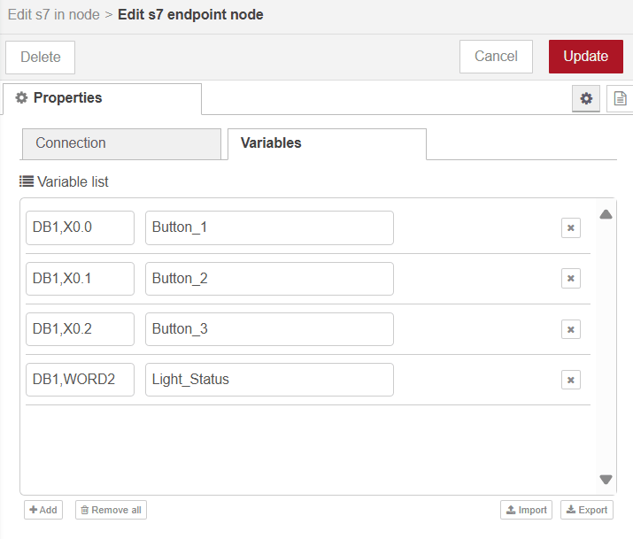

Siemens S7 PLCs are a staple in industrial automation, powering everything from basic control functions to complex, large-scale processes. However, integrating these PLCs with other systems for remote monitoring or data sharing can present challenges.

<!--more-->

This is where Node-RED comes in, offering a user-friendly solution to seamlessly connect Siemens S7 PLCs with a variety of platforms. With its intuitive flow-based interface, Node-RED enables you to create custom workflows and dashboards—no deep technical expertise required.

Siemens S7 PLCs are typically programmed using TIA Portal, Siemens' integrated development environment, and communication with external systems usually relies on the S7 protocol (ISO over TCP/IP). In this article, we’ll walk you through how to use Node-RED to read from and write to Siemens S7 PLCs via the S7 protocol, unlocking new possibilities for remote control and system integration in your industrial automation setup.

## Prerequisite

Before integrating your Siemens S7 PLC with Node-RED, make sure you have the following :

1. Before downloading the ladder program and all configurations and settings to your PLC, make sure you have the following settings:

- Allow PUT/GET Communication from remote partners.

{data-zoomable}
_PUT/GET Communication from remote partners is Allowed_

- Provide full access to the PLC (no protection), allowing unrestricted access to data exchange.

{data-zoomable}
_Providing complete access to the PLC_

2. Ensure that the appropriate ladder program (or any other logic) is written according to your requirements and successfully downloaded to the PLC. However, before downloading, make sure the 'Optimized Block Access' option is disabled for the data block that your ladder program using.

{data-zoomable}
_Untick 'Optimized Block Access.'_

3. Install Node-RED on the device that will communicate with the S7 PLC. You cannot install Node-RED directly on the S7 PLC, as PLCs are typically controllers, not computers. For example, you can use a device like the Revolutionary Pi to connect and transfer data across systems. Use the [FlowFuse Device Agent](/platform/device-agent/) to install Node-RED on your device. 

- Why FlowFuse Device Agent? It allows you to manage Node-RED remotely, enabling control, monitoring, and flow creation without the need for on-site visits. FlowFuse also offers a suite of enterprise-grade features such as collaboration, device management, and DevOps pipelines, which are essential in industrial environments. These features help streamline operations and ensure scalability in complex automation systems. [Sign up for free]() to get started.

4. Verify that the device running Node-RED is in the same network as the PLC and can successfully ping the PLC. Also, a firewall should not block the S7 port (typically port 102).

## Integrating Siemens S7 PLCs with Node-RED

Now that everything is set up, let's integrate your Siemens S7 PLC with Node-RED. In this article, I’ll demonstrate the process using a Siemens S7-1212C PLC. I’ve connected it to a stack/tower light and will walk you through how to write data to the PLC to control this light. Later, I’ll show you how to read data and reflect the status of the light.

My program in TIA Portal is structured as shown below, utilizing DB (Data Blocks) and Q (physical outputs) to control devices. However, Node-RED can retrieve almost all types of data from the PLC. The process is similar for most data types.

_Ladder Logic to Control Outputs for Managing Lights_

Let’s break down what’s happening in the ladder logic above. First, we have open contacts, each with address variables defined in a separate Data Block. There are three open branches, each starting with an open contact. Each contact is connected to an output that alters the status of a Q physical address. Each Q corresponds to a physical output on the PLC, which is wired to the lights. When we change the status of a contact to "true," it activates the corresponding light by altering the state of the Q output, which reflects the change in the physical output.

### Installing the S7 Node

To communicate from Node-RED to the PLC, we need to install the S7 node, which allows Node-RED to interface with Siemens S7 PLCs. In this article, we will be using `node-red-contrib-s7`, which is quite popular. If this particular node is not suitable for your workflow you can find alternatives in the [Node-RED catalog](https://flows.nodered.org/search?term=siemens&type=node).

#### Steps to Install the S7 Node:

1. Open your Node-RED editor in a web browser.
2. Open the main menu by clicking the three horizontal lines in the top-right corner.
3. Click "Manage Palette" from the menu.
4. Switch to the "Install" tab and type `node-red-contrib-s7` in the search field.
5. Click "Install" next to the node name.

Once the installation is complete, the S7 nodes will be available in your Node-RED palette, and you can start using it to communicate with your Siemens S7 PLC.

### Addressing Scheme for Variables in Node-RED with the S7 Node

Before we start, it's important to note that the variables and their addresses configured on the S7 endpoint follow a slightly different addressing scheme compared to those used in Step 7 or the TIA Portal. Therefore, when adding variables to the S7 node in Node-RED, you must ensure that you follow the correct addressing format outlined in the table below.

| **Node-RED Address**      | **Step7 Equivalent**   | **Data Type**       | **Description**                                  |
|---------------------------|------------------------|---------------------|--------------------------------------------------|
| `DB5,X0.1`                | `DB5.DBX0.1`           | Boolean             | Bit 1 of byte 0 in DB5                          |
| `DB23,BYTE1`              | `DB23.DBB1`            | Number (Byte)       | Byte 1 (0-255) of DB23                          |
| `DB100,CHAR2`             | `DB100.DBB2`           | String              | Byte 2 of DB100 as Char                         |
| `DB42,INT3`               | `DB42.DBW3`            | Number (16-bit)     | Signed 16-bit number at byte 3 in DB42          |
| `DB57,WORD4`              | `DB57.DBW4`            | Number (16-bit)     | Unsigned 16-bit number at byte 4 in DB57        |
| `DB13,DINT5`              | `DB13.DBD5`            | Number (32-bit)     | Signed 32-bit number at byte 5 in DB13          |
| `DB19,DWORD6`             | `DB19.DBD6`            | Number (32-bit)     | Unsigned 32-bit number at byte 6 in DB19        |
| `DB21,REAL7`              | `DB21.DBD7`            | Floating Point (32) | Floating point number at byte 7 in DB21         |
| `DB2,S7.10*`              | -                      | String              | String (length 10) starting at byte 7 in DB2    |
| `I1.0`                    | `I1.0`                 | Boolean             | Bit 0 of byte 1 in input area                   |
| `Q2.1`                    | `Q2.1`                 | Boolean             | Bit 1 of byte 2 in output area                  |
| `M3.2`                    | `M3.2`                 | Boolean             | Bit 2 of byte 3 in memory area                  |
| `IB4`                     | `IB4`                  | Number (Byte)       | Byte 4 (0-255) in input area                    |
| `QB5`                     | `QB5`                  | Number (Byte)       | Byte 5 (0-255) in output area                   |
| `MB6`                     | `MB6`                  | Number (Byte)       | Byte 6 (0-255) in memory area                   |
| `IC7`                     | `IB7`                  | String              | Byte 7 of input area as Char                    |
| `QC8`                     | `QB8`                  | String              | Byte 8 of output area as Char                   |
| `MC9`                     | `MB9`                  | String              | Byte 9 of memory area as Char                   |
| `II10`                    | `IW10`                 | Number (16-bit)     | Signed 16-bit number at byte 10 in input area   |
| `QI12`                    | `QW12`                 | Number (16-bit)     | Signed 16-bit number at byte 12 in output area  |
| `MI14`                    | `MW14`                 | Number (16-bit)     | Signed 16-bit number at byte 14 in memory area  |
| `IW16`                    | `IW16`                 | Number (16-bit)     | Unsigned 16-bit number at byte 16 in input area |
| `QW18`                    | `QW18`                 | Number (16-bit)     | Unsigned 16-bit number at byte 18 in output area|
| `MW20`                    | `MW20`                 | Number (16-bit)     | Unsigned 16-bit number at byte 20 in memory area|
| `IDI22`                   | `ID22`                 | Number (32-bit)     | Signed 32-bit number at byte 22 in input area   |
| `QDI24`                   | `QD24`                 | Number (32-bit)     | Signed 32-bit number at byte 24 in output area  |
| `MDI26`                   | `MD26`                 | Number (32-bit)     | Signed 32-bit number at byte 26 in memory area  |
| `ID28`                    | `ID28`                 | Number (32-bit)     | Unsigned 32-bit number at byte 28 in input area |
| `QD30`                    | `QD30`                 | Number (32-bit)     | Unsigned 32-bit number at byte 30 in output area|
| `MD32`                    | `MD32`                 | Number (32-bit)     | Unsigned 32-bit number at byte 32 in memory area|
| `IR34`                    | `IR34`                 | Floating Point      | Floating point number at byte 34 in input area |
| `QR36`                    | `QR36`                 | Floating Point      | Floating point number at byte 36 in output area|
| `MR38`                    | `MR38`                 | Floating Point      | Floating point number at byte 38 in memory area|
| `DB1,DT0`                 | -                      | Date                | Timestamp in DATE_AND_TIME format              |
| `DB1,DTZ10`               | -                      | Date                | Timestamp in DATE_AND_TIME format (UTC)        |
| `DB2,DTL2`                | -                      | Date                | Timestamp in DTL format                         |
| `DB2,DTLZ12`              | -                      | Date                | Timestamp in DTL format (UTC)                  |
| `DB57,RWORD4`             | `DB57.DBW4`            | Number (16-bit)     | Unsigned 16-bit number, Little-Endian at byte 4|
| `DB13,RDI5`               | `DB13.DBD5`            | Number (32-bit)     | Signed 32-bit number, Little-Endian at byte 5  |
| `MRW20`                   | `MW20`                 | Number (16-bit)     | Unsigned 16-bit number, Little-Endian at byte 20|

For example, consider that you have a ladder logic program in the TIA Portal with addresses like DB5.DBX0.0 and DB13.DBW4. You must adjust the address format slightly when you want to use these in the Node-RED S7 node. In Node-RED, DB5.DBX0.0 would be represented as DB5,X0.0 and DB13.DBW4 would be written as DB13,WORD4. Essentially, you look at the TIA Portal address, find the corresponding format in the Node-RED address column, and use that format in the S7 node configuration.

If you wanted integrate Siemens LOGO, please refer to the node's [README](https://flows.nodered.org/node/node-red-contrib-s7), as the addressing differs.

### Configuring the S7 Node to Connect to the PLC

Now that you have all the necessary knowledge and setup, let's start by establishing a connection between Node-RED and your Siemens S7 PLC. The S7 node in Node-RED simplifies the process, making it easy to configure communication. Follow the steps below to connect and start interacting with your PLC

1. Drag the S7 node onto the Node-RED canvas.
2. Double-click on the S7 node and click on the "+" icon to add a PLC configuration.
3. Select "Ethernet (ISO on TCP)" as the transport protocol, then enter your PLC's IP address. The default port (102) is used for S7 communication, so leave it unchanged.
4. Set the Mode to "Rack," then enter the Rack ID and Slot ID. These values can be found in the TIA Portal under the Device View tab on your configured device.

{data-zoomable}
_Image showing window from where you will get the Rack No and Slot No_

5. Enter the Cycle Time (interval for communication with the PLC) and Timeout Duration (maximum time to wait for a response).
6. Once done, switch to the Variables tab and add all the variables with the correct address and name you want to read or write.

{data-zoomable}
_Adding Variables into s7 node_

7. After adding the variables, click Add and then Done.
8. Deploy the flow by clicking the top-right Deploy button. Once deployed, the connection status will be displayed at the bottom of the node. If connected successfully, it will show a green squre with "online" status.

{data-zoomable}
_Configuring S7 node for connection_

### Writing Data to the PLC

Now that you’ve configured the connection, it’s time to use Node-RED to write data to the PLC to control light.

1. Drag the s7-out node onto the canvas.
2. Double-click on the node and select the variable to which you want to update or write a value.
3. Select the PLC configuration that we have added.
4. Click Done.

{data-zoomable}
_Configuring S7-out Node to write data to plc_

5. The node is now ready to write data to the PLC. You can use standard Node-RED nodes like Inject, Change, or Function to create a workflow that sends the data. Ensure the data type matches the configuration set in the PLC program. For example, in my ladder logic, I need to modify the status of individual open contacts, each with its own address, such as DB1.DBX0.0, DB1.DBX0.1, and DB1.DBX0.2, to control the tower lights. Setting these contacts to TRUE will turn on the red, yellow, and green lights, respectively. You can send the data using the nodes I’ve mentioned, or you can build a custom dashboard with [FlowFuse Dashboard](/platform/dashboard/) for easier interaction.

6. Once your flow is set up and the s7-out node for each variable is configured, click Deploy in the top-right corner to activate the flow.

<iframe width="100%" height="315" src="https://www.youtube.com/embed/AilWMNPzP1Q" title="YouTube video player" frameborder="0" allow="accelerometer; autoplay; clipboard-write; encrypted-media; gyroscope; picture-in-picture" allowfullscreen></iframe>

In the video above, the dashboard interface is built to control the stack light. At the end of this article, I will provide the complete flow for you to download.

If you're building a dashboard, keep in mind that while you can create it on Node-RED within the remote instance on FlowFuse Device Agent, you won’t be able to access it remotely across the editor tunnel. You can of course access it locally on the device or on the local LAN. For this demonstration, I wish to access the dashboard remotely across the internet and so I will create the dashboard in a hosted instance of Node-RED and use the FlowFuse Projects nodes to simply and securely pass the necessary values to and from the remote Node-RED instance. For more details on how to set this up, check out our article: [Exploring FlowFuse Project Nodes](/blog/2024/10/exploring-flowfuse-project-nodes/).

### Reading Data from the PLC 

Now that we’ve covered how to write data to your Siemens S7 PLC, let's move on to reading data from it. Node-RED makes it easy to retrieve important information such as the status of inputs, outputs, or internal memory. By pulling this data into your workflows or visualizing it on a dashboard, you can monitor key parameters in real time and gain valuable insights.

However, before we dive in, it's important to consider that reading individual data points one by one in large-scale manufacturing systems can lead to delays. This approach may not be efficient, especially when dealing with a large number of data points. For more information on these challenges and potential solutions, you can refer to this article: [Modernize Your Legacy Industrial Data - Part 2](/blog/2023/09/modernize-your-legacy-industrial-data-part2/).

To address this issue, you can optimize data retrieval by storing output status values in a single word or double word within the PLC. For our example, I have created a custom function in my program that assigns the output values to individual bits of the word. 

{data-zoomable}
_Custom ladder diagram function storing output statuses in a single word for optimized data retrieval._

There are several ways to implement this, and depending on your system’s needs, some methods may be more efficient than others. In this case, the output values are stored in a single word within the PLC, as shown in the ladder diagram above. This is not the only correct method—it's simply one approach that works for this particular scenario. Feel free to adapt or explore other methods that might better suit your setup. 

Additionally, if the data you’re reading is mission-critical and you can't afford to lose any, consider using a FIFO stack or buffer in your PLC program. This method ensures that even if there is a network outage or computer problem, no data is lost as it will remain siting in the stack until your Node-RED is back on line and retrieves it.  This ensures no gaps or interruptions in your data and guarantees data integrity.

Now, let’s begin reading the data from the PLC.

1. Drag the `s7-in` node onto the canvas.
2. Double-click on the node to open the configuration and select the appropriate PLC configuration from the list of available connections.
3. Choose the appropriate mode based on your requirements. If you want to read only one variable, select "Single Variable Mode". In this mode, the "Variable" dropdown will allow you to select only a single variable at a time. If you need to read multiple variables, you can select "All Variables" mode, but be aware that the node might still process each request sequentially, depending on its internal workings (which is not fully documented). This can be inefficient when dealing with hundreds of variables.
4. Choose the variable that corresponds to the word or double word containing all the data points you want to read. For example, if you’ve configured the word in the PLC as `DB.DBW2`, the format in the s7-in node will be `DB,WORD2`.
5. Enable the "Emit only when value changes (diff)" option to ensure that the node only triggers when the value of the variable changes, reducing unnecessary reads and improving efficiency.
6. Once your configuration is set, click "Done" and then deploy the flow to start reading data from the PLC.

{data-zoomable}
_Configuring S7-in Node to Read data from plc_

You can add a "Debug" node to the `s7-in` node's output to verify that the data is being read correctly.

Once you see the printed data, you might be surprised, or perhaps you already expected this: since the word data type we're reading is not directly available in Node.js or Node-RED, we'll receive it as an integer. But don't worry—you can convert it into the format that suits your needs using node-red-contrib-buffer-parser. In this integer scenario, you'll need to shift the bits or extract individual values to match your desired output, such as isolating specific bits to represent different statuses or control points. The flow provided at the end demonstrates the implementation of this conversion.

Now that you have the desired format for your output data, you may want to build a dashboard interface with LEDs, gauges, or charts to monitor and visualize the data you've retrieved. You can use the FlowFuse Dashboard, as suggested earlier.

The video below shows the updated dashboard interface used to monitor the stack light LED status:

<iframe width="100%" height="315" src="https://www.youtube.com/embed/Nlyk_BATKGE" title="YouTube video player" frameborder="0" allow="accelerometer; autoplay; clipboard-write; encrypted-media; gyroscope; picture-in-picture" allowfullscreen></iframe>

Here is the flow you can import into your FlowFuse remote instance and deploy. Ensure that you have installed `node-red-contrib-s7` and `node-red-contrib-buffer-parser`. This flow includes S7 nodes for interacting with the S7 PLC and Project nodes for communicating with the FlowFuse hosted instance, where you will build the dashboard.


[{"id":"0ffc8c2703b5e059","type":"group","z":"FFF0000000000001","style":{"stroke":"#b2b3bd","stroke-opacity":"1","fill":"#f2f3fb","fill-opacity":"0.5","label":true,"label-position":"nw","color":"#32333b"},"nodes":["061313277591a004","a8499bc2443f0bd9","2974dd47fda54b9c","4c009f6076f47eb6","f4378d1e7c268e1e","63abd67743263739"],"x":54,"y":99,"w":732,"h":202},{"id":"061313277591a004","type":"s7 out","z":"FFF0000000000001","g":"0ffc8c2703b5e059","endpoint":"f2f06ce027c97e4d","variable":"Button_1","name":"Button to Turn the RED Light ON","x":620,"y":140,"wires":[]},{"id":"a8499bc2443f0bd9","type":"s7 out","z":"FFF0000000000001","g":"0ffc8c2703b5e059","endpoint":"f2f06ce027c97e4d","variable":"Button_2","name":"Button to turn the Yellow light ON","x":620,"y":200,"wires":[]},{"id":"2974dd47fda54b9c","type":"s7 out","z":"FFF0000000000001","g":"0ffc8c2703b5e059","endpoint":"f2f06ce027c97e4d","variable":"Button_3","name":"Button to turn Green light  ON","x":610,"y":260,"wires":[]},{"id":"4c009f6076f47eb6","type":"project link in","z":"FFF0000000000001","g":"0ffc8c2703b5e059","name":"Project in node to control the red light","project":"all","broadcast":true,"topic":"light_control_red","x":230,"y":140,"wires":[["061313277591a004"]]},{"id":"f4378d1e7c268e1e","type":"project link in","z":"FFF0000000000001","g":"0ffc8c2703b5e059","name":"Project in node to control the yellow light","project":"all","broadcast":true,"topic":"light_control_yellow","x":240,"y":200,"wires":[["a8499bc2443f0bd9"]]},{"id":"63abd67743263739","type":"project link in","z":"FFF0000000000001","g":"0ffc8c2703b5e059","name":"Project in node to control the green light","project":"all","broadcast":true,"topic":"light_control_green","x":240,"y":260,"wires":[["2974dd47fda54b9c"]]},{"id":"f2f06ce027c97e4d","type":"s7 endpoint","transport":"iso-on-tcp","address":"192.168.1.6","port":"102","rack":"0","slot":"1","localtsaphi":"01","localtsaplo":"00","remotetsaphi":"01","remotetsaplo":"00","connmode":"rack-slot","adapter":"","busaddr":"2","cycletime":"1000","timeout":"2000","name":"S7 Connection Configuration","vartable":[{"addr":"DB1,X0.0","name":"Button_1"},{"addr":"DB1,X0.1","name":"Button_2"},{"addr":"DB1,X0.2","name":"Button_3"},{"addr":"DB1,WORD2","name":"LightStatus"}]},{"id":"23fd40630dbef712","type":"group","z":"FFF0000000000001","style":{"stroke":"#b2b3bd","stroke-opacity":"1","fill":"#f2f3fb","fill-opacity":"0.5","label":true,"label-position":"nw","color":"#32333b"},"nodes":["a45637418005d0e5","a8ea1622d1fad4ba","8d9a9dc4183a778e","d60a74a5430df7ae"],"x":54,"y":339,"w":972,"h":82},{"id":"a45637418005d0e5","type":"s7 in","z":"FFF0000000000001","g":"23fd40630dbef712","endpoint":"f2f06ce027c97e4d","mode":"single","variable":"LightStatus","diff":true,"name":"","x":150,"y":380,"wires":[["d60a74a5430df7ae"]]},{"id":"a8ea1622d1fad4ba","type":"project link out","z":"FFF0000000000001","g":"23fd40630dbef712","name":"project out node to send the light status","mode":"link","broadcast":true,"project":"c51f38c2-6c80-442a-a9e2-10ddd68fb606","topic":"light_status","x":840,"y":380,"wires":[]},{"id":"8d9a9dc4183a778e","type":"buffer-parser","z":"FFF0000000000001","g":"23fd40630dbef712","name":"","data":"payload","dataType":"msg","specification":"spec","specificationType":"ui","items":[{"type":"bool","name":"red","offset":0,"length":1,"offsetbit":0,"scale":"1","mask":""},{"type":"bool","name":"yellow","offset":0,"length":1,"offsetbit":1,"scale":"1","mask":""},{"type":"bool","name":"green","offset":0,"length":1,"offsetbit":2,"scale":"1","mask":""},{"type":"bool","name":"all","offset":0,"length":16,"offsetbit":0,"scale":"1","mask":""}],"swap1":"","swap2":"","swap3":"","swap1Type":"swap","swap2Type":"swap","swap3Type":"swap","msgProperty":"payload","msgPropertyType":"str","resultType":"keyvalue","resultTypeType":"return","multipleResult":false,"fanOutMultipleResult":false,"setTopic":true,"outputs":1,"x":530,"y":380,"wires":[["a8ea1622d1fad4ba"]]},{"id":"d60a74a5430df7ae","type":"buffer-maker","z":"FFF0000000000001","g":"23fd40630dbef712","name":"","specification":"spec","specificationType":"ui","items":[{"name":"1stword","type":"uint16le","length":1,"dataType":"msg","data":"payload"}],"swap1":"","swap2":"","swap3":"","swap1Type":"swap","swap2Type":"swap","swap3Type":"swap","msgProperty":"payload","msgPropertyType":"str","x":330,"y":380,"wires":[["8d9a9dc4183a778e"]]}]


Below is the flow that you can import and deploy into the hosted instance created on FlowFuse. With this flow, you'll have a dashboard to control and monitor the tower lights. Just make sure you have installed `@flowfuse/node-red-dashboard` and `@flowfuse/node-red-dashboard-2-ui-led`, and ensure the hosted instance is in the same FlowFuse team as your remote instance.


[{"id":"1f56099d53798b99","type":"group","z":"eb351e503901d04f","style":{"stroke":"#b2b3bd","stroke-opacity":"1","fill":"#f2f3fb","fill-opacity":"0.5","label":true,"label-position":"nw","color":"#32333b"},"nodes":["1e6a379c83bac6b4","f015125886fec5a6","76c696f160db3ca2","1974cfc417898151","9c503fe31081dc2f","9501e2eb7690a0b5"],"x":74,"y":79,"w":652,"h":202},{"id":"1e6a379c83bac6b4","type":"ui-button","z":"eb351e503901d04f","g":"1f56099d53798b99","group":"d4102809d229cb95","name":"","label":"YELLOW","order":5,"width":"3","height":"2","emulateClick":false,"tooltip":"","color":"","bgcolor":"","className":"","icon":"","iconPosition":"left","payload":"","payloadType":"str","topic":"topic","topicType":"msg","buttonColor":"yellow","textColor":"","iconColor":"","enableClick":false,"enablePointerdown":true,"pointerdownPayload":"1","pointerdownPayloadType":"num","enablePointerup":true,"pointerupPayload":"0","pointerupPayloadType":"num","x":160,"y":180,"wires":[["1974cfc417898151"]]},{"id":"f015125886fec5a6","type":"ui-button","z":"eb351e503901d04f","g":"1f56099d53798b99","group":"d4102809d229cb95","name":"","label":"RED","order":4,"width":"3","height":"2","emulateClick":false,"tooltip":"","color":"","bgcolor":"","className":"","icon":"","iconPosition":"left","payload":"","payloadType":"str","topic":"topic","topicType":"msg","buttonColor":"red","textColor":"","iconColor":"","enableClick":false,"enablePointerdown":true,"pointerdownPayload":"1","pointerdownPayloadType":"num","enablePointerup":true,"pointerupPayload":"0","pointerupPayloadType":"num","x":150,"y":120,"wires":[["9501e2eb7690a0b5"]]},{"id":"76c696f160db3ca2","type":"ui-button","z":"eb351e503901d04f","g":"1f56099d53798b99","group":"d4102809d229cb95","name":"","label":"GREEN","order":6,"width":"3","height":"2","emulateClick":false,"tooltip":"","color":"","bgcolor":"","className":"","icon":"","iconPosition":"left","payload":"","payloadType":"str","topic":"topic","topicType":"msg","buttonColor":"green","textColor":"","iconColor":"","enableClick":false,"enablePointerdown":true,"pointerdownPayload":"1","pointerdownPayloadType":"num","enablePointerup":true,"pointerupPayload":"0","pointerupPayloadType":"num","x":160,"y":240,"wires":[["9c503fe31081dc2f"]]},{"id":"1974cfc417898151","type":"project link out","z":"eb351e503901d04f","g":"1f56099d53798b99","name":"Project out node to control the yellow light","mode":"link","broadcast":true,"project":"c51f38c2-6c80-442a-a9e2-10ddd68fb606","topic":"light_control_yellow","x":530,"y":180,"wires":[]},{"id":"9c503fe31081dc2f","type":"project link out","z":"eb351e503901d04f","g":"1f56099d53798b99","name":"Project out node to control the green light","mode":"link","broadcast":true,"project":"c51f38c2-6c80-442a-a9e2-10ddd68fb606","topic":"light_control_green","x":520,"y":240,"wires":[]},{"id":"9501e2eb7690a0b5","type":"project link out","z":"eb351e503901d04f","g":"1f56099d53798b99","name":"Project out node to control the red light","mode":"link","broadcast":true,"project":"c51f38c2-6c80-442a-a9e2-10ddd68fb606","topic":"light_control_red","x":520,"y":120,"wires":[]},{"id":"d4102809d229cb95","type":"ui-group","name":"Group 1","page":"62085b96f178f643","width":"3","height":1,"order":1,"showTitle":false,"className":"","visible":"true","disabled":"false","groupType":"default"},{"id":"62085b96f178f643","type":"ui-page","name":"Page 1","ui":"02c25e8a30f9379d","path":"/page1","icon":"home","layout":"notebook","theme":"f6f5e7ae33bf6878","breakpoints":[{"name":"Default","px":"0","cols":"3"},{"name":"Tablet","px":"576","cols":"6"},{"name":"Small Desktop","px":"768","cols":"9"},{"name":"Desktop","px":"1024","cols":"12"}],"order":1,"className":"","visible":"true","disabled":"false"},{"id":"02c25e8a30f9379d","type":"ui-base","name":"My Dashboard","path":"/dashboard","appIcon":"","includeClientData":true,"acceptsClientConfig":["ui-notification","ui-control"],"showPathInSidebar":false,"showPageTitle":true,"navigationStyle":"default","titleBarStyle":"hidden"},{"id":"f6f5e7ae33bf6878","type":"ui-theme","name":"Default Theme","colors":{"surface":"#ffffff","primary":"#0094ce","bgPage":"#1a1a1a","groupBg":"#000000","groupOutline":"#000000"},"sizes":{"density":"default","pagePadding":"12px","groupGap":"12px","groupBorderRadius":"4px","widgetGap":"12px"}},{"id":"82cc6997fddd0b4b","type":"group","z":"eb351e503901d04f","style":{"stroke":"#b2b3bd","stroke-opacity":"1","fill":"#f2f3fb","fill-opacity":"0.5","label":true,"label-position":"nw","color":"#32333b"},"nodes":["d163a7ab23f7458f","20d211683534362b","b1477193956e591b","fb8801a4accc3c15","2f62948afcfde259","6966f129e718d20a","a5cecf8e8adf6eef"],"x":74,"y":299,"w":872,"h":202},{"id":"d163a7ab23f7458f","type":"ui-led","z":"eb351e503901d04f","g":"82cc6997fddd0b4b","name":"Status of RED light","group":"d4102809d229cb95","order":1,"width":"1","height":"3","label":"","labelPlacement":"left","labelAlignment":"left","states":[{"value":"true","valueType":"bool","color":"#ff0000"},{"value":"false","valueType":"bool","color":"#787878"}],"allowColorForValueInMessage":false,"shape":"circle","showBorder":true,"showGlow":true,"x":810,"y":340,"wires":[]},{"id":"20d211683534362b","type":"ui-led","z":"eb351e503901d04f","g":"82cc6997fddd0b4b","name":"Status of Yellow light","group":"d4102809d229cb95","order":2,"width":"1","height":"3","label":"","labelPlacement":"left","labelAlignment":"left","states":[{"value":"true","valueType":"bool","color":"#c8ff00"},{"value":"false","valueType":"bool","color":"#787878"}],"allowColorForValueInMessage":false,"shape":"circle","showBorder":true,"showGlow":true,"x":820,"y":400,"wires":[]},{"id":"b1477193956e591b","type":"ui-led","z":"eb351e503901d04f","g":"82cc6997fddd0b4b","name":"Status of Green light","group":"d4102809d229cb95","order":3,"width":"1","height":"3","label":"","labelPlacement":"left","labelAlignment":"left","states":[{"value":"true","valueType":"bool","color":"#41891a"},{"value":"false","valueType":"bool","color":"#787878"}],"allowColorForValueInMessage":false,"shape":"circle","showBorder":true,"showGlow":true,"x":820,"y":460,"wires":[]},{"id":"fb8801a4accc3c15","type":"change","z":"eb351e503901d04f","g":"82cc6997fddd0b4b","name":"","rules":[{"t":"set","p":"payload","pt":"msg","to":"payload.red","tot":"msg"}],"action":"","property":"","from":"","to":"","reg":false,"x":600,"y":340,"wires":[["d163a7ab23f7458f"]]},{"id":"2f62948afcfde259","type":"change","z":"eb351e503901d04f","g":"82cc6997fddd0b4b","name":"","rules":[{"t":"set","p":"payload","pt":"msg","to":"payload.yellow","tot":"msg"}],"action":"","property":"","from":"","to":"","reg":false,"x":600,"y":400,"wires":[["20d211683534362b"]]},{"id":"6966f129e718d20a","type":"change","z":"eb351e503901d04f","g":"82cc6997fddd0b4b","name":"","rules":[{"t":"set","p":"payload","pt":"msg","to":"payload.green","tot":"msg"}],"action":"","property":"","from":"","to":"","reg":false,"x":600,"y":460,"wires":[["b1477193956e591b"]]},{"id":"a5cecf8e8adf6eef","type":"project link in","z":"eb351e503901d04f","g":"82cc6997fddd0b4b","name":"project in node to receive the light status","project":"all","broadcast":true,"topic":"light_status","x":260,"y":400,"wires":[["fb8801a4accc3c15","2f62948afcfde259","6966f129e718d20a"]]}]


## Troubleshooting 

When you try to establish a connection with the PLC, you may encounter the following error. This error occurs because your device has established the connection but is unable to communicate. To resolve this issue, ensure that you have configured all the settings mentioned in the prerequisites. If the problem persists, it could be because your PLC and the device running Node-RED are on different networks.

{data-zoomable}
_"Error: This service is not implemented on the modeul or frame error was reported"_

Make sure the IP addresses of your device and PLC are in the same subnet. If the PLC is connected to the internet via a router, all devices (PLC, Node-RED device, and router) should have IP addresses within the same subnet. For example, if your PLC has the address 192.168.1.1, ensure that the other devices have IP addresses in the range 192.168.1.x.

## Conclusion 

Integrating Siemens S7 PLCs with Node-RED opens up powerful automation possibilities with minimal complexity. By following the steps outlined in this guide, you can easily connect your PLC to Node-RED, control devices, and visualize real-time data on dashboards. Whether you're writing data to control outputs or reading sensor values, Node-RED offers a flexible, user-friendly platform for industrial automation.

{% include "cta.njk", cta_url: "/book-demo/?utm_campaign=60718323-BCTA&utm_source=blog&utm_medium=cta%20book%20demo&utm_term=high_intent&utm_content=Getting%20Started%3A%20Integrating%20Siemens%20S7%20PLCs%20with%20Node-RED", cta_type: "demo", cta_text: "" %}
