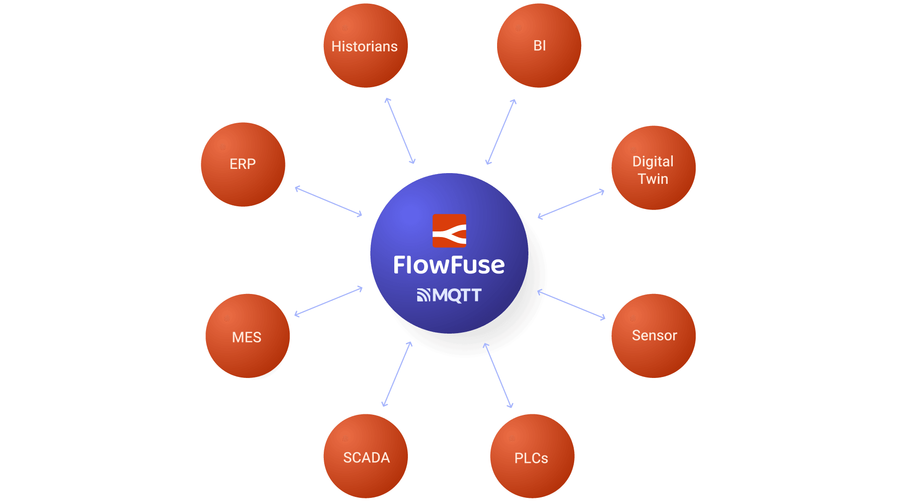

--- 
title: "MQTT: The Frontrunner for Your UNS Broker - Part 2" 
subtitle: "Why MQTT is the Best Choice for Your UNS Broker"
description: "Learn why MQTT is the top choice for Unified Namespace (UNS) brokers and explore the ideal platform that simplifies the connection of devices and services while providing a reliable MQTT broker service."
date: 2025-01-08
authors: ["sumit-shinde"]
image: /blog/2025/01/images/mqtt-for-uns.png
keywords: mqtt unified namespace, why use mqtt in uns, mqtt in a unified namespace, mqtt data modeling UNS, Best protocols for UNS IoT, Implementing UNS with MQTT, Unified Namespace protocols
tags: 
 - mqtt
 - uns
 - unified namespace
---

In [Part 1](/blog/2025/01/mqtt-frontrunner-for-uns/), we discussed the compelling reasons behind MQTT's popularity as a choice for Unified Namespace (UNS) implementations, focusing on its lightweight design, low latency, and reliable message delivery. In this second part, we’ll explore additional factors that further establish MQTT as the leading protocol for UNS brokers, diving into its connectivity, scalability, structured topic management. 

<!--more-->

## Wide Connectivity

For your UNS to be truly effective, it must be able to connect seamlessly with every part of your IIoT environment—whether it’s a device or the cloud. MQTT is an excellent protocol for this because it’s widely adopted in both cloud-based systems and industrial environments.

In a factory, you typically have a mix of physical devices (like sensors and machines) and cloud systems. To make real-time decisions, data needs to flow seamlessly from the shop floor to the cloud. MQTT excels at connecting modern devices with the cloud. However, one challenge is that it doesn’t natively support older systems that typically use protocols like OPC UA or MODBUS.

This isn’t a major issue, though. You can bridge the gap using tools like FlowFuse and Node-RED, which allow MQTT to communicate with older systems.

Overall, MQTT has better compatibility than many other protocols. Some other protocols may offer better compatibility, but they can hardly surpass MQTT in meeting the core requirements of a UNS.

{data-zoomable}{width="550px"}
_MQTT's Compatibility_

## Easily Scalable

A UNS broker needs to be able to grow as your factory or system expands. What starts with just a few sensors or devices might quickly scale up to hundreds or thousands over time. Can MQTT handle this growth? Absolutely.

MQTT's lightweight architecture, based on a simple publish-subscribe model, makes it easy to scale. Adding new devices doesn’t disrupt existing operations. The system can handle thousands of devices and connections without performance issues. As your network grows, new devices can easily connect to the broker and start exchanging data without major changes to the infrastructure.

MQTT brokers handle large volumes of data and can distribute messages to many clients at once. This ensures that as more devices are added, the system remains stable. The broker can also scale horizontally, meaning you can add more brokers or resources to handle the increased load, without affecting the performance or reliability of the system.

## Semantic Hierarchy with Topics

When setting up a UNS, it’s not just about collecting all your data in one place—it’s about organizing it so that it’s easy to navigate. A semantic hierarchy helps do this by arranging data from broad categories down to more specific details. For example, in a factory, you might have levels like factory, area, line, and machine, with data points like temperature or humidity at the bottom. This is similar to how files are organized in folders, making it simple to find what you need.

MQTT works well for this kind of organization because its topics are already structured in a hierarchical way. Topics in MQTT are like paths that break down data into different levels, such as `factory/area-2/line-1/machine-5/temperature`. You can easily follow these paths to find the exact data you need. Furthermore, MQTT supports wildcard characters, which offer flexibility for subscriptions. The # wildcard matches all levels beneath a given level, so a subscription to `factory/#` will match any topic under the "factory" level, regardless of how deep the path goes. Similarly, the `+` wildcard matches only a single level, so `factory/+/line-1/machine-5/temperature` will match any topic that follows the same structure but with different areas. 

While  AMQP and Kafka also support topics and wildcards, they handle them differently. AMQP uses routing keys for message routing rather than a direct hierarchical topic structure like MQTT. Though AMQP has a topic exchange for routing based on patterns (similar to topics), it doesn’t provide the same natural hierarchical organization. Kafka, on the other hand, uses a flat topic model without a hierarchy, which can make it more difficult to maintain clarity and structure as the system grows in complexity. While both AMQP and Kafka can still be used in a UNS, their lack of a natural topic hierarchy makes them more challenging manage compared to MQTT, which provides a simpler, more intuitive way to organize and access data.

In conclusion, MQTT is an excellent choice for your UNS broker because it offers simplicity, scalability, and efficient data organization. Its lightweight design ensures smooth performance as your system grows, while the publish-subscribe  model decouples producers and consumers, allowing them to operate independently. This reduces direct dependencies between devices and systems, making the overall architecture more flexible and easier to scale. MQTT’s hierarchical topic structure further simplifies data management and access. Compared to other options like AMQP and Kafka, MQTT provides a more intuitive, reliable, and scalable and most importantly simple solution for building a Unified Namespace that can adapt to future needs.

## Build Your UNS with FlowFuse Now

Now that you understand why MQTT is the best choice for your UNS, it’s time to build it. FlowFuse is the ideal platform for implementing your UNS with MQTT.

Please read our article: [Building Your UNS with FlowFuse](/blog/2024/11/building-uns-with-flowfuse/) where I show you how to build it quickly—just in 15 minutes!

**Why choose FlowFuse?**

FlowFuse is an industrial data platform that leverages the power of Node-RED, a popular open-source low-code platform for industrial automation. With over 5000 community-contributed nodes, it simplifies the process of collecting, transforming, and integrating data from a wide variety of industrial hardware and services, supporting nearly all industrial protocols. This means you have nearly everything you need to implement a UNS—all you need is the MQTT broker service.

Good news! Recently, FlowFuse has added a built-in MQTT broker service within the platform, making it even easier to manage your MQTT connections. This includes an interface for securely managing MQTT clients and, most importantly, a comprehensive topic hierarchy monitoring tool that’s ideal for managing your UNS.

FlowFuse not only allows you to build and manage your UNS, but also provides a collaborative environment where teams can work in real time. It offers scalability, security, and ease of use, making it simple to grow your system as your needs evolve.

With FlowFuse, you get everything you need to handle data pipelines, implement a UNS, and scale efficiently—all within a single platform.

*Ready to get started? [Talk to with us](/book-demo/) to learn more about how FlowFuse can accelerate your UNS journey.*
