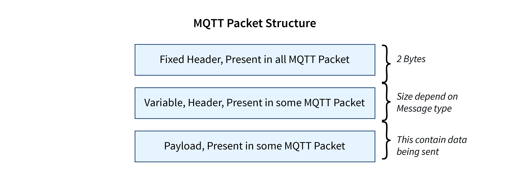

Choosing the right broker for your Unified Namespace (UNS) is often one of the first challenges you'll face when building it. With so many options available, it’s critical to pick one that can handle real-time data, scale effortlessly, and integrate smoothly across diverse devices and services.

In this first part of our series, we’ll explain why MQTT is the standout choice for UNS implementations. With its focus on lightweight, real-time messaging and robust reliability, MQTT delivers the performance IIoT environments demand, making it the perfect fit for a future-proof, scalable UNS.

<!--more-->

The [Unified Namespace (UNS)](/solutions/uns/) is a data architecture (not just a tool or new technology) that centralizes and organizes data from various sources into a single, unified structure. It eliminates data silos by providing a standardized way to represent, access, and share information across different devices, systems, and services. For more information on what is UNS, read our article: [Introduction to the Unified Namespace](/blog/2023/12/introduction-to-unified-namespace/).

When choosing a broker for your UNS, it's crucial to consider how well the selected broker fits the specific requirements of your IIoT environment, including the types of devices and systems involved, as well as factors like scalability, reliability, and ease of integration. Several options are available alongside MQTT, including [AMQP](/node-red/protocol/amqp/), [Kafka](/blog/2024/03/using-kafka-with-node-red/), and cloud message brokers like AWS Kinesis and GCP Pub/Sub. While these alternatives offer unique features, MQTT stands out, and we’ll explain why later in this article. But If you’re interested in a brief overview of why these alternatives are not the best fit for UNS, check out our article: [Unified Namespace: What Broker to Use?](/blog/2024/01/unified-namespace-what-broker/)

There is also an ongoing debate regarding the use of OPC-UA and other protocols for implementing UNS. While I won’t dive into this in detail here as i havent explored it much yet, I encourage you to start with the approach we call reverse engineering. First, understand why MQTT is the preferred choice for implementing UNS, and then explore how its features align with UNS needs. From there, you can evaluate whether other protocols offer similar capabilities. By following this process, you will find the right answer of your questions.

## **Background of MQTT**

Before diving into its specific advantages for UNS, let’s take a brief look at the history of **MQTT** and how it became the backbone of modern IoT communication.

[MQTT](/node-red/protocol/mqtt/) was developed in the late 1990s by Andy Stanford-Clark at IBM and Arlen Nipper at Eurotech to address communication challenges in low-bandwidth, unreliable networks. This early focus on lightweight messaging paved the way for MQTT to become a pioneering solution for the rapidly expanding IoT space.

Since then, MQTT has evolved significantly. The protocol has gone through several iterations, from **MQTT 3.1.1** to the more feature-rich **MQTT 5.0**, each version enhancing the protocol's capabilities to meet the demands of an increasingly connected world. Today, more than 25 years later, MQTT remains the **de facto protocol** for IoT applications, and its simplicity, scalability, and reliability continue to make it an ideal choice for industrial systems.

**But, what exactly makes MQTT the frontrunner for UNS implementations? Let's take a deeper look at some of its key features?**

## **Publish-Subscribe Model and Event-Driven Architecture**

One of the standout features of MQTT is its publish-subscribe (Pub/Sub) model, which is the primary need of an UNS. In this model, data producers (such as sensors or devices) don’t need to know who is receiving the data or how many consumers are out there. Instead, they publish their data to a central broker, and any consumer (like a monitoring system, data warehouse, or analytics engine) that is interested simply subscribes to the relevant data stream.

This approach decouples producers and consumers, removing the need for direct, point-to-point connections between them. In traditional systems, every device would need to know about every other device it communicates with, leading to a messy, tightly coupled network. As your IIoT ecosystem grows, managing these connections becomes increasingly difficult and prone to error. But with MQTT’s Pub/Sub model, adding new devices or services is seamless and doesn’t disrupt existing data flows.

Beyond this, MQTT’s event-driven architecture takes the system to a whole new level of efficiency and responsiveness. Imagine a scenario where a machine detects an issue—rather than waiting for a periodic check-in, the event is immediately sent to the right consumer, triggering an alert in real time. This push mechanism is far more efficient than traditional polling, where systems continuously ask, “Is there new data yet?” and waste precious resources in the process.

With MQTT, data is pushed as soon as it’s available, enabling faster decision-making and real-time responses. This means events like machine faults or environmental changes are addressed immediately, making the Our UNS more agile, responsive, and capable of scaling as needed which is one of priamary need of IIoT environemnt.

If you’d like to understand the importance of **Publish-Subscribe (Pub/Sub)** architecture in detail for UNS, I highly recommend reading our article: [Why UNS Needs Pub/Sub](/blog/2024/11/why-pub-sub-in-uns/).

### **Low Latency and Lightweight Messaging**

Downtime in industrial operations can be very costly—ranging from $15,000 to $20,000 per minute or more. For engineers and operators watching over machines, waiting for data can mean the difference between smooth operations and expensive disruptions,  If you're interested in learning more about downtime, read this research by Siemens from 2022: [True Cost of Downtime 2022](https://assets.new.siemens.com/siemens/assets/api/uuid:3d606495-dbe0-43e4-80b1-d04e27ada920/dics-b10153-00-7600truecostofdowntime2022-144.pdf). Low-latency messaging is key in these situations, which is why data architectures like UNS are being explored to make sure systems and devices in your IIoT setup communicate without delays. MQTT is the protocol that makes this possible.

As we explored, MQTT uses a publish-subscribe model, which is built for real-time communication with minimal delay. Unlike traditional request-response systems that can cause delays due to constant querying, MQTT keeps a persistent connection open. Once a device connects, it can immediately send data or receive updates on important topics, cutting out the need for repeated requests and making sure data flows instantly. This helps engineers make decisions and take action faster.

In addition to being fast, MQTT is very efficient. Its messages are small and use little bandwidth—important when working with low-bandwidth networks or many connected devices. Even with limited resources, MQTT allows devices to send data without overwhelming the system. The result? As soon as a sensor detects a change—like a temperature spike or a production issue—it can send the information right away to the right system, triggering immediate actions to avoid costly downtime.

  _MQTT Packet Structer_

### **Reliability**

When it comes to building a UNS, **reliability** is absolutely crucial. Missing or duplicate data can lead to poor decision-making, system malfunctions, or even costly downtime—things no one wants in their IIoT environment.

This is where MQTT truly shines. It’s built with a **Quality of Service (QoS)** mechanism that allows you to control how reliably your messages are delivered. Depending on the level you choose, you can ensure that data is delivered exactly as you need it, without compromising on system performance.

MQTT offers three levels of QoS to suit different use cases:

- **QoS 0 - "At most once"**: The message is delivered once and isn’t acknowledged. This is fine for non-critical data where the occasional loss of a message is acceptable.
- **QoS 1 - "At least once"**: The message is delivered at least once, with an acknowledgment to ensure it was received. This is ideal for most IIoT applications, where you need reliable delivery, but duplicate messages are not a major concern.
- **QoS 2 - "Exactly once"**: This guarantees the message is delivered exactly once—no duplicates, no omissions. It's the best choice for mission-critical applications where data integrity is paramount.

Now, some other protocols like **AMQP** or **Kafka** also provide reliability guarantees, but they tend to be more complex and come with heavier infrastructure requirements. MQTT, on the other hand, offers a simple and lightweight design while still giving you just the right level of reliability for most IIoT scenarios. You can scale your network with ease, all while maintaining a high standard of reliability in your data flows.

MQTT is the ideal broker for a UNS in IIoT environments, offering real-time, low-latency communication through its Publish-Subscribe model. With Quality of Service (QoS) options for reliable data delivery, it balances performance, scalability, and simplicity. MQTT’s lightweight design makes it perfect for handling large-scale, mission-critical data flows without the complexity of heavier protocols.

**In Part 2, we will explore MQTT's scalability, topic organization, and wide connectivity providing even more compelling reasons why it is the ultimate choice for UNS brokers.**

If you're looking to build your own UNS with MQTT, check out our step-by-step [Article on Building UNS with FlowFuse](/blog/2024/11/building-uns-with-flowfuse/). Plus, we've made it even easier by offering a built-in MQTT broker service within the **FlowFuse Platform**, allowing you to manage all your MQTT clients, devices, services, and data from a single, centralized interface. Check it out [here](/blog/2024/10/announcement-mqtt-broker/)!
