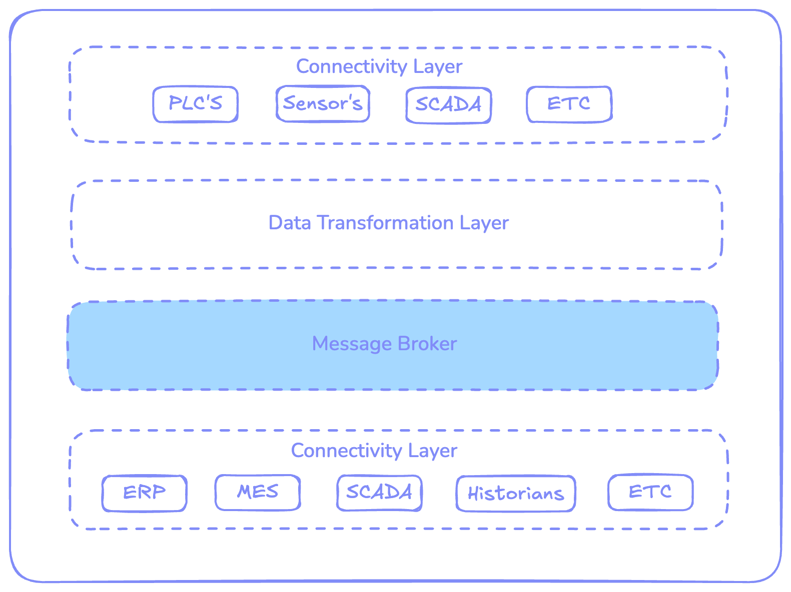

Unified Namespace (UNS) is changing the way data is managed in industrial environments. It’s becoming the key to more successful and productive operations. Many organizations have already implemented it, and others are still figuring out the best approach and platform to implement it. There are so many tools out there; how do you know which one is right for your UNS? It’s a big decision, and it can be overwhelming. The good news? FlowFuse is the toolkit you’ve been looking for! It’s an all-in-one platform to build your UNS—and it’s open-source!

<!--more-->

At its core, a Unified Namespace ([UNS](/solutions/uns/)) is a data architecture that centralizes all your data from devices, sensors, and systems into a single hub. It helps you make sense of everything by organizing, structuring, and standardizing your data for easy access and analysis. Instead of dealing with fragmented data silos, you get a unified, real-time view of your entire operation. 

Think of it as the brain of your entire operation, connecting all your business events in one place. Whether you're tracking performance, optimizing workflows, or making real-time decisions, a well-designed UNS makes it all possible. For more details, check out our article: [Introduction to the Unified Namespace](/blog/2023/12/introduction-to-unified-namespace/).

## **Core Components of UNS and How FlowFuse Fits In**

To truly understand why FlowFuse is the ultimate toolkit for building and managing UNS, we need to explore its core components and see how FlowFuse enhances each one to help create a successful Unified Namespace in industrial IoT environments.

{data-zoomable}  
_Core Components of UNS: Key Elements to Consider When Building Your UNS_

#### **1. Connectivity Layer**

The Connectivity Layer is the foundation of your UNS ecosystem. It’s what collects data from all your devices and systems—whether that’s sensors on the factory floor, PLCs, or IoT devices—and sends it to your UNS. Without a strong connectivity layer, your UNS won’t have the data it needs to create a complete view of your operations.

**How FlowFuse Helps:**

This is where FlowFuse comes in. Built on the powerful Node-RED platform, FlowFuse takes the complexity out of connecting devices. Whether you're dealing with legacy systems (think Modbus or OPC-UA) or the latest IoT devices (like MQTT or HTTP), FlowFuse ensures that everything can speak the same language. It connects your old and new technologies, effortlessly streaming data into your UNS.

With more than 5,000 available community contributed nodes, FlowFuse helps bridge the gap between old and new technologies. For example, if you have machines that use Modbus and new sensors using MQTT, FlowFuse can help them all send data into your UNS without any issues.

#### **2. Data Transformation Layer**

Once you’ve connected your devices and started collecting data, it’s time to send that data to your UNS. However, before that happens, there's an important step: data transformation. The data you collect often comes in different formats, units, or structures, which can create confusion and inefficiency when trying to use it across your system.

This is where the Data Transformation Layer plays a key role. It’s responsible for standardizing and enriching the data, ensuring it’s consistent, accurate, and ready to be used by your entire IIoT system. Without this layer, your data would remain fragmented and inconsistent—making integration difficult and analysis unreliable. Without proper transformation, your UNS wouldn’t be a true UNS; it would just be an data repository or dump.

**How FlowFuse Fits In:** 

FlowFuse simplifies data transformation with its intuitive Node-RED interface. This allows engineers to set up complex data processing workflows with minimal effort. Whether you need to convert units of measurement, clean raw data, or reformat it, FlowFuse offers a low-code environment where you can drag and drop nodes to handle these tasks without needing to write custom code.

Beyond transforming data formats, FlowFuse also enables data contextualization. As raw data flows in, it can be enriched with important metadata—such as timestamps, equipment IDs, or sensor locations—that add context and make the data more meaningful. This is vital for accurate analysis and informed decision-making.

For instance, imagine temperature readings coming from multiple devices, with some sensors reporting in Celsius, others in Fahrenheit, and others in Kelvin. FlowFuse can automatically standardize all these readings to a single unit (like Celsius) and add contextual information, such as which machine the data came from and its current operating status. This makes the data easy to understand and act upon in your UNS.

#### **3. Message Broker**

In UNS), the Message Broker is the central hub where your data resides until it’s accessed or consumed by other systems. It ensures that data flows smoothly between devices and applications, using a publish-subscribe (pub-sub) model. Systems "subscribe" to topics and receive automatic updates whenever new data is published, keeping everything in sync and up to date.

The Message Broker must support the pub-sub model, which is a core requirement for the UNS. For more information on why this model is essential, please read our article on why UNS needs pub-sub. The pub-sub model decouples producers (publishers) from consumers (subscribers), meaning they don’t need to be directly connected or even aware of each other. This decoupling enhances flexibility and scalability. Additionally, it makes the UNS event-driven, eliminating the need for constant polling. Systems only receive data when it’s relevant, boosting efficiency and responsiveness.

MQTT is the ideal broker that supports the pub-sub model and popular choice for uns. It’s lightweight, efficient, and works well in environments with limited resources.

**How FlowFuse Fits In:** 

With FlowFuse, you get a built-in MQTT Broker, which means there's no need to configure and maintain a separate system. This simplifies the connection of all your devices and systems, ensuring smooth data exchange within your UNS.
FlowFuse makes it easy to manage connections, organize topics, and configure security features such as TLS encryption and username/password authentication—all within a single platform. This keeps your setup streamlined and secure.

The MQTT Broker supports hierarchical topic structuring, allowing you to efficiently organize and manage your data flows. In FlowFuse, you have an interface to monitor all your UNS topics in a tree view, as well as a secure interface to manage your MQTT clients.

Node-RED in FlowFuse comes with standard MQTT nodes, making it easy to set up secure connections to your broker. You can quickly configure security features like TLS encryption and username/password authentication or dynamically subscribe to topics

FlowFuse makes building and managing a Unified Namespace (UNS) easy. It connects devices, transforms data into a usable format, and ensures smooth communication using an MQTT broker. Powered by Node-RED, it works with old and new systems, helping you scale and adapt quickly.

## **What Makes FlowFuse Stand Out in Industrial IoT?**

FlowFuse isn’t just another tool—it's a complete solution for building and managing a **Unified Namespace (UNS)**. While other platforms may specialize in certain areas, FlowFuse brings everything together: connectivity, data transformation, and message brokering, all in one platform.

Many tools excel in one area but fall short in others. Some may connect devices well but struggle with legacy systems or data transformation. FlowFuse solves these challenges by offering an all-in-one solution that works seamlessly with both modern and legacy systems.

As an open-source platform, FlowFuse removes the worry of vendor lock-in. You have the flexibility to transition to other services if your needs evolve, without worrying about compatibility issues.

FlowFuse also includes powerful features tailored for industrial environments. One standout is [real-time collaboration](/blog/2024/12/flowfuse-team-collaboration/), which allows multiple engineers to work on **Node-RED flows** simultaneously—speeding up development and deployment. Additionally, you can [remotely manage edge devices](/blog/2024/07/building-on-flowfuse-devices/), reducing the need for costly on-site visits for troubleshooting or updates.

When it comes to scaling, FlowFuse is built to grow with you. It supports horizontal scaling to balance workloads across multiple instances and vertical scaling to add more resources as your needs increase. Whether you’re scaling up or dealing with high workloads, FlowFuse ensures your infrastructure remains stable and efficient.

Security is a major priority with FlowFuse. It includes features like [role-based access control](/blog/2024/04/role-based-access-control-rbac-for-node-red-with-flowfuse/), encryption, multi-factory authentication, and detailed [audit logs](/docs/user/logs/#audit-log) to keep your data secure and meet industry standards.

On top of that, FlowFuse provides features like [DevOps pipeline management](/blog/2024/10/how-to-build-automate-devops-pipelines-node-red-deployments/), [snapshots for disaster recovery](/blog/2024/09/node-red-version-control-with-snapshots/), and much more, ensuring your systems are always running smoothly and reliably.

## **Summary**

FlowFuse is a complete platform for building and managing a Unified Namespace. It combines everything you need—connectivity, data transformation, and message brokering—into one easy-to-use solution. Open-source flexibility makes it simple to connect devices, scale your system, and keep data secure.

***Want to learn more about how FlowFuse can help? [Talk with Our experts!](/book-demo/)***
