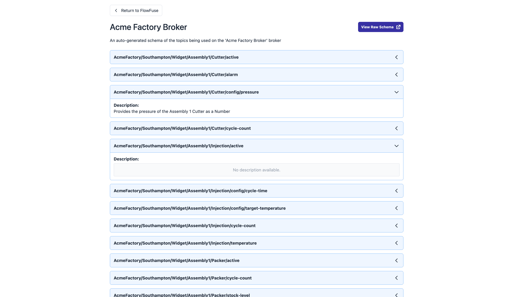

This release is full of highlights, which we’ll break down into two key areas - the **FlowFuse MQTT Experience** and **Remote Instances** - so you can better digest all of the great new functionality introduced in FlowFuse 2.14.

<!--more-->

## MQTT Experience in FlowFuse

In [October we announced the FlowFuse MQTT Broker](/blog/2024/10/announcement-mqtt-broker/), included in our Starter, Team, and Enterprise tiers. It lets you setup your own secure clients to begin publishing and subscribing to your own topics, and building out your full event-driven applications.

We see the MQTT experience and Node-RED experience regularly paired together, and so it's one of our missions at FlowFuse to provide the best developer experience for building out your event-driven applications when these two elements are in play.

### Third Party Broker Integration

Whilst the Team Broker is a great addition, we are aware that many of our customers already have their own existing MQTT brokers and infrastructure, so what does FlowFuse bring to the table for them?

With this new release, it is now possible for you to connect your external brokers to FlowFuse. With that, you'll get access to the same great features to help you gain a clear understanding of the activity on your broker, and the structure of the data and topics that are being used.

### Schema Generation

A pain point we've seen for many customers is collaboration around a single UNS, or MQTT Broker. There is limited (if any) documentation, and to create that, especially at industrial scale, would be a monstrous and time-consuming task. With that in mind, FlowFuse now offers **automated schema generation**. 

FlowFuse now generates a schema for your MQTT Broker's topic hierarchy, whether you're using the in-built FlowFuse Team Broker, or integrating your own, without you needing to do anything. The schema is generated using the industry-standard, open-sourced, [AsyncAPI](https://www.asyncapi.com/), and is clearly presented to you in the FlowFuse UI in two formats.

#### Topic Hierarchy Editor

The first view lives within the FlowFuse UI that you're familiar with, will display your interactive topic hierarchy which you can explore, and is predominantly the "edit" and "review" view of your hierarchy.

{data-zoomable}
_Screenshot of the Topic Hierarchy view for a given Broker in FlowFuse_

For each topic, you can define descriptions so that team members and anyone interacting with your broker can get a clear understanding of how to get the most out of the hierarchy and associated data.

We have also hopped the first piece of our Smart Suggestions, which is an agent that runs and works out the structure of the payloads to each of your topics. Right now, this is shown in the UI under "Detected Schema", but we have bigger plans here, that hopefully you'll be seeing more of in the very near future.

#### Personalized UNS Documentation

The second view is focussed on clarity, and collaboration.

{data-zoomable}
_Screenshot of the new "Schema Documentation" view provided for brokers on FlowFuse_

A big challenge with the Unified Namespace, and wider MQTT too, can be the lack of centralized structure and information around the topics and payloads that are being used. This can make it difficult to understand what is being published and subscribed to, and can make it hard to onboard new projects, team members or partners.

That is why we have built in a new "Schema Documentation" view, available for both the in-built FlowFuse Broker, and any third-party broker that you choose to connect.

This view is built from the automated topic hierarchy, manually added topic descriptions and will soon feature payload schema information from our upcoming Smart Schemas.

## Remote Instances

This release sees two new major features coming to Remote Instances (previously known as "Devices").

### FlowFuse Authentication now Supported

You can now secure your Remote Instances with FlowFuse Authentication.

This means that you can now use the same credentials you use to log into FlowFuse, to authenticate any HTTP endpoints, such as the [FlowFuse Dashboard](https://dashboard.flowfuse.com), on your Remote Instances. This also unlocks features like [Multi-Tenant Dashboards](https://dashboard.flowfuse.com/user/multi-tenancy.html) that can run on your own hardware at the Edge. 

Please note that this does require that your hardware has a connection to FlowFuse.

### Version History for Remote Instances

{data-zoomable}
_Screenshot of the new "Version History" timeline view available for Remote Instances_

This release brings another great update for Remote Instances: the "Timeline" view has been rolled out to provide you a clear picture of everything that has been running on your Remote Instance.

Here you will be able to see every time flows were deployed (for example from within [Developer Mode](/docs/device-agent/quickstart/#developer-mode)), when settings have updated, [Snapshots](/docs/user/snapshots/) have been created, or new flows have been deployed via a [DevOps Pipeline](/docs/user/devops-pipelines/).

## What Else Is New?

For a full list of everything that went into our 2.13 release, you can check out the [release notes](https://github.com/FlowFuse/flowfuse/releases/tag/v2.14.0).

We're always working to enhance your experience with FlowFuse. We're always interested in your thoughts about FlowFuse too. Your feedback is crucial to us, and we'd love to hear about your experiences with the new features and improvements. Please share your thoughts, suggestions, or report any [issues on GitHub](https://github.com/FlowFuse/flowfuse/issues/new/choose). 

Together, we can make FlowFuse better with each release!

## Try FlowFuse

### Self-Hosted

We're confident you can have self managed FlowFuse running locally in under 30 minutes. You can install FlowFuse using [Docker](/docs/install/docker/) or [Kubernetes](/docs/install/kubernetes/).

### FlowFuse Cloud

The quickest and easiest way to get started with FlowFuse is on our own hosted instance, FlowFuse Cloud.

[Get started for free]({{ site.onboardingURL }}) now, and you'll have your own Node-RED instances running in the Cloud within minutes.
