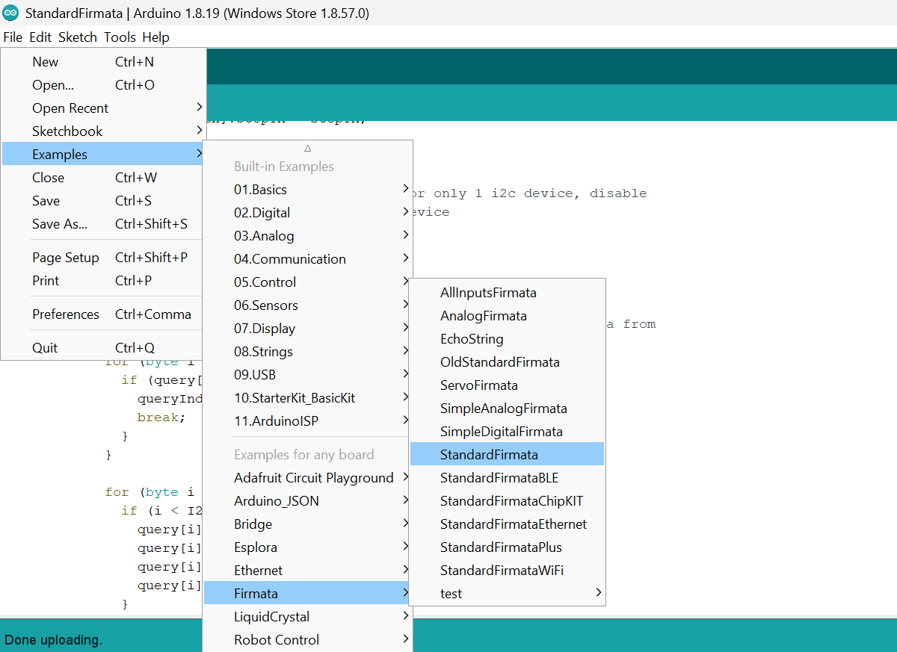

--- 
title: "Interacting with Arduino using Node-RED" 
subtitle: "Control and Automate Arduino with Node-RED"
description: "Learn how to set up and control your Arduino remotely using Node-RED and FlowFuse. Explore the simplicity of automation flows"
date: 2025-02-12
lastUpdated: 2025-07-23
authors: ["sumit-shinde"]
image: /blog/2025/02/images/arduino-with-node-red.png
keywords: Arduino, Node-RED, Firmata, Node-RED IoT, automation, FlowFuse, LED control with Node-RED, IR sensor, input-output, serial communication, microcontroller, Arduino Uno, remote control, object detection, dashboard.
tags: 
 - node-red
---

Arduino is a popular open-source platform that lets you build cool electronics projects. It’s affordable and flexible, with lots of different boards and sensors to choose from. However, unlike some other boards, Arduino doesn’t have built-in internet connectivity, which can make remote control a bit tricky. Plus, it usually requires some coding to make things work.

<!--more-->

In this guide, I’ll show you how to control and automate your Arduino remotely using Node-RED and FlowFuse, all without writing any code. We’ll use the Firmata protocol to make it easy to send commands and get data from your Arduino. By the end of this tutorial, you’ll have a simple automation setup that you can control from anywhere. Just keep in mind, the Arduino will need to be connected to the device running Node-RED!

<iframe width="100%" height="315" src="https://www.youtube.com/embed/FTuxOy16nwo?si=i7wds6zH0Hpo0TTM" title="YouTube video player" frameborder="0" allow="accelerometer; autoplay; clipboard-write; encrypted-media; gyroscope; picture-in-picture" allowfullscreen></iframe>

## Prerequisites

To follow this tutorial, you'll need the following:

- Arduino Board: The hardware you'll be using for this project.
- USB cable: To connect the Arduino to your computer.
- Arduino IDE: Installed and set up to program your Arduino. Download the Arduino IDE if you haven't already done so. we will be using this for initial firmata implementation, not for programming
- FlowFuse Account: You will need a FlowFuse instance running on the device connected to the Arduino. FlowFuse allows you to access that remote instance, build flows, create remotely available dashboards, collaborate with your team on the instance, provide robust security, and much more.

## Getting Started with Arduino and Node-RED

In this section, we’ll set up Node-RED on FlowFuse and download the Firmata protocol setup on the Arduino using Arduino IDE. We will also create a flow that will control an LED on the Arduino and read input data. We will later control the LED based on object detection using an object sensor to make it more interesting. If you don’t have the sensor, don't worry— you can still follow the article. The goal of this example is to demonstrate both reading and writing operations, as well as build an automation flow that reacts to input.

### Step 1: Running Node-RED on the Device connected to Arduino

To begin, you need to run Node-RED on the device connected to your Arduino, whether it is a Raspberry Pi, Windows, or Linux system. However, simply running Node-RED locally is not sufficient if you require remote access. Setting up a server, securing it, and ensuring accessibility can be time-consuming and complex.

Using the FlowFuse device agent simplifies this process. It allows you to remotely access and manage your Node-RED instance without the need for extensive configuration or security management. This approach ensures a more efficient and secure deployment, enabling you to focus on building automation solutions.

For a step-by-step guide on installing and running the FlowFuse device agent, refer to the official documentation: [FlowFuse Device Agent Quickstart](/docs/device-agent/quickstart/). By the way, we also offer a [free tier](/blog/2024/12/flowfuse-release-2-12/) that lets you manage up to two edge devices for free. [Sign up today](?utm_campaign=60718323-BCTA&utm_source=blog&utm_medium=cta&utm_term=high_intent&utm_content=Interacting%20with%20Arduino%20using%20Node-RED)!

### Step 2: Downloading Firmata protocol setup to Arduino.

[Firmata](https://github.com/firmata/protocol) is a protocol for communicating between an Arduino (and other microcontrollers) and the host computer, providing direct access to the IO pins.

Now, let's download the setup to the Arduino. Before proceeding, ensure your Arduino is connected to your laptop or computer via the correct USB cable. The USB connection is essential for uploading the code (sketch) to the Arduino and will also be used by Firmata for communication later.

**Setting up Arduino IDE and Download the setup from examples:**

1. Open the Arduino IDE on your computer.
2. Ensure you have selected the correct board and port in the Tools menu. Since I am using an Arduino Uno 3 board, I’ve selected the Arduino Uno board.
3. Go to File → Examples → Firmata, and then click on StandardFirmata. This will open the Firmata setup code.
4. Click the Upload button in the Arduino IDE to upload the setup to your Arduino board.

{data-zoomable}
_Importing Standard Firmata setup sketch from examples in Arduino IDE_

Once the upload is complete, the Arduino is ready to communicate via the Firmata protocol.

### Step 3: Connecting Node-RED to Arduino via Serial Communication

As mentioned earlier, Firmata typically works over a serial connection (such as USB), enabling communication between the Arduino board and your Node-RED instance. The serial communication allows Node-RED to send commands to the Arduino and receive data from it.

First, we will need to install a node that will enable communication between Node-RED and the Arduino via Firmata.

**Installing Arduino Node**

1. Open the main menu by clicking the three horizontal lines in the top-right corner.
2. Click "Manage Palette" from the menu.
3. Switch to the "Install" tab and type "node-red-node-arduino" in the search field.
4. Click "Install" next to the node name.

After installing the required node for Arduino, we will set up the flow in Node-RED to establish a connection with the Arduino.

**Establishing Connection with Arduino**

1. Drag any Arduino node onto the canvas
2. Double-click the node to open its configuration window.
3. In the new window that opens, enter the port name for your Arduino (for example, COM5 on Windows or /dev/ttyUSB0 on Linux/macOS). You can find the correct port in the Arduino IDE or your system’s device manager.

{data-zoomable}
_Adding the port to the Arduino node_

4. Click and deploy by clicking the top-right deploy button.

Once deployed, after a few seconds, the node will establish a connection with the Arduino board. You should see a green square below the node, indicating that the connection is successful and the status is "Connected."

### Step 4: Sending Commands to Arduino

In this section, I'll show you how to send commands to your Arduino. For this practical demonstration, we will control the default Arduino LED, which is typically connected to pin 13.

1. Drag the Arduino-out node onto the canvas.
2. Double-click the node to open its configuration window.
3. Select the correct configuration (serial port) that you set up in Step 3.
4. Next, choose the type of pin you want to interact with (e.g., digital, analog, servo, etc.). Since in this example we will be interacting with an LED, which only requires on or off commands, I’ve selected Digital (0/1).

Based on the type of data you want to send, select the appropriate pin type:

- Digital (0/1) – accepts 0, 1
- Analog (0-255) (PWM) – accepts Integer values from 0 to 255
- Servo (0-180) – accepts Integer values from 0 to 180
- String – to send a string to the Arduino

5. Once you've configured the pin type, enter the pin number (e.g., 13 for the built-in LED).
6. Click Done.

{data-zoomable}  
_Configuring Arduino-out node_

7. Drag two Inject nodes onto the canvas. For one Inject node, set the payload to true (to turn the LED on), and for the other, set the payload to false (to turn the LED off).
8. Connect the output of each Inject node to the input of the Arduino-out node.
9. Deploy the flow.

Now, you can turn the LED on and off by clicking the inject buttons. Instead of using the inject node, you can also use the FlowFuse dashboard to build an interactive dashboard. The dashboard will allow you to control the LED directly from a web interface.

Below is the flow that allows you to control the LED connected to pin 13.


[{"id":"fbe0eb6547cbfed7","type":"arduino out","z":"FFF0000000000001","name":"","pin":"13","state":"OUTPUT","arduino":"d7663aaf.47194","x":739.8345947265625,"y":645.8272094726562,"wires":[]},{"id":"e222d2df8c62483d","type":"inject","z":"FFF0000000000001","name":"Turn LED on","props":[{"p":"payload"}],"repeat":"","crontab":"","once":false,"onceDelay":0.1,"topic":"","payload":"true","payloadType":"bool","x":530,"y":580,"wires":[["fbe0eb6547cbfed7"]]},{"id":"c82bd0280ee45b3b","type":"inject","z":"FFF0000000000001","name":"Turn LED off","props":[{"p":"payload"}],"repeat":"","crontab":"","once":false,"onceDelay":0.1,"topic":"","payload":"false","payloadType":"bool","x":530,"y":680,"wires":[["fbe0eb6547cbfed7"]]},{"id":"d7663aaf.47194","type":"arduino-board","device":"COM5"}]


If you're interested in learning how to create a dashboard, you can refer to the [Getting Started Guide](/blog/2024/03/dashboard-getting-started/). It will help clarify basic dashboard concepts and guide you through building a simple dashboard interface.

### Step 5: Receiving Inputs from the Arduino

In this step, we’ll focus on receiving inputs from the Arduino to Node-RED. For this practical demonstration, we will use the input from the IR object detection sensor connected to the Arduino.

1. Drag the Arduino-in node onto the canvas.
2. Double-click the node to open its configuration window.
3. Select the serial port to which your Arduino is connected.
4. Based on the input type, choose the correct pin type (e.g., digital, analog). Since we are using an IR sensor, which typically provides a digital output, select the "Digital pin" type.
5. Enter the pin number (e.g., pin 9, if your sensor is connected to pin 9 on the Arduino).

{data-zoomable}  
_Configuring Arduino-in node_

*Note: You cannot use the same pin for both output and input on the Arduino simultaneously. Ensure the pin you use for input (like the IR sensor) is separate from the pin you're using for output (like the LED).*

6. Click Done.
7. Drag the Debug node onto the canvas and connect its input to the output of the Arduino-in node.
8. Deploy the flow.

Now, the Arduino will send the sensor input data to Node-RED. If a change is detected in the input, the Arduino will output that input, and you will see it in the debug panel.

Below, I have provided the flow that reads the IR object detection sensor data connected to pin 9, in case you need it.


[{"id":"2b871fb5d0923355","type":"arduino in","z":"FFF0000000000001","name":"Read Sensor Data","pin":"9","state":"INPUT","arduino":"d7663aaf.47194","x":170,"y":360,"wires":[["e3e52e51a2e4e058"]]},{"id":"e3e52e51a2e4e058","type":"debug","z":"FFF0000000000001","name":"debug 1","active":true,"tosidebar":true,"console":false,"tostatus":false,"complete":"false","statusVal":"","statusType":"auto","x":360,"y":360,"wires":[]},{"id":"d7663aaf.47194","type":"arduino-board","device":"COM5"}]


### Step 6: Creating an Automation Flow

Now that you've learned how to send commands and read inputs from the Arduino, let’s move on to creating an automation flow. This section aims to show you how to program the Arduino without writing a single line of code—using only Node-RED.

The idea is to trigger an action, such as turning on an LED, when the sensor detects an object.

1. Drag a Switch node onto the canvas.
2. Double-click on the Switch node to open its configuration window and add the following conditions:
 - msg.payload == 1
 - msg.payload == 0
3. Click Done to save the configuration.

{data-zoomable}
_Adding conditions in the Switch node to check if the object is detected or not._

4. Connect the Switch node's input to the Arduino-in node's output.
5. Next, drag two Change nodes onto the canvas. Set the payload to false for the first Change node and true for the second Change node.
6. Connect the first output of the Switch node to the input of the first Change node, and the second output of the Switch node to the input of the second Change node.

Since IR object detection sensors output a LOW (0) signal when an object is detected and a HIGH (1) signal when no object is detected, this flow will turn the LED on when an object is detected (when msg.payload is equal to 0) and turn the LED off  object is not detected (when msg.payload is equal to 1).

Below, I have provided the complete flow of how we read the IR object detection sensor data and control the LED in response to the input. I have also included a video demo.


[{"id":"2b871fb5d0923355","type":"arduino in","z":"FFF0000000000001","name":"Read Sensor Data","pin":"9","state":"INPUT","arduino":"d7663aaf.47194","x":130,"y":460,"wires":[["8ad3d1504ba05942"]]},{"id":"49b04d8b6f015846","type":"change","z":"FFF0000000000001","name":"","rules":[{"t":"set","p":"payload","pt":"msg","to":"true","tot":"bool"}],"action":"","property":"","from":"","to":"","reg":false,"x":530,"y":480,"wires":[["d6e251e983f908ac"]]},{"id":"8f56a3d6ac64e87c","type":"change","z":"FFF0000000000001","name":"","rules":[{"t":"set","p":"payload","pt":"msg","to":"false","tot":"bool"}],"action":"","property":"","from":"","to":"","reg":false,"x":530,"y":440,"wires":[["d6e251e983f908ac"]]},{"id":"8ad3d1504ba05942","type":"switch","z":"FFF0000000000001","name":"","property":"payload","propertyType":"msg","rules":[{"t":"eq","v":"1","vt":"num"},{"t":"else"}],"checkall":"true","repair":false,"outputs":2,"x":330,"y":460,"wires":[["8f56a3d6ac64e87c"],["49b04d8b6f015846"]]},{"id":"d6e251e983f908ac","type":"arduino out","z":"FFF0000000000001","name":"Control LED","pin":"13","state":"OUTPUT","arduino":"d7663aaf.47194","x":770,"y":460,"wires":[]},{"id":"d7663aaf.47194","type":"arduino-board","device":"COM5"}]


<iframe width="100%" height="315" src="https://www.youtube.com/embed/FTuxOy16nwo?si=i7wds6zH0Hpo0TTM" title="YouTube video player" frameborder="0" allow="accelerometer; autoplay; clipboard-write; encrypted-media; gyroscope; picture-in-picture" allowfullscreen></iframe>

## Conclusion

In this tutorial, you’ve learned how to connect your Arduino to Node-RED and control it using the Firmata protocol. We started by turning an LED on and off, reading sensor data, and building a flow to automate actions based on input from an IR sensor.

This approach is so powerful that you don’t need to write any code; FlowFuse lets you create automation flows with just a few clicks. You can quickly expand this setup to include more sensors, devices, and dashboards to build your IoT projects.

It’s a simple yet powerful way to interact with your Arduino, with endless possibilities. Enjoy exploring and building!
