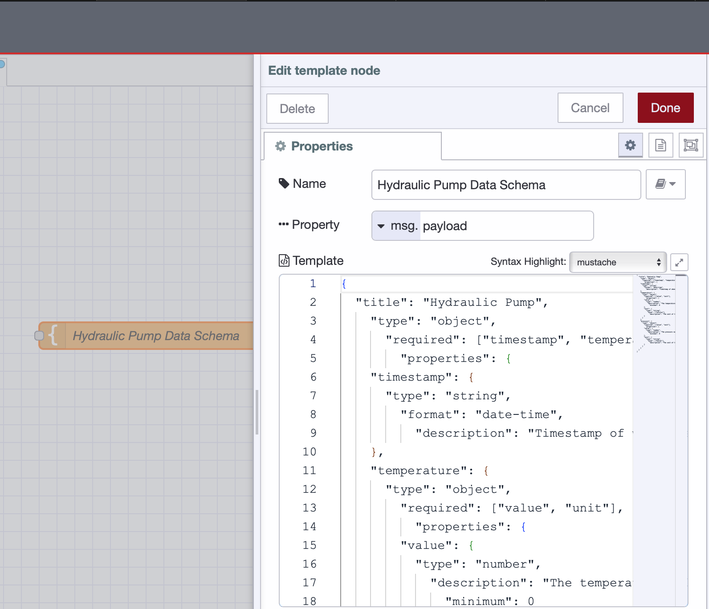
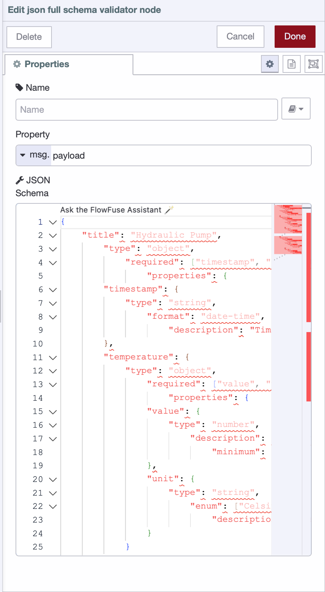
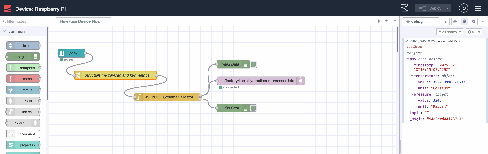

In industrial data operations, structured data is the backbone of consistency, accuracy, and interoperability. Machines, sensors, and control systems generate massive volumes of data, but without a defined schema, managing and integrating this data becomes chaotic.

<!--more-->

A few days ago, we discussed why data schemas are crucial for maturing industrial data operations. Now, it is time to take a step further. In this article, I will introduce JSON Schema—what it is, why it is the fastest way to model and validate data, and how you can implement it in just minutes using FlowFuse. Additionally, we will cover strategies for defining schemas effectively and how to share them with your team to ensure consistency across your operations.

Let’s dive in.

## What is JSON Schema and why is it the fastest and most efficient way to model data?

JSON Schema is a standardized format used to define the structure, validation rules, and data types of JSON documents. It provides a machine-readable way to enforce data consistency, ensuring that JSON data follows a predefined schema.

It is the fastest and most efficient way to model data because it works directly with JSON, requires no compilation, and enables real-time validation. It is lightweight, easy to read, and widely supported, making it simpler than XML Schema and more flexible than Protobuf. Its reusability and standardized tools reduce development effort while ensuring data consistency and reliability across systems.

## Getting Started with Implementing JSON Schema

There are multiple ways to implement JSON Schema, but for industrial environments, a low-code approach can significantly speed up deployment. This is where [FlowFuse](/) comes in.

FlowFuse is an industrial data platform that acts as a complete toolkit for industrial data operations, simplifying all aspects of the process. Whether it’s integration—supporting almost all industrial protocols, hardware API integration, or offering over 5000 pre-built nodes—FlowFuse makes things easier. It handles data collection, aggregation, transformation (with no coding required, just drag-and-drop), MQTT broker management, and visualization with various pre-built widgets (again, no coding required).

From those over 5000 pre-built nodes, we have several that make implementing data schemas easier. We will use one of them today. For this practical example, I have a Siemens PLC integrated with a Raspberry Pi using Node-RED, receiving demo data for temperature and pressure. Let’s implement a data schema.

If you want to learn how to integrate Siemens S7 PLCs with FlowFuse, read the article [Getting Started: Integrating Siemens S7 PLCs with Node-RED](/blog/2025/01/integrating-siemens-s7-plcs-with-node-red-guide/) and  If you want to learn how to integrate a Raspberry Pi, read the following documents:

- [Setting Node-RED on Raspberry Pi 4](/node-red/hardware/raspberry-pi-4/)

- [Setting Up Node-RED on Raspberry Pi 5](/node-red/hardware/raspberry-pi-5/)

If you don’t have the S7 and Raspberry Pi, no worries. You can follow this with other data sources or even use mock data, which you can generate with the Inject and Change nodes.

### Prerequisites

Before you get started, make sure you have the following in place

- Running FlowFuse Remote Instance: 
Ensure that you have a running FlowFuse remote instance on your edge device. This device should act as middleware, collecting data from your industrial PLCs and systems.

To install and run the FlowFuse instance (Node-RED) on your device, use the FlowFuse Device Agent. This agent will connect your device to the FlowFuse Cloud Team, enabling remote access from anywhere.

Don’t have a FlowFuse account yet? No worries! [Sign up now](https://app.flowfuse.com/account/create) and activate your [free tier](/blog/2024/12/flowfuse-release-2-12/). It lets you manage up to two edge devices at no cost.

For more information on how to install and run the FlowFuse instance, refer to the [documentation](/docs/device-agent/quickstart/).

- [node-red-contrib-json-full-schema-validator](https://flows.nodered.org/node/node-red-contrib-full-msg-json-schema-validation): 
This package will be required for JSON schema validation in your flows. Make sure it is installed in your Node-RED environment.

### Getting Started

Before diving into the implementation of the data schema, it's crucial to establish a strong foundation. This section will guide you through the essential steps of defining the schema, sharing it across teams, and validating data against the schema within your factory system.

#### Defining the data schema 

Before moving forward, the first step is to carefully plan the data schema. Since this schema will be used across your entire factory, it’s crucial to involve all relevant team members in the planning process. This includes teams from operations, maintenance, IT, and engineering. Taking the time to gather input from all departments ensures that the schema reflects the real-world requirements of each group and helps avoid misalignment down the line.

When defining the schema, it is essential to decide which properties are necessary, what data types they should be, and what units they should have. For example, if the data includes temperature, determine if it should be in Celsius or Fahrenheit and define the valid range for that data (e.g., -40°C to 150°C). Other factors, such as precision, mandatory fields, and additional attributes, should also be considered to ensure everyone’s needs are addressed.

By carefully planning and involving the whole team, you create a schema that supports consistent data flow across systems and departments. This collaborative approach leads to a well-rounded and effective data schema that helps align team expectations, minimizes future issues, and improves operational efficiency. Taking the time to get everyone on the same page ensures that your data will be consistent, reliable, and ready to drive informed decision-making across the organization.

Once you planned the data scheme, prepare it in the following format.

If you want to learn more about how to create JSON Schemas, check out this helpful : [Getting Started Guide](https://json-schema.org/learn/getting-started-step-by-step)

```json
{
  "title": "Hydraulic Pump",
    "type": "object",
      "required": ["timestamp", "temperature", "pressure"],
        "properties": {
    "timestamp": {
      "type": "string",
        "format": "date-time",
          "description": "Timestamp of when the data was recorded."
    },
    "temperature": {
      "type": "object",
        "required": ["value", "unit"],
          "properties": {
        "value": {
          "type": "number",
            "description": "The temperature value.",
              "minimum": 0
        },
        "unit": {
          "type": "string",
            "enum": ["Celsius"],
              "description": "The unit of the temperature value."
        }
      }
    },
    "pressure": {
      "type": "object",
        "required": ["value", "unit"],
          "properties": {
        "value": {
          "type": "number",
            "description": "The pressure value.",
              "minimum": 0
        },
        "unit": {
          "type": "string",
            "enum": ["Pascal"],
              "description": "The unit of the pressure value."
        }
      }
    }
  }
}
```

This JSON schema defines the structure for data related to a hydraulic pump. It includes three key properties: `timestamp`, `temperature`, and `pressure`. The `timestamp` must be in a valid date-time format. Both `temperature` and `pressure` require two properties: value (a number representing the actual measurement) and `unit` (which must be Celsius for `temperature` and Pascal for `pressure`). Both values must be greater than or equal to zero. This schema ensures that all data is recorded with the correct units and valid values, maintaining consistency and reliability.

##### Sharing This Schema Across Your Team

Now that we have created the JSON schema, we need to ensure that everyone can access it and refer to it when needed. This helps team members understand the schema easily. To achieve this, we will use the FlowFuse Shared Team Library feature.

1. Drag the Template node onto the canvas, paste the data schema into it, and give it a meaningful name. If necessary, add a Comment node.  

{data-zoomable}
_Adding a data schema to the Template node._

1. Next, deploy the flow. Then, go to the main menu (top-right corner), click Export, switch to Team Library, create a new folder, give your data schema flow a meaningful name, and export it to that folder.

{data-zoomable}
_Exporting Schema to Team Library_

Now, any team member who wants to view, use, or understand the data schema format can import it from the Team Library. However, they must be part of the same FlowFuse team where the data schema was exported.

#### Implementing Data Schema Validation

Let's implement the data schema validation mechanism to ensure that each incoming data adheres to the specified JSON schema.

1. Drag the "JSON Full Schema Validator" node onto the Node-RED canvas.
2. Double-click the node to open its settings.
3. Copy and paste your schema into the node’s schema field.

{data-zoomable}
_Configuring "JSON Full Schema Validator" node with json schema for our data_

1. Click Done to save the changes.
2. Connect the input of the "JSON Full Schema Validator" node to the data source from where your data is coming.
3. Connect the node's first output to another node that will process or handle the validated data (e.g., an MQTT node, a database node, or any other destination).
4. Connect the second output to the flow that will handle the situation where data does not meet the schema. This could be a notification flow sending an email or Telegram to your team or a dashboard alert.
5. Deploy the flow.

Now, let's understand this with an example. Below is the data that we are receiving from the PLC. After transforming it, we’ve added essential properties such as unit and value. However, notice that the data doesn't meet the schema definition because the temperature is given in Fahrenheit and is a negative number, which isn't within the expected range.

{data-zoomable}
_Message passes through the second output and includes errors when it does not align with the data schema._

If the data doesn't align with the data schema, it will pass through the "JSON Full Schema Validator" node and flow through the second output. The message will contain an error array with detailed information about what is wrong with the data (e.g., incorrect unit or out-of-range value).

When the data meets the schema, it passes through the first output without errors. The validated data is then sent to the next stage in the flow (e.g., to the Unified Namespace).

{data-zoomable}
_Message passes through the first output and does not include errors when it aligns with the data schema._

## Conclusion

To wrap things up, getting your data structure right is a game-changer for smooth integration and efficient operations. With clear schemas in place, you make sure your data is consistent, reliable, and easy to work with. Tools like FlowFuse can take it up a notch by making data flow between systems even easier. When everything is set up properly, your data becomes a powerful tool that helps drive smarter decisions and boost efficiency. So, investing in your data’s structure really pays off in the long run!