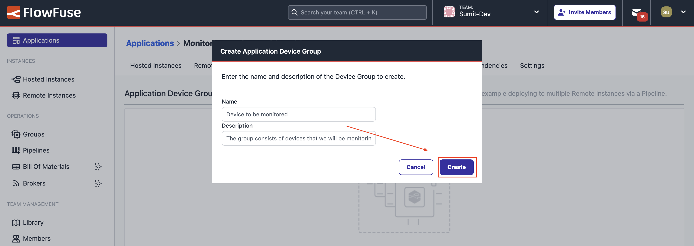
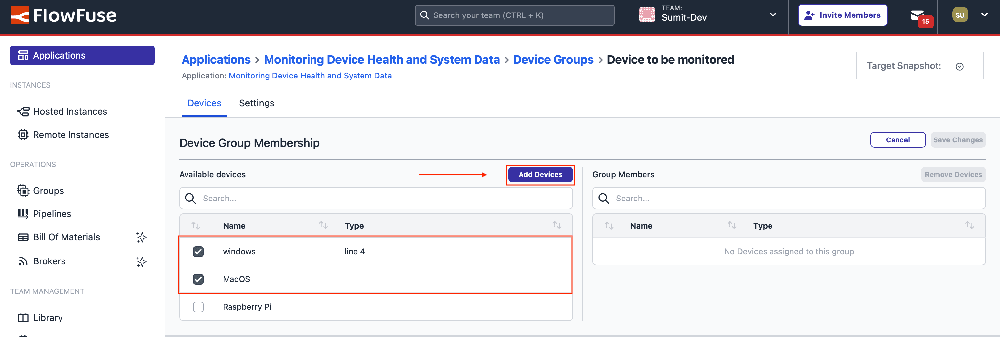
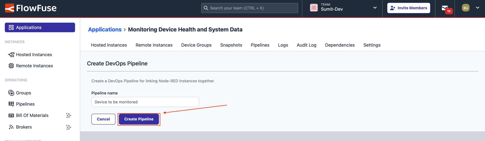

--- 
title: "Monitoring Device Health and Performance at Scale with FlowFuse" 
subtitle: "Track and Optimize Edge Device Performance with Node-RED and FlowFuse."
description: "Learn how to monitor system health and performance with Node-RED. Track CPU usage, memory, and other key metrics, and efficiently scale device monitoring with FlowFuse to thousands of devices."
date: 2025-02-11
authors: ["sumit-shinde"]
image:
keywords: 
tags: 
 - node-red
---

Monitoring edge device health is essential to ensure devices operate efficiently and avoid costly downtime. Whether in IoT networks or industrial environments, tracking key metrics like CPU usage, memory, and system performance is critical. By continuously monitoring these factors in real time, potential issues can be identified and addressed before they lead to disruptions, helping to maintain smooth operations and prevent costly repairs.

<!--more-->

In this post, we will show you how to monitor devices using Node-RED. We will start by building a flow that captures system metrics from a single device, and later, we will explore how FlowFuse simplifies large-scale device monitoring.

## What Exactly Does Monitoring Device Health Mean and Why Is It Essential?

So, when we talk about monitoring the health of edge devices, what we’re really referring to is keeping an eye on things like CPU usage, memory, uptime, and system load. These are the key metrics that help you spot potential issues before they snowball into bigger problems, like crashes or unexpected downtime.

In IoT and IIoT environments, edge devices play a key role in ensuring smooth operations. They manage communication, process data, and integrate different systems. However, when these devices malfunction, it can lead to disruptions, safety risks, or costly consequences. For example, in manufacturing, many companies use edge devices with Node-RED to bridge the gap between older machines and modern cloud systems. These devices facilitate the real-time flow of data between sensors, PLCs, and enterprise applications. If an edge device faces issues like high CPU usage or low memory, it can disrupt data flow, slow down automation, and hinder decision-making, ultimately impacting production efficiency.

The good news is that regularly monitoring device health allows you to identify and resolve minor issues before they cause significant disruptions. This proactive approach helps prevent costly breakdowns, safety risks, and ensures that devices continue to perform as expected in both industrial settings and IoT networks.

## Getting Started with Monitoring Devices

In this section, we’ll walk through how to retrieve key metrics such as CPU usage, memory usage, and other system data from devices. While it would be ideal to test this on thousands of devices, that’s not feasible here. Instead, we’ll use a Raspberry Pi, a Windows machine, and a macOS device for demonstration. However, keep in mind that our customers manage thousands of devices, and FlowFuse makes it possible to monitor them all efficiently.

We’ll start by focusing on monitoring a single device—the Raspberry Pi. The data collected will be sent to a hosted Node-RED instance, and we’ll visualize it using the FlowFuse dashboard. Once we’re comfortable with monitoring a single device, we’ll explore how to scale the monitoring process to handle multiple devices with ease.

### Prerequisites

Before you begin, ensure you have the following:

- Running Node-RED Instance: Make sure you have a running Node-RED instance on the device you need to monitor. You can use the [FlowFuse Device Agent](/product/device-agent/) to install Node-RED, which allows you to access the instance remotely with full security. It also provides additional features such as real-time collaboration with your team, snapshot for recovering from accidental changes, DevOps tools, and the ability to manage multiple devices in groups. You can push updates to all devices with a single click and much more.

For a step-by-step guide on installing and running the FlowFuse device agent, refer to the official documentation: [FlowFuse Device Agent Quickstart](/docs/device-agent/quickstart/).

If you haven’t signed up for a FlowFuse account yet, [sign up now](https://app.flowfuse.com/account/create/).

- Install Necessary Nodes: You need to install the following Node-RED nodes to collect system data and display it on a dashboard:

- `node-red-contrib-os`: Retrieves system information such as memory, uptime, and load.
- `node-red-contrib-cpu`: Monitors CPU usage.
- `@flowfuse/node-red-dashboard`: Provides UI components for visualizing system metrics.
- `node-red-contrib-moment`: Formats uptime duration in a human-readable format.

You can install these nodes from the [Node-RED Palette Manager](https://nodered.org/docs/user-guide/editor/palette/manager).

### Collecting CPU and System Metrics with Node-RED

Now that Node-RED is set up on the device, let's collect key system metrics essential for monitoring, such as overall CPU usage, memory usage, system uptime, and average load over different periods.

**Collecting CPU Usage Data**

1. Drag the CPU node from the Performance category onto the canvas, double-click it, and uncheck all options except the first one: "Send a message for overall usage." This simplifies monitoring overall CPU performance. If you need separate metrics for each core, you can select the second or third option instead.
2. Drag an Inject node onto the canvas, double-click it, and set it to trigger at the desired interval (e.g., every second, every 10 seconds, or every 30 seconds). Connect the output of the Inject node to the input of the CPU node.
3. Drag a Debug node onto the canvas and connect it to the output of the CPU node to view the collected data in the debug pane.
4. Deploy the flow by clicking the Deploy button in the top right corner of the Node-RED editor.

Once deployed, CPU usage data will appear in the debug pane.

**Monitoring Memory Usage**

1. Drag the Memory node the onto the canvas, double-click it, and select the unit you want to use for memory (e.g., byte, gigabyte, etc.). Selecting gigabyte will make it easier to interpret.  
2. Connect the Memory node input to the output of the Inject node.  
3. Then, connect the output of the Memory node to the input of the Debug node that you previously added.
4. Deploy the flow.  

Now, alongside the CPU data, you will receive an object containing the memory usage with the following properties in the debug pane:

- totalmem: total available memory  
- freemem: free memory  
- memusage: current memory usage.

**Tracking System Uptime**

1. Drag the Uptime node onto the canvas.  
2. Connect the input of the Uptime node to the output of the Inject node.  
3. Then, connect the output of the Uptime node to the input of the Debug node that you previously added.  
4. Deploy the flow.  

Once deployed, you will start receiving uptime data in the debug pane. The uptime value represents the total number of seconds the system has been running.

**Analyzing Load Average**

1. Drag the Loadavg node onto the canvas.  
2. Connect the input of the Loadavg node to the output of the Inject node.  
3. Then, connect the output of the Loadavg node to the input of the Debug node.  
4. Deploy the flow.

This will give us the average load over 1 minute, 5 minutes, and 15 minutes. The load average represents the number of processes waiting for CPU time. A high value means the system is under heavy load, while a low value indicates it has available processing capacity. By analyzing these values, you can determine whether system performance is degrading over time. If the load average stays consistently high, it may indicate excessive CPU demand, which could require optimization or additional processing resources.

### Sharing Data Across Different Node-RED Instances

Now that we have the data, we need to send it to the Node-RED instance where we will build the monitoring dashboard. Using a separate instance for the dashboard ensures that, as we scale to multiple devices, we can efficiently monitor all of them from a single location.

While sending the data, we combine all the collected metrics from each device into a single object for better organization and easier processing.

Import the following flow and deploy it in the device instance. I am not covering the detailed steps here, but I have explained below what this flow includes and how it works. To learn more, read the article: [Using FlowFuse Project Nodes for Faster and More Efficient Communication](/blog/2024/10/exploring-flowfuse-project-nodes/).:


[{"id":"6f655630d97bac87","type":"cpu","z":"FFF0000000000001","name":"","msgCore":false,"msgOverall":true,"msgArray":false,"msgTemp":false,"x":450,"y":380,"wires":[["d47b2da8024123bf"]]},{"id":"733dc91d94f03e49","type":"inject","z":"FFF0000000000001","name":"","props":[],"repeat":"10","crontab":"","once":false,"onceDelay":0.1,"topic":"","x":210,"y":440,"wires":[["6f655630d97bac87","bcddc3aba82a12da","7af11ed245ddf9c3","d6d58c81cea93671"]]},{"id":"bcddc3aba82a12da","type":"Memory","z":"FFF0000000000001","name":"","scale":"Gigabyte","x":440,"y":420,"wires":[["03ee32ddbd80d7a2"]]},{"id":"7af11ed245ddf9c3","type":"Uptime","z":"FFF0000000000001","name":"","x":440,"y":460,"wires":[["6117e013be2a11ac"]]},{"id":"d6d58c81cea93671","type":"Loadavg","z":"FFF0000000000001","name":"","x":440,"y":500,"wires":[["b759167c1663eb21"]]},{"id":"d47b2da8024123bf","type":"change","z":"FFF0000000000001","name":"CPU USAGE","rules":[{"t":"set","p":"data","pt":"msg","to":"{}","tot":"json"},{"t":"set","p":"data.CPU_USAGE","pt":"msg","to":"payload","tot":"msg"}],"action":"","property":"","from":"","to":"","reg":false,"x":650,"y":380,"wires":[["7429fa970d1e3099"]]},{"id":"03ee32ddbd80d7a2","type":"change","z":"FFF0000000000001","name":"MEMORY USAGE","rules":[{"t":"set","p":"data","pt":"msg","to":"{}","tot":"json"},{"t":"set","p":"data.MEMORY_USAGE","pt":"msg","to":"payload","tot":"msg"}],"action":"","property":"","from":"","to":"","reg":false,"x":670,"y":420,"wires":[["7429fa970d1e3099"]]},{"id":"6117e013be2a11ac","type":"change","z":"FFF0000000000001","name":"SYSTEM UPTIME","rules":[{"t":"set","p":"data","pt":"msg","to":"{}","tot":"json"},{"t":"set","p":"data.UPTIME","pt":"msg","to":"payload.uptime","tot":"msg"}],"action":"","property":"","from":"","to":"","reg":false,"x":670,"y":460,"wires":[["7429fa970d1e3099"]]},{"id":"b759167c1663eb21","type":"change","z":"FFF0000000000001","name":"LOAD AVERAGE","rules":[{"t":"set","p":"data","pt":"msg","to":"{}","tot":"json"},{"t":"set","p":"data.LOAD_AVERAGE.ONE_MIN","pt":"msg","to":"payload.loadavg[0]","tot":"msg"},{"t":"set","p":"data.LOAD_AVERAGE.FIVE_MIN","pt":"msg","to":"payload.loadavg[1]","tot":"msg"},{"t":"set","p":"data.LOAD_AVERAGE.FIFTEEN_MIN","pt":"msg","to":"payload.loadavg[2]","tot":"msg"}],"action":"","property":"","from":"","to":"","reg":false,"x":670,"y":500,"wires":[["7429fa970d1e3099"]]},{"id":"7429fa970d1e3099","type":"join","z":"FFF0000000000001","name":"","mode":"custom","build":"merged","property":"data","propertyType":"msg","key":"topic","joiner":"\\n","joinerType":"str","useparts":false,"accumulate":true,"timeout":"","count":"4","reduceRight":false,"reduceExp":"","reduceInit":"","reduceInitType":"","reduceFixup":"","x":890,"y":440,"wires":[["133d57048a7b057d"]]},{"id":"133d57048a7b057d","type":"change","z":"FFF0000000000001","name":"","rules":[{"t":"set","p":"payload","pt":"msg","to":"data","tot":"msg"}],"action":"","property":"","from":"","to":"","reg":false,"x":1070,"y":440,"wires":[["8123ad61cf50e61e"]]},{"id":"8123ad61cf50e61e","type":"project link out","z":"FFF0000000000001","name":"project out 1","mode":"link","broadcast":true,"project":"28a809c6-b8f3-499f-bb20-e357c292b443","topic":"${FF_DEVICE_NAME}","x":1250,"y":440,"wires":[]}]


Let's understand the flow.

In the flow above, we use four Change nodes, each connected to the output of the CPU, Memory, Uptime, and Loadavg nodes. The reason we use Change nodes is that these nodes provide their data as `msg.payload`, and we need to structure the data in a more organized way before sending it out.

Next, we use a Join node to combine the `msg.data` objects from all Change nodes into a single data object. Another Change node then assigns this combined object back to `msg.payload`.

The combined object appears as shown in the image below:

{data-zoomable}
_Combined object containing system data such as CPU usage, memory usage, uptime, and load average._

To share this data with other Node-RED instances, we use the Project Out node, which is only available in FlowFuse. It works similarly to MQTT, using MQTT in the background, but without requiring manual configuration—just a topic name and the target instance.

The Project nodes make it easy to manage communication and connection between Node-RED instances.

In this Project node, we broadcast the message across all instances in the team using `${FF_DEVICE_NAME}` as the topic—an environment variable automatically created in all FlowFuse instances. This enables the same flow to be used across multiple devices without modification, ensuring that each device utilizes its own environment variables and sends data under its respective topic.

## Visualizing Data with the FlowFuse Dashboard  

Now that the data is being broadcasted, it can be used to build a simple dashboard that visualizes it with different types of charts.  

Ensure that a separate hosted instance has been created in the same team where the device is registered. This instance will be used to deploy the dashboard.  

1. Drag the Project In node onto the canvas. Double-click on it and select "Listen for broadcast messages from". Choose "All instances and devices" from the dropdown menu. Enter the device name in the topic field and ensure it matches exactly with the device name environment variable. Click Done.  
2. Drag two Change nodes onto the canvas.  
3. Double-click on the first Change node. Set msg.payload to the JSONata expression:  
   
```json
   payload.MEMORY_USAGE.totalmem - payload.MEMORY_USAGE.freemem
```  
   Set msg.topic to "USED MEMORY". Click Done.  

4. Double-click on the second Change node. Set msg.payload to:  
   
```json
   msg.payload.MEMORY_USAGE.freemem
```  
   Set msg.topic to "Free Memory". Click Done.  

5. Drag the ui-chart widget onto the canvas. Double-click on it and create a new group. Set the correct width and height. Select "Pie" as the chart type. Set the action to "Append". Set X to msg.topic. Leave Y empty and Click Done.  
6. Connect the nodes as follows:  

   Project In node → Change nodes → ui-chart widget  

7. Drag another Change node onto the canvas. Double-click on it and set `msg.payload` to the JSONata expression and Click Done:  

```json
   $round(payload.CPU_USAGE, 2)
```  

8. Drag the ui-gauge widget onto the canvas. Double-click on it and create a new group. Set the height and size. Select "3/4 gauge" with a rounded style. Set the range from 0 to 10. Add three segments with different colors: 0 (Green), 4 (Yellow), 7 (Red). Set the label to "CPU". Click Done.  

9. Connect the nodes as follows:  

   Project In node → Change node → ui-gauge widget  

10.  Drag the Humanizer node onto the canvas. Double-click on it and enter "UPTIME" in the input variable field.  

11.  Drag a Change node onto the canvas. Double-click on it and set msg.payload to msg.payload.humanized.  

12.  Drag the ui-text widget onto the canvas. Double-click on it and create a new group. Select the fifth layout. Check "Apply style" and set the text size to 99. Click Done.  

13.  Connect the nodes as follows:  

   Project In node → Humanizer node → Change node → ui-text widget  

14.  Drag three Change nodes onto the canvas.  

15.  Double-click on the first Change node. Set `msg.payload` to `msg.payload.LOAD_AVERAGE.ONE_MIN`. Set `msg.topic` to "One Minute" and Click Done.  

16.  Double-click on the second Change node. Set `msg.payload` to `msg.payload.LOAD_AVERAGE.FIVE_MIN`. Set `msg.topic` to "Five Minute" and Click Done.  

17. Double-click on the third Change node. Set msg.payload to msg.payload.LOAD_AVERAGE.FIFTEEN_MIN. Set msg.topic to "Fifteen Minute". Click Done.  

18. Drag the ui-chart widget onto the canvas. Double-click on it and create a new group. Set the width and height. Set the chart type to "Linear". Set the action to "Append". Set the X-axis type to "Timescale". Set the series to msg.topic. Set X to timestamp and Y to msg.payload. Click Done.  

19. Connect the nodes as follows:  

   Project In node → Change nodes → ui-chart widget  

20. Deploy the flow by click top-right deploy button.

{data-zoomable}
_Dashboard monitoring device CPU usage, memory uptime, and load average_

Below is the complete flow of the dashboard visualizing the system data we collected.


[{"id":"018657fd6a7e4237","type":"project link in","z":"797e084100cec864","name":"project in 1","project":"all","broadcast":true,"topic":"MacOS","x":80,"y":260,"wires":[["1335f4283b6bac10","acd675febbdadc6f","f875ddcc0de1c40f","95e3d356bd589be7","7cde186dd1601efb","6448cab78573bf39","d0e232ec780650fa"]]},{"id":"1335f4283b6bac10","type":"change","z":"797e084100cec864","name":"Free Memory","rules":[{"t":"set","p":"payload","pt":"msg","to":"payload.MEMORY_USAGE.freemem","tot":"msg"},{"t":"set","p":"topic","pt":"msg","to":"Free Memory","tot":"str"}],"action":"","property":"","from":"","to":"","reg":false,"x":270,"y":160,"wires":[["eed0837fccf2639d"]]},{"id":"eed0837fccf2639d","type":"ui-chart","z":"797e084100cec864","group":"a54eed4c7110dfb5","name":"Memory Usage","label":"X - msg.topic, Series - msg.series","order":1,"chartType":"pie","category":"Pie","categoryType":"str","xAxisLabel":"","xAxisProperty":"topic","xAxisPropertyType":"msg","xAxisType":"radial","xAxisFormat":"","xAxisFormatType":"auto","xmin":"","xmax":"","yAxisLabel":"","yAxisProperty":"","yAxisPropertyType":"property","ymin":"","ymax":"","bins":"","action":"append","stackSeries":false,"pointShape":"circle","pointRadius":4,"showLegend":true,"removeOlder":1,"removeOlderUnit":"3600","removeOlderPoints":"","colors":["#0095ff","#ff0000","#ff7f0e","#2ca02c","#98df8a","#d62728","#ff9896","#9467bd","#c5b0d5"],"textColor":["#666666"],"textColorDefault":true,"gridColor":["#e5e5e5"],"gridColorDefault":true,"width":"3","height":"3","className":"","interpolation":"linear","x":520,"y":140,"wires":[[]]},{"id":"acd675febbdadc6f","type":"change","z":"797e084100cec864","name":"Used Memory","rules":[{"t":"set","p":"payload","pt":"msg","to":"payload.MEMORY_USAGE.totalmem - payload.MEMORY_USAGE.freemem","tot":"jsonata"},{"t":"set","p":"topic","pt":"msg","to":"Used Memory","tot":"str"}],"action":"","property":"","from":"","to":"","reg":false,"x":280,"y":120,"wires":[["eed0837fccf2639d"]]},{"id":"f875ddcc0de1c40f","type":"change","z":"797e084100cec864","name":"CPU Overall Usage","rules":[{"t":"set","p":"payload","pt":"msg","to":"$round(payload.CPU_USAGE, 2)","tot":"jsonata"},{"t":"set","p":"topic","pt":"msg","to":"CPU Overall Usage","tot":"str"}],"action":"","property":"","from":"","to":"","reg":false,"x":290,"y":260,"wires":[["a777eb57611ddd60"]]},{"id":"a777eb57611ddd60","type":"ui-gauge","z":"797e084100cec864","name":"","group":"0d1f7e47031c74c1","order":1,"width":"4","height":"5","gtype":"gauge-34","gstyle":"rounded","title":"CPU ","units":"units","icon":"","prefix":"","suffix":"","segments":[{"from":"0","color":"#5cd65c"},{"from":"4","color":"#ffc800"},{"from":"7","color":"#ea5353"}],"min":0,"max":10,"sizeThickness":16,"sizeGap":4,"sizeKeyThickness":8,"styleRounded":true,"styleGlow":false,"className":"","x":490,"y":260,"wires":[]},{"id":"95e3d356bd589be7","type":"humanizer","z":"797e084100cec864","name":"","input":"UPTIME","x":290,"y":340,"wires":[["9d237ff676ad6083"]]},{"id":"79e5bdfa309d27ea","type":"ui-text","z":"797e084100cec864","group":"3827fa7650fa2fa1","order":1,"width":"4","height":"5","name":"Uptime","label":"","format":"{{msg.payload}}","layout":"col-center","style":true,"font":"","fontSize":"99","color":"#0056d6","wrapText":false,"className":"","x":680,"y":340,"wires":[]},{"id":"9d237ff676ad6083","type":"change","z":"797e084100cec864","name":"","rules":[{"t":"set","p":"payload","pt":"msg","to":"payload.humanized","tot":"msg"}],"action":"","property":"","from":"","to":"","reg":false,"x":480,"y":340,"wires":[["79e5bdfa309d27ea"]]},{"id":"7cde186dd1601efb","type":"change","z":"797e084100cec864","name":"One Minute (LOAD_AVERAGE)","rules":[{"t":"set","p":"payload","pt":"msg","to":"payload.LOAD_AVERAGE.ONE_MIN","tot":"jsonata"},{"t":"set","p":"topic","pt":"msg","to":"One Minute","tot":"str"}],"action":"","property":"","from":"","to":"","reg":false,"x":330,"y":400,"wires":[["b5bf2c8c93abb5a9"]]},{"id":"6448cab78573bf39","type":"change","z":"797e084100cec864","name":"Five Minute (LOAD_AVERAGE)","rules":[{"t":"set","p":"payload","pt":"msg","to":"payload.LOAD_AVERAGE.FIVE_MIN","tot":"jsonata"},{"t":"set","p":"topic","pt":"msg","to":"Five Minute","tot":"str"}],"action":"","property":"","from":"","to":"","reg":false,"x":330,"y":440,"wires":[["b5bf2c8c93abb5a9"]]},{"id":"d0e232ec780650fa","type":"change","z":"797e084100cec864","name":"Fifteen Minute (LOAD_AVERAGE)","rules":[{"t":"set","p":"payload","pt":"msg","to":"payload.LOAD_AVERAGE.FIFTEEN_MIN","tot":"jsonata"},{"t":"set","p":"topic","pt":"msg","to":"Fifteen Minute","tot":"str"}],"action":"","property":"","from":"","to":"","reg":false,"x":340,"y":480,"wires":[["b5bf2c8c93abb5a9"]]},{"id":"b5bf2c8c93abb5a9","type":"ui-chart","z":"797e084100cec864","group":"0c78dcb3aefb38a8","name":"LOAD AVERAGE","label":"chart","order":1,"chartType":"line","category":"topic","categoryType":"msg","xAxisLabel":"","xAxisProperty":"","xAxisPropertyType":"timestamp","xAxisType":"time","xAxisFormat":"","xAxisFormatType":"auto","xmin":"","xmax":"","yAxisLabel":"","yAxisProperty":"payload","yAxisPropertyType":"msg","ymin":"","ymax":"","bins":10,"action":"append","stackSeries":false,"pointShape":"dash","pointRadius":4,"showLegend":true,"removeOlder":1,"removeOlderUnit":"3600","removeOlderPoints":"","colors":["#0095ff","#ff0000","#ff7f0e","#2ca02c","#a347e1","#d62728","#ff9896","#9467bd","#c5b0d5"],"textColor":["#666666"],"textColorDefault":true,"gridColor":["#e5e5e5"],"gridColorDefault":true,"width":"12","height":"6","className":"","interpolation":"linear","x":610,"y":440,"wires":[[]]},{"id":"a54eed4c7110dfb5","type":"ui-group","name":"Memory Usage","page":"d0621b8f20aee671","width":"3","height":"3","order":3,"showTitle":true,"className":"","visible":"true","disabled":"false","groupType":"default"},{"id":"0d1f7e47031c74c1","type":"ui-group","name":"CPU Usage","page":"d0621b8f20aee671","width":"4","height":"5","order":2,"showTitle":true,"className":"","visible":"true","disabled":"false","groupType":"default"},{"id":"3827fa7650fa2fa1","type":"ui-group","name":"SYSTEM UPTIME","page":"d0621b8f20aee671","width":"5","height":"5","order":1,"showTitle":true,"className":"","visible":"true","disabled":"false","groupType":"default"},{"id":"0c78dcb3aefb38a8","type":"ui-group","name":"Load Average","page":"d0621b8f20aee671","width":"12","height":1,"order":4,"showTitle":true,"className":"","visible":"true","disabled":"false","groupType":"default"},{"id":"d0621b8f20aee671","type":"ui-page","name":"Mac OS","ui":"6c8450c52cafa145","path":"/macos","icon":"home","layout":"grid","theme":"5075a7d8e4947586","breakpoints":[{"name":"Default","px":"0","cols":"3"},{"name":"Tablet","px":"576","cols":"6"},{"name":"Small Desktop","px":"768","cols":"9"},{"name":"Desktop","px":"1024","cols":"12"}],"order":1,"className":"","visible":"true","disabled":"false"},{"id":"6c8450c52cafa145","type":"ui-base","name":"My Dashboard","path":"/dashboard","appIcon":"","includeClientData":true,"acceptsClientConfig":["ui-notification","ui-control"],"showPathInSidebar":false,"headerContent":"page","navigationStyle":"default","titleBarStyle":"default","showReconnectNotification":true,"notificationDisplayTime":1,"showDisconnectNotification":true},{"id":"5075a7d8e4947586","type":"ui-theme","name":"Default Theme","colors":{"surface":"#ffffff","primary":"#0094CE","bgPage":"#eeeeee","groupBg":"#ffffff","groupOutline":"#cccccc"},"sizes":{"pagePadding":"12px","groupGap":"12px","groupBorderRadius":"4px","widgetGap":"12px"}}]


## Scaling Device Monitoring with FlowFuse

Now that we have learned how to monitor a single device and built a flow that gathers system data from it, the real challenge arises when scaling up to thousands or even tens of thousands of devices. Manually creating a system data-gathering flow for each device would be impractical. However, with FlowFuse, this process can be automated in less than five minutes. Let's see how.

### Creating Device Group

1. Navigate to the FlowFuse platform and go to the Application in which your devices are and where you want to create a group. Ensure that all the devices you want to monitor are part of this application.  

{data-zoomable}  
_Showing the option to switch to "Device Groups" and the "Add Device Group" button._

2. Click on "Device Groups" from the top menu. Next, click on the "Add Device Group" button. In the newly opened window, select the application to which this group should belong. Enter a group name and description, then click "Create".  

{data-zoomable}  
_Form to Create a Device Group: Enter the group name and description_

3. Click on the newly created group and then click the "Edit" button at the top-right.

{data-zoomable}  
_Image showing the edit button to be clicked on._

4. In the left-side container, you will see a list of all available devices in your application. Select the devices you want to add to the group, click the "Add Devices" button at the top-right of that container, and then click "Save Changes" at the top-right of the right-side container. Once done, you will see all added devices in the right-side container, confirming that the devices have been successfully added to the group.

{data-zoomable}  
_Interface to select the devices that need to be added to the group, along with the 'Add Devices' button._

{data-zoomable}  
_Showing the selected devices we chose to add, along with the 'Save Changes' button._

### Creating Snapshot

1. Navigate to the Remote Instance on which we developed the flow to monitor the performance, switch to "Version History" by clicking on "Version History" from the top.

{data-zoomable}  
_Showing the option to switch to "Version history" and the "Create Snapshot" button._

1. Switch to the 'Snapshots' tab and create a new snapshot by clicking on the "Create Snapshot" button. Enter the details such as name and description. While creating the snapshot, make sure to check the 'Set as Target' option and click 'Create'. Checking this option will set the created snapshot as the device’s active snapshot. Later, this snapshot will be used to deploy on the devices from the device group using the DevOps pipeline. If you wanted to learn more on snapshot you can read our article : [Using Snapshots for Version Control in Node-RED with FlowFuse](/blog/2024/09/node-red-version-control-with-snapshots/).

{data-zoomable}  
_Showing the form to create a snapshot and the "Set as Target" option._

### Creating DevOps Pipeline

1. Navigate to the application where the devices were added and the group was created. Switch to the "Pipelines" tab at the top, then click "Add Pipeline". In the newly opened window, enter a pipeline name.

{data-zoomable}  
_Image showing the 'Add Pipeline' button._

{data-zoomable}  
_Image showing the form to create a pipeline by entering a name._

2. In the newly added pipeline, click "Add Stage".

{data-zoomable}  
_Image showing the button to add a stage._

3. In the newly opened window, select "Remote Instance" as the stage type, enter a stage name, and select the device where we previously built the flow for a single device. Select "Use latest device snapshot" under "Action" and click "Add Stage".

{data-zoomable}  
_Image showing the form to add a stage, where a stage is being added for a Raspberry Pi remote instance._

4. Add another stage, select "Device Group" as the stage type, enter a stage name, choose the device group created earlier, and click "Add Stage".

{data-zoomable}  
_Image showing the form to add a stage, where a stage is being added for a Device Group._

5. Once both stages are added, click the "Run Pipeline" button for the first stage. Running the pipeline creates a snapshot that includes all settings, environment variables, and flows for that instance. This snapshot is then copied and deployed to the next stage, which includes all devices in the group. Whether you have 100, 1,000, or 10,000 devices, your system data-gathering flow will be deployed and running in just a few seconds.

To learn more on devops pipeline read the artilce: [Creating and Automating DevOps Pipelines for Node-RED in Industrial Environments](/blog/2024/10/how-to-build-automate-devops-pipelines-node-red-deployments/).

Now you have the system data of all devices broadcasted on the topic with the device name. To monitor each device, go to the dashboard instance, copy the flow, and create copies for each device. Make sure to replace the topic with the corresponding device name. Additionally, ensure that you have created a separate page for each device, assigned them to separate groups, and correctly moved all copied widgets into the correct groups.  

## Conclusion

Building a monitoring flow in Node-RED is simple, allowing you to track key system metrics like CPU usage, memory, and uptime with minimal effort. Its low-code interface makes it easy to create and deploy monitoring solutions quickly.

However, manually deploying this monitoring flow across 10,000 or even 100,000 devices can be a complex and time-consuming task. This is where FlowFuse makes a difference. With features like Device Groups and DevOps pipelines, you can deploy your application from a single device or hosted Node-RED instance to thousands of devices with just a single click. FlowFuse also provides powerful tools for scaling, managing, and monitoring industrial operations, making large-scale deployments more efficient and hassle-free.