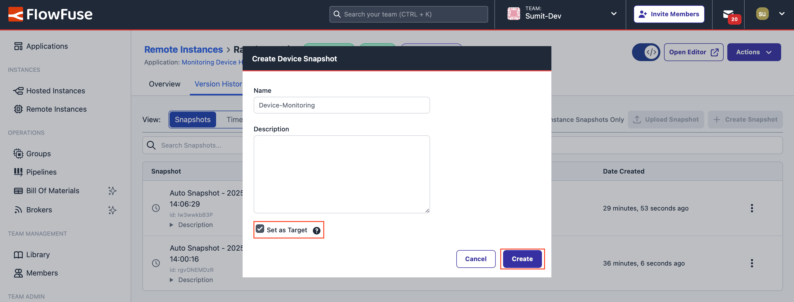

--- 
title: "Monitoring Device Health and Performance at Scale with FlowFuse" 
subtitle: "Track and Optimize Edge Device Performance with Node-RED and FlowFuse."
description: "Learn how to monitor system health and performance with Node-RED. Track CPU usage, memory, and other key metrics, and efficiently scale device monitoring with FlowFuse to thousands of devices."
date: 2025-02-21
authors: ["sumit-shinde"]
image:  /blog/2025/02/images/monitoring-device-health-and-performance-at-scale.png
keywords: real-time device monitoring, FlowFuse for IoT monitoring, scalable edge device monitoring, remote device performance tracking, centralized device monitoring dashboard, optimizing IoT device health, real-time performance tracking with Node-RED, remote monitoring for industrial automation
tags: 
 - node-red
 - flowfuse
---

Edge devices are everywhere, and their numbers are skyrocketing—from 2.7 billion in 2020 to a projected 7.8 billion by 2030, according to [various reports](https://transformainsights.com/news/edge-computing-rapid-growth-iot#:~:text=New%20Transforma%20Insights%20reports%20covering,edge%20capabilities%20in%20IoT%20devices.). As these devices become critical for automation and data processing, monitoring their health is essential to ensure reliability and efficiency.  

<!--more-->

Tracking CPU usage, memory, and system performance helps detect potential issues early, preventing downtime and optimizing operations. In this post, we will explore how to monitor devices using Node-RED and scale this process efficiently with FlowFuse.  

<iframe width="100%" height="315" src="https://www.youtube.com/embed/43te5aD1RRw?si=5X2XbER_-ZQMLZOb" title="YouTube video player" frameborder="0" allow="accelerometer; autoplay; clipboard-write; encrypted-media; gyroscope; picture-in-picture" allowfullscreen></iframe>

## What is Device Health Monitoring, and Why is it Important?  

Edge devices power IoT and automation, handling communication and data processing. As their numbers grow, ensuring they run efficiently is crucial.  

Monitoring device health means tracking key metrics like CPU usage, memory, uptime, and system load. High CPU usage or low memory can slow down processes, disrupt data flow, and reduce efficiency.  

For example, in manufacturing, edge devices connect machines to cloud systems for real-time data. If a device fails, production can be impacted.  

Regular monitoring helps detect issues early, prevents downtime, and keeps devices running smoothly. 

## Getting Started with Monitoring Devices

We will begin by monitoring a single device, such as a Raspberry Pi, collecting system data, and visualizing it using FlowFuse. Once the process is clear, we will expand it to monitor multiple devices at scale.  

### Prerequisites

Before you begin, ensure you have the following:

1. **Running Node-RED Instance:** You need a running Node-RED instance on the device you want to monitor. The easiest way to set this up is with the [FlowFuse Device Agent](/platform/device-agent/), which provides secure remote access, real-time collaboration, snapshots for quick recovery, DevOps tools, and device group management. With it, you can push updates to multiple devices with a single click.  

For a step-by-step installation guide, refer to the [FlowFuse Device Agent Quickstart](/docs/device-agent/quickstart/).  

If you haven’t yet signed up for a FlowFuse account, [sign up now](/get-started?utm_campaign=60718323-BCTA&utm_source=blog&utm_medium=cta&utm_term=high_intent&utm_content=Monitoring%20Device%20Health%20and%20Performance%20at%20Scale%20with%20FlowFuse).

1. **Required Node-RED Nodes:** To collect system data and display it on a dashboard, install the following Node-RED nodes via the [Node-RED Palette Manager](https://nodered.org/docs/user-guide/editor/palette/manager):  

- `node-red-contrib-os`: Retrieves system information such as memory, uptime, and load.
- `node-red-contrib-cpu`: Monitors CPU usage.
- `@flowfuse/node-red-dashboard`: Provides UI components for visualizing system metrics.
- `node-red-contrib-moment`: Formats uptime duration in a human-readable format.

### Collecting CPU and System Metrics with Node-RED  

Now that Node-RED is running on your device, it’s time to gather essential system metrics. Monitoring CPU usage, memory consumption, system uptime, and load averages helps you monitormonitor performance and spot potential issues before they become serious problems.  

Let’s break it down step by step.  

#### Collecting CPU Usage Data  

To start, let’s capture CPU usage in real time:  

1. Drag a **CPU** node from the "Performance" category onto the canvas.  
2. Double-click the node and uncheck all options except "Send a message for overall usage." This ensures you get a clear view of total CPU performance. If you need per-core metrics, you can enable the other options.  
3. Add an **Inject** node, double-click it, and set it to trigger at a suitable interval (e.g., every second, every 10 seconds, or every 30 seconds). Connect its output to the CPU node.  
4. Add a **Debug** node and connect it to the output of the CPU node. This lets you view CPU data in the debug pane.  
5. **Click Deploy** in the top-right corner of the Node-RED editor.  

Your debug pane will now start showing live CPU usage data:

{data-zoomable}
_An image showing the flow that gathers CPU usage data and prints it in the debug pane_

#### Monitoring Memory Usage  

Next, let’s track memory consumption:  

1. Drag a Memory node onto the canvas and double-click it.  
2. Choose the unit for memory display (e.g., gigabytes for easier readability).  
3. Connect the Memory node’s input to the Inject node’s output.  
4. Connect the Memory node’s output to the existing Debug node.  
5. Click Deploy to start monitoring.  

Once deployed, you will see a structured object in the debug pane containing along with cpu usage:  

{data-zoomable}
_An image showing the flow that gathers memory usage data and prints it in the debug pane_

- totalmem: Total available memory  
- freemem: Free memory  
- memusage: Current memory usage  

#### Tracking System Uptime  

Monitoring uptime helps detect unexpected reboots and ensures system stability.  

1. Drag an Uptime node onto the canvas.  
2. Connect its input to the Inject node’s output.  
3. Connect its output to the Debug node.  
4. Click Deploy to activate uptime tracking.  

Each time the Inject node triggers, the debug pane will display the uptime in seconds and CPU and memory usage. 

{data-zoomable}
_An image showing the flow that gathers system uptime data and prints it in the debug pane_

#### Analyzing Load Average  

To understand how busy your system has been over time, let’s analyze the load average:  

1. Drag a **Loadavg** node onto the canvas.  
2. Connect its input to the Inject node’s output.  
3. Connect its output to the Debug node.  
4. Click Deploy to start tracking.  

This will give you three key metrics:  

{data-zoomable}

- 1-minute load average: Immediate system load  
- 5-minute load average: Recent short-term trend  
- 15-minute load average: Long-term system trend  

If these values remain consistently high, your system may struggle under excessive demand, signaling a need for optimization or additional processing power.  

With these metrics in place, you have a solid foundation for real-time system monitoring.   

### Sharing Data Across Different Node-RED Instances

Once we have the data, we must send it to the Node-RED instance handling visualization. Keeping the dashboard separate is essential for scalability. As the number of devices increases, a dedicated instance ensures we can monitor all of them from a single, centralized dashboard. This approach also makes management more efficient.

To send data between multiple Node-RED instances we can use [FlowFuse's Project Nodes](/blog/2024/10/exploring-flowfuse-project-nodes/).

Before sending the data though, we combine all collected metrics into a single object for better organization and easier processing. Currently, each node sends its metrics as a separate message object. Merging them into a single object streamlines data handling and reduces message overhead.

Import the following flow and deploy it in the device instance. While I am not covering the step-by-step process here, the explanation below covers what the flow includes and how it works.


[{"id":"6f655630d97bac87","type":"cpu","z":"FFF0000000000001","name":"","msgCore":false,"msgOverall":true,"msgArray":false,"msgTemp":false,"x":870,"y":460,"wires":[["d47b2da8024123bf"]]},{"id":"733dc91d94f03e49","type":"inject","z":"FFF0000000000001","name":"","props":[],"repeat":"10","crontab":"","once":false,"onceDelay":0.1,"topic":"","x":630,"y":520,"wires":[["6f655630d97bac87","bcddc3aba82a12da","7af11ed245ddf9c3","d6d58c81cea93671"]]},{"id":"bcddc3aba82a12da","type":"Memory","z":"FFF0000000000001","name":"","scale":"Gigabyte","x":860,"y":500,"wires":[["03ee32ddbd80d7a2"]]},{"id":"7af11ed245ddf9c3","type":"Uptime","z":"FFF0000000000001","name":"","x":860,"y":540,"wires":[["6117e013be2a11ac"]]},{"id":"d6d58c81cea93671","type":"Loadavg","z":"FFF0000000000001","name":"","x":860,"y":580,"wires":[["b759167c1663eb21"]]},{"id":"d47b2da8024123bf","type":"change","z":"FFF0000000000001","name":"CPU USAGE","rules":[{"t":"set","p":"data","pt":"msg","to":"{}","tot":"json"},{"t":"set","p":"data.CPU_USAGE","pt":"msg","to":"payload","tot":"msg"}],"action":"","property":"","from":"","to":"","reg":false,"x":1070,"y":460,"wires":[["7429fa970d1e3099"]]},{"id":"03ee32ddbd80d7a2","type":"change","z":"FFF0000000000001","name":"MEMORY USAGE","rules":[{"t":"set","p":"data","pt":"msg","to":"{}","tot":"json"},{"t":"set","p":"data.MEMORY_USAGE","pt":"msg","to":"payload","tot":"msg"}],"action":"","property":"","from":"","to":"","reg":false,"x":1090,"y":500,"wires":[["7429fa970d1e3099"]]},{"id":"6117e013be2a11ac","type":"change","z":"FFF0000000000001","name":"SYSTEM UPTIME","rules":[{"t":"set","p":"data","pt":"msg","to":"{}","tot":"json"},{"t":"set","p":"data.UPTIME","pt":"msg","to":"$floor(payload.uptime)\t","tot":"jsonata"}],"action":"","property":"","from":"","to":"","reg":false,"x":1090,"y":540,"wires":[["7429fa970d1e3099"]]},{"id":"b759167c1663eb21","type":"change","z":"FFF0000000000001","name":"LOAD AVERAGE","rules":[{"t":"set","p":"data","pt":"msg","to":"{}","tot":"json"},{"t":"set","p":"data.LOAD_AVERAGE.ONE_MIN","pt":"msg","to":"payload.loadavg[0]","tot":"msg"},{"t":"set","p":"data.LOAD_AVERAGE.FIVE_MIN","pt":"msg","to":"payload.loadavg[1]","tot":"msg"},{"t":"set","p":"data.LOAD_AVERAGE.FIFTEEN_MIN","pt":"msg","to":"payload.loadavg[2]","tot":"msg"}],"action":"","property":"","from":"","to":"","reg":false,"x":1090,"y":580,"wires":[["7429fa970d1e3099"]]},{"id":"7429fa970d1e3099","type":"join","z":"FFF0000000000001","name":"","mode":"custom","build":"merged","property":"data","propertyType":"msg","key":"topic","joiner":"\\n","joinerType":"str","useparts":false,"accumulate":true,"timeout":"","count":"4","reduceRight":false,"reduceExp":"","reduceInit":"","reduceInitType":"","reduceFixup":"","x":1310,"y":520,"wires":[["133d57048a7b057d"]]},{"id":"133d57048a7b057d","type":"change","z":"FFF0000000000001","name":"","rules":[{"t":"set","p":"payload","pt":"msg","to":"data","tot":"msg"}],"action":"","property":"","from":"","to":"","reg":false,"x":1490,"y":520,"wires":[["8123ad61cf50e61e"]]},{"id":"8123ad61cf50e61e","type":"project link out","z":"FFF0000000000001","name":"project out 1","mode":"link","broadcast":true,"project":"28a809c6-b8f3-499f-bb20-e357c292b443","topic":"${FF_DEVICE_NAME}","x":1670,"y":520,"wires":[]}]


Let's understand the flow.

In the flow above, four Change nodes are used, each connected to the output of the **CPU**, **Memory**, **Uptime**, and **Loadavg** nodes. As mentioned earlier, these nodes provide their data separately as `msg.payload`. We use Change nodes to modify the message structure before sending the data to ensure a more structured and organized format.  

Next, a Join node merges the `msg.data` objects from all Change nodes into a single data object. After that, another Change node assigns this combined object to `msg.payload`.  

The final combined object appears as shown in the image below:

{data-zoomable}
_Combined object containing system data such as CPU usage, memory usage, uptime, and load average._

To share this data with other Node-RED instances, we use the **Project Out** node, which is available exclusively on FlowFuse. It works similarly to the Node-RED Link nodes, but allows for communication between multiple Instances, and uses MQTT in the background, so also beenfits with topic hierarchies for any communications.

In this Project node, we broadcast the message across all instances in the team using `${FF_DEVICE_NAME}` as the topic—an environment variable automatically created in all FlowFuse instances. 

{data-zoomable}
_Image showing the environment variables of Raspberry Pi devices with their values._

Using environment variables as the topic enables the same flow to be used across multiple devices without modification, ensuring that each device utilizes its own environment variables (device name) and sends data under its respective topic.

### Visualizing Data with the FlowFuse Dashboard  

Now that the data is being broadcasted, it can be used to build a simple dashboard that visualizes it with different types of charts.  

{data-zoomable}
_Dashboard monitoring device CPU usage, memory uptime, and load average_

Ensure that a separate **Hosted Instance** has been created in the same Team where the hardware is registered. This instance will be used to deploy the dashboard.  

#### Setting Up the Data Source

1. Drag the **Project In** node onto the canvas.  
2. Double-click on it and select "Listen for broadcast messages from".  
3. Choose "All instances and devices" from the "Source" dropdown menu.  
4. Enter the device name in the topic field, ensuring it matches exactly with the `${FF_DEVICE_NAME}` device environment variable.  
5. Click **Done**.  

#### Memory Usage Visualization

1. Drag two **Change** nodes onto the canvas.  
2. Double-click on the first **Change** node. Set `msg.payload` to:  
   ```json
   payload.MEMORY_USAGE.totalmem - payload.MEMORY_USAGE.freemem
   ```  
3. Set `msg.topic` to "USED MEMORY" and click **Done**.  
4. Double-click on the second **Change** node, Set `msg.payload` to:  
   ```json
   msg.payload.MEMORY_USAGE.freemem
   ```  
5. Set `msg.topic` to "Free Memory" and click **Done**.  
6. Drag a **ui-chart** widget onto the canvas.  
7. Double-click on the widget and create a new Group.  
8. Set the chart type to "Pie" and action to "Append".  
9. Set X to `msg.topic` and leave Y empty.  
10. Click **Done**.  
11. Connect the nodes as follows:  

 Project In node → Change nodes → ui-chart widget  

#### CPU Usage Visualization

1. Drag a Change node onto the canvas.  
2. Double-click on the node. Set `msg.payload` to:  
   ```json
   $round(payload.CPU_USAGE, 2)
   ```  
3. Click Done.  
4. Drag a ui-gauge widget onto the canvas.  
5. Double-click on the widget and create a new group.  
6. Set the height and size.  
7. Select "3/4 gauge" with a rounded style.  
8. Set the range from 0 to 100.  
9. Add three segments with colors: 0 (Green), 50 (Yellow), 80 (Red).  
10. Set the label to "CPU" and unit to %.  
11. Click Done.  
12. Connect the nodes as follows:  

 Project In node → Change node → ui-gauge widget

#### System Uptime Visualization

1. Drag the Humanizer node onto the canvas.  
2. Double-click on the node and enter "UPTIME" in the input variable field.  
3. Click Done.  
4. Drag a Change node onto the canvas.  
5. Double-click on the node. Set `msg.payload` to:  
   ```json
   msg.payload.humanized
   ```  
6. Click Done.  
7. Drag a ui-text widget onto the canvas.  
8. Double-click on it and create a new group.  
9. Select the correct layout.
10. Check the "Apply Styles" option and select the color, font, and size that best suits your needs.
11. Click Done.
12. Connect the nodes as follows:
   
 Project In node → Humanizer node → Change node → ui-text widget 

Below is the complete dashboard flow, which visualizes the system data we collected.


[{"id":"018657fd6a7e4237","type":"project link in","z":"797e084100cec864","name":"project in 1","project":"all","broadcast":true,"topic":"MacOS","x":80,"y":260,"wires":[["1335f4283b6bac10","acd675febbdadc6f","f875ddcc0de1c40f","95e3d356bd589be7","7cde186dd1601efb","6448cab78573bf39","d0e232ec780650fa"]]},{"id":"1335f4283b6bac10","type":"change","z":"797e084100cec864","name":"Free Memory","rules":[{"t":"set","p":"payload","pt":"msg","to":"payload.MEMORY_USAGE.freemem","tot":"msg"},{"t":"set","p":"topic","pt":"msg","to":"Free Memory","tot":"str"}],"action":"","property":"","from":"","to":"","reg":false,"x":270,"y":160,"wires":[["eed0837fccf2639d"]]},{"id":"eed0837fccf2639d","type":"ui-chart","z":"797e084100cec864","group":"a54eed4c7110dfb5","name":"Memory Usage","label":"X - msg.topic, Series - msg.series","order":1,"chartType":"pie","category":"Pie","categoryType":"str","xAxisLabel":"","xAxisProperty":"topic","xAxisPropertyType":"msg","xAxisType":"radial","xAxisFormat":"","xAxisFormatType":"auto","xmin":"","xmax":"","yAxisLabel":"","yAxisProperty":"","yAxisPropertyType":"property","ymin":"","ymax":"","bins":"","action":"append","stackSeries":false,"pointShape":"circle","pointRadius":4,"showLegend":true,"removeOlder":1,"removeOlderUnit":"3600","removeOlderPoints":"","colors":["#0095ff","#ff0000","#ff7f0e","#2ca02c","#98df8a","#d62728","#ff9896","#9467bd","#c5b0d5"],"textColor":["#666666"],"textColorDefault":true,"gridColor":["#e5e5e5"],"gridColorDefault":true,"width":"3","height":"3","className":"","interpolation":"linear","x":520,"y":140,"wires":[[]]},{"id":"acd675febbdadc6f","type":"change","z":"797e084100cec864","name":"Used Memory","rules":[{"t":"set","p":"payload","pt":"msg","to":"payload.MEMORY_USAGE.totalmem - payload.MEMORY_USAGE.freemem","tot":"jsonata"},{"t":"set","p":"topic","pt":"msg","to":"Used Memory","tot":"str"}],"action":"","property":"","from":"","to":"","reg":false,"x":280,"y":120,"wires":[["eed0837fccf2639d"]]},{"id":"f875ddcc0de1c40f","type":"change","z":"797e084100cec864","name":"CPU Overall Usage","rules":[{"t":"set","p":"payload","pt":"msg","to":"$round(payload.CPU_USAGE, 2)","tot":"jsonata"},{"t":"set","p":"topic","pt":"msg","to":"CPU Overall Usage","tot":"str"}],"action":"","property":"","from":"","to":"","reg":false,"x":290,"y":260,"wires":[["a777eb57611ddd60"]]},{"id":"a777eb57611ddd60","type":"ui-gauge","z":"797e084100cec864","name":"","group":"0d1f7e47031c74c1","order":1,"width":"4","height":"5","gtype":"gauge-34","gstyle":"rounded","title":"CPU ","units":"units","icon":"","prefix":"","suffix":"","segments":[{"from":"0","color":"#5cd65c"},{"from":"4","color":"#ffc800"},{"from":"7","color":"#ea5353"}],"min":0,"max":10,"sizeThickness":16,"sizeGap":4,"sizeKeyThickness":8,"styleRounded":true,"styleGlow":false,"className":"","x":490,"y":260,"wires":[]},{"id":"95e3d356bd589be7","type":"humanizer","z":"797e084100cec864","name":"","input":"UPTIME","x":290,"y":340,"wires":[["9d237ff676ad6083"]]},{"id":"79e5bdfa309d27ea","type":"ui-text","z":"797e084100cec864","group":"3827fa7650fa2fa1","order":1,"width":"4","height":"5","name":"Uptime","label":"","format":"{{msg.payload}}","layout":"col-center","style":true,"font":"","fontSize":"99","color":"#0056d6","wrapText":false,"className":"","x":680,"y":340,"wires":[]},{"id":"9d237ff676ad6083","type":"change","z":"797e084100cec864","name":"","rules":[{"t":"set","p":"payload","pt":"msg","to":"payload.humanized","tot":"msg"}],"action":"","property":"","from":"","to":"","reg":false,"x":480,"y":340,"wires":[["79e5bdfa309d27ea"]]},{"id":"7cde186dd1601efb","type":"change","z":"797e084100cec864","name":"One Minute (LOAD_AVERAGE)","rules":[{"t":"set","p":"payload","pt":"msg","to":"payload.LOAD_AVERAGE.ONE_MIN","tot":"jsonata"},{"t":"set","p":"topic","pt":"msg","to":"One Minute","tot":"str"}],"action":"","property":"","from":"","to":"","reg":false,"x":330,"y":400,"wires":[["b5bf2c8c93abb5a9"]]},{"id":"6448cab78573bf39","type":"change","z":"797e084100cec864","name":"Five Minute (LOAD_AVERAGE)","rules":[{"t":"set","p":"payload","pt":"msg","to":"payload.LOAD_AVERAGE.FIVE_MIN","tot":"jsonata"},{"t":"set","p":"topic","pt":"msg","to":"Five Minute","tot":"str"}],"action":"","property":"","from":"","to":"","reg":false,"x":330,"y":440,"wires":[["b5bf2c8c93abb5a9"]]},{"id":"d0e232ec780650fa","type":"change","z":"797e084100cec864","name":"Fifteen Minute (LOAD_AVERAGE)","rules":[{"t":"set","p":"payload","pt":"msg","to":"payload.LOAD_AVERAGE.FIFTEEN_MIN","tot":"jsonata"},{"t":"set","p":"topic","pt":"msg","to":"Fifteen Minute","tot":"str"}],"action":"","property":"","from":"","to":"","reg":false,"x":340,"y":480,"wires":[["b5bf2c8c93abb5a9"]]},{"id":"b5bf2c8c93abb5a9","type":"ui-chart","z":"797e084100cec864","group":"0c78dcb3aefb38a8","name":"LOAD AVERAGE","label":"chart","order":1,"chartType":"line","category":"topic","categoryType":"msg","xAxisLabel":"","xAxisProperty":"","xAxisPropertyType":"timestamp","xAxisType":"time","xAxisFormat":"","xAxisFormatType":"auto","xmin":"","xmax":"","yAxisLabel":"","yAxisProperty":"payload","yAxisPropertyType":"msg","ymin":"","ymax":"","bins":10,"action":"append","stackSeries":false,"pointShape":"dash","pointRadius":4,"showLegend":true,"removeOlder":1,"removeOlderUnit":"3600","removeOlderPoints":"","colors":["#0095ff","#ff0000","#ff7f0e","#2ca02c","#a347e1","#d62728","#ff9896","#9467bd","#c5b0d5"],"textColor":["#666666"],"textColorDefault":true,"gridColor":["#e5e5e5"],"gridColorDefault":true,"width":"12","height":"6","className":"","interpolation":"linear","x":610,"y":440,"wires":[[]]},{"id":"a54eed4c7110dfb5","type":"ui-group","name":"Memory Usage","page":"d0621b8f20aee671","width":"3","height":"3","order":3,"showTitle":true,"className":"","visible":"true","disabled":"false","groupType":"default"},{"id":"0d1f7e47031c74c1","type":"ui-group","name":"CPU Usage","page":"d0621b8f20aee671","width":"4","height":"5","order":2,"showTitle":true,"className":"","visible":"true","disabled":"false","groupType":"default"},{"id":"3827fa7650fa2fa1","type":"ui-group","name":"SYSTEM UPTIME","page":"d0621b8f20aee671","width":"5","height":"5","order":1,"showTitle":true,"className":"","visible":"true","disabled":"false","groupType":"default"},{"id":"0c78dcb3aefb38a8","type":"ui-group","name":"Load Average","page":"d0621b8f20aee671","width":"12","height":1,"order":4,"showTitle":true,"className":"","visible":"true","disabled":"false","groupType":"default"},{"id":"d0621b8f20aee671","type":"ui-page","name":"Mac OS","ui":"6c8450c52cafa145","path":"/macos","icon":"home","layout":"grid","theme":"5075a7d8e4947586","breakpoints":[{"name":"Default","px":"0","cols":"3"},{"name":"Tablet","px":"576","cols":"6"},{"name":"Small Desktop","px":"768","cols":"9"},{"name":"Desktop","px":"1024","cols":"12"}],"order":1,"className":"","visible":"true","disabled":"false"},{"id":"6c8450c52cafa145","type":"ui-base","name":"My Dashboard","path":"/dashboard","appIcon":"","includeClientData":true,"acceptsClientConfig":["ui-notification","ui-control"],"showPathInSidebar":false,"headerContent":"page","navigationStyle":"default","titleBarStyle":"default","showReconnectNotification":true,"notificationDisplayTime":1,"showDisconnectNotification":true},{"id":"5075a7d8e4947586","type":"ui-theme","name":"Default Theme","colors":{"surface":"#ffffff","primary":"#0094CE","bgPage":"#eeeeee","groupBg":"#ffffff","groupOutline":"#cccccc"},"sizes":{"pagePadding":"12px","groupGap":"12px","groupBorderRadius":"4px","widgetGap":"12px"}}]


### Scaling Device Monitoring with FlowFuse

Now that we have learned how to monitor a single device, built a flow to gather system data, and created a dashboard to visualize those metrics, the real challenge arises when scaling up to thousands or even tens of thousands of devices. Manually creating a system data-gathering flow for each device would be impractical. However, FlowFuse can automate this process in less than five minutes. Let's see how.

#### Creating Device Group

1. Navigate to the FlowFuse platform and go to the Application where your devices are and where you want to create a group. Ensure that all the devices you want to monitor are part of this application.  

{data-zoomable}  
_Showing the option to switch to "Device Groups" and the "Add Device Group" button._

1. Click on "Device Groups" from the top menu. Next, click on the "Add Device Group" button. In the newly opened window, enter a group name and description, then click "Create".  

{data-zoomable}  
_Form to Create a Device Group: Enter the group name and description_

2. Click on the newly created group and then click the "Edit" button at the top-right.

{data-zoomable}  
_Image showing the edit button to be clicked on._

3. Next, in the left-side container, you will see a list of all available devices in your application. Select the devices you want to add to the group (make sure to add only the devices that require the deployment of the flow built to gather system metrics). Click the "Add Devices" button at the top-right of that container, and then click "Save Changes". Once done, you will see all added devices in the right-side container, confirming that they have been successfully added to the group.

{data-zoomable}  
_Interface to select the devices that must be added to the group, along with the 'Add Devices' button._

{data-zoomable}  
_Showing the selected devices we chose to add, along with the 'Save Changes' button._

#### Creating Snapshot

1. Navigate to the Remote Instance on which we developed the flow to monitor performance. Switch to "Version History" by clicking on "Version History" from the top.

2. Go to the Snapshots tab and create a new snapshot by clicking the "Create Snapshot" button. Enter details such as the name and description. While making the snapshot, ensure the "Set as Target" option is checked before clicking "Create". Enabling this option sets the created snapshot as the device’s active snapshot. Later, this snapshot will be used for deployment on devices within the device group via the DevOps pipeline.

{data-zoomable}  
_Showing the option to switch to "Version history" and the "Create Snapshot" button._

{data-zoomable}  
_Showing the form to create a snapshot and the "Set as Target" option._

If you want to learn more about snapshots, you can read our article [Using Snapshots for Version Control in Node-RED with FlowFuse](/blog/2024/09/node-red-version-control-with-snapshots/).

#### Creating a DevOps Pipeline  

1. Navigate to the application where the devices were added and the device group was created. Switch to the "Pipelines" tab at the top, then click "Add Pipeline". In the newly opened window, enter a pipeline name.  

{data-zoomable}  
_Image showing the 'Add Pipeline' button._  

{data-zoomable}  
_Image showing the form to create a pipeline by entering a name._  

2. In the newly added pipeline, click "Add Stage".  

{data-zoomable}  
_Image showing the button to add a stage._  

3. In the newly opened window, select "Remote Instance" as the stage type, enter a stage name, and select the device where the flow was previously built for a single device. Under "Action," select "Use active snapshot" and click "Add Stage".  

{data-zoomable}  
_Image showing the form to add a stage, where a stage is being added for a Raspberry Pi remote instance._  

4. To add another stage, select "Device Group" as the stage type, enter a stage name, choose the previously created device group, and click "Add Stage."  

{data-zoomable}  
_Image showing the form to add a stage, where a stage is being added for a Device Group._ 

5. Before moving further, ensure all devices are in fleet mode.  

{data-zoomable}  
_Image showing the fleet mode status of the device (disabling the developer mode option will set the device to fleet mode)._  

6. Once both stages are added, click the 'Run Pipeline' button for the first stage. Running the pipeline will deploy the active snapshot to the devices in the device group, including all settings, environment variables, and flows of that instance. Whether the device group has two devices or thousands, the deployment will be completed efficiently and quickly.

To learn more about DevOps pipelines, read the article: [Creating and Automating DevOps Pipelines for Node-RED in Industrial Environments](/blog/2024/10/how-to-build-automate-devops-pipelines-node-red-deployments/).  

Now, you have the system data of all devices broadcasted on the topic and the device name. To monitor each device, go to the dashboard instance, copy the flow, and create copies for each device. Ensure that you replace the topic with the corresponding device name. Additionally, create a separate page for each device, assign them to separate groups, and correctly move all copied widgets into the appropriate groups. Alternatively, follow [these steps](#visualizing-data-with-the-flowfuse-dashboard) again for each device, and you will have a centralized dashboard monitoring thousands of devices live.

<iframe width="100%" height="315" src="https://www.youtube.com/embed/43te5aD1RRw?si=5X2XbER_-ZQMLZOb" title="YouTube video player" frameborder="0" allow="accelerometer; autoplay; clipboard-write; encrypted-media; gyroscope; picture-in-picture" allowfullscreen></iframe>

## Conclusion

Building a monitoring flow in Node-RED is simple. It allows you to track key system metrics like CPU usage, memory, and uptime with minimal effort. Its low-code Interface makes it easy to create and deploy monitoring solutions quickly.

However, manually deploying this monitoring flow across 10,000 or even 100,000 devices can be a complex and time-consuming task. This is where FlowFuse makes a difference. With features like Device Groups and DevOps pipelines, you can deploy your application from a single device or hosted Node-RED instance to thousands of devices with just a single click. FlowFuse also provides powerful tools for scaling, managing, and monitoring industrial operations, making large-scale deployments more efficient and hassle-free.
