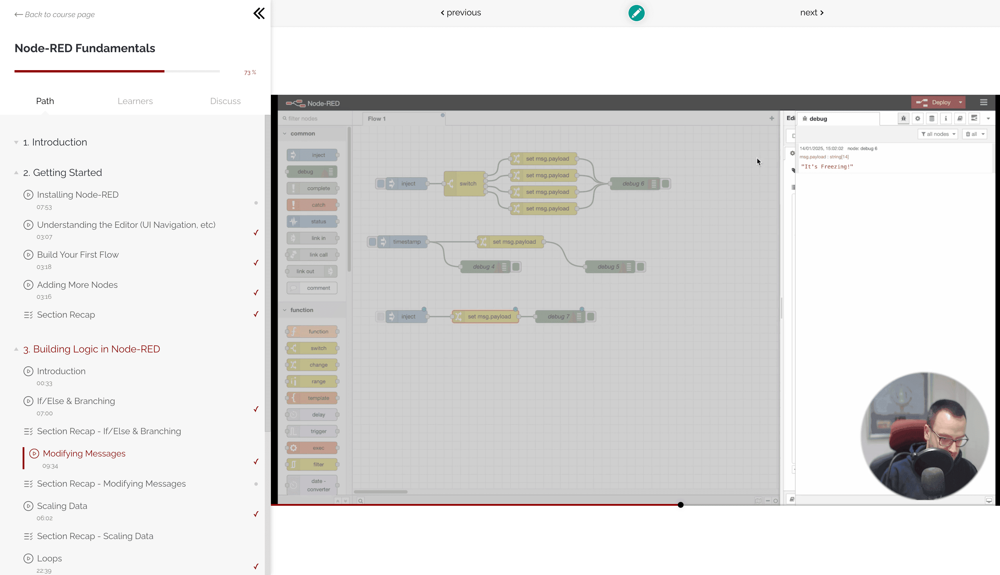

The [Node-RED Academy](https://node-red-academy.learnworlds.com/) provides Node-RED courses both for experts, who want to grow their knowledge, and for beginners, who are just learning the ropes. Get formal certification in Node-RED by completing courses and share certificates on LinkedIn to demonstrate your Node-RED learning accomplishments.

<!--more-->

## What is Node-RED Academy?

Node-RED Academy is a brand new learning portal for Node-RED. Whether you’re a complete beginner to Node-RED or have been building applications for years, Node-RED Academy courses will take your expertise to the next level, and provide you with formal certification that are evidence of your Node-RED knowledge and skills.

## Can I Earn a Credential?

All courses completed through Node-RED Academy provide a formal certification upon successful course completion. You can share this certificate on LinkedIn, add it to your CV or show it off anywhere else you like.

The credential will be evidence of your Node-RED knowledge and abilities, and will be a great way to demonstrate your expertise to potential employers or clients.

## What Courses are Included?

Our first course, The [Node-RED Fundamentals](https://node-red-academy.learnworlds.com/), takes about 90 minutes to complete, is free and available now. [Check it out!](https://node-red-academy.learnworlds.com/).

{data-zoomable}
_Screenshot of the Node-RED Fundamentals course in progress_

We also have plans for the following courses to follow in the future:
- Node-RED Advanced
- Building Applications with Node-RED
- Node-RED for Industry
- Node-RED for Teams
- FlowFuse Fundamentals
- FlowFuse for Teams
- FlowFuse Advanced

This list will likely grow beyond this too. We will be evolving our courses based on feedback and ideas from the community too!

## Who’s behind the Node-RED Academy?

There are many great resources for Node-RED education out there, but the Node-RED Academy has been curated by the authors and developers behind Node-RED and covers everything you'll need to know from building your first flow to integrating with industrial hardware.

FlowFuse is an enterprise-grade industrial data platform that enables engineers to build, manage, scale, and secure their Node-RED solutions for digitalizing processes and operations. You can sign up for free [here]({{ site.onboardingURL }}) to give it a go.

## How Do I Get Started?

Head to [Node-RED Academy](https://node-red-academy.learnworlds.com/) and sign up for free.

{data-zoomable}
_Screenshot of the Node-RED Academy home page_

{% include "cta.njk", cta_url: "https://app.flowfuse.com/account/create?utm_campaign=60718323-BCTA&utm_source=blog&utm_medium=cta&utm_term=high_intent&utm_content=Announcing%20Node-RED%20Academy%21", cta_type: "signup", cta_text: "The courses include everything you need to learn Node-RED, but you will also need access to an instance of Node-RED to follow along with exercises and apply your new knowledge. The easiest way to get access to Node-RED is with the FlowFuse Starter Plan." %}
