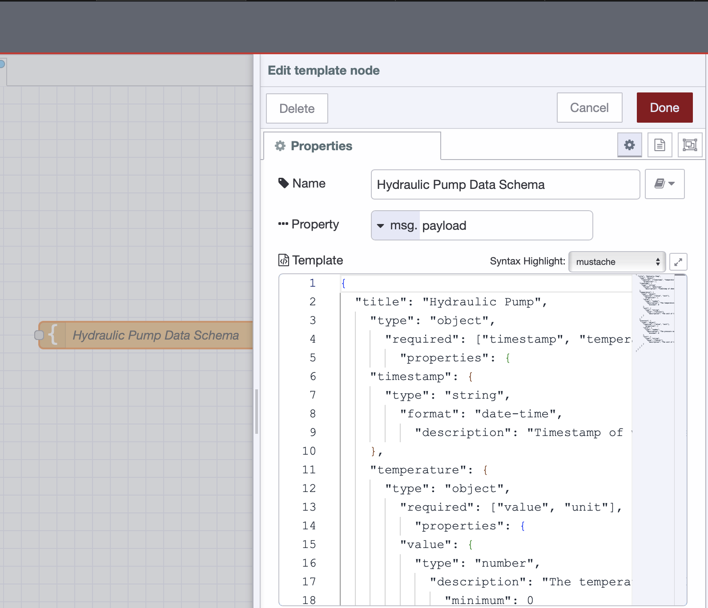
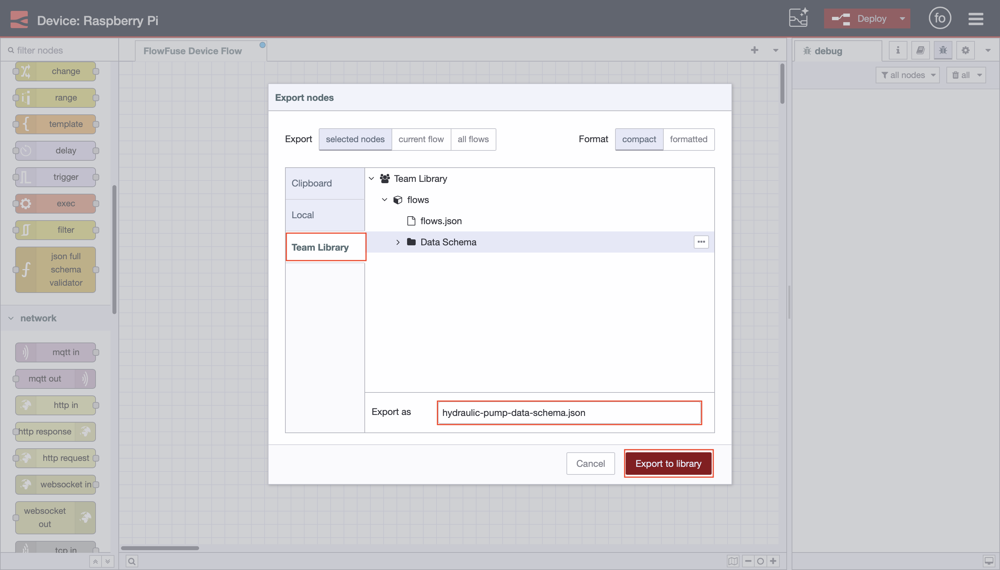
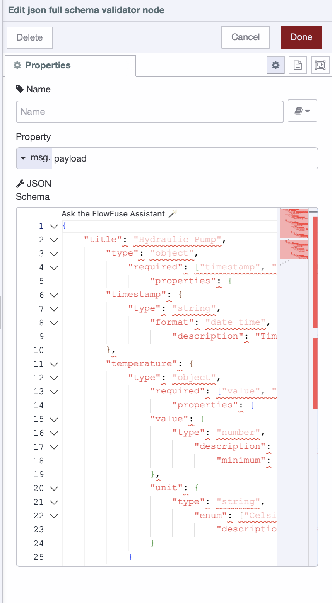
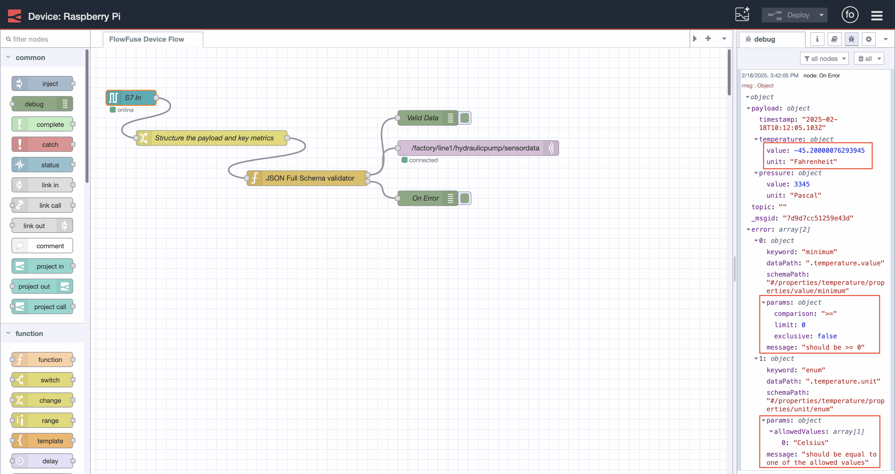
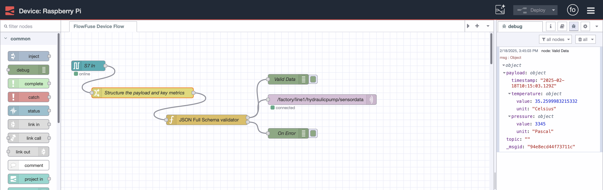

--- 
title: "Why Data schemas Are needed to Mature your Industrial Data Operations" 
subtitle: "FlowFuse Makes Industrial Data Schema Management and Implementation Effortless"
description: "Explore the importance of data schemas in industrial data operations and how FlowFuse simplifies their implementation for efficient, consistent, and reliable data processing."
date: 2025-02-21
authors: ["sumit-shinde"]
image: 
keywords: 
tags: 
 - node-red
---

A data schema defines how a system stores, structures, and organizes data. While it may seem similar to data modeling, it differs in that it translates the conceptual design of data modeling into a practical, working structure. The term "data schema" is commonly discussed in conversations about data management and organization.

So, why is it so important?

In this post, we explore data schemas' vital role in improving industrial data operations and how they can be effectively implemented with FlowFuse.

## What Exactly is a Data Schema, and How is it Different from Data Modeling?

Before discussing the importance of data schemas, it’s essential to understand what a data schema is and how it differs from data modeling.

A data schema is the actual implementation of how data is stored and organized within a system. It defines the structure in detail — including tables, fields, relationships, and rules — to ensure that data is consistent, accessible, and usable. For example, in a relational database, the schema specifies how the data should be arranged in tables, which columns are required, and what kind of data each column should store. It is the blueprint turned into a working structure.

In contrast, data modeling is the process of conceptually designing how data should be structured. Think of it as creating a map that outlines what data is needed and how different data elements are related. However, data modeling does not deal with the actual physical organization or implementation of the data in a system; it focuses on high-level design.

Both concepts—data schema and data modeling—originate from database management systems (DBMS) but have since been extended to other areas of data operations. Data schema and modeling serve different yet complementary roles in managing data structures across various systems.

In summary, the key difference is:

*A data model is like a conceptual, abstract design or blueprint for data — it defines the relationships and structure. A data schema, on the other hand, is the detailed plan and practical application of that design — it’s the actual implementation that organizes the data in a system.*

## Why Data Schemas Matter for Industrial Data Operations?

Data schemas are essential for ensuring the smooth functioning of any system, especially in industrial environments where data integrity and consistency are critical to operations.

Here’s why a strong data schema is so essential:

### Enforces Validation

Machines, sensors, and monitoring systems generate vast amounts of data every second. If this data is incorrect, incomplete, it can disrupt workflows and produce misleading insights.

Consider a manufacturing plant where sensors monitor temperature and pressure levels. If a sensor mistakenly reports an out-of-range value—such as a negative temperature in a steam pressure system—the system must detect and flag this issue. It should also prevent further processing of that data point before it affects operations.

A well-defined data schema includes rules for various checks, such as type enforcement, ensuring that data follows the correct format, falls within an acceptable range, and contains all required properties without missing values. For example, temperature values must be numeric and within a predefined range. Required properties define which data fields are mandatory and validate their presence. Range constraints help prevent invalid data entries by enforcing acceptable thresholds.

By integrating strong validation processes into industrial data operations, organizations ensure that only clean, reliable data flows through their operations. This boosts operational efficiency and enables quicker, more accurate decision-making, reducing costly errors and minimizing system downtime.

### Guarantees Data Consistency and Integrity and Speeds Up Integration Across Systems

Consistency and integrity are key when working with industrial data. With many different devices and systems feeding data into operations, inconsistent or faulty data can cause significant disruptions.

A well-defined data schema ensures all incoming data is structured uniformly, eliminating confusion and discrepancies. For example, a factory sensor may send temperature data. Without a schema, some readings could be in Celsius while others in Fahrenheit, causing inconsistency. However, with a schema in place, such issues are identified early, ensuring data uniformity.

Data integrity goes hand-in-hand with consistency. A schema enforces rules defining data formats and quality standards, ensuring all data fits the required format and maintains accuracy. This minimizes the risk of data corruption, loss, or unauthorized alterations.

When data is consistent and ensures integrity, integrating other systems becomes much easier and less confusing. For example, if a temperature sensor sends data to a unified namespace, and later, a SCADA system uses this data, the solution engineer might design the system assuming the temperature will always be in Celsius. However, if the data arrives without the proper unit, is mistakenly sent in Fahrenheit, or the temperature property is missing, the system may fail to provide accurate results, potentially leading to costly downtime or disruptions.

### Speeds Up Data Processing

Once you have consistent and reliable data, everything else becomes much smoother. Think about how critical speed is in industrial operations – whether it’s for real-time analytics, monitoring, or automation.

When data follows a set structure, it can be processed immediately. There’s no need to clean or transform it before using it. For example, in a factory setting, when temperature readings from machines are consistently formatted in Celsius, fall within the expected range, and come in the correct data type, systems can immediately act on those readings without needing extra time on transformation.

This means quicker decision-making. The less time spent fixing or formatting data, the faster you can respond to issues or opportunities, increasing efficiency across the board. As a bonus, it frees up your team’s time to focus on more strategic tasks rather than constantly troubleshooting data issues.

### Promotes Collaboration Across Teams

Collaboration is a key part of any industrial environment. Teams from different departments, such as operations, maintenance, engineering, and IT, work together to keep things running smoothly. However, when it comes to data, miscommunication can quickly happen if everyone works from different assumptions. That’s where data schemas come in. They help everyone get on the same page by defining how data should be organized and used.

With a clear structure, teams can quickly understand the data they’re working with, reducing confusion and making collaboration easier. This leads to faster decisions, fewer mistakes, and a more seamless workflow across the whole operation. Instead of spending time figuring out data issues, teams can focus on what really matters—solving problems and improving efficiency.

Now that you have a basic understanding of why data schemas are essential for maturing your industrial data operations, let's learn how to define and implement a data schema in your operations.

## Defining Data Schemas and How FlowFuse Simplifies Their Implementation

FlowFuse is an industrial data platform that acts as a complete toolkit for industrial data operations, simplifying all aspects of the process. Whether it’s integration—supporting almost all industrial protocols, hardware API integration, or offering over 5000 pre-built nodes—FlowFuse makes things easier. It handles data collection, aggregation, transformation (with no coding required, just drag-and-drop), MQTT broker management, and visualization with various pre-built widgets (again, no coding required).

From those over 5000 pre-built nodes, we have several that make implementing data schemas easier. We will use one of them today. For this practical example, I have a Siemens PLC integrated with a Raspberry Pi using Node-RED, receiving demo data for temperature and pressure. Let’s implement a data schema.

If you want to learn how to integrate Siemens S7 PLCs with FlowFuse, read the article [Getting Started: Integrating Siemens S7 PLCs with Node-RED](/blog/2025/01/integrating-siemens-s7-plcs-with-node-red-guide/) and  If you want to learn how to integrate a Raspberry Pi, read the following documents:

- [Setting Node-RED on Raspberry Pi 4](/node-red/hardware/raspberry-pi-4/)

- [Setting Up Node-RED on Raspberry Pi 5](/node-red/hardware/raspberry-pi-5/)

If you don’t have the S7 and Raspberry Pi, no worries. You can follow this with other data sources or even use mock data, which you can generate with the Inject and Change nodes.

### Prerequisites

Before you get started, make sure you have the following in place

- Running FlowFuse Remote Instance: 
Ensure that you have a running FlowFuse remote instance on your edge device. This device should act as middleware, collecting data from your industrial PLCs and systems.

To install and run the FlowFuse instance (Node-RED) on your device, use the FlowFuse Device Agent. This agent will connect your device to the FlowFuse Cloud Team, enabling remote access from anywhere.

Don’t have a FlowFuse account yet? No worries! [Sign up now](https://app.flowfuse.com/account/create) and activate your [free tier](/blog/2024/12/flowfuse-release-2-12/). It lets you manage up to two edge devices at no cost.

For more information on how to install and run the FlowFuse instance, refer to the [documentation](/docs/device-agent/quickstart/).

- [node-red-contrib-json-full-schema-validator](https://flows.nodered.org/node/node-red-contrib-full-msg-json-schema-validation): 
This package will be required for JSON schema validation in your flows. Make sure it is installed in your Node-RED environment.

### Getting Started with Data Schema Implementation

Before diving into the implementation of the data schema, it's crucial to establish a strong foundation. This section will guide you through the essential steps of defining the schema, sharing it across teams, and validating data against the schema within your factory system.

Let’s get started.

#### Defining the data schema 

Before moving forward, the first step is to carefully plan the data schema. Since this schema will be used across your entire factory, it’s crucial to involve all relevant team members in the planning process. This includes teams from operations, maintenance, IT, and engineering. Taking the time to gather input from all departments ensures that the schema reflects the real-world requirements of each group and helps avoid misalignment down the line.

When defining the schema, it is essential to decide which properties are necessary, what data types they should be, and what units they should have. For example, if the data includes temperature, determine if it should be in Celsius or Fahrenheit and define the valid range for that data (e.g., -40°C to 150°C). Other factors, such as precision, mandatory fields, and additional attributes, should also be considered to ensure everyone’s needs are addressed.

By carefully planning and involving the whole team, you create a schema that supports consistent data flow across systems and departments. This collaborative approach leads to a well-rounded and effective data schema that helps align team expectations, minimizes future issues, and improves operational efficiency. Taking the time to get everyone on the same page ensures that your data will be consistent, reliable, and ready to drive informed decision-making across the organization.

Once you planned the data scheme, prepare it in the following format.

If you want to learn more about how to create JSON Schemas, check out this helpful : [Getting Started Guide](https://json-schema.org/learn/getting-started-step-by-step)

```json
{
  "title": "Hydraulic Pump",
    "type": "object",
      "required": ["timestamp", "temperature", "pressure"],
        "properties": {
    "timestamp": {
      "type": "string",
        "format": "date-time",
          "description": "Timestamp of when the data was recorded."
    },
    "temperature": {
      "type": "object",
        "required": ["value", "unit"],
          "properties": {
        "value": {
          "type": "number",
            "description": "The temperature value.",
              "minimum": 0
        },
        "unit": {
          "type": "string",
            "enum": ["Celsius"],
              "description": "The unit of the temperature value."
        }
      }
    },
    "pressure": {
      "type": "object",
        "required": ["value", "unit"],
          "properties": {
        "value": {
          "type": "number",
            "description": "The pressure value.",
              "minimum": 0
        },
        "unit": {
          "type": "string",
            "enum": ["Pascal"],
              "description": "The unit of the pressure value."
        }
      }
    }
  }
}
```

This JSON schema defines the structure for data related to a hydraulic pump. It includes three key properties: `timestamp`, `temperature`, and `pressure`. The `timestamp` must be in a valid date-time format. Both `temperature` and `pressure` require two properties: value (a number representing the actual measurement) and `unit` (which must be Celsius for `temperature` and Pascal for `pressure`). Both values must be greater than or equal to zero. This schema ensures that all data is recorded with the correct units and valid values, maintaining consistency and reliability.

##### Sharing This Schema Across Your Team

Now that we have created the JSON schema, we need to ensure that everyone can access it and refer to it when needed. This helps team members understand the schema easily. To achieve this, we will use the FlowFuse Shared Team Library feature.

1. Drag the Template node onto the canvas, paste the data schema into it, and give it a meaningful name. If necessary, add a Comment node.  

{data-zoomable}
_Adding a data schema to the Template node._

1. Next, deploy the flow. Then, go to the main menu (top-right corner), click Export, switch to Team Library, create a new folder, give your data schema flow a meaningful name, and export it to that folder.

{data-zoomable}
_Exporting Schema to Team Library_

Now, any team member who wants to view, use, or understand the data schema format can import it from the Team Library. However, they must be part of the same FlowFuse team where the data schema was exported.

#### Implementing Data Schema Validation

Let's implement the data schema validation mechanism to ensure that each incoming data adheres to the specified JSON schema.

1. Drag the "JSON Full Schema Validator" node onto the Node-RED canvas.
2. Double-click the node to open its settings.
3. Copy and paste your schema into the node’s schema field.

{data-zoomable}
_Configuring "JSON Full Schema Validator" node with json schema for our data_

1. Click Done to save the changes.
2. Connect the input of the "JSON Full Schema Validator" node to the data source from where your data is coming.
3. Connect the node's first output to another node that will process or handle the validated data (e.g., an MQTT node, a database node, or any other destination).
4. Connect the second output to the flow that will handle the situation where data does not meet the schema. This could be a notification flow sending an email or Telegram to your team or a dashboard alert.
5. Deploy the flow.

Now, let's understand this with an example. Below is the data that we are receiving from the PLC. After transforming it, we’ve added essential properties such as unit and value. However, notice that the data doesn't meet the schema definition because the temperature is given in Fahrenheit and is a negative number, which isn't within the expected range.

{data-zoomable}
_Message passes through the second output and includes errors when it does not align with the data schema._

If the data doesn't align with the data schema, it will pass through the "JSON Full Schema Validator" node and flow through the second output. The message will contain an error array with detailed information about what is wrong with the data (e.g., incorrect unit or out-of-range value).

When the data meets the schema, it passes through the first output without errors. The validated data is then sent to the next stage in the flow (e.g., to the Unified Namespace).

{data-zoomable}
_Message passes through the first output and does not include errors when it aligns with the data schema._

## Conclusion

To wrap things up, getting your data structure right is a game-changer for smooth integration and efficient operations. With clear schemas in place, you make sure your data is consistent, reliable, and easy to work with. Tools like FlowFuse can take it up a notch by making data flow between systems even easier. When everything is set up properly, your data becomes a powerful tool that helps drive smarter decisions and boost efficiency. So, investing in your data’s structure really pays off in the long run!
