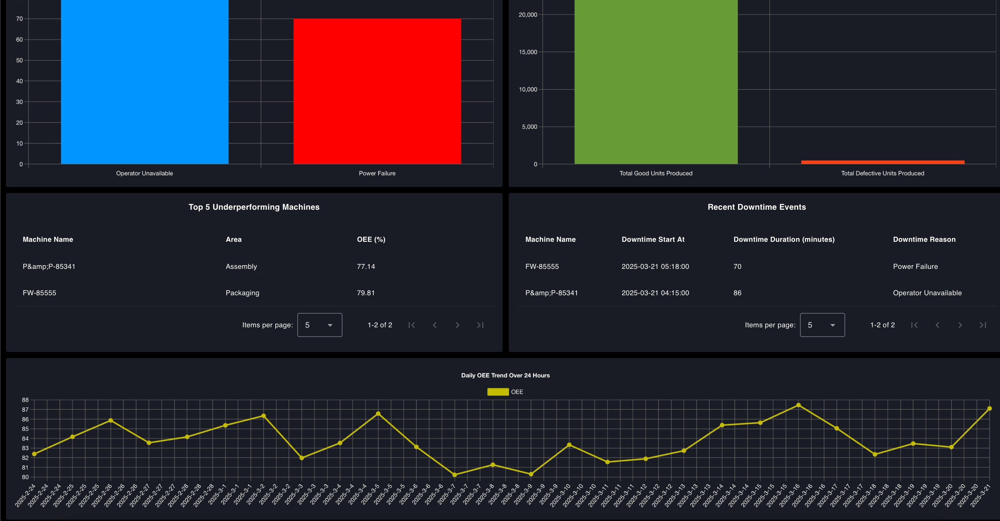

OEE (Overall Equipment Effectiveness) is a KPI used in manufacturing to measure equipment performance based on availability, efficiency, and quality. To effectively track this KPI, an OEE dashboard is built, but creating one can be complex, especially when consolidating data from various sources. Often, there’s limited flexibility to seamlessly combine data across different systems. Additionally, building a customizable dashboard to suit specific needs adds another layer of complexity. With FlowFuse, a no-code, customizable OEE dashboard can be created to provide real-time production insights, tailored to your unique requirements.

<!--more-->

We’re starting a blog series on building an OEE dashboard with FlowFuse. In this first part, we’ll explain the concept of OEE and outline the basic plan for the dashboard. We’ll cover the scope of OEE calculation, key metrics, visualization strategies, and the expected design of the dashboard.

Let’s get started!

## What is OEE?

{data-zoomable}
_What is OEE?_

Overall Equipment Effectiveness (OEE) is a crucial metric in manufacturing that assesses the productivity of equipment through three key components. These components evaluate the efficiency of equipment during the production process:

1. Availability — How often does the equipment perform when needed?
2. Performance  — How much product does the equipment produce?
3. Production Quality — How many high-quality products does the equipment produce?

The concept of OEE was introduced by Seiichi Nakajima in the 1960s as part of the [Total Productive Maintenance (TPM)](https://en.wikipedia.org/wiki/Total_productive_maintenance) initiative in Japan. Nakajima, an engineer at the Japan Institute of Plant Maintenance (JIPM), developed OEE to measure and enhance manufacturing productivity by identifying inefficiencies. This metric has since become widely adopted across the manufacturing industry. Today, OEE remains one of the most critical KPIs, with a really huge number of manufacturers considering it either important or very important for improving production efficiency and minimizing waste.

Measuring and improving OEE allows you to improve  the utilization of existing machinery  and improves operational efficiency. In many cases, improving OEE is the most strategic and cost-effective approach to increasing output.

## Planning Your OEE Dashboard

Now that we’ve covered what OEE is, let's focus on designing a basic plan that details what are the things that we should display on our dashboard, the scope and level of calculation, and how the visual layout will be structured for effective monitoring and analysis.

### Defining the Scope of OEE Calculation

The first and most important step before creating the dashboard is defining the scope of the OEE calculation. The tracking level can vary based on the focus on area, whether it is individual machines, entire production line, or the factory as a whole. 

Machine-level OEE concentrates on individual machines, aiding in the identification of specific inefficiencies that impact performance. Line-level OEE assesses the entire production line, offering insights into the collaboration of multiple machines and pinpointing where bottlenecks arise. Factory-level OEE compiles data from various production lines to provide a comprehensive overview of overall efficiency and trends.  

For those building the dashboard from scratch, it’s advisable to start at the machine level. This approach allows for faster time to value, as data collection can typically begin from a single point, reducing initial complexity. Once you’ve established the machine-level tracking and identified the inefficiencies, you can scale up to line-level and eventually factory-level OEE. Starting with machine-level data ensures that you can quickly uncover key insights and iteratively improve the scope and detail of your dashboard.

However, for this guide, we will be building the dashboard at the line level. In this case, we will collect data specific to a production line and perform the OEE calculation based on that data.

### Key Metrics and Insights

As mentioned earlier, the dashboard will calculate OEE for each production line, presenting key metrics such as availability, performance, quality, and the overall OEE score. While the overall OEE score provides a quick snapshot of performance, it does not offer enough detail to pinpoint specific areas that need improvement.

To address this, the dashboard will break down the OEE calculation at the machine level, enabling managers to identify underperforming machines that affect overall efficiency. Additionally, it will display recent downtime incidents, summarizing this data to uncover trends and identify potential root causes. This breakdown will provide a clearer understanding of where inefficiencies are occurring and allow for targeted corrective actions.

The dashboard will also track production quality, displaying the number of acceptable versus defective parts to ensure a continued focus on quality control. By presenting each OEE component in detail, the dashboard makes it easier to identify where improvements are needed and what specific steps should be taken to enhance efficiency.

Furthermore, the dashboard will include a 30-day OEE trend analysis, providing insights into performance changes over time. This will help managers identify patterns, track improvements, and highlight areas that need attention.

### Dashboard Visualization & UI Design

To ensure that insights are easy to understand and act upon, the dashboard will feature a well-structured visual layout that presents complex data in a clear and intuitive manner. After analyzing various OEE dashboards, I designed this one with a focus on clarity, usability, and actionable insights. It will include gauges for a quick OEE overview, bar charts to track downtime and production trends, tables to highlight underperforming machines and recent downtime events, and line charts to monitor efficiency patterns over time. This setup ensures managers can quickly spot problems, understand their causes, and take the necessary steps to optimize production.

The following dashboard image represents the intended design and key objectives of our OEE dashboard. Based on the plan we made in this part, we will build the dashboard interface in the next section using simulated production and downtime data. Later, we will demonstrate how to connect real factory data, scale the dashboard across multiple production lines, and use it to improve OEE effectively.

{data-zoomable}
_OEE Dashboard_

{data-zoomable}
_OEE Dashboard_

If you’re excited to quickly launch your OEE dashboard in your factory environment, don’t delay! [Register for a FlowFuse account](https://app.flowfuse.com/account/create) now and initiate your journey with our new effective, ready-made [OEE Dashboard Blueprint](/blueprints/manufacturing/oee-dashboard/). Gain insights swiftly, optimize your operations, and enhance efficiency starting today! 
