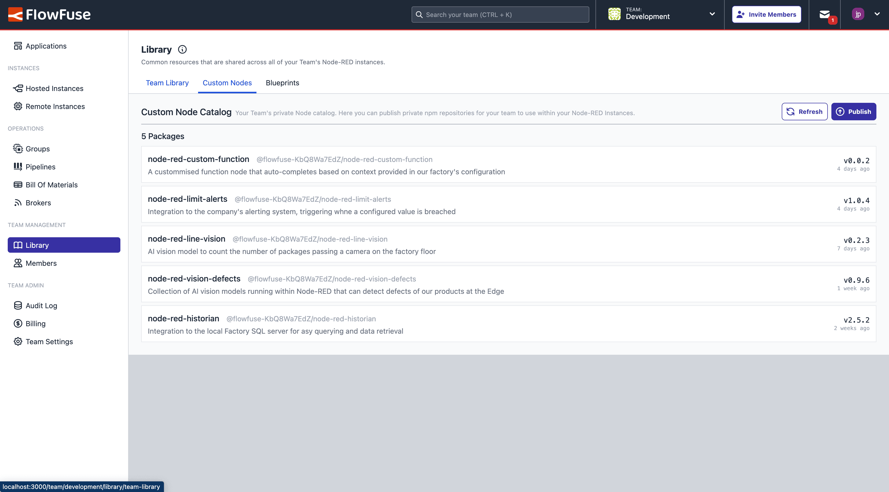
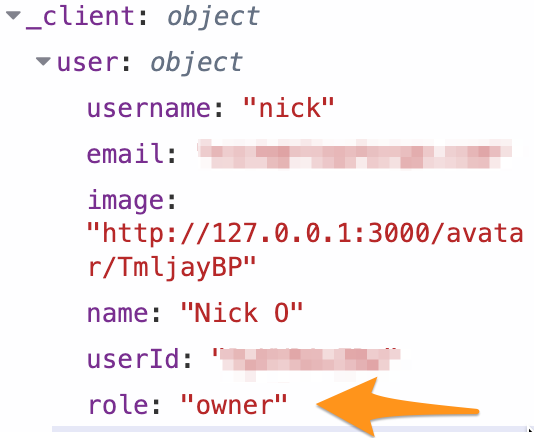

Our three focal points for the latest release of FlowFuse have been:

- **Collaborative Development:** Our new **Custom Node Catalogues** provides a place for you to centralise your own private nodes and Javascript libraries for Node-RED.
- **Full Stack Applications:** We've added our new **"Smart Schema Suggestions"** feature for automatically generating documentation for your MQTT Brokers.
- **DevOps:** We've improved Pipelines now to let you deploy to Device Groups in the middle of a Pipeline, this is just the first step in a wider set of improvements to come for DevOps Pipelines.

<!--more-->

## Custom Node Catalogues

{data-zoomable}
_Screenshot of the new "Custom Nodes" view in Team Library_

### Pain Point

Many of our customers have very mature Node-RED setups, including large collections of their own, custom node packages that they have built. These packages range significantly in purpose, from small utility functions, to custom hardware integrations. 

Until now, to utilise these packages within FlowFuse, you would either need to publish to the [public Node-RED Community Catalogue](https://flows.nodered.org/search?type=node), meaning all of your nodes are available to anyone in the world using Node-RED, or you had to setup and manage your own private NPM registry, which is very time consuming and requires deeper technical knowledge.

### Now in FlowFuse

With our new update, every Team- and Enterprise-Tier Library in FlowFuse has an in-built private Node collection, ready for you to go. This means that you can push your custom node packages directly to that registry, and make it available to all of your Instances running in FlowFuse within seconds. This comes built in with full version control and all of the great update mechanisms that you already have in Node-RED.

This new feature also integrates seamlessly ith our [Bill of Materials](https://flowfuse.com/docs/user/bill-of-materials/) view, providing you the single source of truth to all of your Instance's dependencies in one-place, making it easier to audit and manage your Node-RED instances and their dependencies.

## MQTT Broker Integration

### Smart Schema Suggestions

<iframe width="100%" height="400" src="https://www.youtube.com/embed/bNeTDJUZ1So?si=LFKiLrCrH6JUq3DH" title="YouTube video player" frameborder="0" allow="accelerometer; autoplay; clipboard-write; encrypted-media; gyroscope; picture-in-picture; web-share" referrerpolicy="strict-origin-when-cross-origin" allowfullscreen style="margin-bottom: 12px;"></iframe>

We are very pleased to announce our new "Smart Suggestions" feature. When working with an MQTT Broker for live data, it can be difficult to understand the structure of the data and topics that are being used. We recently released the new "Hierarchy" view, showing the topic structure present on a Broker, and we've now evolved that even further.

With Smart Suggestions, you will be presented with proposals as to what FlowFuse _thinks_ your payload schema is, based on the data that is being published to your Broker. If you approve these suggestions, then FlowFuse wll start constructing a schema to represent the traffic on your Broker, and make that available in our new "Schema Documentation" view.

This will save you days of effort in documenting your Broker, and provide a single source of truth for your schema to ensure your team is always on the same page when working with your MQTT data.

### Searching for Topics

A very nice, small, improvement we've made to the Broker view too is the ability to search for topics to quickly find the topics of interest. This is a small but very useful feature, especially for those with large numbers of topics on their Broker, enabling you to find the topics of interest much faster.

## DevOps Pipelines Improvements

Last year, we announced the introduction of Device Groups. For those that are not familiar with Device Groups, this feature enables users to logically group their Remote Instances so that they can be targeted in a DevOps Pipeline, facilitating streamlined and efficient deployments across your fleet of devices, rolling out a single flow to thousands of Remote Instances within seconds.

Previously, you could only use a Group as the _last_ stage in a Pipeline. With this update, you can now have Groups at other stages in a pipeline. For example, you may have a group of test Remote Instances that you want to push updates to, before pushing them out to your larger group of production Instances.

This improvement not only saves time but also enhances the consistency and reliability of Remote Instance management across your fleet.

## Removing Credit Card Requirement for Free Tier

When we recently introduced the new Free Tier for FlowFuse Cloud, we had some legacy architecture in place that meant that, whilst it was entirely free, the Free Tier still require you to put in credit card details.

This is something we've completely overhauled in the new version of FlowFuse, so now, you can just sign up and get started with building your own Remote Instances without the need for any credit card details. It was deployed to FlowFuse Cloud a week ago, and is already proving popular with new users. We can't wait to see what everyone builds on the free tier.

## FlowFuse Dashboard Authentication Now Includes User's Role

An enhancement to FlowFuse's underlying Node-RED launcher is the inclusion of the FlowFuse user's role in the `user` object return by the FlowFuse User Addon. This means you can start building your own RBAC (Role Based Access Control) into your own Node-RED/Dashboard applications, without the need to define roles and access levels directly within your Node-RED flows.

{width=300px}{style="margin: auto"}
_Screenshot showing the inclusion of the user's role within Dashboard's "user" object_

## What Else Is New?

For a full list of everything that went into our 2.15 release, you can check out the [release notes](https://github.com/FlowFuse/flowfuse/releases/tag/v2.15.0).

We're always working to enhance your experience with FlowFuse. We're always interested in your thoughts about FlowFuse too. Your feedback is crucial to us, and we'd love to hear about your experiences with the new features and improvements. Please share your thoughts, suggestions, or report any [issues on GitHub](https://github.com/FlowFuse/flowfuse/issues/new/choose). 

Together, we can make FlowFuse better with each release!

## Try FlowFuse

### Self-Hosted

We're confident you can have self managed FlowFuse running locally in under 30 minutes. You can install FlowFuse using [Docker](/docs/install/docker/) or [Kubernetes](/docs/install/kubernetes/).

### FlowFuse Cloud

The quickest and easiest way to get started with FlowFuse is on our own hosted instance, FlowFuse Cloud.

[Get started for free]() now, and you'll have your own Node-RED instances running in the Cloud within minutes.
