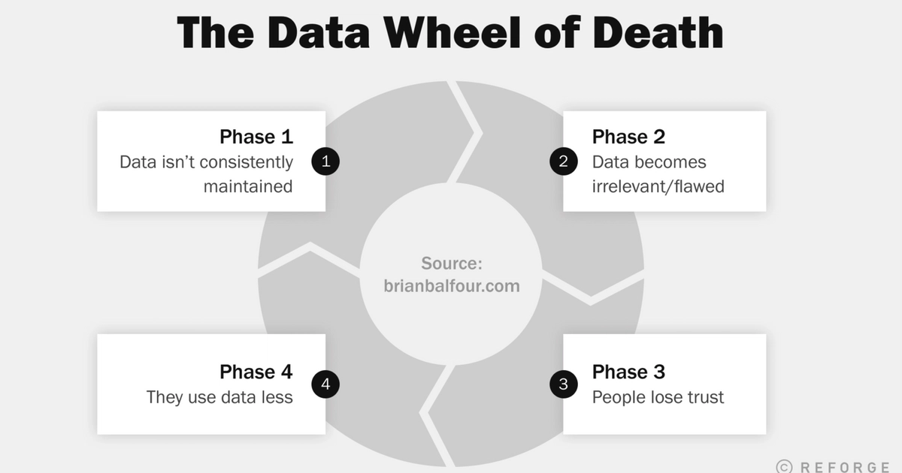

Data is the backbone of modern decision-making, but everything built on it starts to crumble when it is inconsistent. Organizations rely on analytics to drive strategy, optimize operations, and improve customer experiences, yet unreliable data leads to misleading insights, costly mistakes, and eroded trust.

<!--more-->

Unlike system failures that trigger alerts, data inconsistency often goes unnoticed—distorting reports, reinforcing biases, and steering businesses in the wrong direction. Decisions based on faulty trends can result in missed opportunities, poor resource allocation, and inaccurate forecasts.

This article explores why data inconsistency persists, from organizational silos to technical pitfalls, and how businesses can mitigate its impact before it undermines their analytics.

## The Impact of Inconsistent Data on Industrial Analytics

Inconsistent data is not just a small problem—it creates a cycle that weakens analytics over time. At first, small errors may go unnoticed, but as they build up, they lead to incorrect insights and poor decisions. This repeating pattern is called the **[Data Wheel of Death](https://youtu.be/2r7woaRC6Xo?si=5Qe7tQQpodLrSm59)**.

{data-zoomable}
_Data Wheel Of Death_

The cycle starts with data changes and errors. Sensors wear out, software updates alter settings, and manual entries introduce mistakes. These inconsistencies go undetected until they start affecting insights. Reports show trends that are not real, AI models make wrong predictions, and dashboards display misleading information.

Bad data leads to bad decisions. Businesses lose money, miss opportunities, and start doubting their analytics. Decision-makers stop trusting data and rely on intuition instead. To fix the issue, teams use temporary solutions—manually editing reports, keeping duplicate records, or patching errors. But these quick fixes only make the problem worse, creating a cycle that keeps damaging data reliability.

### How Inconsistent Data Affects IIoT

IoT systems rely on real-time data to optimize operations. But in dynamic industrial settings, even small data errors can cause big problems.

For example, predictive maintenance needs stable sensor data. If readings are off due to calibration errors or network delays, the system may schedule unnecessary repairs, wasting money—or worse, miss early warning signs, leading to unexpected breakdowns.
Quality control also depends on accurate data. If sensors provide faulty inputs, defective products may pass inspection, or too many good ones might be discarded.

Supply chains suffer too. If inventory data is wrong, a factory might stop production due to a missing part that was actually available or end up with excess stock due to bad demand forecasts.
Even energy management is affected. If power monitoring devices send inconsistent data, efficiency optimizations fail, leading to wasted resources and higher costs.

These are just a few examples. The impact of inconsistent data spreads across industrial operations, increasing inefficiencies, raising costs, and weakening trust in analytics. When decision-makers stop relying on data, they fall back on intuition, limiting the benefits of IIoT and creating a cycle of reactive problem-solving instead of proactive optimization.

## Why Data Inconsistency Persists: Organizational and Technical Pitfalls

Data inconsistency is not merely a technical glitch—it is deeply rooted in how organizations operate. Fragmented data management, system limitations, and human biases create discrepancies that undermine even the most sophisticated analytics. Addressing these challenges requires examining both organizational and technical pitfalls.

### The Organizational Pitfalls of Data Inconsistency

One major cause of data inconsistency is data silos—when different teams manage their own datasets separately. Each department has its own version of the truth, often outdated or incomplete. This happens due to company culture, lack of standardization, and reluctance to share control over data. Without a unified strategy, keeping data accurate across systems becomes a challenge.

Adding to this complexity is the [Rashomon Effect](https://en.wikipedia.org/wiki/Rashomon_effect)—a situation where multiple systems report conflicting values for the same data point, leading to different versions of reality. Inspired by the classic film Rashomon, where various witnesses recall the same event differently, organizations often face similar discrepancies across production lines, supply chains, and quality control systems. For instance, a machine sensor might report one temperature while the central monitoring system records another, or production output numbers in one software may not align with inventory records. Depending on which system is consulted, both values may appear ‘correct.’

These inconsistencies often stem from delays in data updates, lack of system integration, or disagreements on which source is most reliable. Instead of fixing the problem, managers may choose the data that best supports their argument, further deepening the issue.

Even dashboards contribute to the problem. They can create a false sense of accuracy, making inconsistent data look reliable just because it is well-presented. This Dashboard Delusion leads decision-makers to trust visualized data without questioning its accuracy, allowing errors to go unnoticed and spread further.

Compounding the problem is a flawed mindset that treats data as a static asset—something collected, stored, and assumed to be accurate indefinitely. Many individuals and teams rely on data without questioning its evolving nature. Business conditions change, new data is added, and systems are updated, making past information quickly outdated or misleading. When organizations fail to recognize this, they unknowingly trust stale reports and flawed insights, leading to poor decisions. Over time, these unnoticed issues result in costly mistakes, operational inefficiencies, and missed opportunities.

### The Technical Challenges Behind Data Inconsistency

Data inconsistency is not just an organizational issue—it also degrades as it moves through systems. The **Broken Telephone Effect** describes how information integrity erodes when data is transferred between multiple platforms. Every transformation, integration, or manual adjustment introduces slight variations. Over time, these accumulate, leading to significant distortions, especially in industrial settings where data flows through various control systems and middleware before being analyzed.

Another technical challenge is the **Data Drift Effect**. Over time, the statistical properties of incoming data shift, making historical models unreliable. This is particularly problematic in IIoT environments, where factors like machine wear and environmental changes subtly alter sensor readings. Without continuous monitoring and model retraining, analytics outputs become progressively less accurate, misleading decision-makers.

## Breaking the Cycle: How to Keep Data Consistent  

Fixing inconsistent data is not just about catching errors—it is about building a system that prevents inaccuracies from taking root. This requires smarter processes, a cultural shift, and technical solutions to keep data reliable as it moves through an organization.  

### Establish a Unified Data Strategy  

Many inconsistencies arise because different departments manage their own datasets, each with slight variations. When these disconnected systems feed into analytics tools, they create multiple versions of the truth, making insights unreliable. To fix this, businesses must define a **single source of truth**—a central dataset that serves as the foundation for all analytics and decision-making. Standardizing data collection, storage, and processing ensures consistency across the organization.  

One effective approach is the **Unified Namespace (UNS) architecture**, widely used to streamline data management. Learn how to implement UNS using FlowFuse in this detailed article: [Building a Unified Namespace (UNS) with FlowFuse](#). 

### Automate Data Validation  

Manual processes often introduce errors, duplications, and outdated records. **Automated validation checks** catch inconsistencies in real time, preventing inaccurate data from distorting analytics. **Reconciliation tools** continuously scan for discrepancies, while scheduled **data-cleaning processes** remove outdated or duplicate records before they cause issues.  

A powerful platform for automating these tasks is FlowFuse, which provides easy to use low-code interface for data transformation and validation. Learn how to implement JSON Schema in FlowFuse for fast, automated validation in this article: [JSON Schema: The Fastest Way to Model Your Data](#). 

### Ensure Seamless System Integration

Disconnected systems that update at different times often create data mismatches. This is especially problematic in industrial settings, where real-time sensor data must sync with enterprise systems. Strong integration frameworks ensure smooth data flow, reducing delays and discrepancies. Synchronizing real-time information prevents conflicting values and ensures every system works with the most accurate data.  

FlowFuse simplifies this process, offering robust support for a wide range of industrial protocols, hardware devices, APIs, and third-party services. With over [5,000 integrations](/integrations/), it helps organizations streamline integration and maintain data consistency. 

### Shift the Mindset Around Data 

Keeping data consistent is not just about better tools—it requires a change in mindset. Many people assume data remains accurate indefinitely, but in reality, it evolves with new inputs, business changes, and system updates. Blindly trusting dashboards without verifying their accuracy can lead to poor decisions. Decision-makers must actively validate data, challenge inconsistencies, and recognize that maintaining accuracy is an ongoing process.  

### Make Teams Accountable for Data Quality  

Accountability is crucial for maintaining reliable data. When teams take ownership of data quality, errors are detected and corrected early. Clearly assigning roles, conducting regular checks, and treating data as a dynamic asset—rather than something static—helps prevent costly mistakes. Organizations that prioritize data quality build trust, adapt faster, and make better decisions.

## Conclusion: Data You Can Trust

Inconsistent data is more than an inconvenience—it is a silent disruptor that undermines analytics, erodes trust, and leads to costly missteps. Unlike system failures that trigger alerts, data inconsistencies often go unnoticed until they have already distorted insights and misled decision-makers.

Breaking free from the "Data Wheel of Death" requires more than quick fixes; it demands a strategic shift in how organizations manage, validate, and integrate their data. A unified data strategy, automation, seamless system integration, and a proactive data quality culture are essential to ensuring accuracy and reliability.

By leveraging platforms like FlowFuse, businesses can automate data validation, enforce consistency, and create a single source of truth that empowers reliable decision-making. When organizations treat data as a dynamic asset—continuously monitored, refined, and trusted—they unlock the full potential of analytics and drive smarter, data-driven success.

[Sign up](https://app.flowforge.com/account/create) for FlowFuse today and take the first step toward better data management, seamless integration, and data you can trust.
