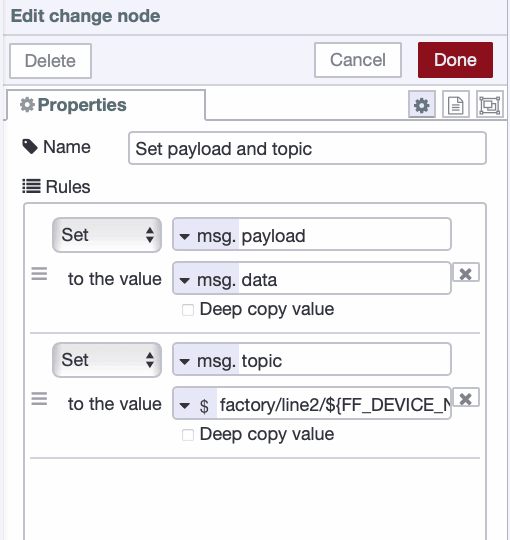
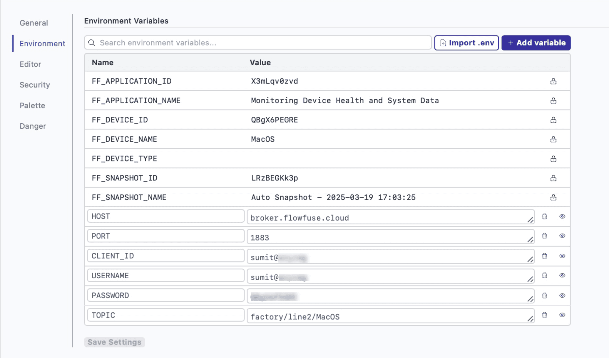
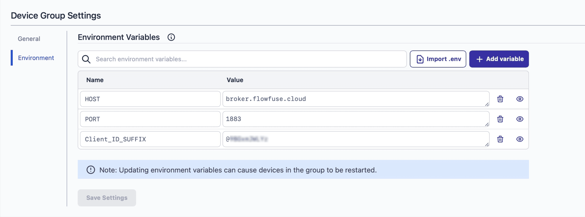

FlowFuse makes it easy to deploy Node-RED flows at scale using DevOps pipelines and device groups. However, different stages in a pipeline may need different MQTT brokers—for example, one for development and another for production. Manually configuring each stage can be time-consuming, especially when a stage has multiple remote instances (devices).

<!--more-->

This article shows how to continue using FlowFuse’s one-click deployment while ensuring that remote instances in each stage of your pipeline connect to the desired MQTT broker without manual configuration.

## Goal and Prerequisites

This article explains how to deploy Node-RED flows across different pipeline stages while ensuring each stage connects to its appropriate MQTT broker.

To proceed, ensure that the DevOps pipeline is created with the correct stages. If a stage includes remote instances, verify that all instances are running the FlowFuse Device Agent and are connected to your team.

For more information on how to create a DevOps pipeline, refer to [How to Build and Automate DevOps Pipelines for Node-RED Deployments](/blog/2024/10/how-to-build-automate-devops-pipelines-node-red-deployments/). For instructions on how to create a device group, refer to the [Device Groups Documentation](/docs/user/device-groups/).

## Setting Environment Variables for Development Instance

For this guide, environment variables will be the key tool to ensure each pipeline stage connects to the correct MQTT broker without manual intervention, allowing for a smooth deployment process.

Since the development remote instance is where the flow will be built and tested, start by adding the necessary environment variables for its MQTT configuration. Setting these up first ensures the flow runs as expected before deploying it to other pipeline stages.

1. Go to the remote/hosted instance settings in the FlowFuse platform.
2. Switch to the **Environment** settings.
3. Add the following environment variables with the appropriate values for that specific device:

   - `HOST` – The MQTT broker's hostname or IP address.
   - `PORT` – The port number the broker is listening on.
   - `USERNAME` – The authentication username for the MQTT broker.
   - `PASSWORD` – The authentication password for the MQTT broker.
   - `CLIENT_ID` – A unique identifier for the device connecting to the broker.
   - `CLIENT_ID_SUFFIX` – A suffix shared among client IDs within the broker.
   - `TOPIC` – The MQTT topic used for message communication.

4. Click **Save Settings** to apply the changes and restart the device.

## Configuring MQTT in Node-RED with Environment Variables

Now, let's explore how these environment variables can be used within Node-RED to configure the MQTT broker. Node-RED offers multiple ways to reference environment variables. Here are two primary methods to configure MQTT nodes using environment variables:

### 1. Using the Configuration Dialog: 

Environment variables can be directly referenced in the MQTT node properties using the `${ENV_NAME}` syntax as shown in the following images.

{data-zoomable}
_Setting up MQTT connection using environment variables._

{data-zoomable}
_Configuring MQTT node security settings using environment variables in Node-RED._

{data-zoomable}
_Configuring the MQTT topic in Node-RED using environment variables._

### 2. Setting Values Dynamically via the `msg` Object

In this approach, a **Change node** is used to retrieve environment variables and set the necessary MQTT configuration properties in the `msg` object. These properties include:

- `msg.broker.broker` – The MQTT broker’s URL or IP address.
- `msg.action` – Must be set to `"connect"` when establishing a connection.
- `msg.broker.force` – Must be set to `true` to enforce the connection.
- `msg.broker.port` – The port number for the MQTT connection.
- `msg.broker.clientid` – The unique client identifier for the device.
- `msg.broker.username` – The MQTT username for authentication.
- `msg.broker.password` – The MQTT password for authentication.
- `msg.topic` – The MQTT topic to which the device will publish or subscribe.

While the first method (direct reference in the MQTT node) is simpler and does not require additional nodes, it has limitations. It works well when there is only a single instance in the pipeline stage. However, when multiple instances exist within the same stage, the client ID, username, password, and topics often vary from device to device. The second method provides greater flexibility by dynamically adjusting these values, ensuring each device connects with the correct credentials and configurations. This approach makes the setup scalable and adaptable, eliminating the need for manual updates during deployment.

Unlike the first approach, which restricts direct combinations (e.g., string + environment variables or environment variables + environment variables), the second method enables dynamic modifications.

#### Ensuring Unique MQTT Credentials and Topics

As we mentioned in the multi-device deployment scenario, each device needs to establish its own connection to the MQTT broker while maintaining unique credentials and topics. If multiple devices in the same stage use identical configurations, connection conflicts—such as client ID duplication—may occur. To avoid these issues, each device must be assigned a unique client ID, username, password for security, and topic.

To ensure uniqueness, we can use the default environment variables available for each remote instance, such as:

- `FF_DEVICE_NAME`
- `FF_DEVICE_ID`

When generating the client ID for the MQTT broker, the device name (`FF_DEVICE_NAME`) can be used as the username. Since all client IDs share the same suffix, this suffix can be stored as a device-level environment variable (`CLIENT_ID_SUFFIX`). By combining both values, we can get the client ID of the device without manual intervention.

For the password, you can use the device ID (`FF_DEVICE_ID`), which is assigned when creating the client. Alternatively, you can set a common password for all clients by defining it as a device group-level environment variable.

{data-zoomable}
_Using a Change node to dynamically set MQTT broker connection properties._

For topics, a combination of a string and `FF_DEVICE_NAME` can be used to ensure uniqueness.

{data-zoomable}
_Configuring MQTT topics dynamically using a Change node in Node-RED._

*Note: Ensure that the topic configuration is set dynamically when sending the payload, not when establishing the connection.*

Once you have built your flow to connect to the intended MQTT broker using environment variables, deploy it and verify that it works as expected.

Also, if you need an example flow to test and explore in more detail, the following flow is provided. It demonstrates how to configure the MQTT connection dynamically using environment variables and, where needed, generate some settings by combining strings with environment variables.


[{"id":"0301bbe611a22e6d","type":"cpu","z":"aeaff62b91a987d4","name":"","msgCore":false,"msgOverall":true,"msgArray":false,"msgTemp":false,"x":450,"y":380,"wires":[["0c0ee596549272d4"]]},{"id":"4b8f4fec3983d558","type":"inject","z":"aeaff62b91a987d4","name":"Trigger every 5-second interval.","props":[],"repeat":"5","crontab":"","once":false,"onceDelay":0.1,"topic":"","x":190,"y":440,"wires":[["0301bbe611a22e6d","e12765d187a7b502","43e83b87e202428b","552b49b55fbf8071"]]},{"id":"e12765d187a7b502","type":"Memory","z":"aeaff62b91a987d4","name":"","scale":"Gigabyte","x":440,"y":420,"wires":[["fe3d07cd9f4f1b20"]]},{"id":"43e83b87e202428b","type":"Uptime","z":"aeaff62b91a987d4","name":"","x":440,"y":460,"wires":[["29541f3dafd85db9"]]},{"id":"552b49b55fbf8071","type":"Loadavg","z":"aeaff62b91a987d4","name":"","x":440,"y":500,"wires":[["7b09b1eae14fac16"]]},{"id":"0c0ee596549272d4","type":"change","z":"aeaff62b91a987d4","name":"CPU USAGE","rules":[{"t":"set","p":"data","pt":"msg","to":"{}","tot":"json"},{"t":"set","p":"data.CPU_USAGE","pt":"msg","to":"payload","tot":"msg"}],"action":"","property":"","from":"","to":"","reg":false,"x":650,"y":380,"wires":[["75445a62bac2e0c7"]]},{"id":"fe3d07cd9f4f1b20","type":"change","z":"aeaff62b91a987d4","name":"MEMORY USAGE","rules":[{"t":"set","p":"data","pt":"msg","to":"{}","tot":"json"},{"t":"set","p":"data.MEMORY_USAGE","pt":"msg","to":"payload","tot":"msg"}],"action":"","property":"","from":"","to":"","reg":false,"x":670,"y":420,"wires":[["75445a62bac2e0c7"]]},{"id":"29541f3dafd85db9","type":"change","z":"aeaff62b91a987d4","name":"SYSTEM UPTIME","rules":[{"t":"set","p":"data","pt":"msg","to":"{}","tot":"json"},{"t":"set","p":"data.UPTIME","pt":"msg","to":"payload.uptime","tot":"msg"}],"action":"","property":"","from":"","to":"","reg":false,"x":670,"y":460,"wires":[["75445a62bac2e0c7"]]},{"id":"7b09b1eae14fac16","type":"change","z":"aeaff62b91a987d4","name":"LOAD AVERAGE","rules":[{"t":"set","p":"data","pt":"msg","to":"{}","tot":"json"},{"t":"set","p":"data.LOAD_AVERAGE.ONE_MIN","pt":"msg","to":"payload.loadavg[0]","tot":"msg"},{"t":"set","p":"data.LOAD_AVERAGE.FIVE_MIN","pt":"msg","to":"payload.loadavg[1]","tot":"msg"},{"t":"set","p":"data.LOAD_AVERAGE.FIFTEEN_MIN","pt":"msg","to":"payload.loadavg[2]","tot":"msg"}],"action":"","property":"","from":"","to":"","reg":false,"x":670,"y":500,"wires":[["75445a62bac2e0c7"]]},{"id":"75445a62bac2e0c7","type":"join","z":"aeaff62b91a987d4","name":"","mode":"custom","build":"merged","property":"data","propertyType":"msg","key":"topic","joiner":"\\n","joinerType":"str","useparts":false,"accumulate":false,"timeout":"","count":"4","reduceRight":false,"reduceExp":"","reduceInit":"","reduceInitType":"","reduceFixup":"","x":870,"y":440,"wires":[["acf3b791d682a13d"]]},{"id":"272ec74227a151db","type":"change","z":"aeaff62b91a987d4","name":"Dynamically Configure MQTT Connection Using Environment Variables","rules":[{"t":"set","p":"action","pt":"msg","to":"connect","tot":"str"},{"t":"set","p":"broker.broker","pt":"msg","to":"HOST","tot":"env"},{"t":"set","p":"broker.port","pt":"msg","to":"PORT","tot":"env"},{"t":"set","p":"broker.clientid","pt":"msg","to":"${FF_DEVICE_NAME}${Client_ID_SUFFIX}","tot":"env"},{"t":"set","p":"broker.username","pt":"msg","to":"broker.clientid","tot":"msg"},{"t":"set","p":"broker.password","pt":"msg","to":"FF_DEVICE_ID","tot":"env"},{"t":"set","p":"broker.force","pt":"msg","to":"true","tot":"bool"}],"action":"","property":"","from":"","to":"","reg":false,"x":820,"y":580,"wires":[["4860cc23dfca9720"]]},{"id":"4860cc23dfca9720","type":"mqtt out","z":"aeaff62b91a987d4","name":"","topic":"","qos":"0","retain":"","respTopic":"","contentType":"","userProps":"","correl":"","expiry":"","broker":"f484702903e298e7","x":1270,"y":580,"wires":[]},{"id":"acf3b791d682a13d","type":"change","z":"aeaff62b91a987d4","name":"Set payload and topic","rules":[{"t":"set","p":"payload","pt":"msg","to":"data","tot":"msg"},{"t":"set","p":"topic","pt":"msg","to":"factory/line2/${FF_DEVICE_NAME}","tot":"env"}],"action":"","property":"","from":"","to":"","reg":false,"x":1080,"y":440,"wires":[["4860cc23dfca9720"]]},{"id":"79dfc62b4b21d20b","type":"inject","z":"aeaff62b91a987d4","name":"Trigger on deploy","props":[],"repeat":"","crontab":"","once":true,"onceDelay":0.1,"topic":"","x":210,"y":580,"wires":[["272ec74227a151db"]]},{"id":"f484702903e298e7","type":"mqtt-broker","name":"","broker":"localhost","port":1883,"clientid":"","autoConnect":false,"usetls":false,"protocolVersion":4,"keepalive":60,"cleansession":true,"autoUnsubscribe":true,"birthTopic":"","birthQos":"0","birthRetain":"false","birthPayload":"","birthMsg":{},"closeTopic":"","closeQos":"0","closeRetain":"false","closePayload":"","closeMsg":{},"willTopic":"","willQos":"0","willRetain":"false","willPayload":"","willMsg":{},"userProps":"","sessionExpiry":""}]


## Setting Environment Variables for a Device Group

After confirming that your flow in the development stage remote instance works as expected and connects to the broker correctly, the next step is to add environment variables.

If your target stage has only a single instance, you can set the environment variables at the instance level, as shown in the image below, and use the first method discussed earlier. This approach is straightforward and efficient for configuring a single instance using environment variables.

{data-zoomable}
_Setting environment variables at the instance level in FlowFuse._

However, when multiple remote instances exist within the same stage, such as in a device group, configuring them individually can be impractical, especially when most settings remain the same. To simplify this process, FlowFuse allows you to set environment variables at the device group level, and you can use the second method to make the configuration quick and easy while using remote instance default environment variables.

To add the device group level environment variables follow the steps:

1. Go to your **device group’s settings** in the FlowFuse platform.
2. Add the following environment variables with the appropriate values:

   - `HOST`
   - `PORT`
   - `CLIENT_ID_SUFFIX`

3. Click **Save Settings** to apply the changes.

{data-zoomable}
_Configuring environment variables at the device group level._

With this approach, you do not need to set environment variables separately for each instance. Instead, the environment variables defined at the device group level will apply to all remote instances within the group, ensuring a consistent and efficient configuration.

## Deploying Flow with Stage-Specific Configurations via DevOps Pipeline

Now that everything is set up, trigger the deployment pipeline for the development stage. This will push the flow and settings to the next-stage instances while preserving the existing environment variables. Before applying the new configuration, all remote instances in the target stage will restart automatically.

{data-zoomable}
_Deploying Node-RED flows using FlowFuse's DevOps pipeline._

If everything is configured correctly, the MQTT nodes in each remote Node-RED instance will connect to the appropriate broker configured at the device group level.

## Monitoring MQTT Topic Hierarchy with FlowFuse

Once the Node-RED flow is deployed on all remote instances in the device group and the MQTT nodes in each instance are connected to the broker, you can monitor and manage all topics across all brokers directly in FlowFuse.

{data-zoomable}
_Monitoring MQTT topics in FlowFuse across multiple brokers._

Watch this short video to learn how to bring your own brokers for topic monitoring in FlowFuse: [https://youtube.com/shorts/-8TPXb0h0vA?si=wi3wghi4vUWlXJTZ](https://youtube.com/shorts/-8TPXb0h0vA?si=wi3wghi4vUWlXJTZ)

## Conclusion

FlowFuse makes it easy to deploy Node-RED flows while ensuring each stage connects to the right MQTT broker. By using environment variables at both the instance and device group levels, you can automate MQTT configurations, reducing manual setup and ensuring consistency.

[Get Started Now]()
